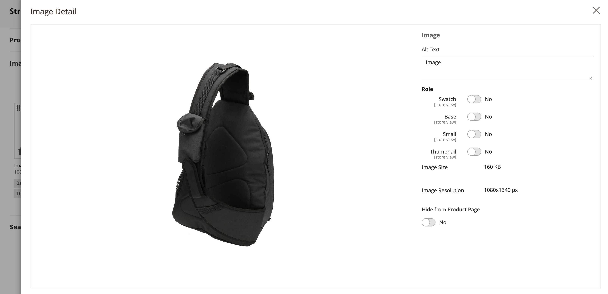

# Configurações do produto - [!UICONTROL Images and Videos]

No _[!UICONTROL Images and Videos]_, você pode executar tarefas básicas de gerenciamento de imagens, como carregar várias imagens, reorganizar imagens e controlar como cada imagem é usada. Para obter controle adicional sobre imagens individuais, abra cada imagem em_ exibição detalhada _. Para obter mais informações, consulte [Imagens e vídeos do catálogo](catalog-images-video.md).

## Carregar uma nova imagem

1. Abra o produto no modo de edição.

1. Rolar para baixo e expandir  o _[!UICONTROL Images and Videos]_seção.

   {width="600" zoomable="yes"}

1. Se estiver pronto para adicionar uma imagem de produto, siga um destes procedimentos:

   - Arraste uma imagem da sua área de trabalho e solte-a na _Câmera_ ().

   - Clique em _Câmera_ (), selecione o arquivo de imagem e clique em **[!UICONTROL Open]**.

A [espaço reservado](product-image-config.md#image-placeholders) será exibida no catálogo até que uma imagem do produto esteja disponível.

## Detalhes da imagem

À medida que adiciona imagens de produtos, você pode personalizar a exibição da imagem no _[!UICONTROL Image Detail]_janela.

{width="600" zoomable="yes"}

Para definir as opções de exibição de imagem de um produto:

1. Clique na imagem do produto.

1. Insira o **[!UICONTROL Alt text]**.

1. Escolha um **[!UICONTROL Role]** para exibir a imagem (todas as funções podem ser selecionadas para uma imagem):

   - `Swatch`
   - `Base`
   - `Small`
   - `Thumbnail`

   Todas essas funções são selecionadas para a primeira imagem adicionada por padrão.

   {width="600" zoomable="yes"}

Para ocultar a imagem do produto da página do produto, selecione a **[!UICONTROL Hide from Product Page]** caixa de seleção
