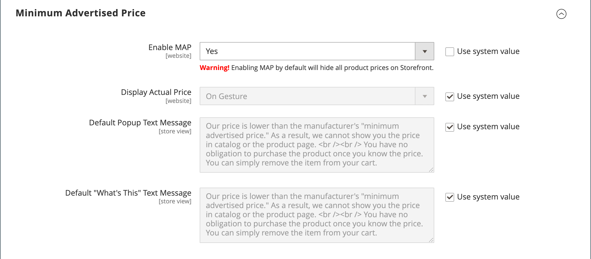

# Preço mínimo anunciado

Os comerciantes são, por vezes, proibidos de apresentar um preço inferior ao preço de venda a retalho sugerido pelo fabricante (MSRP). O Mínimo de preço anunciado (MAP) oferece a capacidade de permanecer em conformidade com os requisitos do fabricante, oferecendo aos seus clientes um melhor preço. Como os requisitos diferem de um fabricante para outro, você pode configurar a loja para impedir a exibição do preço real em páginas nas quais ele não é permitido.

O recurso MAP adiciona um link dedicado _Clique para Preço_ em vez do preço normal do produto. Se o preço na sua loja for inferior ao preço mínimo definido para esse produto, há duas maneiras pelas quais as informações de preços podem ser tratadas na loja. A primeira maneira é que o preço não é exibido. Se o comprador clicar no botão _Clicar para Preço_, somente então o preço real no qual você está vendendo o produto se tornará visível. A segunda maneira é que a lista/preço de mercado é exibido com um tachado para enfatizar que seu preço é mais baixo.

Além disso, o recurso MAP permite sugerir algumas melhorias. Por exemplo, quando um cliente adiciona esse produto ao carrinho, ele não é redirecionado ao carrinho e, em vez disso, há ofertas exibidas que permitem ao comprador:

- Remover um item do carrinho (pode ser feito se o comprador quiser apenas esclarecer o preço e ainda não tiver tomado uma decisão de compra)

- Deixe-o no carrinho de compras e continue comprando

- Prosseguir para o check-out

## Lógica do MAPA

Alguns produtos têm preços que dependem de uma opção selecionada, como opções personalizadas ou produtos simples com suas próprias SKUs e gerenciamento de estoque). Para esses produtos, aplica-se a seguinte lógica, de acordo com o tipo de produto e a definição de preço. O preço real é usado pelo gerenciamento de pedidos, ferramentas de gerenciamento de clientes e relatórios.

## Uso do MAP com tipos de produtos

| Tipo de produto | Descrição |
|--- |--- |
| [Simples](product-create-simple.md), [Virtual](product-create-virtual.md) | O preço real não aparece automaticamente na lista de catálogos e páginas de produtos, mas é incluído somente de acordo com a configuração [!UICONTROL Display Actual Price]. Os preços das opções personalizadas aparecem normalmente. |
| [Agrupado](product-create-grouped.md) | Os preços de produtos simples associados não aparecem automaticamente na lista de catálogos e páginas de produtos, mas são incluídos somente de acordo com a configuração [!UICONTROL Display Actual Price]. |
| [Configurável](product-create-configurable.md) | O preço real não aparece automaticamente na lista de catálogos e páginas de produtos, mas é incluído somente de acordo com a configuração [!UICONTROL Display Actual Price]. Os preços das opções aparecem normalmente. |
| [Pacote](product-create-bundle.md) (com preço fixo) | O preço real não aparece automaticamente nas páginas do catálogo, mas é incluído somente de acordo com a configuração [!UICONTROL Display Actual Price]. Os preços dos pacotes aparecem normalmente. O MAPA não está disponível para pacotes de produtos com preços dinâmicos. |
| [Baixável](product-create-downloadable.md) | O preço real não aparece automaticamente na lista de catálogos e páginas de produtos, mas é incluído somente de acordo com a configuração [!UICONTROL Display Actual Price]. O preço associado a cada link de download aparece normalmente. |

{style="table-layout:auto"}

## Uso do MAP com configurações de preço

| Definição de preço | Descrição |
|--- |--- |
| Preço principal | Quando a MAP é aplicada ao preço principal, os preços das opções, dos itens de pacote e dos produtos associados (que adicionam ou subtraem do preço principal) aparecem normalmente. |
| Preço do Produto Associado | Se um produto não tiver um preço principal e seu preço for derivado dos preços do produto associados (como em um produto agrupado), as configurações de MAPA dos produtos associados serão aplicadas. |
| [MSRP](product-price-minimum-advertised.md) | Se um produto no carrinho tiver o Preço de varejo sugerido pelo fabricante (MSRP) especificado, o preço não será riscado. |
| [Preço da camada](product-price-tier.md) | Se a precificação de camada for definida, a mensagem de precificação de camada não será exibida no catálogo. Na página do produto, é exibida uma notificação indicando que o preço pode ser menor ao solicitar mais de uma determinada quantidade, mas o desconto é exibido somente em porcentagens. Para produtos associados de um produto agrupado, os descontos não são exibidos na página do produto. O preço da camada é exibido de acordo com a configuração Exibir Preço Real. |
| [Preço Especial](product-price-special.md) | Se o Preço especial for especificado, o preço especial será exibido de acordo com a configuração Exibir Preço Real. |

## Configuração de MAPA

O recurso de preço mínimo anunciado (MAP) não está habilitado por padrão. Para adicionar esse recurso à loja, é necessário habilitá-lo e definir as configurações de MAPA para os produtos. As configurações de MAPA podem ser aplicadas a todos os produtos no catálogo ou configuradas para produtos específicos. Quando o MAPA é habilitado globalmente, todos os preços de produtos na loja ficam ocultos. Há várias opções de configuração que você pode usar para manter a conformidade com os termos de seu contrato com o fabricante, enquanto ainda oferece aos seus clientes um preço melhor.

{width="700" zoomable="yes"}

No nível global, você pode ativar ou desativar o MAP, aplicá-lo a todos os produtos e definir como o preço real é exibido. Também é possível editar o texto das mensagens relacionadas e as dicas de informações que aparecem na loja.

Quando o MAPA é ativado, as configurações de MAPA no nível do produto ficam disponíveis. Você pode aplicar o MAP a um produto individual inserindo o MSRP e escolhendo como deseja que o preço real apareça na loja. As configurações de MAP de nível de produto substituem as configurações de MAP globais.

{width="700" zoomable="yes"}

### Etapa 1: Habilitar MAP para a exibição de loja

1. Na barra lateral _Admin_, vá para **[!UICONTROL Stores]** > _[!UICONTROL Settings]_>**[!UICONTROL Configuration]**.

1. Se aplicável, defina **[!UICONTROL Store View]** no canto superior direito da exibição à qual a configuração se aplica.

1. No painel esquerdo, expanda **[!UICONTROL Sales]** e escolha **[!UICONTROL Sales]** abaixo de.

1. Expandir  a seção _[!UICONTROL Minimum Advertised Price]_.

1. Se necessário, defina **Habilitar MAP** como `Yes`.

   {width="600" zoomable="yes"}

   Para obter uma lista detalhada dessas opções de configuração, consulte [_Preço mínimo anunciado_](../configuration-reference/sales/sales.md#minimum-advertised-price) na _Referência de configuração_.

### Etapa 2: definir as configurações de MAP

Use um dos métodos a seguir para definir as configurações de MAP:

#### Método 1: configurar o MAP para todos os produtos

1. Para determinar quando e onde você deseja que o preço real fique visível para os clientes, faça o seguinte:

   - Para alterar o valor padrão, desmarque a caixa de seleção **[!UICONTROL Use system value]**.

   - Defina **Exibir Preço Real** para um dos seguintes:
      - `In Cart`
      - `Before Order Confirmation`
      - `On Gesture (on click)`

1. Digite o texto que você deseja que apareça no **[!UICONTROL Default Popup Text Message]**.

1. Insira qualquer explicação adicional que você deseja que apareça na **[!UICONTROL Default "What's This" Text Message]**.

1. Quando terminar, clique em **[!UICONTROL Save Config]**.

#### Método 2: configurar o MAP para um único produto

1. Na barra lateral _Admin_, vá para **[!UICONTROL Catalog]** > **[!UICONTROL Inventory]** > **[!UICONTROL Products]**.

1. Abra o produto no modo **[!UICONTROL Edit]**.

1. No painel esquerdo, expanda **[!UICONTROL Advanced Settings]** e escolha **[!UICONTROL Advanced Pricing]**.

   >[!NOTE]
   >
   >Os campos [!UICONTROL Manufacturer's Suggested Retail Price] e [!UICONTROL Display Actual Price] aparecem somente quando o [Preço mínimo anunciado](../configuration-reference/sales/sales.md#minimum-advertised-price) está habilitado na configuração.

1. Insira o **[!UICONTROL Manufacturer's Suggested Retail Price]** (MSRP).

   Neste exemplo, o preço do produto é de US$ 54,00 e o MSRP é de 59,95.

   {width="600" zoomable="yes"}

1. Defina **[!UICONTROL Display Actual Price]** como um dos seguintes:

   - `Use config` - (Padrão) Aplica as configurações de exibição como [configurado](../configuration-reference/sales/sales.md#minimum-advertised-price) para o armazenamento. |
   - `On Gesture` - Exibe o preço real do produto em um pop-up quando o cliente clica em _Clicar para preço_ ou _O que é isso?Link_.
   - `In Cart` - Exibe o preço real do produto no carrinho de compras.
   - `Before Order Confirmation` - Exibe o preço real do produto no final do processo de finalização, antes da confirmação do pedido.

1. Quando terminar, clique em **[!UICONTROL Done]** e depois em **[!UICONTROL Save]**.
