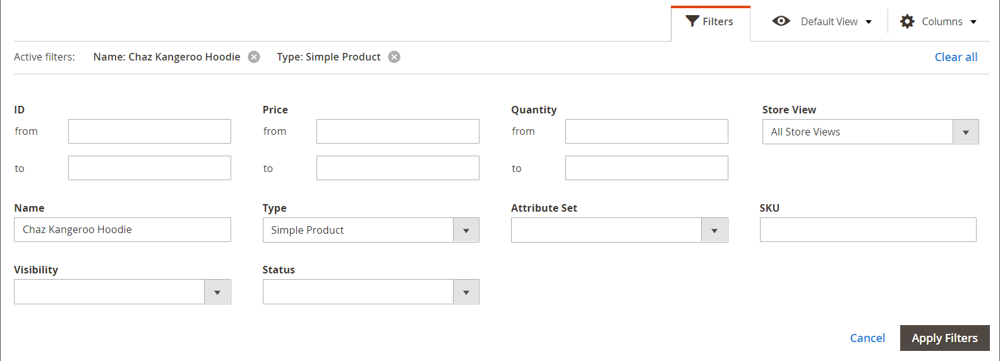

# Preços especiais

Um preço especial pode ser oferecido por um período de tempo designado. Durante o período de tempo especificado, o preço especial aparece em vez do preço normal, seguido por uma notação que mostra o preço normal.

{width="700" zoomable="yes"}

## Aplicar preço especial a um produto individual

Você pode facilmente definir um preço especial para um único produto no catálogo.

### Usar uma atualização agendada

{{ee-feature}}

O Adobe Commerce inclui suporte para [atualizações programadas](../content-design/content-staging-scheduled-update.md). Use essas ferramentas promocionais para aplicar um preço especial a um produto específico por um período especificado.

1. Abra o produto no modo de edição.

1. Clique em **[!UICONTROL Scheduled Update]**.

   {width="600" zoomable="yes"}

1. Para **Atualizar nome**, informe um nome para a promoção de preço especial.

1. Insira um resumo **[!UICONTROL Description]**.

1. Use o _Calendário_ (  ) para escolher o **[!UICONTROL Start Date]** e **[!UICONTROL End Date]** para a promoção de preço especial.

   Você pode usar o **[!UICONTROL Hour]** e **[!UICONTROL Minute]** controles deslizantes para escolher a hora inicial e final também. Clique em **[!UICONTROL Close]** quando o início e o fim são definidos.

   {width="600" zoomable="yes"}

1. Role para baixo até _Preço_ clique em **[!UICONTROL Advanced Pricing]** e insira a quantidade de **[!UICONTROL Special Price]** a ser aplicado de acordo com a atualização agendada.

   {width="600" zoomable="yes"}

1. Quando terminar, clique em **[!UICONTROL Done]** e depois **[!DNL Save]**.

   Na loja, o preço especial deve aparecer na listagem do catálogo e na página do produto.

   A variável _[!UICONTROL Scheduled Change]_é exibida na parte superior da página.

   {width="600" zoomable="yes"}

### Usar uma data simples de início e término

{{ce-feature}}

Magento Open Source inclui opções de data inicial e final simples nas opções de Advanced Pricing.

1. Abra o produto no modo de edição.

1. Role para baixo até _[!UICONTROL Price]_clique em **[!UICONTROL Advanced Pricing]**e insira o **[!UICONTROL Special Price]**quantia.

1. Use o _Calendário_ (  ) para escolher o **[!UICONTROL Start Date]** e **[!UICONTROL End Date]** para a promoção de preço especial.

   O preço especial entra em vigor imediatamente após a meia-noite no início da data de início (00:01) e continua até pouco antes da meia-noite (23:59) no dia anterior à data de término.

   {width="600" zoomable="yes"}

1. Quando terminar, clique em **[!UICONTROL Done]** e depois **[!UICONTROL Save]**.

   Na loja, o preço especial deve aparecer na listagem do catálogo e na página do produto.

## Aplicar um preço especial a vários produtos

Você também pode atribuir um preço especial a vários produtos, como várias variações de um [produto configurável](product-create-configurable.md).

### Definir um preço especial para produtos selecionados

{{ee-feature}}

O exemplo a seguir mostra como atribuir o mesmo preço especial a várias variações de produto de um produto configurável no Adobe Commerce.

1. No _[!UICONTROL Products]_clique em **[!UICONTROL Filters]**e insira o **[!UICONTROL Name]**do produto configurável.

1. Definir **[!UICONTROL Type]** para `Configurable Product` e clique em **[!UICONTROL Apply Filters]**.

1. Se quiser atribuir o mesmo preço especial a todos os produtos, defina o controle no cabeçalho da primeira coluna como `Select All`.

   Como alternativa, você pode marcar a caixa de seleção de cada produto que deseja incluir.

1. Defina o **[!UICONTROL Actions]** controle para `Update attributes`.

1. Role para baixo até _[!UICONTROL Special Price]_e selecione o **[!UICONTROL Change]**caixa de seleção abaixo de_[!UICONTROL Special Price]_ e insira o preço especial que deseja oferecer.

   {width="600" zoomable="yes"}

1. Quando terminar, clique em **[!UICONTROL Save]**.

O preço especial disponível na loja aparece nas listagens de catálogo e na página do produto. Para um produto configurável, o preço normal também aparece na página do produto quando as opções são escolhidas.

### Definir um preço especial e um intervalo de datas para produtos selecionados

{{ce-feature}}

O exemplo a seguir mostra como atribuir o mesmo preço especial a várias variações de produto de um produto configurável no Magento Open Source.

1. No _Admin_ barra lateral, vá para **[!UICONTROL Catalog]** > **[!UICONTROL Products]**.

1. Clique em **[!UICONTROL Filters]**.

1. Insira o **[!UICONTROL Name]** do produto configurável.

1. Definir **[!UICONTROL Type]** para `Simple Product`.

   {width="600" zoomable="yes"}

1. Clique em **[!UICONTROL Apply Filters]**.

   A grade lista todos os produtos simples associados como variações do produto configurável.

1. Se quiser atribuir o mesmo preço especial a todos os produtos, defina o controle no cabeçalho da primeira coluna como `Select All`.

   Como alternativa, você pode marcar a caixa de seleção de cada produto que deseja incluir.

1. Defina o **[!UICONTROL Actions]** controle para `Update attributes`.

   {width="600" zoomable="yes"}

1. Role para baixo até _[!UICONTROL Special Price]** e faça o seguinte:

   - Selecione o **[!UICONTROL Change]** caixa de seleção abaixo de _[!UICONTROL Special Price]** e insira o preço especial que deseja oferecer.

   - Selecione o **[!UICONTROL Change]** caixa de seleção abaixo de _Preço Especial a Partir da Data_ clique no botão _Calendário_ (  ) e escolha a primeira data da promoção de preço especial.

     O preço especial entra em vigor imediatamente após a meia-noite no início da data de início (00:01) e continua até pouco antes da meia-noite (23:59) no dia anterior à data de término.

   - Selecione o **[!UICONTROL Change]** caixa de seleção abaixo de _Preço Especial Acumulado_ clique no botão _Calendário_ (  ) e escolha a última data da promoção de preço especial.

   {width="600" zoomable="yes"}

1. Quando terminar, clique em **[!UICONTROL Save]**.

   Uma mensagem indica quantos registros foram atualizados com o preço especial.

   O preço especial fica disponível na loja na data especificada e é exibido nas listagens de catálogo e na página do produto. Para um produto configurável, o preço normal também aparece na página do produto quando as opções são escolhidas.

   {width="600" zoomable="yes"}

## Testes

Se o preço especial não aparecer corretamente na loja na lista de catálogos e nas páginas de produtos, limpe o cache do navegador:

1. No _Admin_ barra lateral, vá para **[!UICONTROL System]** > **[!UICONTROL Cache Management]**.

1. Clique em **[!UICONTROL Flush Magento Cache]**.

>[!NOTE]
>
>A variável **_final_** o preço do produto é calculado como a **_mínimo_** preço relevante, utilizando a seguinte fórmula:  `Final Price=Min(Regular(Base) Price, Group(Tier) Price, Special Price, Catalog Price Rule) + Sum(Min Price per each required custom option)`

>[!NOTE]
>
>**_Preço Fixo_** produto As opções personalizáveis são _não_ afetados pelas regras de Preço do Grupo, Preço da Camada, Preço Especial ou Preço do Catálogo.
