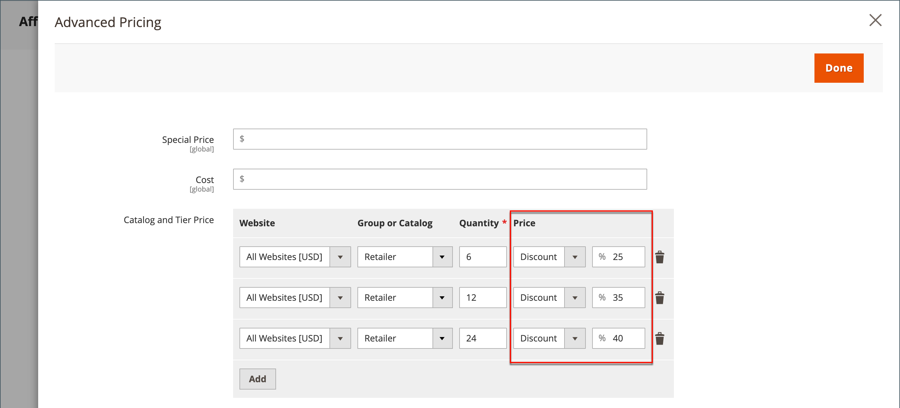

# Nível de preços

Os preços de nível permitem oferecer um desconto por quantidade de uma lista de produtos ou página de produtos na loja. O desconto pode ser aplicado a uma exibição de loja específica, grupo de clientes ou catálogo compartilhado.

Se você tem muitos produtos para atualizar, é mais eficiente importar as alterações de preço de nível, em vez de inseri-las individualmente. Para obter mais informações, consulte [Importar preços de camada](../systems/data-import-price-tier.md).

{width="700" zoomable="yes"}

A página do produto calcula o desconto por quantidade e exibe uma mensagem como:

`Buy 6 for $5.95 each and save 15%`

Os preços na loja têm prioridade da quantidade mais alta para a mais baixa. Se você tiver um preço de camada para a quantidade `5` e um para `10` e um cliente adicionar cinco, seis, sete, oito ou nove itens ao carrinho de compras, o cliente receberá o preço com desconto para a camada de quantidade `5`. Quando o cliente adiciona o décimo item, o preço com desconto especificado para a camada de quantidade `10` substitui a camada para uma quantidade de `5` e o preço com desconto para `10` se aplica.

## Adicionar uma camada de preços para um produto

1. Abra o produto no modo de edição.

1. Abaixo do campo _[!UICONTROL Price]_, clique em **[!UICONTROL Advanced Pricing]**.

1. Na seção _[!UICONTROL Tier Price]_, clique em **[!UICONTROL Add]**.

   Se você estiver criando um nível de vários preços, clique em **[!UICONTROL Add]** para cada nível adicional, para que você possa trabalhar todos os níveis ao mesmo tempo. Cada camada no grupo tem o mesmo site e grupo de clientes ou atribuição de catálogo compartilhado, mas uma quantidade e preço diferentes.

## Configurar a camada de preços

1. Se sua loja tiver vários sites, escolha o **[!UICONTROL Website]** ao qual se aplica o preço de camada.

1. Se necessário, limite a disponibilidade da camada de preços selecionando o **[!UICONTROL Customer Group]** ou **[!UICONTROL Shared Catalog]** ( Disponível somente com [Adobe Commerce B2B](./b2b/../introduction.md)).

1. Para **[!UICONTROL Qty]**, insira a quantidade que deve ser solicitada para receber o desconto.

   - **Método 1:** Inserir preço como valor fixo

     Defina **[!UICONTROL Price]** como `Fixed` e insira o preço ajustado para uma unidade nessa camada.

     {width="600" zoomable="yes"}

   - **Método 2:** Inserir preço como uma porcentagem

     Defina **[!UICONTROL Price]** como `Discount` e insira o preço com desconto como uma porcentagem do preço base do produto.

     Por exemplo, para um desconto de 15%, insira o número `15`. (O preço é salvo com duas casas decimais, como `15.00`.)

     >[!NOTE]
     >
     >Para obter o preço com desconto, a porcentagem definida é calculada em relação ao valor definido no campo _[!UICONTROL Price]_, não no campo_[!UICONTROL Special Price]_.

     {width="600" zoomable="yes"}

## Concluir a configuração de preço

1. Para adicionar outro conjunto de preços de camada para um site ou grupo de clientes diferente, repita as etapas anteriores.

1. Quando terminar, clique em **[!UICONTROL Done]** e depois em **[!UICONTROL Save]**.

>[!NOTE]
>
>O preço do produto **_final_** é calculado como o preço relevante de **_mínimo_**, usando a seguinte fórmula:  `Final Price=Min(Regular(Base) Price, Group(Tier) Price, Special Price, Catalog Price Rule) + Sum(Min Price per each required custom option)`

>[!NOTE]
>
>**_Preço Fixo_** O produto de Opções Personalizáveis _não_ é afetado pelas regras de Preço de Grupo, Preço de Camada, Preço Especial ou Preço de Catálogo.

## Habilitar preço de camada para regras de preço de catálogo

[!BADGE Somente SaaS]{type=Positive url="https://experienceleague.adobe.com/en/docs/commerce/user-guides/product-solutions" tooltip="Aplicável somente a projetos do Adobe Commerce as a Cloud Service (infraestrutura SaaS gerenciada pela Adobe)."}

[!BADGE Sandbox]{type=Caution tooltip="Os itens listados estão disponíveis atualmente apenas em ambientes de sandbox. A Adobe disponibiliza novas versões em ambientes de sandbox primeiro para fornecer tempo para que você teste as alterações futuras antes que a versão esteja disponível em ambientes de produção."}

Em versões anteriores do Commerce, o preço por camada não podia ser usado em conjunto com as regras de preço do catálogo. As regras de catálogo ignoraram a configuração de preço de camada e calcularam descontos somente do preço base original. Usando o Adobe Commerce as a Cloud Service, agora é possível optar por incluir preços de camada no cálculo das regras de preço do catálogo.

Para ativar essa funcionalidade:

1. Navegue até **[!UICONTROL Stores]** > *[!UICONTROL Settings]* > **[!UICONTROL Configuration]** > **[!UICONTROL Sales]** > **[!UICONTROL Sales]** > **[!UICONTROL Promotions]** e defina o campo **[!UICONTROL Apply Catalog Price Rule on Grouped Price]** como **[!UICONTROL Yes]**.

   {width="700" zoomable="yes"}

1. Defina um preço de camada com uma quantidade de `1` para cada grupo de clientes específico ou catálogo compartilhado (como `Wholesale`, `Retail` ou grupo definido pelo comerciante) que deseja direcionar com as regras de preço de catálogo. O grupo de clientes `ALL GROUPS` e o catálogo compartilhado `Default` não podem ser usados para essa finalidade. A precificação de camada não está habilitada para nenhum grupo que não tenha um preço de camada definido com uma quantidade de `1`.

1. Defina preços de camada adicionais com quantidades maiores que `1`, conforme necessário. Esses preços de nível adicionais serão aplicados como de costume quando o cliente adicionar quantidades adicionais do produto ao carrinho de compras. As regras de preço de catálogo não se aplicam a esses preços de nível adicionais.

Para ilustrar como a precificação por camada funciona com as regras de preço de catálogo ao comprar um único produto, considere o seguinte exemplo:

- O preço base padrão de um produto é US$ 100.
- Um preço de camada é definido para o grupo de clientes `Wholesale` com uma quantidade de `1` e um preço fixo de US$ 90.
- Uma regra de preço de catálogo fornece um desconto de 10% para o grupo de clientes `Wholesale`.

Quando a camada de preços está habilitada para regras de preço de catálogo, o sistema usa o seguinte fluxo para calcular o preço final:

1. Antes de o cliente fazer logon, o preço do produto é exibido como US$ 100 (o preço base padrão).

1. Depois que o cliente fizer logon como membro do grupo `Wholesale`, o preço do produto será ajustado para US$ 90 (o preço de camada do grupo `Wholesale`).

1. A regra de preço de catálogo é aplicada, fornecendo um desconto de 10% no preço de camada de 90 USD, resultando em um preço final de 81 USD.

A tabela a seguir resume cálculos de preço quando a precificação por camada está ativada para regras de preço de catálogo e uma regra de preço de catálogo fornece um desconto de 10% para todos os grupos de clientes:

Produto: Preço Padrão US$ 100 (Compra de Item Único)

| Grupo de Clientes | Preço da camada (Qtde.=1) | Novo Preço Base | Preço final |
|---|---|---|---|
| TODOS OS GRUPOS | Não configurado | $ 100 | US$ 100 - 10% = US$ 90 |
| Atacado | Fixo: US$ 85 | $ 85 | US$ 85 a 10% = US$ 76,50 |
| Retailer | Desconto de 20% | $ 80 | US$ 80 a 10% = US$ 72,00 |
| VIP | Desconto de 15% | $ 85 | US$ 85 a 10% = US$ 76,50 |
