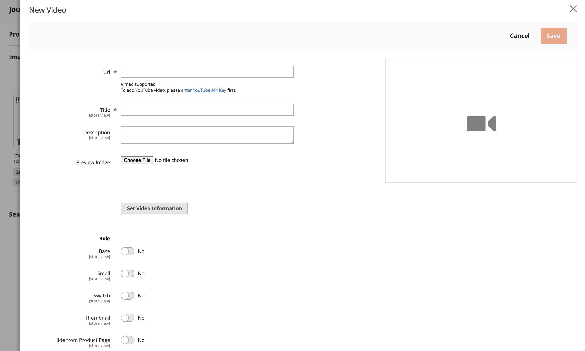

# Adicionar vídeos de produtos

Para adicionar um vídeo de produto, primeiro obtenha uma Chave de API da sua conta da Google e insira-a na configuração da sua loja. Em seguida, é possível vincular ao vídeo a partir do produto.

## Etapa 1: Obtenha sua chave de API do YouTube

1. Faça logon em sua conta do Google e visite o [Console de Desenvolvedores do Google][1].

1. No campo de pesquisa na parte superior, digite `YouTube Data API v3` e clique no ícone de pesquisa.

1. Quando a página da API for exibida, verifique se ela está ativada.

1. No painel esquerdo, escolha **[!UICONTROL Credentials]**.

1. Dependendo de você ter ou não credenciais, execute um dos procedimentos a seguir:

   - Se você já tiver as credenciais necessárias, copie a chave na tabela _Chaves de API_.

   - Se você ainda não tiver credenciais para esta API, clique em **[!UICONTROL Create Credentials]** na parte superior e siga as instruções para criar as credenciais necessárias. Em _Obter suas credenciais_, copie a chave de API e clique em **[!UICONTROL Done]**.

1. Copie a chave da API para a área de transferência.

1. Clique no ícone Edit à direita e defina as restrições para garantir que a chave da API esteja limitada aos referenciadores corretos.

1. Aguarde alguns momentos enquanto a chave é gerada e copie a chave para a área de transferência.

   Na próxima etapa, você colará a chave na configuração da sua loja.

## Etapa 2: configurar a chave no Commerce

1. Na barra lateral _Admin_, vá para **[!UICONTROL Stores]** > _[!UICONTROL Settings]_>**[!UICONTROL Configuration]**.

1. No painel esquerdo, expanda **[!UICONTROL Catalog]** e escolha **[!UICONTROL Catalog]** abaixo de.

1. Expanda  a seção _[!UICONTROL Product Video]_&#x200B;e cole seu **[!UICONTROL YouTube API key]**.

   {width="600" zoomable="yes"}

1. Quando terminar, clique em **[!UICONTROL Save Config]**.

1. Quando solicitado, atualize o cache.

## Etapa 3: vincular ao vídeo

1. Abra um produto no modo de edição.

1. Role e expanda a seção _[!UICONTROL Images and Videos]_.

   {width="600" zoomable="yes"}

1. clique em **[!UICONTROL Add Video]**.

   Se você ainda não tiver configurado sua chave de API do YouTube, clique em **[!UICONTROL OK]** para continuar. Não é possível vincular a um vídeo do YouTube, mas você pode passar pelo processo.

1. Para **[!UICONTROL Url]**, insira a URL do vídeo do YouTube ou Vimeo.

   {width="600" zoomable="yes"}

1. Clique fora do campo e aguarde feedback sobre a chave de API ou o vídeo.

   Se tudo der certo, o YouTube fornecerá as informações básicas do vídeo

1. Insira os **[!UICONTROL Title]** e **[!UICONTROL Description]** do vídeo.

1. Para carregar um **[!UICONTROL Preview Image]**, navegue até a imagem e selecione o arquivo.

   >[!NOTE]
   >
   >Após o upload, a imagem de pré-visualização exibida é gerada automaticamente por um provedor de serviço de vídeo externo. Não é possível editar a imagem no Adobe Commerce Admin.

1. Se preferir usar os metadados de vídeo, clique em **[!UICONTROL Get Video Information]**.

1. Para determinar como o vídeo é usado na loja, marque a caixa de seleção de cada **[!UICONTROL Role]** que se aplica:

   - `Base Image`
   - `Small Image`
   - `Swatch Image`
   - `Thumbnail`
   - `Hide from Product Page`

1. Quando terminar, clique em **[!UICONTROL Save]**.

   >[!NOTE]
   >
   >Se a opção de configuração _[!UICONTROL Autostart base video]_&#x200B;estiver definida como `Yes`, mas o vídeo não começar a ser reproduzido automaticamente, talvez seja devido às políticas de reprodução automática que são aplicadas pelo navegador e não podem ser controladas pelo Adobe Commerce. Cada navegador compatível tem suas próprias políticas de reprodução automática que podem mudar com o tempo, e o vídeo pode não ser reproduzido automaticamente no futuro. Como prática recomendada, você não deve depender da reprodução automática para a funcionalidade comercial crítica e deve testar o comportamento de reprodução automática de vídeo em sua loja com cada navegador compatível.

## Manter acesso à API

De acordo com o desenvolvedor do Google [Termos e Condições], a YouTube pode desabilitar o acesso à API para contas que ficaram inativas por mais de 90 dias. Esta ocorrência pode fazer com que seus vídeos não sejam exibidos. Para manter o acesso à API atualizado, use um trabalho cron para fazer ping na API em intervalos regulares:

```code
30 10 1 * * curl -i -G -e https://yourdomain.com/ -d "part=snippet&maxResults=1&q=test&key=YOUTUBEAPIKEY" https://www.googleapis.com/youtube/v3/search >/dev/null 2>&1
```

## Referência do campo

| Campo | Descrição |
|--- |--- |
| [!UICONTROL URL] | O URL do vídeo associado. |
| [!UICONTROL Title] | O título do vídeo. |
| [!UICONTROL Description] | A descrição do vídeo. |
| [!UICONTROL Preview Image] | Uma imagem carregada que é usada como pré-visualização do vídeo em sua loja. |
| [!UICONTROL Get Video Information] | Recupera os metadados de vídeo armazenados no servidor host. Você pode usar os dados originais ou atualizá-los conforme necessário. |
| [!UICONTROL Role] | Determina como a imagem de visualização é usada em sua loja. Você pode escolher qualquer combinação de opções: `Base Image`, `Small Image`, `Thumbnail`, `Swatch Image`, `Hide from Product Page` |

{style="table-layout:auto"}

[1]: https://console.developers.google.com/
[Termos e condições]: https://developers.google.com/youtube/terms/developer-policies#d.-accessing-youtube-api-services
