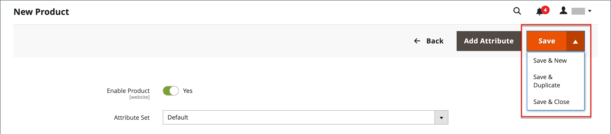

# Espaço de trabalho do produto

O espaço de trabalho do produto é basicamente o mesmo para todos os tipos de produto, embora a seleção de campos mude dependendo do conjunto de atributos usado. Os atributos do produto estão na parte superior do formulário, seguidos por seções expansíveis de informações do produto. Quando um novo produto é salvo pela primeira vez, o seletor _[!UICONTROL Store View]_aparece no canto superior esquerdo do formulário.

{width="700" zoomable="yes"}

## Configuração de [!UICONTROL Enable Product]

O status online do produto é indicado pelo switch na parte superior do formulário. Para alterar o status online, defina a opção **[!UICONTROL Enable Product]** como `Yes` ou `No`.

| Controle | Descrição |
|-------- | ----------- |
|  | Indica que o produto está online. |
|  | Indica que o produto está offline. |

{style="table-layout:auto"}

## Conjunto de atributos

O nome do [conjunto de atributos](attribute-sets.md) aparece no canto superior esquerdo e determina os campos que aparecem no registro do produto. Para escolher um conjunto de atributos diferente, clique na seta para baixo ao lado do nome do conjunto de atributos default.

{width="600" zoomable="yes"}

## Expandir/recolher

Para expandir ou recolher uma seção, clique no ícone expandir  ou recolher .

## Menu [!UICONTROL Save]

O menu _[!UICONTROL Save]_inclui várias opções que permitem salvar e continuar, salvar e criar um produto, salvar e duplicar o produto ou salvar e fechar.

{width="600" zoomable="yes"}

| Comando | Descrição |
|--- |--- |
| [!UICONTROL Save] | Salve o produto atual e continue trabalhando. |
| [!UICONTROL Save & New] | Salve e feche o produto atual e inicie um novo produto com base no mesmo tipo de produto e modelo. |
| [!UICONTROL Save & Duplicate] | Salvar e fechar o produto atual e abrir uma nova cópia duplicada. |
| [!UICONTROL Save & Close] | Salvar o produto atual e retornar ao espaço de trabalho _[!UICONTROL Products]_. |

{style="table-layout:auto"}

## Valores de campo padrão

Para economizar tempo ao criar produtos, o valor padrão de vários campos de produto faz referência a valores de outro campo. Você pode aceitar o valor padrão ou inserir outro. Os seguintes campos geraram automaticamente valores padrão:

| Campo | Padrão |
|----- |------- |
| [!UICONTROL SKU] | Com base no nome do produto. |
| [!UICONTROL Meta Title] | Com base no nome do produto. |
| [!UICONTROL Meta Keywords] | Com base no nome do produto. |
| [!UICONTROL Meta Description] | Com base no nome e na descrição do produto. |

{style="table-layout:auto"}

Os espaços reservados que representam o valor de outro campo são colocados entre chaves duplas. Qualquer código de atributo incluído no produto [conjunto de atributos](attribute-sets.md) pode ser usado como um espaço reservado.

{width="600" zoomable="yes"}

Para obter uma lista detalhada dessas configurações, consulte [Geração automática de campos de produto](../configuration-reference/catalog/catalog.md#product-fields-auto-generation) na _Referência de configuração_.

### Editar o valor do espaço reservado

1. Na barra lateral _Admin_, vá para **[!UICONTROL Stores]** > _[!UICONTROL Settings]_>**[!UICONTROL Configuration]**.

1. No painel esquerdo, expanda **[!UICONTROL Catalog]** e escolha **[!UICONTROL Catalog]** abaixo de.

1. Expanda  a seção **[!UICONTROL Product Fields Auto-Generation]** e faça as alterações necessárias nos valores de espaço reservado.

   Por exemplo, se houver uma palavra-chave específica que você deseja incluir para cada produto ou uma frase que você deseja incluir em cada meta descrição, insira o valor diretamente no campo apropriado.

   >[!NOTE]
   >
   >Se desejar manter os valores de espaço reservado existentes, preserve as chaves duplas que delimitam cada tag de marcação.

1. Quando terminar, clique em **[!UICONTROL Save Config]**.

### Espaços reservados comuns

- `{{color}}`
- `{{country_of_manufacture}}`
- `{{description}}`
- `{{gender}}`
- `{{material}}`
- `{{name}}`
- `{{short_description}}`
- `{{size}}`
- `{{sku}}`
