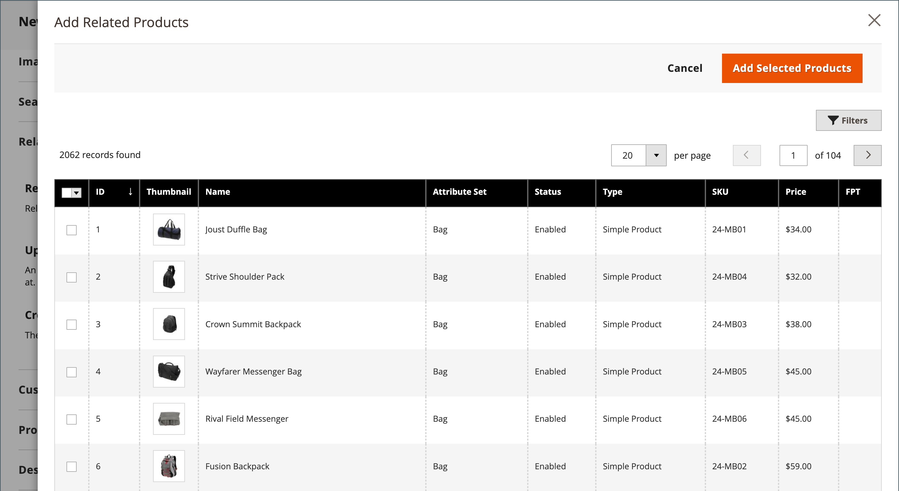

# Configurações do produto - [!UICONTROL Related Products, Up-Sells, and Cross-Sells]

Use a seção _[!UICONTROL Related Products, Up-Sells, and Cross-Sells]_&#x200B;para configurar blocos promocionais simples que apresentam uma seleção de produtos adicionais que podem ser de interesse do cliente. Para obter mais informações, consulte [Relações de Produto](../merchandising-promotions/product-relationships.md).

{width="600" zoomable="yes"}

Cada bloco consiste em uma lista de produtos que pertencem a uma opção específica.

| Campo | Descrição |
|--- |--- |
| [!UICONTROL ID] | Um identificador numérico exclusivo que é atribuído à entidade do produto. |
| [!UICONTROL Thumbnail] | Imagem em miniatura do produto. |
| [!UICONTROL Name] | O nome do produto. |
| [!UICONTROL Status] | Indica o status do produto. Opções: `Enabled` / `Disabled`. Os produtos desativados não são exibidos nos blocos do front-end. |
| [!UICONTROL Attribute Set] | O nome do conjunto de atributos usado como modelo para o produto. |
| [!UICONTROL SKU] | A Unidade de Manutenção de Estoque exclusiva atribuída ao produto. |
| [!UICONTROL Price] | O preço unitário do produto. |
| [!UICONTROL Action] | Opções: `Remove`. Remove um produto do bloco. |

{style="table-layout:auto"}

>[!TIP]
>
>O  (somente Adobe Commerce) **Product Recommendations viabilizadas pela IA do Adobe** simplifica o processo de definição de relações de produtos utilizando inteligência artificial e algoritmos de aprendizado de máquina para executar uma análise detalhada de dados de visitantes agregados. Esses dados, quando combinados com seu catálogo do Adobe Commerce, resultam em experiências altamente envolventes, relevantes e personalizadas para o comprador.
> 
>Para obter mais informações sobre como usar esta extensão desenvolvida pela Adobe como uma alternativa para recomendações de produto e vendas adicionais configuradas manualmente, consulte o _[Guia de Recomendações de Produto](https://experienceleague.adobe.com/docs/commerce/product-recommendations/guide-overview.html)_.

## Produtos relacionados

Os produtos relacionados devem ser comprados além do item que o cliente está visualizando. O cliente pode colocar o item no carrinho de compras simplesmente clicando na caixa de seleção. O posicionamento do bloco _Produtos relacionados_ varia de acordo com o tema e o layout da página definidos. No exemplo abaixo, o bloco _Produtos relacionados_ aparece na parte inferior da página _Exibição do produto_. Com um layout de duas colunas, o bloco _Produtos relacionados_ geralmente aparece na barra lateral direita.

{width="600" zoomable="yes"}

Para configurar produtos relacionados:

1. Abra o produto no modo de edição.

1. Role para baixo e expanda  na seção **[!UICONTROL Related Products, Up-Sells, and Cross-Sells]**.

1. Clique em **[!UICONTROL Add Related Products]**.

1. Use os [controles de filtro](../getting-started/admin-grid-controls.md) para localizar os produtos desejados.

1. Na lista, marque a caixa de seleção de qualquer produto que deseja incluir como produto relacionado.

   {width="600" zoomable="yes"}

1. Quando terminar, clique em **[!UICONTROL Add Selected Products]**.

## Vendas adicionais

Os produtos de venda adicional são itens que o cliente pode preferir, em vez do produto considerado no momento. Um item oferecido como uma venda adicional pode ter uma qualidade mais alta, ser mais popular ou ter uma margem de lucro melhor. Os produtos de venda adicional aparecem na página do produto sob um cabeçalho como _Você também pode estar interessado nos seguintes produtos_.

{width="600" zoomable="yes"}

Para selecionar produtos de venda adicional:

1. Abra o produto no modo de edição.

1. Role para baixo e expanda  na seção **[!UICONTROL Related Products, Up-Sells, and Cross-Sells]**.

1. Clique em **[!UICONTROL Add Up-Sell Products]**.

1. Use os [controles de filtro](../getting-started/admin-grid-controls.md) para localizar os produtos desejados.

1. Na lista, marque a caixa de seleção de qualquer produto que deseja apresentar como um produto de venda adicional.

   {width="600" zoomable="yes"}

1. Quando terminar, clique em **[!UICONTROL Add Selected Products]**.

>[!NOTE]
>
>O produto do pacote principal é sempre exibido automaticamente como um produto de venda adicional para todos os seus produtos secundários.

## Vendas cruzadas

Os itens de venda cruzada são semelhantes às compras por impulso posicionadas ao lado da caixa registradora na linha de check-out. Os produtos oferecidos como venda cruzada aparecem na página do carrinho de compras, antes que o cliente inicie o processo de finalização.

>[!NOTE]
>
>Para mostrar ou ocultar itens de venda cruzada por exibição de loja, consulte a opção [Check-out > Carrinho de Compras](../configuration-reference/sales/checkout.md) chamada _[!UICONTROL Show Cross-sell Items]_&#x200B;no Carrinho de Compras. Talvez você queira ocultar as vendas cruzadas durante vendas específicas ou para testes A/B em uma exibição de loja.

{width="600" zoomable="yes"}

**_Para selecionar produtos de venda cruzada:_**

1. Abra o produto no modo de edição.

1. Role para baixo e expanda  na seção **[!UICONTROL Related Products, Up-Sells, and Cross-Sells]**.

1. Clique em **[!UICONTROL Add Cross-Sell Products]**.

1. Use os [controles de filtro](../getting-started/admin-grid-controls.md) para localizar os produtos desejados.

1. Na lista, marque a caixa de seleção de qualquer produto que deseja incluir como produto de venda cruzada.

   {width="600" zoomable="yes"}

1. Quando terminar, clique em **[!UICONTROL Add Selected Products]**.
