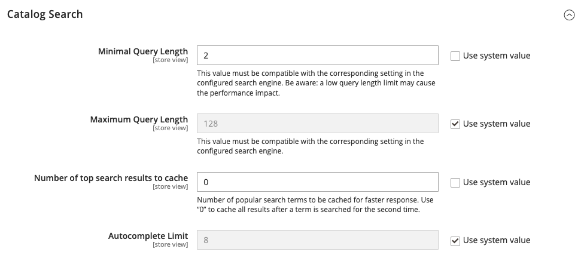

# Configurar pesquisa no catálogo

Há duas variações da configuração da Pesquisa no catálogo. O primeiro método descreve as configurações disponíveis quando o [Live Search](https://experienceleague.adobe.com/docs/commerce-merchant-services/live-search/overview.html) é instalado. O segundo método descreve as definições de configuração do Adobe Commerce nativo com [OpenSearch](https://experienceleague.adobe.com/docs/commerce-operations/installation-guide/prerequisites/search-engine/overview.html){:target=&quot;_blank&quot;}.

>[!NOTE]
>
>Para projetos de infraestrutura em nuvem, consulte instruções adicionais no [_Guia do Commerce on Cloud Infrastructure_](https://experienceleague.adobe.com/en/docs/commerce-cloud-service/user-guide/configure/service/opensearch).

## Método 1: Adobe Commerce com [!DNL Live Search]

1. Na barra lateral _Admin_, vá para **[!UICONTROL Stores]** > _[!UICONTROL Settings]_>**[!UICONTROL Configuration]**.

1. No painel esquerdo, expanda **[!UICONTROL Catalog]** e escolha **[!UICONTROL Catalog]** abaixo de.

1. Expandir  a seção **[!UICONTROL Catalog Search]**.

   {width="600" zoomable="yes"}

   Para obter uma lista detalhada dessas opções, consulte [Adobe Commerce com Live Search](../configuration-reference/catalog/catalog.md#adobe-commerce-with-live-search) na _Referência de Configuração_.

1. Para limitar o comprimento e a contagem de palavras do texto da consulta de pesquisa, defina um valor para **[!UICONTROL Minimal Query Length]** e **[!UICONTROL Maximum Query Length]**.

1. Para limitar a quantidade de resultados de pesquisa populares a serem armazenados em cache para respostas mais rápidas, defina uma quantidade para **[!UICONTROL Number of top search results to cache]**.

   O valor padrão é `100`. Inserir um valor de `0` armazena em cache todos os termos e resultados da pesquisa quando inseridos uma segunda vez.

1. Para alterar o número máximo de linhas disponíveis para os resultados retornados no [pop-up da vitrine](https://experienceleague.adobe.com/docs/commerce-merchant-services/live-search/live-search-storefront/quick-tour.html), digite um valor **[!UICONTROL Autocomplete Limit]** diferente.

   A restrição do número de linhas melhora o desempenho das pesquisas e reduz o tamanho da lista retornada. O valor padrão é `8` linhas.

## Método 2: Commerce com OpenSearch

>[!IMPORTANT]
>
>- Devido ao anúncio do fim do suporte do [!DNL Elasticsearch 7] para agosto de 2023, é recomendável que todos os clientes do Adobe Commerce migrem para o mecanismo de pesquisa OpenSearch 2.x. Para obter informações sobre como migrar o mecanismo de pesquisa durante a atualização do produto, consulte [Migrando para o OpenSearch](https://experienceleague.adobe.com/docs/commerce-operations/upgrade-guide/prepare/opensearch-migration.html) no _Guia de Atualização_.
>- Nas versões 2.4.4 e 2.4.3-p2, todos os campos rotulados como Elasticsearch também se aplicam ao OpenSearch. Quando o suporte para o Elasticsearch 8.x foi introduzido na versão 2.4.6, novos rótulos foram criados para distinguir entre configurações Elasticsearch e OpenSearch. No entanto, as opções de configuração de ambos são as mesmas.

### Etapa 1: configurar opções gerais de pesquisa

>[!NOTE]
>
>Com o OpenSearch e o Elasticsearch, não há suporte pronto para uso para pesquisa por sufixo. Por exemplo, a pesquisa por SKU pode não retornar o resultado esperado se a palavra-chave contiver somente a parte final do SKU.

1. Na barra lateral _Admin_, vá para **[!UICONTROL Stores]** > _[!UICONTROL Settings]_>**[!UICONTROL Configuration]**.

1. No painel esquerdo, expanda **[!UICONTROL Catalog]** e escolha **[!UICONTROL Catalog]** abaixo de.

1. Expandir  a seção **[!UICONTROL Catalog Search]**.

   {zoomable="yes"}

   Para obter mais informações sobre essas opções, consulte [Adobe Commerce com pesquisa nativa](../configuration-reference/catalog/catalog.md#adobe-commerce-with-native-search) na _Referência de Configuração_.

1. Para limitar o comprimento e a contagem de palavras do texto da consulta de pesquisa, defina um valor para **[!UICONTROL Minimal Query Length]** e **[!UICONTROL Maximum Query Length]**.

   >[!IMPORTANT]
   >
   >O valor definido para essa faixa mínima e máxima deve ser compatível com a faixa correspondente definida na configuração do mecanismo de pesquisa. Por exemplo, se você definir esses valores como `2` e `300` no Commerce, atualize os valores correspondentes no mecanismo de pesquisa.

1. Para limitar a quantidade de resultados de pesquisa populares a serem armazenados em cache para respostas mais rápidas, defina uma quantidade para **[!UICONTROL Number of top search results to cache]**.

   O valor padrão é `100`. Inserir um valor de `0` armazena em cache todos os termos e resultados da pesquisa quando inseridos uma segunda vez.

1. Se quiser habilitar ou desabilitar o indexador EAV do Produto, defina o **[!UICONTROL Enable EAV Indexer]**.

   Esse recurso melhora a velocidade de indexação e restringe o uso do indexador por extensões de terceiros.

1. Para limitar o número máximo de resultados da pesquisa a serem exibidos para preenchimento automático, defina uma quantidade para **[!UICONTROL Autocomplete Limit]**.

   A restrição dessa quantidade aumenta o desempenho das pesquisas e reduz o tamanho da lista exibida. O valor padrão é `8`.

### Etapa 2: configurar a conexão OpenSearch

>[!IMPORTANT]
>
>Os campos **[!UICONTROL Search Engine]**, **[!UICONTROL OpenSearch Server Hostname]**, **[!UICONTROL OpenSearch Server Port]**, **[!UICONTROL OpenSearch Index Prefix]**, **[!UICONTROL Enable OpenSearch HTTP Auth]** e **[!UICONTROL OpenSearch Server Timeout]** foram configurados quando o Commerce foi instalado ou atualizado. Esses valores devem ser alterados somente ao atualizar ou modificar o OpenSearch.

1. Para **[!UICONTROL Search Engine]**, selecione `OpenSearch`.

1. Para **[!UICONTROL OpenSearch Server Hostname]**, aceite o valor padrão que foi configurado quando o Commerce foi instalado.

1. Para **[!UICONTROL OpenSearch Server Port]**, aceite o valor padrão que foi configurado quando o Commerce foi instalado.

   Neste exemplo, o valor padrão é `9200`.

1. Para **[!UICONTROL OpenSearch Index Prefix]**, insira um prefixo para identificar o índice de Elasticsearch.

   O valor padrão é `magento2`.

1. Para usar a autenticação HTTP para solicitar um nome de usuário e senha para acessar o servidor OpenSearch, defina **[!UICONTROL Enable OpenSearch HTTP Auth]** como `Yes`.

1. Por **[!UICONTROL OpenSearch Server Timeout]**, insira o número de segundos antes do tempo limite do sistema expirar.

   O valor padrão é `15`.

1. Para verificar a configuração, clique em **[!UICONTROL Test Connection]**.

### Etapa 3: configurar sugestões e recomendações

>[!NOTE]
>
>As sugestões e recomendações de pesquisa podem afetar o desempenho do servidor.

1. Para oferecer recomendações, defina **[!UICONTROL Enable Search Recommendations]** como `Yes` e faça o seguinte:

   - Para **[!UICONTROL Search Recommendation Count]**, insira o número de recomendações a serem oferecidas.

   - Para mostrar o número de resultados encontrados para cada recomendação, defina **[!UICONTROL Show Results Count for Each Recommendation]** como `Yes`.

1. Defina **[!UICONTROL Enable Search Suggestions]** como `Yes` e faça o seguinte:

   - Para **[!UICONTROL Search Suggestions Count]**, insira o número de sugestões de pesquisa a serem oferecidas.

   - Para mostrar o número de resultados encontrados para cada sugestão, defina **[!UICONTROL Show Results for Each Suggestion]** como `Yes`.

### Etapa 4: configurar termos mínimos para corresponder a

Para controlar o número mínimo de termos da sua consulta que os resultados da pesquisa devem corresponder para retorno, especifique um valor para **[!UICONTROL Minimum Terms to Match]**. Especificar esse valor garante a relevância ideal dos resultados para os compradores. Para obter uma lista de valores aceitos, consulte o [parâmetro minimum_should_match](https://opensearch.org/docs/latest/query-dsl/minimum-should-match/) na documentação do OpenSearch.

Quando terminar, clique em **[!UICONTROL Save Config]**.
