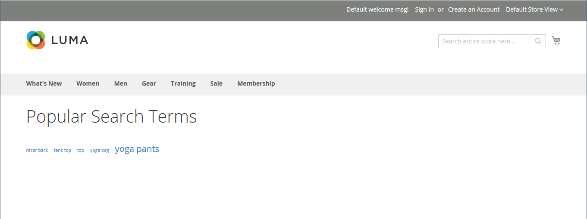
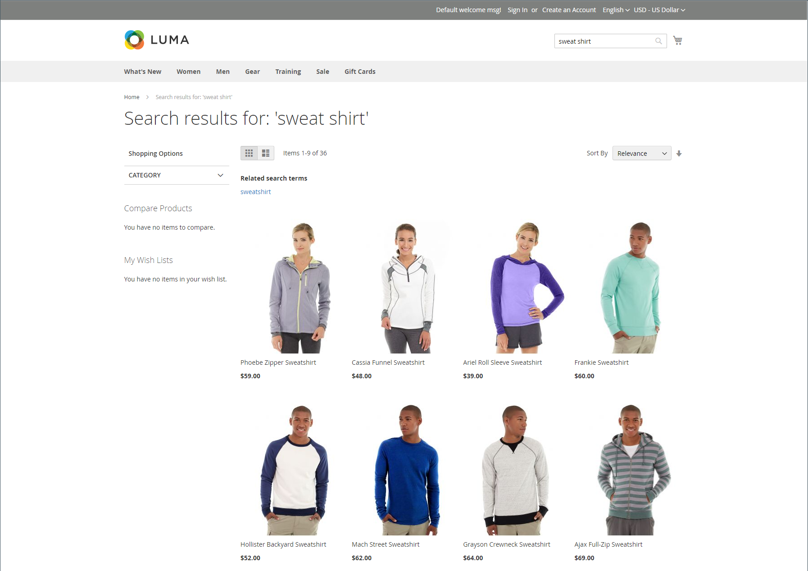

# Gerenciar termos de pesquisa

A [página de aterrissagem](../content-design/pages.md) de um termo de pesquisa pode ser uma página de conteúdo, uma página de categoria, uma página de detalhes do produto ou até mesmo uma página em um site diferente.

Use os termos de pesquisa para capturar erros ortográficos comuns e redirecioná-los para a página apropriada. Por exemplo, se você vende móveis de pátio de ferro forjado, você sabe que muitas pessoas escrevem incorretamente o termo como _ferro de haste_, ou até mesmo _ferro de podridão_. Você pode inserir cada palavra com erro ortográfico como um termo de pesquisa e torná-las sinônimas para _ferro forjado_. Mesmo que a palavra esteja incorreta, a busca é direcionada à página do ferro forjado.

Você também pode saber o que seus clientes estão procurando examinando os termos de pesquisa que eles usam para encontrar produtos em sua loja. Se um número suficiente de pessoas procurar um produto que não esteja em seu catálogo, isso pode indicar uma oportunidade de vendas. Enquanto isso, em vez de deixá-los vazios, você pode redirecioná-los para outro produto no catálogo.

## Adicionar termos de pesquisa

À medida que você aprende novas palavras que as pessoas usam para pesquisar em sua loja, é possível adicioná-las à lista de termos de pesquisa para direcionar as pessoas para os produtos mais semelhantes em seu catálogo.

{width="700" zoomable="yes"}

| Coluna | Descrição |
|--- |--- |
| [!UICONTROL Search Query] | A consulta usada para realizar a pesquisa. |
| [!UICONTROL Store] | O armazenamento onde a consulta de pesquisa foi aplicada. |
| [!UICONTROL Results] | Número de resultados encontrados por consulta. |
| [!UICONTROL Uses] | Número de usos. |
| [!UICONTROL Redirect URL] | URL da página de destino para a qual o usuário foi redirecionado após executar a pesquisa. |
| [!UICONTROL Suggested Terms] | Determina se o resultado da consulta exibe os termos sugeridos. |
| [!UICONTROL Actions] | Abre o produto no modo de edição. |

{style="table-layout:auto"}

>[!NOTE]
>
>O número de resultados é atualizado sempre que um comprador executa uma pesquisa usando essa consulta de pesquisa. Ela não será atualizada se qualquer um dos produtos for alterado ou removido.

### Adicionar um termo de pesquisa

1. Na barra lateral _Admin_, vá para **[!UICONTROL Marketing]** > _[!UICONTROL SEO & Search]_>**[!UICONTROL Search Terms]**.

1. Clique em **[!UICONTROL Add New Search Term]**.

   {width="600" zoomable="yes"}

1. Em _[!UICONTROL General Information]_, na caixa **[!UICONTROL Search Query]**, digite a palavra ou frase que deseja adicionar como um novo termo de pesquisa.

1. Se sua loja estiver disponível em vários idiomas, escolha a exibição **[!UICONTROL Store]** aplicável.

1. Para redirecionar os resultados da pesquisa para outra página na sua loja ou para outro site, insira a URL completa da página de destino no campo **[!UICONTROL Redirect URL]**.

1. Se você quiser que este termo esteja disponível para uso como sugestão sempre que uma pesquisa não retornar resultados, defina **[!UICONTROL Display in Suggested Terms]** como `Yes`.

1. Quando terminar, clique em **[!UICONTROL Save Search]**.

## Editar um termo de pesquisa

1. Na grade _[!UICONTROL Search Terms]_, clique na linha de qualquer registro para abrir o termo de pesquisa no modo de edição.

1. Faça as alterações necessárias.

1. Quando terminar, clique em **[!UICONTROL Save Search]**.

## Excluir um termo de pesquisa

Há dois métodos para excluir um termo de pesquisa — da grade e na página de edição.

**Método 1:** na grade _[!UICONTROL Search Terms]_

1. Na lista, marque a caixa de seleção do termo a ser excluído.

1. No canto superior esquerdo da lista, defina **[!UICONTROL Actions]** como `Delete`.

1. Quando terminar, clique em **[!UICONTROL Submit]**.

**Método 2:** na página _[!UICONTROL Edit a Search Term]_

1. Na barra lateral _Admin_, vá para **[!UICONTROL Marketing]** > _[!UICONTROL SEO & Search]_>**[!UICONTROL Search Terms]**.

1. Localize o termo de pesquisa a ser excluído e abra-o no modo de edição.

1. Clique em **[!UICONTROL Delete Search]**.

1. Para confirmar a ação, clique em **[!UICONTROL OK]**.

## Termos de pesquisa populares

O link _Termos de Pesquisa_ no rodapé da sua loja exibe os termos de pesquisa usados pelos visitantes da sua loja, classificados por popularidade. Os termos de pesquisa aparecem em um formato de _nuvem de tags_, em que o tamanho do texto indica a popularidade do termo.

Por padrão, os Termos de pesquisa populares são ativados como uma ferramenta de otimização de mecanismo de pesquisa, mas não têm conexão direta com o processo de pesquisa do catálogo. Como a página Termos de pesquisa é indexada por mecanismos de pesquisa, quaisquer termos na página podem ajudar a melhorar a classificação do mecanismo de pesquisa e a visibilidade da loja. A URL da página de Termos de Pesquisa Popular é: `mystore.com/search/term/popular/`

{width="600" zoomable="yes"}

**_Para configurar termos de pesquisa populares:_**

1. Na barra lateral _Admin_, vá para **[!UICONTROL Stores]** > _[!UICONTROL Settings]_>**[!UICONTROL Configuration]**.

1. No painel esquerdo, expanda **[!UICONTROL Catalog]** e escolha **[!UICONTROL Catalog]** abaixo de.

1. Expandir  a seção **[!UICONTROL Search Engine Optimization]**.

   {width="600" zoomable="yes"}

   Para obter uma lista detalhada dessas opções, consulte [Otimização do Mecanismo de Pesquisa](../configuration-reference/catalog/catalog.md#search-engine-optimization) na _Referência de Configuração_.

1. Defina **[!UICONTROL Popular Search Terms]** conforme necessário.

   Se necessário, desmarque a caixa de seleção **[!UICONTROL Use system value]** para alterar essa configuração.

1. Quando terminar, clique em **[!UICONTROL Save Config]**.

>[!NOTE]
>
>Você pode configurar ainda mais o armazenamento em cache de [pesquisas populares em catálogos](search-configuration.md).

## Pesquisar sinônimos

Uma maneira de melhorar a eficácia da [pesquisa de catálogo](search-configuration.md) é incluir termos diferentes que as pessoas podem usar para descrever o mesmo item. Você não quer perder uma venda só porque alguém está procurando um _sofá_ e seu produto está listado como um _sofá_. Você pode capturar uma variedade maior de termos de pesquisa inserindo _sofa_, _davenport_ e _loveseat_ como sinônimos para _couch_ e direcioná-los para a mesma página inicial.

A Adobe Commerce oferece suporte a duas soluções diferentes de gerenciamento de sinônimos:

- O recurso [Sinônimos](https://experienceleague.adobe.com/docs/commerce/live-search/live-search-admin/synonyms/synonyms.html) do Live Search está disponível para instalações do Adobe Commerce com o Live Search instalado.
- O recurso Pesquisar sinônimos padrão (descrito nesta página) está disponível e pronto para uso para todas as instalações do Adobe Commerce.

>[!NOTE]
>
>O recurso Sinônimos de Pesquisa padrão pronto para uso oferece suporte aos `name` e `sku` atributos de produto **_somente_**.

>[!IMPORTANT]
>
>O recurso de sinônimos de pesquisa usa apenas um método de pesquisa correspondente a texto completo.

{width="700" zoomable="yes"}

### Criar um grupo de sinônimos

1. Na barra lateral _Admin_, vá para **[!UICONTROL Marketing]** > _[!UICONTROL SEO & Search]_>**[!UICONTROL Search Synonyms]**.

   A grade _[!UICONTROL Search Synonyms]_&#x200B;é exibida. Se for a primeira vez que você usa sinônimos de pesquisa, a grade estará vazia.

   {width="700" zoomable="yes"}

1. Clique em **[!UICONTROL New Synonym Group]**.

   {width="700" zoomable="yes"}

1. Defina **[!UICONTROL Scope]** para as exibições de armazenamento onde os sinônimos se aplicam.

1. Insira cada sinônimo no grupo, separado por vírgula. Escolha palavras que as pessoas possam usar como critérios de pesquisa. Por exemplo:

   - `sweatshirt, sweat shirt, hoodie, fleece`
   - `cell phone, mobile phone, smart phone`
   - `couch, sofa, davenport`
   - `wrought iron, rot iron, rod iron`

1. Para unir esses sinônimos em um grupo com outros que tenham o mesmo escopo, marque a caixa de seleção **[!UICONTROL Merge existing synonyms]**.

1. Quando terminar, clique em **[!UICONTROL Save Synonym Group]**.

### Editar um grupo de sinônimos

1. Na grade _[!UICONTROL Search Synonyms]_, clique na linha de qualquer registro para abrir o grupo de sinônimos no modo de edição.

1. Faça as alterações necessárias.

1. Quando terminar, clique em **[!UICONTROL Save Synonym Group]**.

### Excluir um grupo de sinônimos

Há dois métodos para excluir um grupo de sinônimos: na grade e na página de edição.

**Método 1:** na grade de Sinônimos de Pesquisa

1. Na grade _[!UICONTROL Search Synonyms]_, marque a caixa de seleção do grupo a ser excluído.

1. No canto superior esquerdo da lista, defina **[!UICONTROL Actions]** como `Delete`.

1. Quando terminar, clique em **[!UICONTROL Submit]**.

**Método 2:** na página Editar um Grupo de Sinônimos

1. Na grade Pesquisar sinônimos, clique na linha de qualquer registro para abrir o grupo de sinônimos no modo de edição.

1. Clique em **[!UICONTROL Delete Synonym Group]**.

1. Quando solicitado, confirme a remoção do grupo.

## Relatório de Termos de pesquisa

O relatório Termos de pesquisa mostra o número de resultados para cada termo e o número de vezes (ocorrências) que o termo foi usado. Os dados do relatório podem ser filtrados por termo, armazenamento, resultados e ocorrências e exportados para análise adicional.

### Exibir o relatório

1. Na barra lateral _Admin_, vá para **[!UICONTROL Reports]** > _[!UICONTROL Marketing]_>**[!UICONTROL Search Terms]**.

1. Use os controles para filtrar o relatório conforme necessário.

   {width="700" zoomable="yes"}

## Exportar o relatório

1. Para **[!UICONTROL Export to]**, escolha um formato de exportação:

   - `CSV` - Um arquivo de valores separados por vírgula contendo dados de texto sem formatação
   - `Excel XML` - Um formato de dados de planilha baseado em XML

1. Clique em **[!UICONTROL Export]**.

   O arquivo gerado é salvo automaticamente na pasta designada para downloads.

### Colunas do relatório

| Coluna | Descrição |
|--- |--- |
| [!UICONTROL ID] | ID numérica exclusiva gerada para a entrada de termo de pesquisa |
| [!UICONTROL Search Query] | A consulta usada para realizar a pesquisa |
| [!UICONTROL Store] | O armazenamento onde a consulta de pesquisa foi aplicada |
| [!UICONTROL Results] | Número de resultados |
| [!UICONTROL Hits] | Número de utilizações |

{style="table-layout:auto"}
