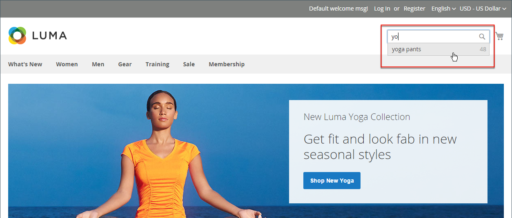

# Visão geral da pesquisa no catálogo

>[!TIP]
>
>O [[!DNL Live Search]](https://experienceleague.adobe.com/docs/commerce-merchant-services/live-search/overview.html) fornece uma experiência de pesquisa rápida, relevante e intuitiva e está disponível para o Adobe Commerce sem custo adicional. Esta seção descreve a funcionalidade de pesquisa padrão que pode ser diferente de [!DNL Live Search].

Pesquisas mostram que as pessoas que usam a pesquisa têm mais probabilidade de fazer uma compra do que os clientes que dependem apenas da navegação. Na verdade, de acordo com alguns estudos, as pessoas que usam a pesquisa têm quase duas vezes mais chances de fazer uma compra.

As seções a seguir descrevem os recursos básicos de pesquisa do catálogo. Para obter informações sobre como configurar e personalizar os recursos nativos de pesquisa no catálogo, consulte:

- [Configurar pesquisa no catálogo](search-configuration.md)
- [Resultados da pesquisa](search-results.md)
- [Gerenciar termos de pesquisa](search-terms.md)

>[!NOTE]
>
>A funcionalidade de pesquisa nativa no Commerce fornece resultados de pesquisa com correspondência exata. Enquanto o [!DNL Live Search], um módulo opcional disponível para instalação e habilitação no Adobe Commerce, é implementado de forma diferente e o resultado não é limitado à sequência de pesquisa exata. Por exemplo, onde você tem dez produtos rotulados numericamente para o _Omega_: a pesquisa por `Omega 1` resulta em uma única correspondência para o _Omega 1_ com o recurso de pesquisa nativo. Mas a mesma sequência de pesquisa fornecida pelo Live Search resulta em uma correspondência para vários itens, _Ômega 1_ e _Ômega 10_.

## Pesquisa rápida

>[!NOTE]
>
>Quando o [[!DNL Live Search]](https://experienceleague.adobe.com/en/docs/commerce-merchant-services/live-search/overview) está instalado e o widget [[!DNL Storefront Popover]](https://experienceleague.adobe.com/en/docs/commerce-merchant-services/live-search/live-search-storefront/storefront-popover) está habilitado, a caixa de pesquisa retorna o resultado &quot;pesquisar ao digitar&quot; em um pop-over.

A caixa de pesquisa no cabeçalho da loja ajuda os visitantes a encontrar produtos no catálogo. O texto da pesquisa pode ser o nome completo ou parcial do produto ou qualquer outra palavra ou frase que descreva o produto. Os termos de pesquisa que as pessoas usam para encontrar produtos podem ser gerenciados no Administrador.

1. Para **[!UICONTROL Search]**, o cliente insere as primeiras letras do que deseja encontrar.

   Todas as correspondências no catálogo são exibidas abaixo, com o número de resultados encontrados.

1. O cliente pressiona a tecla Enter ou clica em um resultado na lista de produtos correspondentes.

   {width="700" zoomable="yes"}

## Pesquisa avançada

>[!NOTE]
>
>A funcionalidade de pesquisa avançada de formulário descrita aqui não se aplica a [[!DNL Live Search]](https://experienceleague.adobe.com/docs/commerce-merchant-services/live-search/overview.html).

A Pesquisa avançada permite que os compradores pesquisem no catálogo com base nos valores inseridos em um formulário. Como o formulário contém vários campos, uma única pesquisa pode incluir vários parâmetros. O resultado é uma lista de todos os produtos no catálogo que correspondem aos critérios. Um link para Pesquisa avançada está no rodapé da loja.

{width="700" zoomable="yes"}

Cada campo no formulário corresponde a um atributo do catálogo de produtos. Para adicionar um campo, defina as propriedades de front-end do atributo como `Include in Advanced Search`. Como prática recomendada, inclua apenas os campos que os clientes têm maior probabilidade de usar para localizar um produto, pois ter muitos atrasa a pesquisa.

1. No rodapé da loja, o cliente clica em **[!UICONTROL Advanced Search]**.

1. No formulário _Pesquisa Avançada_, o adiciona valores totais ou parciais em quantos campos forem necessários.

1. Clica em **[!UICONTROL Search]** para exibir os resultados.

   {width="700" zoomable="yes"}

1. Se não vir o que está procurando nos resultados da pesquisa, o cliente clica em **[!UICONTROL Modify your search]** e tenta outra combinação de critérios.
