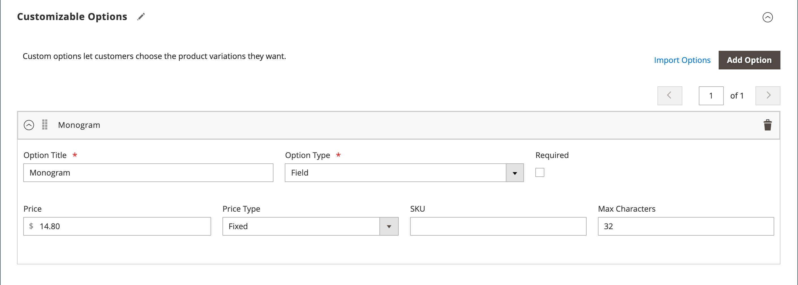

# Configurações do produto - [!UICONTROL Customizable Options]

Adicionar opções personalizáveis a um produto é uma maneira fácil de oferecer uma seleção de opções com texto, seleção e tipos de entrada de data. As opções personalizáveis são uma boa solução se suas necessidades de inventário são simples. No entanto, como eles se baseiam em variações de um único SKU, não podem ser usados para gerenciar estoque ou como a base das condições de regra de preço. Se você tiver vários produtos com as mesmas opções, será possível configurar um produto e importar as opções para os outros produtos.

Quando um cliente compra um produto com uma opção personalizável, uma descrição de cada opção selecionada é exibida abaixo da descrição do produto, e qualquer marcação associada (ou markdown) é aplicada automaticamente ao preço do item.

{width="700" zoomable="yes"}

Se uma regra de preço do carrinho for acionada pela compra, o cálculo inicial se aplica primeiro ao preço do produto e, em seguida, ao preço do item de linha com qualquer ajuste para opções personalizáveis aplicáveis. No exemplo a seguir, o cliente compra uma bolsa de babados por US$ 74,00, além de uma opção personalizável para um monograma. Uma marcação de $14,80 é aplicada ao preço base do produto e o preço ajustado é mostrado como $88,80. Nesse caso, a compra do saco de truques aciona uma regra de preço do carrinho com base no SKU do produto e aplica um desconto à compra, além de frete grátis. Embora a regra de preço do carrinho não seja acionada pela opção personalizável, ela aplica o desconto ao conteúdo do carrinho, o que inclui a marcação para a opção personalizável.

{width="700" zoomable="yes"}

>[!NOTE]
>
>Um desconto de regra de preço de catálogo não é aplicado às opções personalizáveis de preço fixo.

## Criar opções personalizáveis

1. Abra o produto no modo de edição.

1. Role para baixo e expanda  na seção _[!UICONTROL Customizable Options]_.

1. Clique em **[!UICONTROL Add Option]**.

   {width="600" zoomable="yes"}

1. Conclua as novas configurações de opção:

   - Para **[!UICONTROL Option Title]**, insira um nome para a opção.

   - Defina o **[!UICONTROL Option Type]** para o tipo de entrada de dados.

   - Se a opção não for necessária para comprar o produto, desmarque a caixa de seleção **[!UICONTROL Required]**.

1. Preencha os campos de acordo com o tipo de entrada de dados:

   - Para **[!UICONTROL Title]**, insira um nome para esta opção.

   - (Opcional) Para **[!UICONTROL Price]**, insira qualquer marcação ou markdown do preço base do produto que se aplique a esta opção.

   - Defina **[!UICONTROL Price Type]** como um dos seguintes:

      - `Fixed` - O preço da variação difere do preço do produto base por um valor monetário fixo, como $1.
      - `Percentage` - O preço da variação difere do preço do produto base por uma porcentagem, como 10%.

   - (Opcional) Digite um **[!UICONTROL SKU]** para a opção. O SKU de opção é um sufixo adicionado ao SKU do produto.

   - Se o _[!UICONTROL Option Type]_&#x200B;for `File`, defina os parâmetros do arquivo. Para **[!UICONTROL Compatible File Extensions]**, insira as extensões válidas como valores separados por vírgula (como `png, jpg, gif`). Para **[!UICONTROL Maximum Image Size]**, insira o tamanho máximo da imagem em pixels. Se for uma entrada de texto, insira o valor máximo para **[!UICONTROL Maximum Characters]**.

   {width="600" zoomable="yes"}

1. (Opcional) Se quiser adicionar outra opção personalizável, clique em **[!UICONTROL Add Option]**.

   - Conclua as configurações como antes.

   - Para alterar a ordem das opções, clique no ícone _[!UICONTROL Order]_ e arraste a opção para uma nova posição na lista.

   Repita essa etapa para cada opção a ser adicionada.

1. Quando terminar, clique em **[!UICONTROL Save]**.

## Importar opções personalizáveis

1. Na seção _Opções Personalizáveis_, clique em **[!UICONTROL Import Options]**.

1. Todos os produtos com opções personalizáveis aparecem na grade.

1. Na lista, marque a caixa de seleção do produto com as opções que deseja importar.

1. Clique em **[!UICONTROL Import]**.

1. Quando terminar, você poderá continuar a adicionar mais opções personalizadas ou clicar em **[!UICONTROL Save and Close]**.

## Tipos de entrada

| Tipo | Descrição |
|---------------------|---------------|
| [!UICONTROL Text] | Uma linha ou caixa de texto de entrada onde o cliente pode inserir as informações necessárias. Opções: **[!UICONTROL Field]**- Um campo de entrada de linha única para texto. **[!UICONTROL Area]** - Um campo de entrada de várias linhas. Este tipo não suporta formatação avançada como HTML. Use Max Characters para limitar o comprimento do texto que pode ser inserido e garantir a representação correta do texto inserido no Admin. |
| [!UICONTROL File] | Permite que o cliente carregue um arquivo. |
| [!UICONTROL Select] | Permite que o cliente selecione uma ou várias opções, dependendo do tipo de entrada usado. Opções: **[!UICONTROL Drop-down]**- Uma lista suspensa de opções que permite apenas uma seleção. **[!UICONTROL Radio Buttons]** - Um conjunto de opções que permite somente uma seleção. **[!UICONTROL Checkbox]**- Uma caixa de seleção é uma variação de uma opção sim/não. Se o produto tiver mais de uma caixa de seleção, várias seleções poderão ser feitas. **[!UICONTROL Multiple Select]** - Uma caixa de listagem suspensa de opções que aceita várias seleções. Para escolher várias opções, mantenha pressionada a tecla Ctrl (PC) ou Command (Mac) e clique em cada opção. |
| [!UICONTROL Date] | Permite que o cliente informe uma data ou hora ou escolha o valor de um calendário. Opções:  **[!UICONTROL Date]**- Um campo de entrada para um valor de data. A data pode ser digitada diretamente no campo ou selecionada em uma lista ou calendário. O método e o formato de entrada são determinados pela configuração das [opções de data e hora](attributes-input-types.md#date-and-time-options). **[!UICONTROL Date & Time]** - Um campo de entrada para um valor de data e hora. **[!UICONTROL Time]**- Um campo de entrada para um valor de tempo. |

{style="table-layout:auto"}
