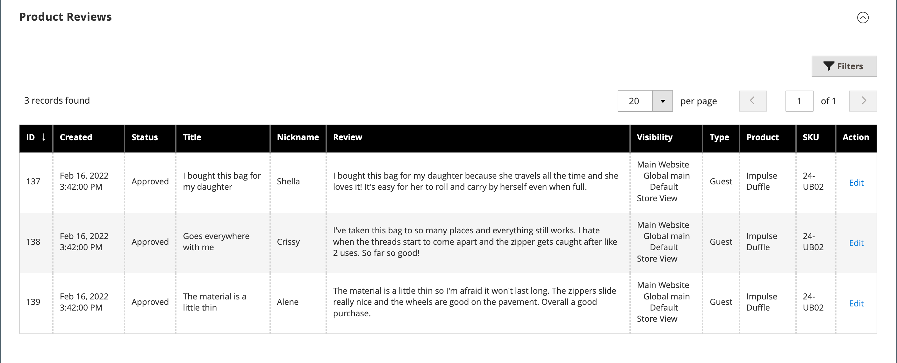

# Configurações do produto - [!UICONTROL Product Reviews]

A variável _[!UICONTROL Product Reviews]_A seção lista todas as análises que os clientes enviaram sobre o produto. Esta seção é exibida com as outras informações do produto somente depois que um novo produto é salvo pela primeira vez. Para obter mais informações, consulte [Avaliações do produto](../merchandising-promotions/product-reviews.md).

{width="600" zoomable="yes"}

## Referência do campo

| Campo | Descrição |
|--- |--- |
| [!UICONTROL ID] | ID numérica exclusiva gerada para a entrada de revisão do produto |
| [!UICONTROL Created] | Data de publicação da revisão |
| [!UICONTROL Status] | Status da revisão (`Pending`, `Approved`ou `Not Approved`) |
| [!UICONTROL Title] | Revisar título |
| [!UICONTROL Nickname] | O apelido do usuário que deixou a revisão |
| [!UICONTROL Review] | Análise do cliente sobre o produto atual |
| [!UICONTROL Visibility] | Visibilidade em revisões da loja |
| [!UICONTROL Type] | Tipo de usuário que deixou a revisão (`Guest` ou `Customer`) |
| [!UICONTROL Product] | Nome do produto revisado |
| [!UICONTROL SKU] | A Unidade de Manutenção de Estoque exclusiva atribuída ao produto |
| [!UICONTROL Action] | Abre o produto no modo de edição |

{style="table-layout:auto"}

## Avaliações moderadas de um produto específico

1. No _Admin_ barra lateral, vá para **[!UICONTROL Catalog]** > **[!UICONTROL Products]**.

1. Localize o produto e abra-o no modo de edição.

1. Role para a _[!UICONTROL Product Reviews]_seção.

1. Clique em **[!UICONTROL Edit]** para uma análise de produto com `Pending` status para exibir e editar os detalhes.

1. Definir status para revisão:

   - Para aprovar uma revisão pendente, selecione `Approved`.
   - Para rejeitar uma revisão, selecione `Not Approved`.
   - É possível alterar o status da revisão novamente para `Pending` a qualquer momento.

1. Quando terminar, clique em **[!UICONTROL Save Review]**.

Análises com a `Pending` e `Not Approved` Os status não são exibidos na loja.
