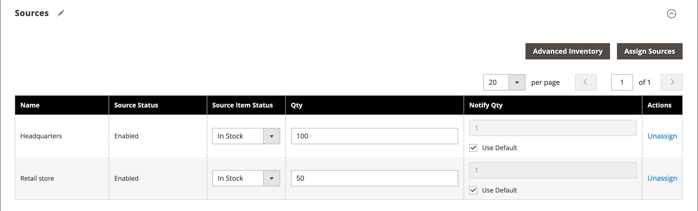

# Configurações do produto - [!UICONTROL Sources]

A seção _[!UICONTROL Sources]_&#x200B;das configurações do produto lista as fontes das quais o produto pode ser distribuído. É usado para atribuir e desatribuir origens, bem como gerenciar a quantidade e a disponibilidade do produto. Esta seção será exibida somente se houver mais de uma origem definida para o armazenamento. Para obter mais informações sobre fontes, consulte [Gerenciar fontes](../inventory-management/sources-manage.md).

## Atribuir uma origem a um produto

1. Clique em **[!UICONTROL Assign Source]**.

1. Marque a caixa de seleção das fontes necessárias.

1. Clique em **[!UICONTROL Done]**.

1. Selecione **[!UICONTROL Source Item Status]** e insira os valores de **[!UICONTROL Qty]** e **[!UICONTROL Notify Qty]**, conforme necessário.

1. Clique em **[!UICONTROL Save]** para salvar as alterações.

{width="600" zoomable="yes"}

## Referência do campo

| Campo | Descrição |
|--- |--- |
| [!UICONTROL Name] | O nome exclusivo de uma origem. |
| [!UICONTROL Source Status] | Determina se o produto está ativado ou desativado no catálogo. |
| [!UICONTROL Source Item Status] | Determina a disponibilidade atual do produto. Opções: **[!UICONTROL In Stock]**- Disponibiliza o produto para compra. **[!UICONTROL Out of Stock]** - A menos que os pedidos pendentes sejam ativados, impede que o produto esteja disponível para compra e remove a listagem do catálogo. |
| [!UICONTROL Qty] | Valores de estoque disponível para cada origem. |
| [!UICONTROL Notify Qty] | Um valor para a _Notificar para Quantidade_ para esta origem específica se `Notify Quantity Use Default` não estiver selecionado. |
| [!UICONTROL Notify Qty Use Default] | Indica o uso da configuração padrão para _Notificar para Quantidade_ no inventário avançado do produto ou configuração global na configuração da loja. Para obter mais informações sobre configurações avançadas de inventário para o seu produto, consulte [Configurar opções avançadas do produto](../inventory-management/product-options.md). |
| [!UICONTROL Actions] | Para uma origem atribuída, clique em **[!UICONTROL Unassign]** para tornar a origem não disponível para o produto. Para uma origem não atribuída, clique em **[!UICONTROL Assign Sources]** para disponibilizar uma origem para o produto. Para obter mais informações sobre as opções de [!UICONTROL Assign Sources], consulte [Atribuindo origens por produto](../inventory-management/sources-assign-per-product.md). |

{style="table-layout:auto"}

