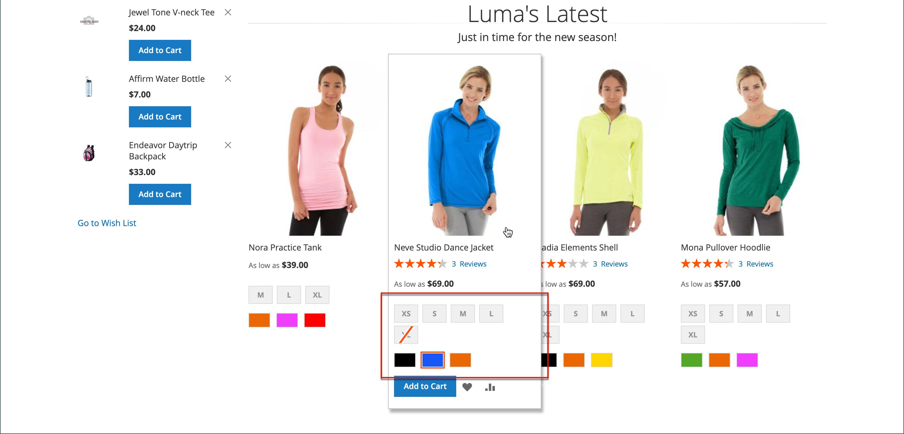
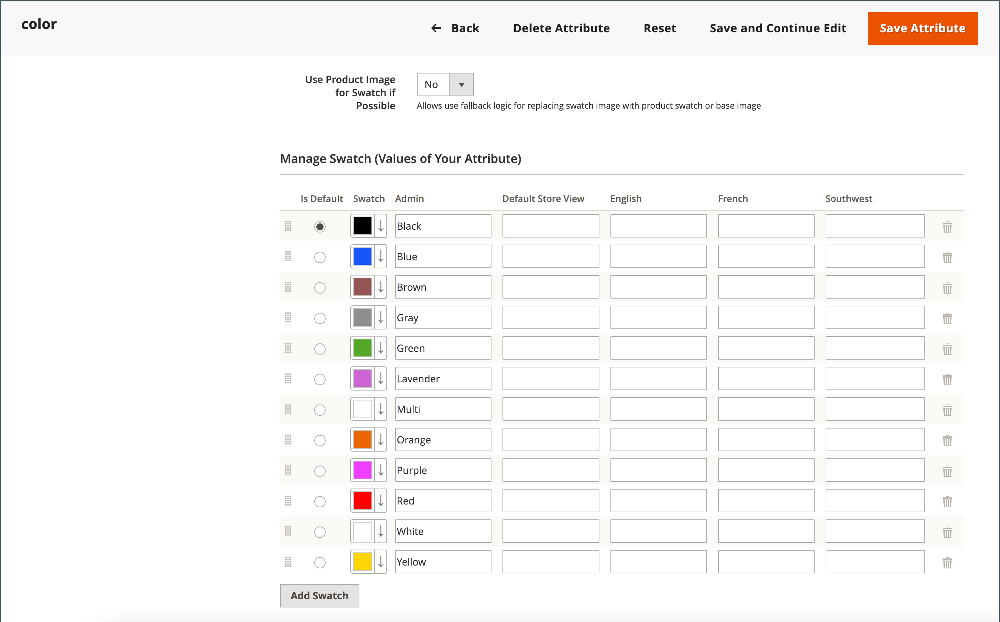

# Amostras de produto

Os clientes têm grandes expectativas em relação à escolha de uma cor, e é fundamental que as descrições dos produtos representem com precisão cada cor, padrão ou textura disponível. Por exemplo, as calças no exemplo a seguir não estão disponíveis em vermelho, verde e azul. Em vez disso, elas estão disponíveis apenas em tons específicos de vermelho, verde e azul, que provavelmente são exclusivos desse produto.

{width="700" zoomable="yes"}

Para [produtos configuráveis](product-create-configurable.md), a cor pode ser indicada por uma amostra visual, amostra de texto ou controle de entrada. As amostras podem ser usadas na página do produto, em listagens de produtos e na [navegação em camadas](navigation-layered.md). Na página do produto, as amostras são sincronizadas para exibir a imagem do produto correspondente quando a amostra é selecionada. Quando o cliente seleciona a amostra, o valor correspondente é exibido no campo de entrada e a amostra é destacada como a seleção atual.

>[!NOTE]
>
>Os atributos de amostra podem ser configurados para não exibir imagens de produtos simples correspondentes quando a amostra é selecionada ao definir o valor da opção _[!UICONTROL Update Product Preview Image]_&#x200B;como `No` na página [!UICONTROL Attribute Edit] no Administrador.

## Amostras baseadas em texto

Se uma imagem não estiver disponível para uma amostra, o valor do atributo será exibido como texto. Uma amostra baseada em texto é como um botão com um rótulo de texto e se comporta da mesma forma que uma amostra com uma imagem. Quando as amostras baseadas em texto são usadas para mostrar os tamanhos disponíveis, qualquer tamanho que não estiver disponível será riscado.

{width="700" zoomable="yes"}

## Amostras em navegação em camadas

As amostras também podem ser usadas na navegação em camadas, se a propriedade _[!UICONTROL Use in Layered Navigation]_&#x200B;do atributo color estiver definida como `Yes`. O exemplo a seguir mostra amostras de imagens coloridas e baseadas em texto na navegação em camadas.

{width="700" zoomable="yes"}

## Criar amostras para produtos

As amostras podem ser definidas como um componente do atributo `color` ou configuradas localmente para um produto específico e carregadas como [imagens do produto](product-image.md#upload-an-image).

Nos exemplos anteriores, as calças &quot;Sylvia Capri&quot; estão disponíveis em valores específicos de `red`, `green` e `blue`. Como as amostras foram obtidas da imagem do produto, cada uma é uma representação real da cor. O atributo `color` é usado para gerenciar as informações de todas as cores e amostras do produto.

### Etapa 1: criar as amostras

Use um dos métodos a seguir para criar amostras para seus produtos.

#### Método 1: adicionar uma amostra de cor

1. Para capturar a cor real de um produto, abra a imagem em um editor de fotos e use a ferramenta conta-gotas para identificar a cor exata e anotar o valor hexadecimal equivalente.

   {width="400"}

1. Na barra lateral _Admin_, vá para **[!UICONTROL Stores]** > _[!UICONTROL Attributes]_>**[!UICONTROL Product]**.

1. Na grade, abra o atributo _color_ no modo de edição.

1. Verifique se **[!UICONTROL Catalog Input Type for Store Owner]** está definido como `Visual Swatch`.

1. Se preferir não exibir imagens do produto simples correspondentes quando a amostra for selecionada na página de exibição do produto, defina **[!UICONTROL Update Product Preview Image]** como `No`.

1. Em _[!UICONTROL Manage Swatch (Values of Your Attribute)]_, clique em **[!UICONTROL Add Swatch]**&#x200B;e faça o seguinte:

   {width="600" zoomable="yes"}

   - Na coluna _Amostra_, clique na nova amostra e selecione **[!UICONTROL Choose a color]** no menu.

     {width="500" zoomable="yes"}

   - No seletor de cores, coloque o cursor no campo **#**, exclua o valor atual e insira o valor hexadecimal de seis caracteres da nova cor.

     {width="500" zoomable="yes"}

   - Para salvar a amostra, clique no ícone _Roda de Cores_ (  ) no canto inferior direito do seletor de cores.

   - Na coluna _Admin_, digite um rótulo para descrever a cor para o administrador de armazenamento.

     Se aplicável, também é possível inserir a tradução da cor para cada idioma aceito. No exemplo a seguir, o SKU está incluído para referência no rótulo de _Administrador_ porque as cores são usadas somente para um produto específico. Você pode incluir um espaço ou um sublinhado no rótulo, mas não um hífen.

   - Na coluna _Is Default_, selecione a amostra que deve ser a opção padrão.

   - Para alterar a ordem das amostras de cores, clique no ícone _[!UICONTROL Order]_ e arraste o item para uma nova posição na lista.

     {width="400"}

1. Quando terminar, clique em **[!UICONTROL Save Attribute]** e atualize o cache quando solicitado.

1. Abra cada produto no modo de edição e atualize o atributo **Cor** com a amostra correta.

   Para atualizar vários produtos ao mesmo tempo, siga as etapas abaixo.

#### Método 2: carregar uma imagem de amostra

1. Para capturar uma imagem para uma amostra, abra a imagem do produto em um editor de fotos e salve uma área quadrada da imagem que represente a cor, o padrão ou a textura.

   Se necessário, você pode repetir essa ação para cada variação do produto.

   O tamanho e as dimensões da amostra são determinados pelo tema. Geralmente, salvar uma imagem como um quadrado ajuda a preservar a proporção de um padrão.

   {width="400"}

1. Na barra lateral _Admin_, vá para **[!UICONTROL Stores]** > _[!UICONTROL Attributes]_>**[!UICONTROL Product]**.

1. Na grade, abra o atributo **[!UICONTROL color]** no modo de edição.

1. Verifique se **[!UICONTROL Catalog Input Type for Store Owner]** está definido como `Visual Swatch`.

1. Se preferir não exibir imagens do produto simples correspondentes quando a amostra for selecionada na página de exibição do produto, defina **[!UICONTROL Update Product Preview Image]** como `No`.

1. Em _[!UICONTROL Manage Swatch]_(valores do seu atributo), clique em **[!UICONTROL Add Swatch]**&#x200B;e faça o seguinte:

   - Na coluna _[!UICONTROL Swatch]_, clique na nova amostra para exibir o menu e escolha **[!UICONTROL Upload a file]**.

   - Navegue até o arquivo de amostra preparado e escolha o arquivo do qual fazer upload.

   - Repita essas etapas para cada imagem de amostra.

   - Insira os rótulos para o Administrador e a loja.

     Neste exemplo, o SKU está incluído no rótulo de Administrador para referência, pois essas cores são usadas somente para um produto específico. Você pode incluir um espaço ou um sublinhado no rótulo, mas não pode incluir um hífen.

     {width="500" zoomable="yes"}

1. Quando terminar, clique em **[!UICONTROL Save Attribute]** e atualize o cache quando solicitado.

1. Abra cada produto no modo de edição e atualize o atributo **[!UICONTROL Color]** com a amostra correta.

   Para atualizar vários produtos ao mesmo tempo, siga as etapas abaixo.

### Etapa 2: atualizar os produtos

1. Na barra lateral _Admin_, vá para **[!UICONTROL Catalog]** > **[!UICONTROL Products]**.

1. Use o **[!UICONTROL Filter]** para exibir a lista por Nome ou SKU e incluir apenas os produtos aplicáveis.

1. Na grade, marque a caixa de seleção de cada produto ao qual a amostra se aplica.

1. Defina **[!UICONTROL Actions]** como `Update Attributes`.

   Neste exemplo, todas as configurações azuis das calças são selecionadas.

   {width="600" zoomable="yes"}

1. Role para baixo até o atributo **[!UICONTROL Color]** e marque a caixa de seleção **[!UICONTROL Change]**.

   {width="400"}

1. Escolha a amostra aplicável aos produtos selecionados e clique em **[!UICONTROL Save]**.

1. Quando solicitado, atualize o cache.

   {width="200"}

## Adicionar amostras a um produto simples

1. Na barra lateral _Admin_, vá para **[!UICONTROL Catalog]** > **[!UICONTROL Products]**.

1. Abra um produto no modo de edição e verifique o status do produto (deve ser ativado).

1. Clique no botão **[!UICONTROL Create Configurations]** (na guia `Configurations`).

1. Na janela pop-up, escolha o atributo Cor e **[!UICONTROL Next]**.

1. Selecione amostras de cores no atributo que você deseja incluir neste produto.

1. Na barra de progresso, clique em **[!UICONTROL Next]**.

1. [Configure as imagens, o preço e a quantidade](product-create-configurable.md#step-3-configure-the-images-price-and-quantity).

   Nesta etapa, defina as imagens, os preços e a quantidade de cada configuração. As opções disponíveis são as mesmas para cada uma e você pode escolher apenas uma. Você pode aplicar a mesma configuração a todos os SKUs, aplicar uma configuração exclusiva a cada SKU ou ignorar as configurações por enquanto.

1. Quando a configuração de imagens, preço e quantidade estiver concluída, clique em **[!UICONTROL Next]** no canto superior direito.

   As variações de produto atuais aparecem na parte inferior da seção Configuração. Se você estiver satisfeito com as configurações, clique em **[!UICONTROL Generate Products]**.
