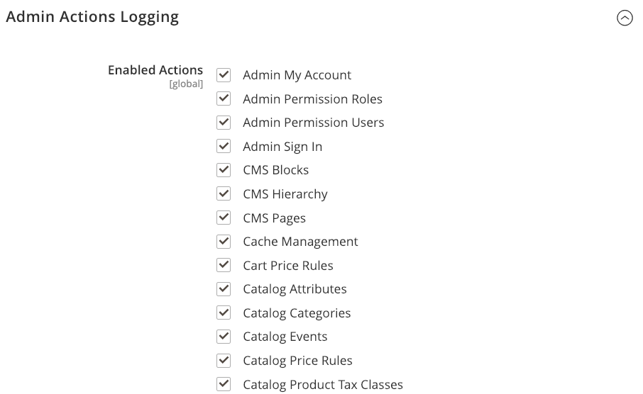

# Avançado > Administrador

{{config}}

## [!UICONTROL Admin User Emails]

<!-- zoom -->

Para obter mais informações sobre como alterar essas configurações, consulte [Senha esquecida e redefinir email](../../systems/permissions-users-all.md#forgotten-password-and-reset-emails).

| Campo | [Escopo](../../getting-started/websites-stores-views.md#scope-settings) | Descrição |
|---------------------------------------------|------------------------------------------------------------------------|----------------------------------------------------------------------------------------------------------------------------------------------------------------------------------------------------------------|
| [!UICONTROL Forgot Password Email Template] | Global | Identifica o modelo de email usado para a mensagem enviada quando um usuário administrador esquece a senha. Modelo padrão: `Forgot Admin Password` |
| [!UICONTROL Forgot and Reset Email Sender] | Global | Identifica o contato de armazenamento que aparece como remetente do email _Esqueceu a senha_. Remetente padrão: `General Contact` Outras opções de remetente: `Sales Representative`, `Customer Support`, `Custom Email` |
| [!UICONTROL User Notification Template] | Global | Determina o modelo de email usado como o padrão para notificações de administrador. Modelo padrão: `User Notification` |

{style="table-layout:auto"}

## [!UICONTROL Startup Page]

<!-- zoom -->

Para obter mais informações sobre como alterar essas configurações, consulte [Alterar a página de inicialização](../../getting-started/admin-dashboard.md#change-the-startup-page) no _Guia de Introdução_.

| Campo | [Escopo](../../getting-started/websites-stores-views.md#scope-settings) | Descrição |
|---------------------------|------------------------------------------------------------------------|------------------------------------------------------------------|
| [!UICONTROL Startup Page] | Global | Determina a página de aterrissagem do administrador que aparece depois que você faz logon. |

{style="table-layout:auto"}

### [!UICONTROL Startup Page] opções

| Área |                                                                                                                                                                                                                                                                                                                                                                           | Opção |
|---------------------------------------------------------|---------------------------------------------------------------------------------------------------------------------------------------------------------------------------------------------------------------------------------------------------------------------------------------------------------------------------------------------------------------------------|---------------------------------------------------------------------------------------------------------------------------------------------------------------------------------------------------------------------------------------------------------------------------------------------------------------------------------------------------------------------------------------------------------------------------------------------------------------------------------------------------------------------------------------------------------------------------------------------|
| [`Dashboard`](../../getting-started/admin-dashboard.md) |                                                                                                                                                                                                                                                                                                                                                                           |                                                                                                                                                                                                                                                                                                                                                                                                                                                                                                                                                                                             |
| `Sales` | `Operations` | [`Quotes`](../../b2b/quotes.md)   [`Orders`](../../stores-purchase/orders.md) [`Invoices`](../../stores-purchase/invoices.md) [`Shipments`](../../stores-purchase/shipments.md) [`Credit Memos`](../../stores-purchase/credit-memos.md) [`Billing Agreements`](../../stores-purchase/paypal-billing-agreements.md) [`Returns`](../../stores-purchase/returns.md)   [`Transactions`](../../stores-purchase/transactions.md) `Braintree Virtual Terminal` |
| `Catalog` | [`Inventory`](../../inventory-management/introduction.md) | [`Products`](../../catalog/products-list.md) [`Categories`](../../catalog/categories.md) [`Shared Catalog`](../../b2b/catalog-shared-create.md)  |
| `Customers` | [`All Customers`](../../customers/customers-all.md) [`Now Online`](../../customers/now-online.md) [`Customer Groups`](../../customers/customer-groups.md) [`Segments`](../../customers/customer-segments.md)   [`Companies`](../../b2b/account-companies.md) |                                                                                                                                                                                                                                                                                                                                                                                                                                                                                                                                                                                             |
| `Marketing` | `Promotions` | [`Catalog Price Rule`](../../merchandising-promotions/price-rules-catalog.md)  [`Cart Price Rules`](../../merchandising-promotions/price-rules-cart.md))  [`Related Products Rules`](../../merchandising-promotions/product-related-rules.md)   [`Gift Card Accounts`](../../stores-purchase/product-gift-card-accounts.md)  |
|                                                         | [`Private Sales`](../../merchandising-promotions/events-private-sales.md)  | [`Events`](../../merchandising-promotions/event-configure.md)  [`Invitations`](../../merchandising-promotions/invitations.md) |
|                                                         | `Communications` | [`Email Templates`](../../systems/email-templates.md)  [`Newsletter Template`](../../merchandising-promotions/newsletter-template.md)  [`Newsletter Queue`](../../merchandising-promotions/newsletter-queue.md)  [`Newsletter Subscribers`](../../merchandising-promotions/newsletter-subscribers.md)  [`Email Reminders`](../../merchandising-promotions/email-reminder-rules.md)  |
|                                                         | `SEO & Search` | [`Search Terms`](../../catalog/search-terms.md)  [`Search Synonyms`](../../catalog/search-terms.md#search-synonyms)  [`URL Rewrites`](../../merchandising-promotions/url-rewrite.md)  [`Site Map`](../../merchandising-promotions/sitemap-xml.md) |
|                                                         | [`User Content`](../../catalog/settings-advanced-product-reviews.md) | [`All Reviews`](../../catalog/settings-advanced-product-reviews.md)  [`Pending Reviews`](../../merchandising-promotions/product-reviews-moderate.md)   |
| `Content` | `Elements` | [`Pages`](../../content-design/pages.md) [`Hierarchy`](../../content-design/page-hierarchy.md)  [`Blocks`](../../content-design/blocks.md) [`Dynamic Blocks`](../../content-design/dynamic-blocks.md)  [`Widgets`](../../content-design/widgets.md) [`Media Gallery`](../../content-design/media-storage.md) |
|                                                         | `Design` | [`Configuration`](../../content-design/configuration.md) [`Themes`](../../content-design/themes.md) [`Schedule`](../../content-design/schedule.md) |
|                                                         | `Content Staging`   | [Painel](../../content-design/content-staging.md) |
| `Reports` | [`Marketing`](../../getting-started/marketing-reports.md) | `Products in Cart` `Search Terms` `Abandoned Carts` `Newsletter Problem Reports` |
|                                                         | [`Reviews`](../../getting-started/review-reports.md) | `By Customer`  `By Products`  |
|                                                         | [`Sales`](../../getting-started/sales-reports.md) | `Orders` `Tax` `Invoiced` `Shipping` `Refunds` `Coupons` `PayPal Settlement` `Braintree Settlement` |
|                                                         | `System Insights` | [`Site-Wide Analysis Tool`](https://experienceleague.adobe.com/docs/commerce-operations/tools/site-wide-analysis-tool/access.html)  |
|                                                         | [`Customers`](../../getting-started/customer-reports.md) | `Order Total` `Order Count` `New` `Wish Lists` `Segments`  |
|                                                         | [`Products`](../../getting-started/product-reports.md) | `Views` `Bestsellers` `Low Stock` `Ordered` `Downloads` |
|                                                         | [`Private Sales`](../../getting-started/private-sales-reports.md)  | `Invitations` `Invited Customers` `Conversions` |
|                                                         | `Statistics` | [`Refresh Statistics`](../../getting-started/sales-reports.md#refresh-statistics) |
|                                                         | [`Business Intelligence`](../../getting-started/business-intelligence.md) | `Advanced Reporting` `BI Essentials`  |
|                                                         | `Customer Engagement` | `Dashboard` `Importer Status` `Automation Enrollment` `Campaign Sends` `SMS Sends` `Cron Tasks` `Log Viewer` `Abandoned Carts` |
| `Stores` | `Settings` | [`All Stores`](../../stores-purchase/stores.md) [`Configuration`](../../configuration-reference/guide-overview.md) [`Terms and Conditions`](../../stores-purchase/terms-and-conditions.md) [`Order Status`](../../stores-purchase/order-status.md) |
|                                                         | [`Inventory`](../../inventory-management/introduction.md) | [`Sources`](../../inventory-management/sources-stocks.md#sources) [`Stocks`](../../inventory-management/sources-stocks.md#stocks) |
|                                                         | [`Taxes`](../../stores-purchase/taxes.md) | [`Tax Rules`](../../stores-purchase/tax-rules.md) [`Tax Zones and Rates`](../../stores-purchase/tax-zones-rates.md) |
|                                                         | [`Currency`](../../stores-purchase/currency.md) | [`Currency Rates`](../../stores-purchase/currency-configuration.md) [`Currency Symbols`](../../stores-purchase/currency-configuration.md#step-5-customize-currency-symbols-optional) |
|                                                         | `Attributes` | [`Customer`](../../systems/data-attributes-customer.md) [`Customer Address`](../../systems/data-attributes-customer.md#customer-addresses) [`Product`](../../systems/data-attributes-product.md) [`Attribute Set`](../../catalog/attribute-sets.md) [`Returns`](../../stores-purchase/attributes-returns.md) [`Ratings`](../../merchandising-promotions/product-reviews.md#create-custom-ratings) |
|                                                         | `Other Settings` | [`Reward Exchange Rates`](../../merchandising-promotions/reward-exchange-rates.md) [`Gift Wrapping`](../../stores-purchase/cart-configuration.md#gift-wrap) [`Gift Registry`](../../merchandising-promotions/gift-registry-create.md) |
| `System` | [`Data Transfer`](../../systems/data-transfer.md) | [`Import`](../../systems/data-import.md) [`Export`](../../systems/data-export.md) [`Import/Export Tax Rates`](../../systems/data-transfer-tax-rates.md) [`Import History`](../../systems/data-import.md#import-history) [`Scheduled Import/Export`](../../systems/data-scheduled-import-export.md) |
|                                                         | `Extensions` | [`Integrations`](../../systems/integrations.md) |
|                                                         | `Tools` | [`Cache Management`](../../systems/cache-management.md) [`Index Management`](../../systems/index-management.md) |
|                                                         | `Support` | [`Data Collector`](../../systems/support.md#data-collector) [`System Report`](../../systems/support.md#system-reports) |
|                                                         | `Permissions` | [`All Users`](../../systems/permissions-users-all.md) [`Locked Users`](../../systems/permissions-users-all.md#locked-users) [`User Roles`](../../systems/permissions-user-roles.md) |
|                                                         | `Action Log`  | [`Report`](../../systems/action-log.md) [`Archive`](../../systems/action-log-archive.md) [`Bulk Actions`](../../systems/action-log-bulk-actions.md) |
|                                                         | `Other Settings` | [`Notifications`](../../systems/notifications.md) [`Custom Variables`](../../systems/variables-custom.md) [`Manage Encryption Key`](../../systems/encryption-key.md) |
| `Find Partners & Extensions` |                                                                                                                                                                                                                                                                                                                                                                           |                                                                                                                                                                                                                                                                                                                                                                                                                                                                                                                                                                                             |

{style="table-layout:auto"}

<!-- Feature still in development 
## [!UICONTROL Unified Experience]

The [!UICONTROL Unified Experience] option is available in Adobe Commerce deployments that have the Commerce Admin Unified Experience extension loaded. This extension enables integration with Experience Cloud to streamline cross-application workflows between Commerce and other Experience Cloud solutions. See [Adobe Experience Cloud Integration for Commerce Admin](../../getting-started/admin-unified-experience-integration-overview.md).

| Field        | [Scope](../../getting-started/websites-stores-views.md#scope-settings) | Description                                                                                                                                                                                                                                                                                                                                                                    |
|--------------|------------------------------------------------------------------------|--------------------------------------------------------------------------------------------------------------------------------------------------------------------------------------------------------------------------------------------------------------------------------------------------------------------------------------------------------------------------------|
| Enable       | Global                                                                 | Determines if the Commerce instance uses the Experience Cloud integration. Before enabling this feature, review the [requirements and configuration instructions](../../getting-started/admin-unified-experience-integration-overview.md). Options: Yes/No.                                                                                                                    |
| Project Name | Global                                                                 | Identifies the instance in the Experience Cloud Commerce Projects workspace when the Unified Experience is enabled. The name can contain only alphanumeric characters and spaces. Defaults to the [cloud environment name](https://experienceleague.adobe.com/docs/commerce-cloud-service/user-guide/architecture/pro-architecture.html?lang=en#pro-environment-architecture). |

{style="table-layout:auto"}

-->

## [!UICONTROL Admin Base URL]

<!-- zoom -->

Para obter mais informações sobre a configuração dessas opções, consulte [Configurar a URL de base](../../stores-purchase/store-urls.md#configure-the-base-url) no _Guia de Experiência de Compras e Lojas_.

| Campo | [Escopo](../../getting-started/websites-stores-views.md#scope-settings) | Descrição |
|------------------------------------|------------------------------------------------------------------------|-----------------------------------------------------------------------------------------------------------------------------------------------------------------------------------------------------------------------------------|
| [!UICONTROL Use Custom Admin URL] | Global | Determina se um URL personalizado é usado para acessar o Administrador. Opções: `Yes` / `No` |
| [!UICONTROL Custom Admin URL] | Global | Especifica uma URL personalizada para acessar o Administrador. Por padrão, o URL de administração é igual ao URL de base. **Importante:** a URL do Administrador deve estar na mesma instalação do Commerce e ter a mesma raiz do documento que a loja. |
| [!UICONTROL Use Custom Admin Path] | Global | Determina se um caminho personalizado é usado para acessar o Administrador. O caminho padrão é `admin`. Opções: `Yes` / `No` |
| [!UICONTROL Custom Admin Path] | Global | Altera o nome do caminho padrão do Administrador para algo difícil de adivinhar. Insira o nome do caminho personalizado em caracteres minúsculos. Por exemplo: `aardvark` |

{style="table-layout:auto"}

## [!UICONTROL Security]

<!-- zoom -->

Para obter mais informações sobre a configuração dessas opções, consulte [Configurar a segurança do administrador](../../systems/security-admin.md) no _Guia de Sistemas do Administrador_.

| Campo | [Escopo](../../getting-started/websites-stores-views.md#scope-settings) | Descrição |
|--------------------------------------------------------|------------------------------------------------------------------------|--------------------------------------------------------------------------------------------------------------------------------------------------------------------------------------------------------------------------------------------------------------------------------------------------------------------------------------------------------------------------------------------------------------------------------------------------------------------------------------------------------------------------------------------------------------------------------------------------------|
| [!UICONTROL Admin Account Sharing] | Exibição da loja | Determina se um usuário administrador pode fazer logon na mesma conta simultaneamente a partir de diferentes dispositivos. Opções:  **`Yes`**- Permite várias sessões ativas da mesma conta de Administrador. **`No`** - Permite somente uma sessão ativa por conta de Administrador. |
| [!UICONTROL Password Reset Protection Type] | Exibição da loja | Determina o método usado para gerenciar solicitações de redefinição de senha. Opções:  **`By IP and Email`**- A senha pode ser redefinida online depois que uma resposta é recebida da notificação enviada para o endereço de email associado à conta de Administrador. **`By IP`** - A senha pode ser redefinida online sem confirmação adicional.  **`By Email`**- A senha só pode ser redefinida respondendo por email à notificação enviada para o endereço de email associado à conta de Administrador. **`None`** - A senha pode ser redefinida somente pelo administrador de armazenamento. |
| [!UICONTROL Recovery Link Expiration Period (hours)] | Global | Determina o número de horas que um link de recuperação de senha permanece válido. |
| [!UICONTROL Max Number of Password Reset Requests] | Exibição da loja | Determina o número máximo de solicitações de senha que podem ser enviadas por hora. |
| [!UICONTROL Min Time Between Password Reset Requests] | Exibição da loja | Determina o número mínimo de minutos entre as solicitações de redefinição de senha. |
| [!UICONTROL Add Secret Key to URLs] | Global | Quando ativado, o anexa uma chave secreta ao URL do administrador como precaução contra explorações. Opções: `Yes` / `No` |
| [!UICONTROL Login Is Case Sensitive] | Global | Determina se as credenciais de logon inseridas por um usuário devem corresponder às maiúsculas e minúsculas dos armazenados. Opções: `Yes` / `No` |
| [!UICONTROL Admin Session Lifetime (seconds)] | Global | Determina a duração de uma sessão do Administrador em segundos. |
| [!UICONTROL Maximum Login Failures to Lockout Account] | Global | Determina o número de vezes que os usuários administradores podem tentar fazer logon antes que suas contas sejam bloqueadas. Se o campo estiver vazio, nenhum mínimo será definido. Valor padrão: `6` |
| [!UICONTROL Lockout Time (minutes)] | Global | Determina por quantos minutos uma conta de Administrador é bloqueada antes que o usuário possa tentar fazer logon novamente. Valor padrão: `30` |
| [!UICONTROL Password Lifetime (days)] | Global | Determina o número de dias antes de uma senha de administrador expirar. Se o campo estiver vazio, nenhuma duração será definida. Valor padrão: `90` |
| [!UICONTROL Password Change] | Global | Determina se usuários administradores precisam alterar suas senhas. Opções:  **`Forced`**- Exige que os usuários Administradores alterem suas senhas após a configuração da conta. **`Recommended`** - Recomenda que os usuários administradores alterem suas senhas após a configuração da conta. |

{style="table-layout:auto"}

## [!UICONTROL Dashboard]

<!-- zoom -->

Para obter mais informações sobre como configurar essas opções, consulte o [Painel de administração](../../getting-started/admin-dashboard.md) no _Guia de Introdução_.

| Campo | [Escopo](../../getting-started/websites-stores-views.md#scope-settings) | Descrição |
|----------------------------|------------------------------------------------------------------------|-------------------------------------------------------------------------------------------------------|
| [!UICONTROL Enable Charts] | Global | Determina se o painel inclui um gráfico gerado dos dados de vendas atuais. Opções: `Yes` / `No` |

{style="table-layout:auto"}

## [!UICONTROL Admin Grids]

<!-- zoom -->

Para obter mais informações sobre como configurar essas opções, consulte [Limitar exibição do produto](../../catalog/products-list.md#limit-product-display) no _Guia de Gerenciamento de Catálogo_.

>[!NOTE]
>
>Para melhorar o desempenho de catálogos grandes, é recomendável limitar o número de produtos exibidos na grade.

| Campo | [Escopo](../../getting-started/websites-stores-views.md#scope-settings) | Descrição |
|-----------------------------------------------|------------------------------------------------------------------------|-------------------------------------------------------------------------------------------------------------------------------------|
| [!UICONTROL Limit Number of Products in Grid] | Global | Determina se o número de produtos exibidos na grade é limitado ao valor _[!UICONTROL Records Limit]_. Opções: `Yes` / `No` |
| [!UICONTROL Records Limit] | Global | Define o limite de número de produtos na grade de produtos. O valor mínimo padrão é `20000`. |

## [!UICONTROL CAPTCHA]

<!-- zoom -->

Para obter mais informações sobre a configuração dessas opções, consulte [CAPTCHA](../../systems/security-captcha.md) no _Guia de Sistemas de Administração_.

| Campo | [Escopo](../../getting-started/websites-stores-views.md#scope-settings) | Descrição |
|-------------------------------------------------------|------------------------------------------------------------------------|-------------------------------------------------------------------------------------------------------------------------------------------------------------------------------------------------------------------------------------------------------------------------------------------------------------------------------------------------------------------------------------------------------------------------------------------------------------------------------------------------------------------------------------------------------------------------------------------------------------------------------------------------------------------------------------------------------------------------------------------------------------------------------------------------|
| [!UICONTROL Enable CAPTCHA in Admin] | Global | Habilita CAPTCHA para o logon de Administrador. Opções: `Yes` / `No` |
| [!UICONTROL Font] | Global | Determina a fonte usada para exibir o CAPTCHA. Para adicionar sua própria fonte, coloque o arquivo de fonte no mesmo diretório da instância do Commerce e adicione a declaração ao arquivo config.xml em `app/code/Magento/Captcha/etc` Fonte padrão:` LinLibertine` |
| [!UICONTROL Forms] | Global | Determina os formulários em que CAPTCHA é usado. Opções: `Admin Login` / `Admin Forgot Password` |
| [!UICONTROL Displaying Mode] | Global | Determina quando o CAPTCHA é exibido. Opções:  **`Always`**- CAPTCHA é sempre necessário para fazer logon. **`After number of attempts to login`** - Exibe o campo [!UICONTROL Number of Unsuccessful Attempts to Login]. Insira o número de tentativas de logon permitidas. Um valor de 0 (zero) é semelhante à definição de Modo de exibição como Sempre. Essa opção não abrange os formulários Esqueceu a senha e Criar usuário. Se CAPTCHA estiver ativado e definido para ser exibido, ele sempre será incluído no formulário. **Observação**: para rastrear o número de tentativas de logon malsucedidas, cada tentativa de logon em um endereço de email e a partir de um endereço IP é contada. O número máximo de tentativas de logon permitidas no mesmo endereço IP é 1.000. Essa limitação se aplica somente quando CAPTCHA está ativado. |
| [!UICONTROL Number of Unsuccessful Attempts to Login] | Global | Determina o número de vezes que uma pessoa pode tentar fazer logon antes que a conta seja bloqueada. Para rastrear o número de tentativas de logon malsucedidas, o sistema rastreia as tentativas de um endereço de email a partir de um único endereço IP. O número máximo de tentativas permitidas no mesmo endereço IP é 1.000. Essa limitação se aplica somente se CAPTCHA estiver ativado. |
| [!UICONTROL CAPTCHA Timeout (minutes)] | Global | Determina a duração do CAPTCHA atual. Quando o CAPTCHA expira, o usuário deve recarregar a página. |
| [!UICONTROL Number of Symbols] | Global | Determina o número de símbolos usados no CAPTCHA. O valor máximo permitido é `8`. Você também pode especificar um intervalo, por exemplo, `5-8`. |
| [!UICONTROL Symbols Used in CAPTCHA] | Global | Determina quais símbolos são usados no CAPTCHA. Somente letras (a-z e A-Z) e números (0-9) são permitidos. O conjunto padrão de símbolos sugeridos no campo exclui símbolos de aparência semelhante como i, l ou 1. A exibição desses símbolos no CAPTCHA diminui a probabilidade de um usuário reconhecer CAPTCHA corretamente. |
| [!UICONTROL Case Sensitive] | Global | Determina se os caracteres usados em CAPTCHA diferenciam maiúsculas de minúsculas. Opções: `Yes` / `No` |

{style="table-layout:auto"}

## [!UICONTROL Admin Actions Logging]

{{ee-feature}}

<!-- zoom -->

Para obter mais informações sobre a configuração dessas opções, consulte [Arquivo de log de ações](../../systems/action-log-archive.md) no _Guia de Sistemas de Administração_.

| Campo | [Escopo](../../getting-started/websites-stores-views.md#scope-settings) | Descrição |
|-----------------------------|------------------------------------------------------------------------|-----------------------------------------------------------------------------------------------------------------------------------------------------------------------------------------------------------------------------------------------------------------------------------------------------------------------------------------------------------------------------------------------------------------------------------------------------------------------------------------------------------------------------------------------------------------------------------------------------------------------------------------------------------------------------------------------------------------------------------------------------------------------------------------------------------------------------------------------------------------------------------------------------------------------------------------------------------------------------------------------------------------------------------------------------------------------------------------------------------------------------------------------------------------------------------------------------------------------------------------------------------------------------------------------------------------------------------------------------------------------------------------------------------------------------------------------------------------------------------------------------------------------------------------------------------------------------------------------------------------------------------------------------------------------------------------------------------------------------------------------------------------------------------------------|
| [!UICONTROL Enable Actions] | Global | Habilita o log de ações para cada uma das ações selecionadas:  `Admin My Account`  `Admin Permission Roles`  `Admin Permission Users`  `Admin Sign In`  `CMS Blocks`  `CMS Hierarchy`  `CMS Pages`  `Cache Management`  `Cart Price Rules`  `Catalog Attributes`  `Catalog Categories`  `Catalog Events`  `Catalog Price Rules`  `Catalog Product Tax Classes`  `Catalog Product Templates`  `Catalog Products`  `Catalog Ratings`  `Catalog Reviews`  `Catalog Search`  `Checkout Terms and Conditions`  `Companies`  `Company Credit`  `Custom Variables`  `Customer Groups`  `Customer Tax Classes`  `Customers`  `Design Configuration`  `Gift Card Accounts` &lbrace;22  `Gift Registry Type`  `Index Management`  `Login as a Customer`  `Manage Currency Rates`  `Manage Customer Address Attributes`  `Manage Customer Attributes`  `Manage Design`  `Manage Dynamic Blocks`  `Manage Segments`  `Manage Store Views`  `Manage Stores`  `Manage Websites`  `Negotiable Quotes`  `Newsletter Queue`  `Newsletter Templates`  `PayPal Settlement Reports`  `Reports`   `Customer Invitations` `Gift Registry Entity` `Newsletter Subscribers` `Reward Points Rates`  `Rule-Based Product Relations`  `Sales Archive`  `Sales Credit Memos`  `Sales Invoices`  `Sales Order Status`  `Sales Orders`  `Sales Shipments`  `Shared Catalog`  `Shopping Cart Management`  `Store Credit`  `System Backups`  `System Configuration`  `Tax Rates`  `Tax Rules`  `Transactional Emails`  `URL Rewrites`  `Widget`  `XML Sitemap` |

{style="table-layout:auto"}

## [!UICONTROL Admin Usage]

<!-- zoom -->

Para obter mais informações sobre a configuração dessas opções, consulte [Coleção de dados de uso](../../getting-started/admin.md#usage-data-collection) no _Guia de Introdução_.

| Campo | Escopo | Descrição |
|------------------------------------------|--------|--------------------------------------------------------------------------------------------------------------------------------------------------------------------------------------------------------------------------------------------------------------------------------------------------------------------------------------------------------------------------------------------------------------------------------------------------------------------------------------------------------------------------------------------------------------------------------------------------------------|
| [!UICONTROL Enable Admin Usage Tracking] | Global | Concede permissão para que o Adobe colete dados de uso de Administrador para melhorar a experiência de uso do _Administrador_ e de produtos e serviços relacionados. Permitir a coleta de dados também habilita o _Guia no Produto_, que foi projetado para fornecer conteúdo interativo, como ajuda, dicas de ferramentas, guias passo a passo, informações de integração, anúncios de recursos e muito mais, ao _Administrador_. Os administradores individuais não são identificados nos dados de uso. Opções: **`Yes`**- Permite a coleta de dados e habilita a _Orientação no Produto_. **`No`** - Não permite coleta de dados nem habilita _Orientação no Produto_. |

{style="table-layout:auto"}
