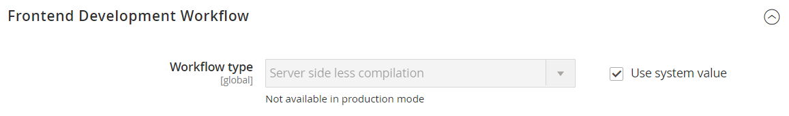
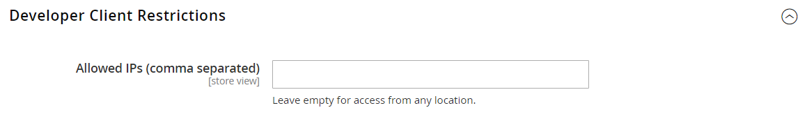
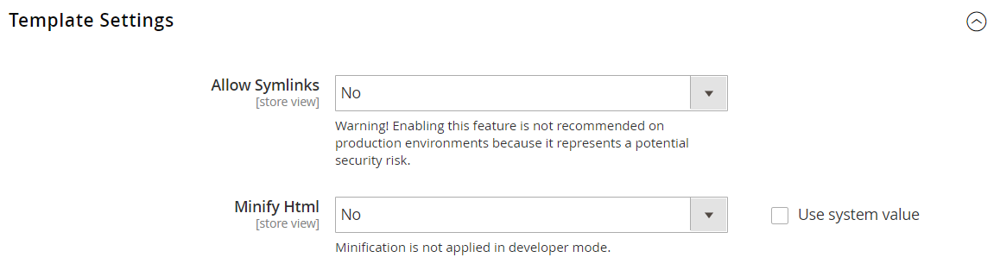
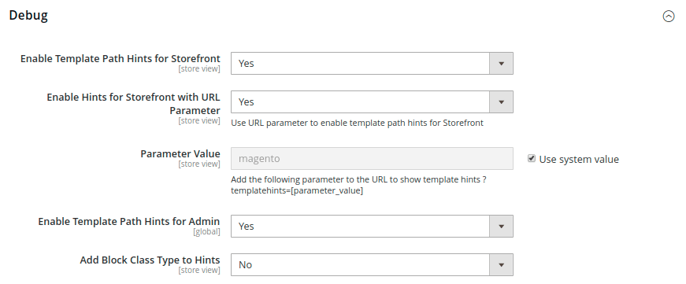
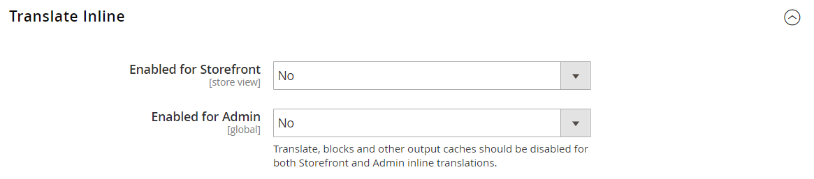
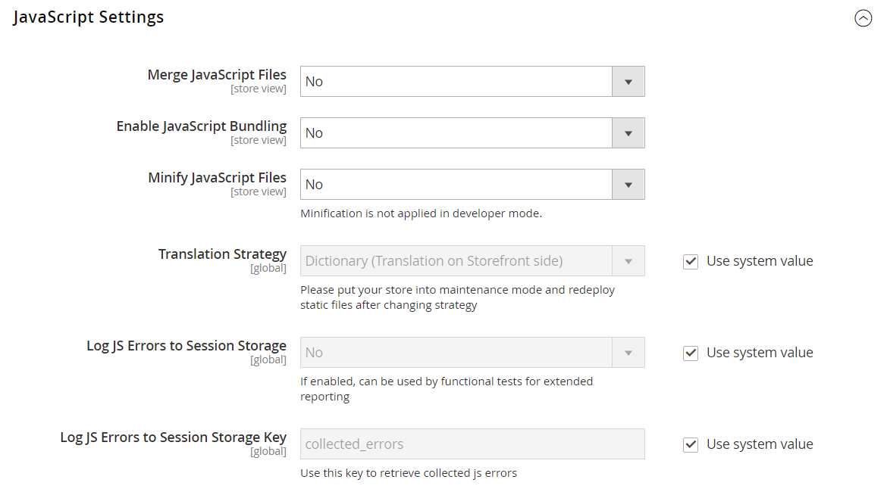
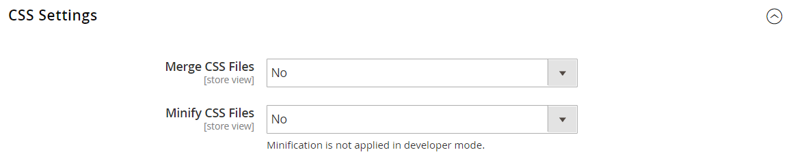
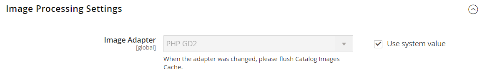
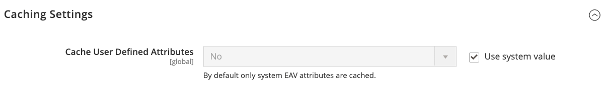
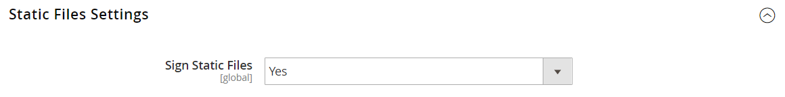

# [!UICONTROL Advanced] > [!UICONTROL Developer]

{{config}}

>[!NOTE]
>
>Estas configurações estão disponíveis somente no [modo de desenvolvedor](../../systems/developer-tools.md#operation-modes).

## [!UICONTROL Frontend Development Workflow]

<!-- zoom -->

Para obter mais informações sobre como alterar essas configurações, consulte [Fluxo de trabalho de desenvolvimento de front-end](../../systems/developer-tools.md#frontend-development-workflow) no _Guia de Sistemas do Administrador_.

| Campo | [Escopo](../../getting-started/websites-stores-views.md#scope-settings) | Descrição |
|--- |--- |--- |
| [!UICONTROL Workflow Type] | Global | Determina se ocorre Menos compilação no cliente ou no servidor durante o desenvolvimento. Opções:  **`Client side less compilation`**- A compilação ocorre no navegador usando a biblioteca nativa less.js. **`Server side less compilation`** - A compilação ocorre no servidor usando a biblioteca PHP Less. Esse é o modo padrão para produção. |

{style="table-layout:auto"}

## [!UICONTROL Developer Client Restrictions]

<!-- zoom -->

Para obter mais informações sobre como alterar essa configuração, consulte [Restrições do cliente](../../systems/developer-tools.md#client-restrictions) no _Guia de Sistemas de Administração_.

| Campo | [Escopo](../../getting-started/websites-stores-views.md#scope-settings) | Descrição |
|--- |--- |--- |
| [!UICONTROL Allow IPs (comma separated)] | Exibição da loja | Cria um incluo na lista de permissões de endereços IP que podem usar ferramentas de desenvolvedor em um site ativo, sem interferir com os clientes na loja. Quaisquer alterações no site ao usar uma ferramenta de desenvolvedor, como a _Tradução sequencial_, serão visíveis somente nos endereços IP do incluo na lista de permissões. |

{style="table-layout:auto"}

## [!UICONTROL Template Settings]

<!-- zoom -->

Para obter mais informações sobre como alterar essas configurações, consulte [Otimização de arquivos de recursos](../../systems/developer-tools.md#optimizing-resource-files) no _Guia de Sistemas do Administrador_.

| Campo | [Escopo](../../getting-started/websites-stores-views.md#scope-settings) | Descrição |
|--- |--- |--- |
| [!UICONTROL Allow Symlinks] | Exibição da loja | Habilitar [links simbólicos](https://en.wikipedia.org/wiki/Symbolic_link) pode expor seu site a riscos de segurança e não é recomendado para um armazenamento de produção. |
| [!UICONTROL Minify Html] | Exibição da loja | Determina se o HTML para modelos de armazenamento é minimizado. Opções: `Yes` / `No` |

{style="table-layout:auto"}

## [!UICONTROL Debug]

<!-- zoom -->

Para obter mais informações sobre como alterar essas configurações, consulte [Dicas do caminho do modelo](../../systems/developer-tools.md#template-path-hints) no _Guia de Sistemas de Administração_.

| Campo | [Escopo](../../getting-started/websites-stores-views.md#scope-settings) | Descrição |
|--- |--- |--- |
| [!UICONTROL Enable Template Path Hints for Storefront] | Exibição da loja | Adiciona uma notação à loja que indica o caminho para cada modelo usado na página. Opções: `Yes` / `No` |
| [!UICONTROL Enable Template Path Hints for Admin] | Global | Adiciona uma notação ao Administrador que indica o caminho para cada modelo usado na página. Opções: `Yes` / `No` |
| [!UICONTROL Add Block Class Type to Hints] | Exibição da loja | Inclui os nomes dos blocos nas dicas de caminho do modelo. Opções: `Yes` / `No` |

{style="table-layout:auto"}

## [!UICONTROL Translate Inline]

<!-- zoom -->

Para obter mais informações sobre como alterar essas configurações, consulte [Traduzir em linha](../../systems/developer-tools.md#translate-inline) no _Guia de Sistemas de Administração_.

| Campo | [Escopo](../../getting-started/websites-stores-views.md#scope-settings) | Descrição |
|--- |--- |--- |
| [!UICONTROL Enable for Storefront] | Exibição da loja | Ativa o tradutor em linha para a loja. O texto da interface pode ser editado para cada visualização de loja. Para usar o Conversor em linha sem interferir na loja em tempo real, adicione seu endereço IP ao incluo na lista de permissões de Restrições do cliente do desenvolvedor. |
| [!UICONTROL Enable for Admin] | Global | Ativa o tradutor em linha para o administrador. Ao contrário da loja, o Administrador não pode ser traduzido para vários idiomas. No entanto, os rótulos de campo e outros textos na interface podem ser alterados. |

{style="table-layout:auto"}

## [!UICONTROL JavaScript Settings]

<!-- zoom -->

Para obter mais informações sobre como alterar essas configurações, consulte [Otimização de arquivos de recursos](../../systems/developer-tools.md#optimizing-resource-files) no _Guia de Sistemas do Administrador_.

| Campo | [Escopo](../../getting-started/websites-stores-views.md#scope-settings) | Descrição |
|--- |--- |--- |
| [!UICONTROL Merge JavaScript Files] | Exibição da loja | Mescla vários arquivos do JavaScript em um único arquivo para melhorar o tempo de carregamento da página. |
| [!UICONTROL Enable JavaScript Bundling] | Exibição da loja | Determina se vários arquivos do JavaScript podem ser agrupados em um único arquivo. Opções: `Yes` / `No` |
| [!UICONTROL Minify JavaScript Files] | Exibição da loja | Remove caracteres desnecessários, espaços e recuo para reduzir o tamanho do código. |
| [!UICONTROL Move JS code to the bottom of the page] | Global | Se ativada, move o código JS para a parte inferior da página. Opções: `Yes` / `No` |
| [!UICONTROL Translation Strategy] | Global | Determina a metodologia de tradução usada pelo sistema. Opções:  **`Dictionary`**- Tradução no lado da loja. **`Embedded`** - Tradução no lado do administrador. |
| [!UICONTROL Log JS Errors to Session Storage] | Global | Se ativado, pode ser usado por testes funcionais para relatórios. Opções: `Yes` / `No` |
| [!UICONTROL Log JS Errors to Session Storage Key] | Global | Identifica a chave usada para recuperar erros de js coletados. |

{style="table-layout:auto"}

## [!UICONTROL CSS Settings]

<!-- zoom -->

Para obter mais informações sobre como alterar essas configurações, consulte [Otimização de arquivos de recursos](../../systems/developer-tools.md#optimizing-resource-files) no _Guia de Sistemas do Administrador_.

| Campo | [Escopo](../../getting-started/websites-stores-views.md#scope-settings) | Descrição |
|--- |--- |--- |
| [!UICONTROL Merge CSS Files] | Exibição da loja | Mescla vários arquivos CSS em um único arquivo para melhorar o tempo de carregamento da página. Opções: `Yes` / `No` |
| [!UICONTROL Minify CSS Files] | Exibição da loja | Remove caracteres desnecessários, espaços e recuo para reduzir o tamanho do código. Opções: `Yes` / `No` |
| [!UICONTROL Use CSS critical path] | Global | O _caminho crítico de CSS_ fornece CSS crítico minificado embutido em `<head>` e adia todos os estilos não críticos carregados de forma assíncrona. Opções: `Yes` / `No` |

{style="table-layout:auto"}

## [!UICONTROL Image Processing Settings]

<!-- zoom -->

| Campo | [Escopo](../../getting-started/websites-stores-views.md#scope-settings) | Descrição |
|--- |--- |--- |
| [!UICONTROL Image Adapter] | Global | Especifica o adaptador que é usado para renderizar imagens. Depois de alterar a configuração do adaptador, limpe o cache de imagens do catálogo. Opções: `PHP GD2` / `ImageMagick`   **_Nota:_** O tipo de arquivo ICO é suportado somente pelo adaptador ImageMagik. |

{style="table-layout:auto"}

## [!UICONTROL Caching Settings]

<!-- zoom -->

| Campo | [Escopo](../../getting-started/websites-stores-views.md#scope-settings) | Descrição |
|--- |--- |--- |
| [!UICONTROL Cache User Defined Attributes] | Global | Quando ativado, armazena em cache atributos EAV (valor de atributo de entidade) definidos pelo usuário e pelo sistema. Essa opção pode aumentar o desempenho, mas também requer espaço adicional para armazenamento em cache. Opções: `Yes` / `No` |

{style="table-layout:auto"}

## [!UICONTROL Static Files Settings]

<!-- zoom -->

| Campo | [Escopo](../../getting-started/websites-stores-views.md#scope-settings) | Descrição |
|--- |--- |--- |
| [!UICONTROL Sign Static Files] | Global | Quando ativado, adiciona uma assinatura digital ao URL de arquivos estáticos para permitir que os navegadores detectem quando uma versão mais recente do arquivo estiver disponível. Se a assinatura de um arquivo for diferente do que está armazenado no cache do navegador, a versão mais recente do arquivo será usada. Os arquivos estáticos que podem ser assinados incluem JavaScript, CSS, imagens e fontes. Opções: `Yes` / `No` |

{style="table-layout:auto"}

## [!UICONTROL Grid Settings]

<!-- zoom -->

| Campo | [Escopo](../../getting-started/websites-stores-views.md#scope-settings) | Descrição |
|--- |--- |--- |
| [!UICONTROL Asynchronous Indexing|Global] | Determina quando as entidades do sistema de processamento de ordens, como ordens, NFFs, entregas e avisos de crédito, são adicionadas à grade e reindexadas. A Indexação assíncrona pode ser usada para evitar bloqueios de dados durante operações de salvamento e para reduzir o tempo de processamento. Opções:  **`Disable`**- (Padrão) Entidades relacionadas à ordem são adicionadas à grade em vários momentos. conforme são salvas. **`Enable`** - As entidades relacionadas à ordem são adicionadas à grade somente durante um trabalho cron agendado. O Cron deve ser configurado para ser executado uma vez a cada minuto. |

{style="table-layout:auto"}
