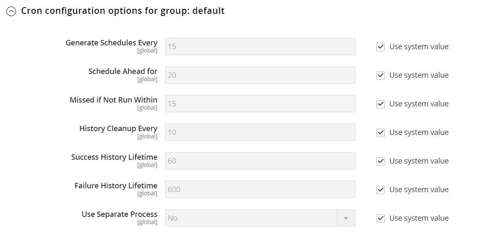

# [!UICONTROL Advanced] > [!UICONTROL System]

{{config}}

## [!UICONTROL Cron (Scheduled Tasks)]

<!-- zoom -->

Para obter mais informações sobre como alterar essas definições de configuração, consulte [Cron (tarefas agendadas)](../../systems/cron.md).

### [!UICONTROL index]

<!-- zoom -->

| Campo | [Escopo](../../getting-started/websites-stores-views.md#scope-settings) | Descrição |
|--- |--- |--- |
| [!UICONTROL Generate Schedules Every] | Global | Determina a frequência em minutos em que os agendamentos são gerados. |
| [!UICONTROL Schedule Ahead for] | Global | Determina com antecedência o número de minutos em que os cronogramas são gerados. |
| [!UICONTROL Missed if Not Run Within] | Global | Determina o número de minutos antes que um trabalho cron que ainda não foi executado seja marcado como ausente. |
| [!UICONTROL History Cleanup Every] | Global | Determina o número de minutos passados antes da limpeza do histórico CRON. |
| [!UICONTROL Success History Lifetime] | Global | Determina o número de minutos durante os quais o registro de trabalhos cron concluídos com êxito é mantido no banco de dados. |
| [!UICONTROL Failure History Lifetime] | Global | Determina o número de minutos durante os quais o registro de trabalhos cron com falha é mantido no banco de dados. |
| [!UICONTROL Use Separate Process] | Global | Determina se os trabalhos cron são executados em paralelo como processos separados. Opções: `Yes` / `No` |

{style="table-layout:auto"}

### [!UICONTROL default]

<!-- zoom -->

| Campo | [Escopo](../../getting-started/websites-stores-views.md#scope-settings) | Descrição |
|--- |--- |--- |
| [!UICONTROL Generate Schedules Every] | Global | Determina a frequência em minutos em que os agendamentos são gerados. |
| [!UICONTROL Schedule Ahead for] | Global | Determina com antecedência o número de minutos em que os cronogramas são gerados. |
| [!UICONTROL Missed if Not Run Within] | Global | Determina o número de minutos antes que um trabalho cron que ainda não foi executado seja marcado como ausente. |
| [!UICONTROL History Cleanup Every] | Global | Determina o número de minutos passados antes da limpeza do histórico CRON. |
| [!UICONTROL Success History Lifetime] | Global | Determina o número de minutos durante os quais o registro de trabalhos cron concluídos com êxito é mantido no banco de dados. |
| [!UICONTROL Failure History Lifetime] | Global | Determina o número de minutos durante os quais o registro de trabalhos cron com falha é mantido no banco de dados. |
| [!UICONTROL Use Separate Process] | Global | Determina se os trabalhos cron são executados em paralelo como processos separados. Opções: `Yes` / `No` |

{style="table-layout:auto"}

## [!UICONTROL MySQL Message Queue Cleanup]

{{ee-feature}}

<!-- zoom -->

| Campo | [Escopo](../../getting-started/websites-stores-views.md#scope-settings) | Descrição |
|--- |--- |--- |
| [!UICONTROL Successful Messages Lifetime] | Global | Determina a duração de mensagens bem-sucedidas em minutos. Insira zero para ignorar a limpeza. Padrão: `10080` (7 dias) |
| [!UICONTROL New Messages Lifetime] | Global | Determina a duração de novas mensagens em minutos. Insira zero para ignorar a limpeza. Padrão: `10080` (7 dias) |
| [!UICONTROL Failed Messages Lifetime] | Global | Determina o tempo de vida em minutos das mensagens com falha. Insira zero para ignorar a limpeza. Padrão: `10080` (7 dias) |
| [!UICONTROL Retry Messages in Progress After] | Global | Determina quanto tempo o sistema aguarda uma mensagem em andamento antes de tentar novamente. Padrão: `1440` (24 horas) |

{style="table-layout:auto"}

## [!UICONTROL Mail Sending Settings]

<!-- zoom -->

Para obter mais informações sobre como alterar essas configurações, consulte [Configurar comunicações por email](../../systems/email-communications.md) no _Guia de Sistemas de Administração_.

>[!IMPORTANT]
>
>**Aviso de segurança** Recomendamos que todos os comerciantes definam imediatamente sua configuração de envio de email para proteger contra uma possível exploração de execução remota de código recentemente identificada. Até que esse problema seja resolvido, é altamente recomendável que você evite usar o [!DNL Sendmail] para comunicações por email. Em [!UICONTROL Mail Sending Settings], verifique se [!UICONTROL Set Return Path] está definido como `No`.

| Campo | [Escopo](../../getting-started/websites-stores-views.md#scope-settings) | Descrição |
|--- |--- |--- |
| [!UICONTROL Disable Email Communications] | Exibição da loja | Determina se as comunicações por email são ativadas para a loja. Opções: `Yes` / `No` |
| [!UICONTROL Transport] | Exibição da loja | Determina o tipo de transporte para comunicações por email do armazenamento. Opções: `Sendmail` / `SMTP` |
| [!UICONTROL Host] | Exibição da loja | (Somente para servidores SMTP e Windows) Determina o nome usado para fazer referência ao host. Valor padrão: `localhost` |
| [!UICONTROL Port (25)] | Exibição da loja | (Somente para servidores SMTP e Windows) Identifica a porta usada para comunicações por email. Valor padrão: `25` |
| [!UICONTROL Set Return-Path] | Exibição da loja | Determina se um endereço de roteamento é usado para emails retornados. Opções: `No` / `Yes` / `Specified` |

{style="table-layout:auto"}

### Opções de SMTP

Quando você seleciona SMTP no tipo de transporte, opções adicionais estão disponíveis para configurar a conexão do servidor SMTP.

<!-- zoom -->

| Campo | [Escopo](../../getting-started/websites-stores-views.md#scope-settings) | Descrição |
|--- |--- |--- |
| [!UICONTROL Username] | Exibição da loja | Nome de usuário de logon do servidor SMTP. |
| [!UICONTROL Password] | Exibição da loja | Senha para o logon do servidor SMTP. |
| [!UICONTROL Auth] | Exibição da loja | Determina o tipo de autenticação para a conexão do servidor SMTP. Opções: `NONE` / `PLAIN` / `LOGIN` |
| [!UICONTROL SSL] | Exibição da loja | Determina o tipo de verificação para o certificado de segurança do host. Opções: `SSL` / `TLS` |

{style="table-layout:auto"}

## [!UICONTROL Currency]

<!-- zoom -->

Para obter mais informações sobre como alterar essa configuração, consulte [Configuração de moeda](../../stores-purchase/currency-configuration.md) no _Guia de Experiência de Compras e Lojas_.

| Campo | [Escopo](../../getting-started/websites-stores-views.md#scope-settings) | Descrição |
|--- |--- |--- |
| [!UICONTROL Installed Currencies] | Global | Indica as moedas que estão disponíveis no momento para a instalação do Commerce. As opções incluem todas as moedas disponíveis, com as moedas instaladas selecionadas. |

{style="table-layout:auto"}

## [!UICONTROL Security]

<!-- zoom -->

Para obter mais informações sobre como alterar essas configurações, consulte [Gerenciamento de sessão](../../systems/security-session-management.md) no _Guia de Sistemas de Administração_.

| Campo | [Escopo](../../getting-started/websites-stores-views.md#scope-settings) | Descrição |
|--- |--- |--- |
| [!UICONTROL Max Session Size in Admin] | Global | Limite o tamanho máximo da sessão em bytes. Use `0` para desabilitar. |
| [!UICONTROL Max Session Size in Storefront] | Global | Limite o tamanho máximo da sessão em bytes. Use `0` para desabilitar. |

{style="table-layout:auto"}

## [!UICONTROL Notifications]

<!-- zoom -->

Para obter mais informações sobre como alterar essas configurações, consulte [Notificações do sistema](../../systems/notifications.md) no _Guia de Sistemas de Administração_.

| Campo | [Escopo](../../getting-started/websites-stores-views.md#scope-settings) | Descrição |
|--- |--- |--- |
| [!UICONTROL Use HTTPS to Get Feed] | Global | Determina se as notificações de administrador são entregues por um canal seguro. Opções: `Yes` / `No` |
| Frequência de atualização | Global | Determina a frequência das atualizações de mensagem do administrador. Opções: `1 Hour` / `2 Hours` / `6 Hours` / `12 Hours` / `24 Hours` |
| [!UICONTROL Last Update] | Global | Indica a data e a hora da última atualização de mensagem. |

{style="table-layout:auto"}

## [!UICONTROL Backup Settings]

<!-- zoom -->

{{$include /help/_includes/backups-note.md}}

Para obter mais informações sobre como alterar essas configurações, consulte [Backups do sistema](../../systems/backups.md) no _Guia de Sistemas de Administração_.

| Campo | [Escopo](../../getting-started/websites-stores-views.md#scope-settings) | Descrição |
|--- |--- |--- |
| [!UICONTROL Enable Backup] | Global | Determina se a instância do Commerce permite backups. Opções: `Yes` / `No` |
| [!UICONTROL Enable Scheduled Backup] | Global | (Exibido quando _[!UICONTROL Enable Backup]_&#x200B;está definido como `Yes`.) Determina se o backup da instância do Commerce é feito automaticamente em uma programação regular. Opções: `Yes` / `No` |
| [!UICONTROL Scheduled Backup Type] | Global | (Exibido quando _[!UICONTROL Enable Scheduled Backup]_&#x200B;está definido como `Yes`.) Determina os elementos da instância do Commerce que estão incluídos no backup. Opções: `Database` / `Database and Media` / `System` / `System (excluding Media)` |
| [!UICONTROL Start Time] | Global | (Exibido quando [!UICONTROL Enable Scheduled Backup] está definido como `Yes`.) Especifica a hora, o minuto e o segundo em que o backup agendado começa. |
| [!UICONTROL Frequency] | Global | (Exibido quando [!UICONTROL Enable Scheduled Backup] está definido como `Yes`.) Determina com que frequência o backup agendado ocorre. Opções: `Daily` / `Weekly` / `Monthly` |
| [!UICONTROL Maintenance Mode] | Global | (Exibido quando [!UICONTROL Enable Scheduled Backup] está definido como `Yes`.) Determina se o armazenamento é colocado em modo de manutenção durante o backup agendado. Opções: `Yes` / `No` |

{style="table-layout:auto"}

## [!UICONTROL Admin Actions Log Archiving]

{{ee-feature}}

<!-- zoom -->

Para obter mais informações sobre como alterar essas configurações, consulte [Arquivo de log de ações](../../systems/action-log-archive.md) no _Guia de Sistemas de Administração_.

| Campo | [Escopo](../../getting-started/websites-stores-views.md#scope-settings) | Descrição |
|--- |--- |--- |
| [!UICONTROL Log Entry Lifetime, Days] | Exibição da loja | Determina o número de dias em que as ações do administrador são mantidas no arquivo de Ações do administrador. Padrão: `60` |
| [!UICONTROL Log Archiving Frequency] | Exibição da loja | Determina a frequência com que os logs de Ações administrativas são arquivados. Opções: `Daily` / `Weekly` / `Monthly` |

{style="table-layout:auto"}

## [!UICONTROL Full Page Cache]

<!-- zoom -->

Para obter mais informações sobre como alterar essas configurações, consulte [Cache de página inteira](../../systems/cache-management.md#full-page-caching) no _Guia de Sistemas de Administração_.

<!-- zoom -->

| Campo | [Escopo](../../getting-started/websites-stores-views.md#scope-settings) | Descrição |
|--- |--- |--- |
| [!UICONTROL Caching Application] | Global | Determina o aplicativo usado para gerenciar o cache de página inteira. Opções:  **`Built-in Application`**- Não recomendado para o ambiente de produção. **`Varnish Caching`** - Recomendado para o ambiente de produção. |
| [!UICONTROL TTL for public content] | Global | Determina a duração do cache de conteúdo público em segundos. Valor padrão: `120` |
| [!UICONTROL Handles param size] | global | Especifica o número máximo de [identificadores de layout](https://developer.adobe.com/commerce/frontend-core/guide/layouts/#layout-handles) para processar no ponto de extremidade HTTP [`{BASE-URL}/page_cache/block/esi`](https://experienceleague.adobe.com/docs/commerce-operations/configuration-guide/cache/use-varnish-esi.html). Restringir o tamanho pode melhorar a segurança e o desempenho. Valor padrão: `100` |
| **[!UICONTROL Varnish Configuration]** |  |  |
| [!UICONTROL Access list] | Global | Especifica os endereços IP que podem limpar a configuração de verniz para gerar um arquivo de configuração. Separe várias entradas com uma vírgula. Valor padrão: `localhost` |
| [!UICONTROL Backend host] | Global | Especifica o host de back-end que gera arquivos de configuração. Valor padrão: `localhost` |
| [!UICONTROL Backend port] | Global | Especifica a porta de back-end usada para gerar arquivos de configuração. Valor padrão: `8080` |
| [!UICONTROL Grace period] | Global | Determina por quanto tempo o Verniz fornecerá conteúdo obsoleto se o back-end não for responsivo. Valor padrão: `300` |
| **[!UICONTROL Export Configuration]** |  |  |
| [!UICONTROL Export VCL for Varnish 4] | Global | Exporta o arquivo `varnish.vcl` para a versão 4. |
| [!UICONTROL Export VCL for Varnish 5] | Global | Exporta o arquivo `varnish.vcl` para a versão 5. |
| [!UICONTROL Export VCL for Varnish 6] | Global | Exporta o arquivo `varnish.vcl` para a versão 6. |

{style="table-layout:auto"}

## [!UICONTROL Storage Configuration for Media]

<!-- zoom -->

Para obter mais informações sobre como alterar essas configurações, consulte [Usar um Banco de Dados de Mídia](../../content-design/media-storage-database.md) no _Guia de Conteúdo e Design_.

| Campo | [Escopo](../../getting-started/websites-stores-views.md#scope-settings) | Descrição |
|--- |--- |--- |
| [!UICONTROL Media Storage] | Global | Determina o método usado para armazenar arquivos de mídia. Configuração padrão: `File System` |
| [!UICONTROL Environment Update Time] | Global | Determina a frequência das atualizações do ambiente do arquivo de mídia em segundos. Valor padrão: `3600` |

{style="table-layout:auto"}

<!-- zoom -->

>[!IMPORTANT]
>
>O método de armazenamento de mídia de banco de dados foi descontinuado a partir do Adobe Commerce e do Magento Open Source 2.4.3.

| Campo | [Escopo](../../getting-started/websites-stores-views.md#scope-settings) | Descrição |
|--- |--- |--- |
| [!UICONTROL Media Storage] | Global | Especifica banco de dados como o método usado para armazenar arquivos de mídia. |
| [!UICONTROL Select Media Database] | Global | Identifica o nome do banco de dados usado para armazenamento de mídia. Configuração padrão: `default_setup` |
| [!UICONTROL Synchronize] |  | Sincroniza a transferência de todas as mídias para o local de banco de dados especificado. |
| Tempo de atualização do ambiente | Global | Determina a frequência das atualizações do ambiente do arquivo de mídia em segundos. Valor padrão: `3600` |

{style="table-layout:auto"}

## [!UICONTROL Bulk Actions]

{{ee-feature}}

<!-- zoom -->

Para obter mais informações sobre como alterar essas configurações, consulte [Ações em massa](../../systems/action-log-bulk-actions.md) no _Guia de Sistemas de Administração_.

| Campo | [Escopo](../../getting-started/websites-stores-views.md#scope-settings) | Descrição |
|--- |--- |--- |
| [!UICONTROL Days Saved in Log] | Global | Determina o número de dias em que as ações em massa são mantidas no arquivo morto do _Log de Ações em Massa_. Padrão: `60` |

{style="table-layout:auto"}

## [!UICONTROL Scheduled Import/Export File History Cleaning]

{{ee-feature}}

<!-- zoom -->

Para obter mais informações sobre como alterar essas configurações, consulte [Importação e exportação agendadas](../../systems/data-scheduled-import-export.md) no _Guia de Sistemas de Administração_.

| Campo | [Escopo](../../getting-started/websites-stores-views.md#scope-settings) | Descrição |
|--- |--- |--- |
| [!UICONTROL Save File, Days] | Global | Determina o número de dias em que os arquivos do histórico de importação/exportação são salvos. |
| [!UICONTROL Enable Scheduled File History Cleaning] | Global | Ativa a limpeza programada de arquivos de importação/exportação. Opções: `Yes` / `No` |
| [!UICONTROL Clean Now] |  | Substitui a limpeza agendada e limpa imediatamente os arquivos de histórico de importação/exportação. |
| [!UICONTROL Start Time] | Global | Especifica a hora, os minutos e o segundo da limpeza do arquivo de histórico de importação/exportação. |
| [!UICONTROL Frequency] | Global | Determina com que frequência os arquivos do histórico de importação/exportação são limpos. Opções: `Daily` / `Weekly` / `Monthly` |
| [!UICONTROL Error Email Recipient] | Global | O endereço de email da pessoa que receberá a notificação se ocorrer um erro enquanto o histórico do arquivo de importação/exportação for limpo. Separe vários endereços com uma vírgula. |
| [!UICONTROL Error Email Sender] | Global | Identifica o contato de armazenamento que aparece como o remetente da notificação. Remetente padrão: `General Contact` |
| [!UICONTROL Error Email Template] | Global | Identifica o modelo de email usado para a notificação de erro de limpeza do arquivo de importação/exportação. Modelo padrão: `File History Clean Failed` |

{style="table-layout:auto"}

## [!UICONTROL Image Upload Configuration]

<!-- zoom -->

<!-- [Image Upload Configuration](https://experienceleague.adobe.com/en/docs/commerce-admin/systems/action-logs/action-log-bulk-actions) -->

| Campo | [Escopo](../../getting-started/websites-stores-views.md#scope-settings) | Descrição |
|--- |--- |--- |
| [!UICONTROL Quality] | Global | Determina a qualidade do JPG para a imagem redimensionada. Uma qualidade inferior reduz o tamanho do arquivo. Use de 80 a 90% para ajudar a reduzir o tamanho do arquivo com alta qualidade. Padrão: `80` |
| [!UICONTROL Enable Frontend Resize] | Global | Habilite esta configuração para permitir que o Commerce redimensione imagens grandes demais que você possa carregar para a página _Detalhes do produto_. O Commerce redimensiona os arquivos de imagem usando o JavaScript antes de fazer upload do arquivo. Quando a imagem é redimensionada, ela mantém as proporções exatas a serem atendidas e não excede o maior tamanho para Largura máxima ou Altura máxima. Padrão: `Yes` |
| [!UICONTROL Maximum Width] | Global | Determina a largura máxima em pixels para a imagem. Quando a imagem é redimensionada, ela não excede essa largura. Padrão: `1920` |
| [!UICONTROL Maximum Height] | Global | Determina a altura máxima em pixels para a imagem. Quando a imagem é redimensionada, ela não excede essa altura. Padrão: `1200` |

{style="table-layout:auto"}

## [!UICONTROL Media Gallery]

<!-- zoom -->

| Campo | [Escopo](../../getting-started/websites-stores-views.md#scope-settings) | Descrição |
|--- |--- |--- |
| [!UICONTROL Enable Old Media Gallery] | Global | Ativa ou desativa a Galeria de mídia antiga. |

{style="table-layout:auto"}

## [!UICONTROL Media Gallery Image Optimization]

<!-- zoom -->

| Campo | [Escopo](../../getting-started/websites-stores-views.md#scope-settings) | Descrição |
|--- |--- |--- |
| [!UICONTROL Enable Image Optimization] | Global | Determina se as imagens são redimensionadas para diminuir o tamanho do arquivo das imagens inseridas no conteúdo. As imagens originais são preservadas na Galeria de mídia. |
| [!UICONTROL Maximum Width] | Global | A largura máxima (em pixels) para imagens inseridas da Galeria de mídia no conteúdo. |
| [!UICONTROL Maximum Height] | Global | A altura máxima (em pixels) para imagens inseridas da Galeria de mídia no conteúdo. |

{style="table-layout:auto"}

## [!UICONTROL Adobe Stock Integration]

<!-- zoom -->

Para obter mais informações sobre como definir essas configurações, consulte [Integração do Adobe Stock](../../content-design/adobe-stock.md) no _Guia de Conteúdo e Design_.

| Campo | [Escopo](../../getting-started/websites-stores-views.md#scope-settings) | Descrição |
|--- |--- |--- |
| [!UICONTROL Enabled Adobe Stock] | Global | Habilita ou desabilita a Integração com o Adobe Stock. |
| [!UICONTROL API Key (Client ID)] | Global | É necessária uma chave de API para conectar sua loja ao serviço da Adobe Stock. |
| [!UICONTROL Client Secret] | Global | É necessário o Segredo do cliente para a integração com o Adobe Stock. |
| [!UICONTROL Test Connection] |  | Executa um teste para verificar se a chave de API é válida para uso com o serviço Adobe Stock. |

{style="table-layout:auto"}

<!-- Last updated from includes: 2023-02-22 09:59:54 -->
