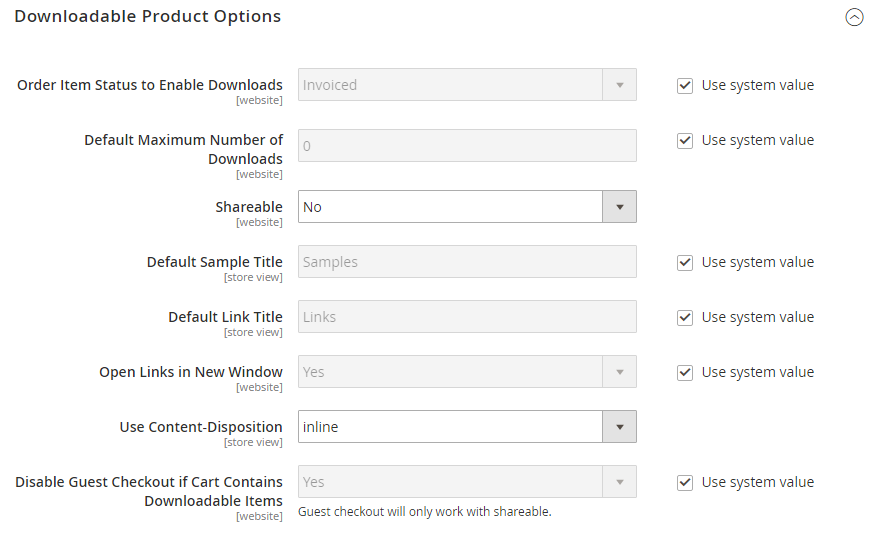

# [!UICONTROL Catalog] > [!UICONTROL Catalog]

{{config}}

## [!UICONTROL Product Fields Auto-Generation]

<!-- zoom -->

<!-- [Product Fields Auto-Generation](https://experienceleague.adobe.com/pt-br/docs/commerce-admin/catalog/products/product-workspace#default-field-values) -->

| Campo | [Escopo](../../getting-started/websites-stores-views.md#scope-settings) | Descrição |
|--- |--- |--- |
| [!UICONTROL Mask for SKU] | Global | Determina o valor padrão do campo SKU com base nos valores de espaço reservado de outros campos e em qualquer texto adicional inserido. Espaço reservado padrão:  Nome do produto - `{{name}}` |
| [!UICONTROL Mask for Meta Title] | Global | Determina o valor padrão do campo Metatítulo com base nos valores de espaço reservado de outros campos e qualquer texto adicional inserido. Espaço reservado padrão:  Nome do produto - `{{name}}` |
| [!UICONTROL Mask for Meta Keywords] | Global | Determina o valor padrão do campo _Metapalavras-chave_ com base nos valores de espaço reservado de outros campos e em qualquer texto adicional inserido. Espaço reservado padrão:  Nome do produto - `{{name}}` |
| [!UICONTROL Mask for Meta Description] | Global | Determina o valor padrão do campo Descrição Meta com base nos valores de espaço reservado de outros campos e em qualquer texto adicional inserido. Espaço reservado padrão:  Nome do Produto - `{{name}}`  Descrição - `{{description}}` |

{style="table-layout:auto"}

## [!UICONTROL Product Reviews]

<!-- zoom -->

<!-- [Product Reviews](https://experienceleague.adobe.com/pt-br/docs/commerce-admin/marketing/merchandising/product-reviews/product-reviews) -->

| Campo | [Escopo](../../getting-started/websites-stores-views.md#scope-settings) | Descrição |
|--- |--- |--- |
| [!UICONTROL Enabled] | Exibição da loja | Habilita análises de produtos. Opções: `Yes` / `No` |
| [!UICONTROL Allow Guests to Write Reviews] | Site | Determina se os clientes devem abrir uma conta na loja para poderem escrever análises do produto. |

{style="table-layout:auto"}

## [!UICONTROL Storefront]

<!-- zoom -->

<!-- [Storefront](https://experienceleague.adobe.com/pt-br/docs/commerce-admin/catalog/catalog/navigation/navigation-product-listings) -->

| Campo | [Escopo](../../getting-started/websites-stores-views.md#scope-settings) | Descrição |
|--- |--- |--- |
| [!UICONTROL List Mode] | Exibição da loja | Determina o formato da lista de resultados da pesquisa. Opções:  **`Grid Only`**- Formata a lista como uma grade de linhas e colunas. Cada produto aparece em uma única célula da grade. **`List Only`** - Formata a lista com cada produto em uma linha separada.  **`Grid (default / List)`**- Por padrão, os produtos aparecem na exibição em Grade e podem ser alternados para a exibição em Lista. **`List (default / Grid)`** - Por padrão, os produtos aparecem na Exibição de Lista e podem ser alternados para a Exibição de Grade. |
| [!UICONTROL Products per Page on Grid Allowed Values] | Exibição da loja | Determina o número de produtos exibidos na exibição de grade. Para fornecer uma seleção de opções, insira vários valores separados por vírgulas. |
| [!UICONTROL Products per Page on Grid Default Value] | Exibição da loja | Determina o número de produtos exibidos por página por padrão na exibição de grade. |
| [!UICONTROL Products per Page on List Allowed Values] | Exibição da loja | Determina o número de produtos exibidos na Exibição de lista. Para fornecer uma seleção de opções, insira vários valores separados por vírgulas. |
| [!UICONTROL Products per Page on List Default Value] | Exibição da loja | Determina o número de produtos exibidos por página por padrão, na exibição em lista. |
| Lista de produtos Classificar por | Exibição da loja | Determina a ordem de classificação da lista de resultados da pesquisa. A seleção de opções é determinada pelas Configurações de Exibição da categoria e pelos atributos disponíveis definidos como `Used for Sorting in Product Listing`. O padrão é definido como `Use All Available Attributes` e geralmente inclui Melhor Valor, Nome, Preço. Esta configuração não se aplica ao [!DNL Live Search] [Widget de página de listagem de produtos](https://experienceleague.adobe.com/pt-br/docs/commerce/live-search/live-search-storefront/plp-styling). |
| [!UICONTROL Allow All Products per Page] | Exibição da loja | Se definida como `Yes`, inclui a opção `ALL` no controle &quot;Mostrar por Página&quot;. |
| [!UICONTROL Remember Category Pagination] | Global | Se definido como `Yes`, os valores de paginação da categoria atual serão salvos à medida que os clientes navegarem de uma categoria para outra em [listas de produtos](../../catalog/navigation-product-listings.md). Salvar o valor usa mais armazenamento em cache e pode afetar a forma como as páginas são indexadas por mecanismos de pesquisa. Opções: `Yes` / `No` (padrão) |
| [!UICONTROL Use Flat Catalog Category] | Global | Habilita a [estrutura de categoria simples](../../catalog/catalog-flat.md) (não recomendado). Opções: `Yes` / `No` |
| [!UICONTROL Use Flat Catalog Product] | Global | Habilita a estrutura plana do produto. (não recomendado) Opções: `Yes` / `No` |
| [!UICONTROL Swatches per Product] | Exibição da loja | Determina o número de amostras disponíveis para cada produto. Padrão: `16` |
| [!UICONTROL Show Swatches in Product List] | Exibição da loja | Determina se as amostras são exibidas na Lista de produtos. Opções: `Yes` / `No` |
| [!UICONTROL Show Swatch Tooltip] | Exibição da loja | Determina se a dica de ferramenta da amostra é exibida. Opções: `Yes` / `No` |

{style="table-layout:auto"}

## [!UICONTROL Product Alerts]

<!-- zoom -->

<!-- [Product Alerts](https://experienceleague.adobe.com/pt-br/docs/commerce-admin/inventory/configuration/product-alerts/alert-setup) -->

| Campo | [Escopo](../../getting-started/websites-stores-views.md#scope-settings) | Descrição |
|--- |--- |--- |
| [!UICONTROL Allow Alerts When Product Price Changes] | Exibição da loja | Determina se os alertas de email estão disponíveis para alterações de preço do produto. Opções: `Yes` / `No` |
| [!UICONTROL Price Alert Email Template] | Exibição da loja | Identifica o modelo usado para alertas de email de alteração de preço do produto. Modelo padrão: `Product price alert` |
| [!UICONTROL Allow Alert When Product Comes Back in Stock] | Site | Determina se os clientes podem optar por receber um alerta quando o produto retornar ao estoque. Opções: `Yes` / `No` |
| [!UICONTROL Stock Alert Email Template] | Exibição da loja | Identifica o modelo usado para notificações por email de alerta de estoque. Modelo padrão: `Product stock alert` |
| [!UICONTROL Alert Email Sender] | Exibição da loja | Determina o contato da loja que aparece como o remetente da mensagem de email de alerta do produto. Opções: `General Contact` / `Sales Representative` / `Customer Support` / `Custom Email` |

{style="table-layout:auto"}

## [!UICONTROL Product Alerts Run Settings]

<!-- zoom -->

<!-- [Product Alerts Run Settings](https://experienceleague.adobe.com/pt-br/docs/commerce-admin/inventory/configuration/product-alerts/alert-setup) -->

| Campo | [Escopo](../../getting-started/websites-stores-views.md#scope-settings) | Descrição |
|--- |--- |--- |
| [!UICONTROL Frequency] | Global | Escolha a frequência com que os alertas de produto são enviados. Opções: `Daily` / `Weekly` / `Monthly` |
| [!UICONTROL Start Time] | Global | Escolha a hora do dia em que o processo de alerta do produto é iniciado. Esse período deve ser posterior a qualquer atualização de preço ou inventário. |
| [!UICONTROL Error Email Recipient] | Global | Identifique o endereço de email da pessoa (normalmente um administrador de loja) que deve receber uma notificação por email quando houver um erro no processo de alerta do produto. |
| [!UICONTROL Error Email Sender] | Global | Selecione a função de email `from`. |
| [!UICONTROL Error Email Template] | Global | Selecione o modelo de email a ser usado para notificações de erro de alerta do produto. |

{style="table-layout:auto"}

## [!UICONTROL Product Image Placeholders]

<!-- zoom -->

<!-- [Product Image Placeholders](https://experienceleague.adobe.com/pt-br/docs/commerce-admin/catalog/products/digital-assets/product-image-config#image-placeholders) -->

| Campo | [Escopo](../../getting-started/websites-stores-views.md#scope-settings) | Descrição |
|--- |--- |--- |
| [!UICONTROL Base Image] | Exibição da loja | Identifica o arquivo de espaço reservado escolhido para a imagem base. |
| [!UICONTROL Small Image] | Exibição da loja | Identifica o arquivo de espaço reservado escolhido para a imagem pequena. |
| [!UICONTROL Swatch] | Exibição da loja | Identifica o arquivo de espaço reservado escolhido para a amostra. |
| [!UICONTROL Thumbnail] | Exibição da loja | Identifica o arquivo de espaço reservado escolhido para a miniatura. |
| [!UICONTROL Choose File] |  | Navega até o arquivo e faz upload dele como a imagem do espaço reservado para o tipo. |

{style="table-layout:auto"}

## [!UICONTROL Recently Viewed/Compared Products]

<!-- zoom -->

<!-- Recently Viewed/Compared Products](https://experienceleague.adobe.com/pt-br/docs/commerce-admin/stores-sales/shopper-tools/products-viewed-compared) -->

| Campo | [Escopo](../../getting-started/websites-stores-views.md#scope-settings) | Descrição |
|--- |--- |--- |
| [!UICONTROL Synchronize widget products with backend storage] | Global | Determina a sincronização das informações do widget produto, como ID do produto, com o banco de dados. Isso permite a reutilização de informações em outros dispositivos. |
| [!UICONTROL Show for Current] | Site | Limita os produtos mostrados ao site atual. Opções: `Website` / `Store` / `Store View` |
| [!UICONTROL Default Recently Viewed Products Count] | Exibição da loja | Determina o número máximo de produtos visualizados recentemente que aparecem na lista. |
| [!UICONTROL Default Recently Compared Products Count] | Exibição da loja | Determina o número máximo de produtos comparados recentemente que aparecem na lista. |
| [!UICONTROL Lifetime of products in Recently Viewed Widget] | Global | Determina por quanto tempo, em segundos, os produtos visualizados são exibidos na lista visualizada recentemente. |
| [!UICONTROL Lifetime of products in Recently Compared Widget] | Global | Determina por quanto tempo, em segundos, os produtos comparados são exibidos na lista comparada recentemente. |

{style="table-layout:auto"}

## [!UICONTROL Product Video]

<!-- zoom -->

<!-- [Product Videos](https://experienceleague.adobe.com/pt-br/docs/commerce-admin/catalog/products/digital-assets/product-video) -->

| Campo | [Escopo](../../getting-started/websites-stores-views.md#scope-settings) | Descrição |
|--- |--- |--- |
| [!UICONTROL YouTube API key] | Exibição da loja | Especifica a chave de API necessária para se conectar ao servidor do YouTube. |
| [!UICONTROL Autostart base video] | Exibição da loja | Para iniciar o vídeo automaticamente depois que a página for carregada, defina como `Yes`. |
| [!UICONTROL Show related video] | Exibição da loja | Para exibir vídeos relacionados, defina como `Yes`. |
| [!UICONTROL Auto restart video] | Exibição da loja | Para habilitar a reprodução automática de vídeo, defina como `Yes`. |

{style="table-layout:auto"}

## [!UICONTROL Price]

<!-- zoom -->

<!--Price](https://experienceleague.adobe.com/pt-br/docs/commerce-admin/catalog/products/pricing/catalog-price-scope) -->

| Campo | [Escopo](../../getting-started/websites-stores-views.md#scope-settings) | Descrição |
|--- |--- |--- |
| [!UICONTROL Catalog Price Scope] | Global | Determina o escopo da moeda base. Opções: `Global` / `Website` |
| [!UICONTROL Default Product Price] | Global |  (somente Adobe Commerce) Define o preço padrão do produto, se aplicável. |

{style="table-layout:auto"}

## [!UICONTROL Layered Navigation]

>[!NOTE]
>
>A configuração de pesquisa padrão descrita nesta seção é diferente para o [Live Search](https://experienceleague.adobe.com/docs/commerce/live-search/overview.html?lang=pt-BR).

<!-- [Layered Navigation - Automatic (equalize price ranges)](https://experienceleague.adobe.com/pt-br/docs/commerce-admin/catalog/catalog/navigation/navigation-layered#configure-layered-navigation) -->

<!-- zoom -->

<!-- zoom -->

<!-- zoom -->

| Campo | [Escopo](../../getting-started/websites-stores-views.md#scope-settings) | Descrição |
|--- |--- |--- |
| [!UICONTROL Display Product Count] | Exibição da loja | Determina se a contagem de produtos aparece após cada atributo, faixa de preços e categoria. Opções: `Yes` / `No` |
| [!UICONTROL Price Navigation Step Calculation] | Exibição da loja | Determina o método usado para determinar o [passo de navegação de preço](../../catalog/navigation-layered.md#configure-price-navigation)). Opções:  `Automatic (equalize price ranges)` - Baseia o cálculo no intervalo de preços dos produtos no grupo.  `Automatic (equalize product counts)` - Baseia o cálculo no número de produtos no grupo. Estabelece um limite para o número mínimo de produtos no grupo, para evitar que sejam divididos em grupos menores.  `Manual` - Usa o limite de divisão inserido para intervalos de preço. |
| [!UICONTROL Default Price Navigation Step] | Exibição da loja | Determina o número de produtos incluídos em cada etapa. |
| [!UICONTROL Maximum Number of Price Intervals] | Exibição da loja | Estabelece um limite para o número de intervalos de preço que aparecem na navegação em camadas. |

{style="table-layout:auto"}

## [!UICONTROL Category Permissions]

{{ee-feature}}

<!-- zoom -->

<!-- [Category Permissions](https://experienceleague.adobe.com/pt-br/docs/commerce-admin/catalog/categories/category-permissions) -->

| Campo | [Escopo](../../getting-started/websites-stores-views.md#scope-settings) | Descrição |
|--- |--- |--- |
| [!UICONTROL Enable] | Global | Ativa restrições de categoria. Por padrão, o uso desse recurso restringe todas as categorias. Opções: `Yes` / `No` |
| [!UICONTROL Allow Browsing Category] | Site | Determina quem tem permissão para navegar pelas categorias. Opções:  `Yes, for Everyone` - Permite que todos os visitantes e clientes naveguem na categoria.  `Yes, for Specified Customer Groups` - Permite que somente membros de grupos de clientes selecionados naveguem na categoria.  `No, Redirect to Landing Page` - Nega acesso à categoria e redireciona para a página selecionada. |
| [!UICONTROL Display Product Prices] | Site | Controla a exibição dos preços do produto para a categoria. Opções:  `Yes, for Everyone` - Permite que todos vejam o preço dos produtos na categoria.  `Yes, for Specified Customer Groups` - Permite que somente os membros de grupos de clientes selecionados vejam o preço dos produtos na categoria.  `No` - Desativa a exibição dos preços do produto para a categoria. |
| [!UICONTROL Allow Adding to Cart] | Site | Determina quem pode comprar produtos da categoria. Opções:  `Yes, for Everyone` - Permite que todos coloquem produtos da categoria em seus carrinhos de compras.  `Yes, for Specified Customer Groups` - Permite que somente membros de grupos de clientes selecionados coloquem produtos da categoria em seus carrinhos de compras.  `No` - Não permite que ninguém coloque produtos da categoria em seus carrinhos de compras. |
| [!UICONTROL Disallow Catalog Search by] | Site | Identifica os grupos de clientes que não têm permissão para procurar produtos na categoria. |

{style="table-layout:auto"}

## [!UICONTROL Search Engine Optimization]

<!-- zoom -->

<!-- [Search Engine Optimization](https://experienceleague.adobe.com/pt-br/docs/commerce-admin/catalog/products/settings/product-search-engine-optimization) -->

| Campo | [Escopo](../../getting-started/websites-stores-views.md#scope-settings) | Descrição |
|--- |--- |----------------------------------------------------------------------------------------------------------------------------------------------------------------------------------------------------------------------------------------------------------------------------------------------------------------------------------------------------------------------------------------------------------|
| [!UICONTROL Popular Search Terms] | Exibição da loja | Determina se os _Termos de Pesquisa Populares_ estão implementados no armazenamento. Esta configuração não se aplica às lojas que usam o [Live Search](https://experienceleague.adobe.com/docs/commerce/live-search/overview.html?lang=pt-BR). Opções: `Enable` / `Disable` |
| [!UICONTROL Product URL Suffix] | Exibição da loja | Determina se um sufixo, como html ou htm, é aplicado aos URLs do produto. Se usado, não inclua um ponto antes do sufixo, pois ele é aplicado automaticamente. |
| [!UICONTROL Category URL Suffix] | Exibição da loja | Determina se um sufixo, como html ou htm, é aplicado aos URLs da categoria. Se usado, não inclua um ponto antes do sufixo, pois ele é aplicado automaticamente. |
| [!UICONTROL Use Categories Path for Product URLs] | Exibição da loja | Determina se os caminhos de categoria são incluídos nos URLs do produto na loja. Isso pode fazer com que vários URLs apontem para a mesma página, o que pode afetar a classificação da pesquisa. Para saber mais, consulte [Metatag canônica](../../merchandising-promotions/meta-data.md#canonical-meta-tag). |
| [!UICONTROL Create Permanent Redirect for URLs if URL Key Changed] | Exibição da loja | Determina se um redirecionamento permanente é criado automaticamente sempre que uma chave de URL é alterada. Quando implementada, a caixa de seleção Criar redirecionamento personalizado para URL antigo abaixo do campo Chave do URL do produto é selecionada por padrão. Opções: `Yes` / `No` |
| [!UICONTROL Generate "category/product" URL Rewrites] | Global | Determina se o Adobe Commerce gera dados e os salva em tabelas de regravação quando um usuário salva uma categoria que contém muitos produtos atribuídos.    Alterar essa opção não afeta como as URLs de produtos são resolvidas no Adobe Commerce, pois o sistema resolve automaticamente as URLs de produtos, independentemente dessa configuração.   Opções: `Yes` / `No`   **_Importante:_**&#x200B;Salvar estes dados gerados em uma tabela de regravações de URL pode prejudicar o desempenho. Consulte [Redirecionamentos automáticos de produto](../../merchandising-promotions/url-redirect-product-automatic.md) para obter mais informações. |
| [!UICONTROL Apply transliteration for product URL] | Exibição da loja | Determina se a transliteração é aplicada ao criar ou atualizar URLs de produtos. Opções: `Yes` / `No`. O padrão está definido como `Yes`.   Para certos casos de uso, você deve desativar a transliteração. Por exemplo, se você opera uma loja online em chinês, as práticas recomendadas da SEO recomendam que os URLs dos produtos correspondam ao nome do produto. Definir a opção como `No` permite que caracteres chineses sejam usados em URLs de produtos, em vez de um equivalente ASCII. |
| [!UICONTROL Page Title Separator] | Exibição da loja | Identifica o caractere que separa o nome da categoria e a subcategoria na barra de título do navegador. |
| [!UICONTROL Use Canonical Link Meta Tag for Categories] | Exibição da loja | Se houver vários URLs que apontem para a mesma página de categoria, essa opção usará uma meta tag canônica para identificar o URL da categoria que os mecanismos de pesquisa devem indexar. O URL inclui um nome completo para a categoria usando a meta tag. Isso reduz o conteúdo duplicado e melhora o SEO. Opções: `Yes` / `No` |
| [!UICONTROL Use Canonical Link Meta Tag for Products] | Exibição da loja | Se houver vários URLs que apontem para a mesma página do produto, essa opção usará uma meta tag canônica para identificar o URL do produto que os mecanismos de pesquisa devem indexar. O URL inclui um nome completo para o produto usando a meta tag. Isso reduz o conteúdo duplicado e melhora o SEO. Opções: `Yes` / `No` |

{style="table-layout:auto"}

## [!UICONTROL Category Top Navigation]

<!-- zoom -->

<!-- Category Top Navigation](https://experienceleague.adobe.com/pt-br/docs/commerce-admin/catalog/catalog/navigation/navigation-top) -->

| Campo | [Escopo](../../getting-started/websites-stores-views.md#scope-settings) | Descrição |
|--- |--- |--- |
| [!UICONTROL Maximal Depth] | Global | Determina o número de níveis de subcategoria na navegação superior. O valor padrão de `0` não coloca limite no número de níveis. |

{style="table-layout:auto"}

## [!UICONTROL Catalog Search]

Você pode configurar a Pesquisa no Catálogo usando o [[!DNL Live Search]](https://experienceleague.adobe.com/docs/commerce/live-search/overview.html?lang=pt-BR) ou serviços de mecanismo de pesquisa de terceiros aos quais a Adobe Commerce oferece suporte. Siga as instruções de instalação.

### Adobe Commerce com [!DNL Live Search]

Quando o Live Search é instalado, a Pesquisa no catálogo inclui as seguintes configurações:

<!-- zoom -->

<!-- [Catalog Search for Live Search](https://experienceleague.adobe.com/pt-br/docs/commerce-admin/catalog/catalog/search/search-configuration) -->

| Campo | [Escopo](../../getting-started/websites-stores-views.md#scope-settings) | Descrição |
|--- |--- |--- |
| [!UICONTROL Minimal Query Length] | Exibição da loja | O número mínimo de caracteres permitidos em uma pesquisa de catálogo. O valor definido para essa opção deve ser compatível com o intervalo correspondente definido nas configurações do mecanismo de pesquisa do Elasticsearch. Por exemplo, se você definir esse valor como `2` no Adobe Commerce, atualize o valor no mecanismo de pesquisa. |
| [!UICONTROL Maximum Query Length] | Exibição da loja | O número máximo de caracteres permitidos em uma pesquisa de catálogo. O valor definido para essa opção deve ser compatível com o intervalo correspondente definido nas configurações do mecanismo de pesquisa do Elasticsearch. Por exemplo, se você definir esse valor como 300 no Adobe Commerce, atualize o valor no mecanismo de pesquisa. |
| [!UICONTROL Number of top search results to cache] | Exibição da loja | O número de termos e resultados de pesquisa populares a serem armazenados em cache para respostas mais rápidas. Inserir um valor de `0` armazena em cache todos os termos e resultados da pesquisa quando inseridos uma segunda vez. Valor padrão: `100` |
| [!UICONTROL Autocomplete Limit] | Exibição da loja | Determina o número máximo de linhas disponíveis no popover de [vitrine eletrônica]. O valor padrão pode ser alterado quando o Live Search é instalado e atualizado posteriormente alterando essa configuração. Valor padrão: `8` |

{style="table-layout:auto"}

### Mecanismos de pesquisa de terceiros

O Adobe Commerce é compatível com OpenSearch e Elasticsearch. As versões do Adobe Commerce 2.3.7-p3, 2.4.3-p2 e 2.4.4 e posteriores são compatíveis com o serviço OpenSearch. O Elasticsearch 7.11 e posterior não é compatível com projetos de infraestrutura em nuvem do Adobe Commerce. O Elasticsearch ainda é compatível com instalações locais.

>[!IMPORTANT]
>
>- Devido ao anúncio do fim do suporte do Elasticsearch 7 para agosto de 2023, a Adobe recomenda que todos os clientes do Adobe Commerce migrem para o mecanismo de pesquisa OpenSearch 2.x. Para obter informações sobre como migrar o mecanismo de pesquisa durante uma atualização, consulte [Migrando para OpenSearch](https://experienceleague.adobe.com/docs/commerce-operations/upgrade-guide/prepare/opensearch-migration.html?lang=pt-BR) no _Guia de Atualização_.
>- Nas versões 2.4.4 e 2.4.3-p2, todos os campos rotulados como Elasticsearch também se aplicam ao OpenSearch. Quando o suporte para o Elasticsearch 8.x foi introduzido na versão 2.4.6, novos rótulos foram criados para distinguir entre as configurações do Elasticsearch e do OpenSearch. No entanto, as opções de configuração de ambos são as mesmas.

{zoomable="yes"}

| Campo | [Escopo](../../getting-started/websites-stores-views.md#scope-settings) | Descrição |
|--- |--- |--- |
| [!UICONTROL Minimal Query Length] | Exibição da loja | O número mínimo de caracteres permitidos em uma pesquisa de catálogo. O valor definido para essa opção deve ser compatível com o intervalo correspondente definido na configuração do OpenSearch ou do Elasticsearch. Por exemplo, se você definir esse valor como `2` no Adobe Commerce, também deverá atualizar o valor na configuração do mecanismo de pesquisa. Valor padrão: `3` |
| [!UICONTROL Maximum Query Length] | Exibição da loja | O número máximo de caracteres permitidos em uma pesquisa de catálogo. O valor definido para essa opção deve ser compatível com o intervalo correspondente definido na configuração do OpenSearch ou do Elasticsearch. Por exemplo, se você definir esse valor como `300` no Adobe Commerce, deverá atualizar o valor na configuração do mecanismo de pesquisa. Valor padrão: `128` |
| [!UICONTROL Number of top search results to cache] | Exibição da loja | O número de termos e resultados de pesquisa populares a serem armazenados em cache para respostas mais rápidas. Inserir um valor de `0` armazena em cache todos os termos e resultados da pesquisa quando inseridos uma segunda vez. Valor padrão: `100` |
| [!UICONTROL Enable EAV Indexer] | Global | Determina se o indexador EAV do produto deve ser ativado ou desativado. Esse recurso melhora a velocidade de indexação e restringe o uso do indexador por extensões de terceiros. Opção padrão: `Yes` para habilitado |
| [!UICONTROL Autocomplete Limit] | Exibição da loja | O número máximo de consultas de pesquisa a serem exibidas abaixo do campo de pesquisa para preenchimento automático de pesquisa. A restrição dessa quantidade aumenta o desempenho das pesquisas e reduz o tamanho da lista exibida. Valor padrão: `8` |
| Mecanismo de pesquisa | Global | Identifica o mecanismo de pesquisa necessário para processar solicitações de dados de catálogo. As opções de configuração do mecanismo de pesquisa são as mesmas para OpenSearch e Elasticsearch. Opções: `OpenSearch` ou `Elasticsearch` |
| [!UICONTROL OpenSearch Server Hostname] | Global | Especifica o nome do servidor host OpenSearch ou Elasticsearch. |
| [!UICONTROL OpenSearch Server Port] | Global | Especifica o número da porta do servidor usada pelo OpenSearch ou Elasticsearch. Valor padrão: `9200` |
| [!UICONTROL OpenSearch Index Prefix] | Global | Atribui um prefixo para identificar o índice OpenSearch ou Elasticsearch. Valor padrão: `magento2` |
| [!UICONTROL Enable OpenSearch HTTP Auth] | Global | Se ativado, usa autenticação HTTP para solicitar um nome de usuário e senha antes de acessar o servidor OpenSearch ou Elasticsearch. Opções: `Yes` / `No` |
| [!UICONTROL OpenSearch HTTP Username] | Global | Quando _Habilitar Autenticação HTTP do Elasticsearch_ está definido como `Yes`, especifica o nome de usuário para autenticação HTTP OpenSearch ou Elasticsearch. |
| [!UICONTROL OpenSearch HTTP Password] | Global | Quando a opção _Habilitar Autenticação HTTP do Elasticsearch_ está definida como `Yes`, especifica a senha para a autenticação HTTP do OpenSearch ou do Elasticsearch. |
| [!UICONTROL OpenSearch Server Timeout] | Global | Determina o número de segundos antes que uma solicitação para o servidor do OpenSearch ou do Elasticsearch atinja o tempo limite. Valor padrão: `15` |
| [!UICONTROL Test Connection] |  | Valida a conexão OpenSearch ou Elasticsearch. |
| [!UICONTROL Enable Search Recommendations] | Exibição da loja | Determina se as recomendações de pesquisa são oferecidas quando uma pesquisa não retorna resultados e aparece na seção `Related search terms` da página de resultados da pesquisa. Opções: `Yes` / `No`  Quando definido como Sim, opções adicionais são exibidas para _[!UICONTROL Search Recommendations Count]_&#x200B;e_[!UICONTROL Shows Results Count for Each Recommendation]_. |
| [!UICONTROL Search Recommendations Count] | Exibição da loja | Especifica o número de termos de pesquisa oferecidos como recomendações. Por padrão, não são mostradas mais de cinco. |
| [!UICONTROL Show Results Count for Each Recommendation] | Exibição da loja | Quando definido como `Yes`, o número de produtos encontrados para a recomendação de pesquisa proposta é mostrado entre parênteses. Opções: `Yes` / `No` |
| [!UICONTROL Enable Search Suggestions] | Exibição da loja | Determina se as sugestões de pesquisa aparecem para erros ortográficos comuns. Quando habilitadas, sugestões de pesquisa são oferecidas para qualquer solicitação que não retorne resultados e apareça na seção `Did you mean` da página **Resultados da pesquisa**. As sugestões de pesquisa podem afetar o desempenho da pesquisa. Quando definido como `Yes`, opções adicionais são exibidas para Habilitar Recomendações de Pesquisa e campos associados. Opções: `Yes` / `No` |
| [!UICONTROL Search Suggestions Count] | Exibição da loja | Determina o número de sugestões de pesquisa oferecidas. Por exemplo: `2` |
| [!UICONTROL Show Results Count for Each Suggestion] | Exibição da loja | Determina se o número de resultados da pesquisa é mostrado para cada sugestão. Dependendo do tema, o número geralmente aparece entre parênteses após a sugestão. Opções: `Yes` / `No` |
| [!UICONTROL Minimum Terms to Match] | Exibição da loja | Especifica um valor que corresponde ao número de termos da sua consulta que os resultados da pesquisa devem corresponder para serem retornados. Isso garante a relevância ideal dos resultados para os compradores. Os valores percentuais estão correlacionados a um número e, se necessário, são arredondados para baixo e usados como o número mínimo de termos a serem correspondidos em seu query. O valor pode ser um número inteiro negativo ou positivo, um percentual negativo ou positivo, uma combinação dos dois ou várias combinações. Para saber mais, consulte o [parâmetro minimum_should_match](https://opensearch.org/docs/latest/query-dsl/minimum-should-match/) na documentação do OpenSearch. |

## [!UICONTROL Downloadable Product Options]

<!-- zoom -->

<!-- [Downloadable Product Options](https://experienceleague.adobe.com/pt-br/docs/commerce-admin/catalog/products/types/product-create-downloadable#configure-the-download-options) -->

| Campo | [Escopo](../../getting-started/websites-stores-views.md#scope-settings) | Descrição |
|--- |--- |--- |
| [!UICONTROL Order Item Status to Enable Downloads] | Site | Determina o status que um pedido deve ter antes que os downloads fiquem disponíveis. Opções: `Pending` / `Invoiced` |
| [!UICONTROL Default Maximum Number of Downloads] | Site | Determina o número padrão de downloads disponíveis para um cliente. |
| [!UICONTROL Shareable] | Site | Determina se os clientes devem fazer logon em suas contas do para acessar o link de download. Opções:  **Sim** - Permite que o link seja enviado por email, que pode ser compartilhado com outras pessoas.  **Não** - Requer que os clientes façam logon em suas contas para acessar o link de download. |
| [!UICONTROL Default Sample Title] | Exibição da loja | O título padrão para todos os arquivos de amostra. |
| [!UICONTROL Default Link Title] | Exibição da loja | O link padrão para todos os títulos baixáveis. |
| [!UICONTROL Opens Links in New Window] | Site | Determina se o link de download será aberto em uma nova janela do navegador. Opções: `Yes` / `No` |
| [!UICONTROL Use Content Disposition] | Exibição da loja | Determina como o link para o conteúdo baixável é entregue, como um anexo de email ou como um link em linha em uma janela do navegador. Opções:  **`Attachment`**- O link de download é entregue como um anexo de email. **`Inline`** - O link de download é fornecido como um link incorporado em uma página da Web. |
| [!UICONTROL Disable Guest Checkout if Cart Contains Downloadable Items] | Site | Determina se os convidados que compram produtos baixáveis devem se registrar em uma conta e fazer logon para concluir o processo de finalização. Opções:  **`Yes`**- Se o carrinho contiver produtos baixáveis, o convidado precisará se registrar em uma conta ou fazer logon em uma conta existente para concluir a compra. **`No`** - O link para download é fornecido como um link incorporado no corpo da mensagem de email.    _&#x200B;**Observação:**&#x200B;_ o check-out de convidado só estará disponível para produtos de download se Compartilhável estiver definido como `Yes`. |

{style="table-layout:auto"}

## [!UICONTROL Date & Time Custom Options]

<!-- zoom -->

<!-- Date & Time Custom Options](https://experienceleague.adobe.com/pt-br/docs/commerce-admin/catalog/product-attributes/attributes-input-types#date-and-time-options) -->

| Campo | [Escopo](../../getting-started/websites-stores-views.md#scope-settings) | Descrição |
|--- |--- |--- |
| [!UICONTROL Use JavaScript Calendar] | Exibição da loja | Determina se o calendário do JavaScript é usado como um controle de entrada para campos de data. Opções: `Yes` / `No`  Se definido como `No`, uma lista suspensa separada será exibida para cada parte do campo de data. |
| [!UICONTROL Date Fields Order] | Exibição da loja | Estabelece a ordem dos três campos de data. Opções: `Day` / `Month` / `Year` |
| [!UICONTROL Time Format] | Exibição da loja | Define o formato de hora para um relógio de 12 ou 24 horas. Opções: `12h AM/PM` / `24h` |
| [!UICONTROL Year Range] | Exibição da loja | Define o intervalo de anos inicial e final que aparece no campo _Ano_. O valor deve ser inserido no formato AAAA. |

{style="table-layout:auto"}

## [!UICONTROL Catalog Events]

{{ee-feature}}

<!-- zoom -->

<!-- [Catalog Events](https://experienceleague.adobe.com/pt-br/docs/commerce-admin/marketing/promotions/events/events-private-sales) -->

| Campo | [Escopo](../../getting-started/websites-stores-views.md#scope-settings) | Descrição |
|--- |--- |--- |
| [!UICONTROL Enable Catalog Events Functionality] | Site | Determina se o módulo Eventos está ativado. |
| [!UICONTROL Enable Catalog Event Widget on Frontend] | Exibição da loja | Determina se o Dispositivo de evento está disponível na loja. Este é um bloco estático com informações sobre eventos no site. |
| [!UICONTROL Number of Events to be Displayed in the Event Slider Widget] | Exibição da loja | Determina o número de eventos que aparecem no widget controle deslizante de eventos nas páginas de categoria. Para substituir, use a variável `limit="x"`. |
| [!UICONTROL Events to Scroll per Click in Event Slider Widget] | Exibição da loja | Determina o número de eventos que aparecem no widget controle deslizante de eventos nas páginas do CMS, como a página inicial. Para substituir, use a variável `scroll="x"`. |

{style="table-layout:auto"}

## [!UICONTROL Rule-Based Product Relations]

{{ee-feature}}

<!-- zoom -->

<!-- [Rule-Based Product Relations](https://experienceleague.adobe.com/pt-br/docs/commerce-admin/marketing/promotions/product-relationships/product-related-rules) -->

| Campo | [Escopo](../../getting-started/websites-stores-views.md#scope-settings) | Descrição |
|--- |--- |--- |
| [!UICONTROL Maximum Number of Products in Related Products List] | Global | Determina o número máximo de produtos que podem aparecer na lista _Produtos relacionados_. |
| [!UICONTROL Show Related Products] | Global | Determina qual lista de produtos relacionados aparece na loja. Pode ser a lista selecionada manualmente nas Informações do produto, a lista gerada em resposta a uma regra de relacionamento do produto ou uma combinação dos dois. Opções: `Both Selected and Rule-Based` / `Selected Only` / `Rule-Based Only` |
| [!UICONTROL Rotation Mode for Products in Related Products List] | Global | Determina a ordem em que os produtos da lista _Produtos relacionados_ são exibidos. Opções: `Do not rotate` / `Shuffle` |
| [!UICONTROL Maximum Number of Products in Cross-Sell Product List] | Global | Determina o número máximo de produtos que podem aparecer na lista de venda cruzada. |
| [!UICONTROL Show Cross-Sell Products] | Global | Determina qual lista de produtos de venda cruzada aparece na loja. Pode ser a lista selecionada manualmente nas Informações do produto, a lista gerada em resposta a uma regra de relacionamento do produto ou uma combinação dos dois. Opções: `Both Selected and Rule-Based` / `Selected Only` / `Rule-Based Only` |
| [!UICONTROL Rotation Mode for Products in Cross-Sell Products List] | Global | Determina a ordem na qual os produtos da lista de venda cruzada são exibidos. Opções: não girar/embaralhar |
| [!UICONTROL Maximum Number of Products in Upsell Product List] | Global | Determina o número máximo de produtos que podem aparecer na lista _Produtos de venda adicional_. |
| [!UICONTROL Show Upsell Products] | Global | Determina qual lista de produtos de venda adicional aparece na loja. Pode ser a lista selecionada manualmente nas Informações do produto, a lista gerada em resposta a uma regra de relacionamento do produto ou uma combinação dos dois. Opções: `Both Selected and Rule-Based` / `Selected Only` / `Rule-Based Only` |
| [!UICONTROL Rotation Mode for Products in Upsell Product List] | Global | Determina a ordem em que os produtos da lista de Produtos de venda adicional são exibidos. Opções: `Do not rotate` / `Shuffle` |

{style="table-layout:auto"}
