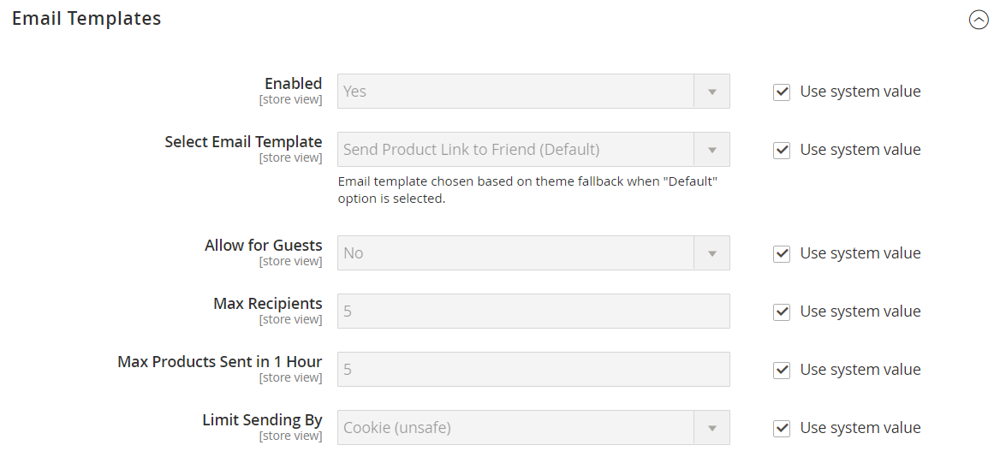

# [!UICONTROL Catalog] > [!UICONTROL Email to a Friend]

{{config}}

## [!UICONTROL Email Templates]

<!-- zoom -->

<!-- [Email Templates](https://experienceleague.adobe.com/en/docs/commerce-admin/systems/communications/email-templates#configure-email-templates) -->

| Campo | [Escopo](../../getting-started/websites-stores-views.md#scope-settings) | Descrição |
|--- |--- |--- |
| [!UICONTROL Enabled] | Exibição da loja | Ativa o processo que oferece aos clientes a capacidade de enviar emails para amigos sobre produtos em sua loja. Opções: `Yes` / `No` |
| [!UICONTROL Select Email Template] | Exibição da loja | Identifica o modelo de email usado para mensagens geradas pela função _Enviar um Amigo por Email_. Modelo padrão: `Send Product to Friend` |
| [!UICONTROL Allow for Guests] | Exibição da loja | Determina se o remetente deve ser um cliente registrado para enviar emails sobre um produto para amigos. Opções: `Yes` / `No` |
| [!UICONTROL Max Recipients] | Exibição da loja | Limita o número de pessoas que podem estar na lista de distribuição para um único email. |
| [!UICONTROL Max Products Sent in 1  Hour] | Exibição da loja | Limita o número de produtos que podem ser compartilhados por um único usuário no período de uma hora. |
| [!UICONTROL Limit Sending By] | Exibição da loja | Determina o método usado para identificar o remetente. As opções incluem:  **`IP Address`**- (Recomendado) Identifica o remetente pelo endereço IP do computador usado para enviar os emails do produto. **`Cookie (unsafe)`** - Identifica o remetente por um cookie do navegador. Este método não é seguro porque o usuário pode excluir o cookie para evitar a restrição. |

{style="table-layout:auto"}
