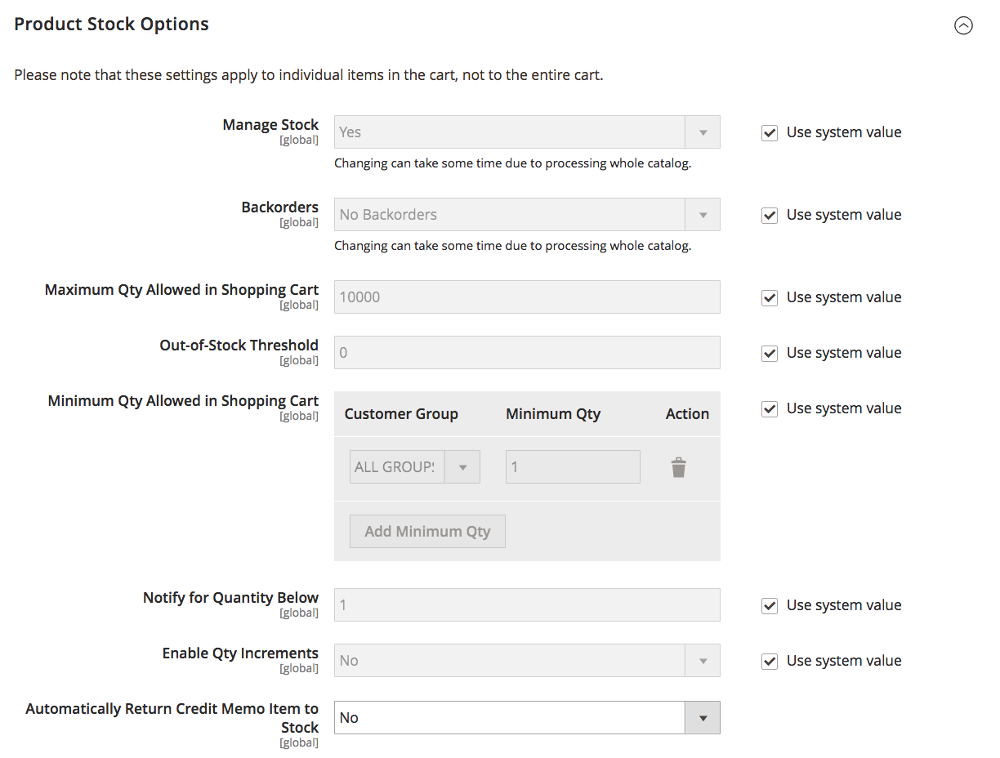

# [!UICONTROL Catalog] > [!UICONTROL Inventory]

{{config}}

>[!NOTE]
>
>O [!DNL Inventory Management] for Adobe Commerce e Magento Open Source fornece as ferramentas para gerenciar o inventário de produtos. Comerciantes com uma única loja para vários depósitos, lojas, locais de retirada, entregadores diretos e muito mais podem usar esses recursos para manter quantidades para vendas e controlar entregas para ordens completas. Para obter mais informações sobre esses recursos e como usá-los para gerenciar estoque em vários locais, consulte o [_[!DNL Inventory Management] Guia do Usuário _](https://experienceleague.adobe.com/docs/commerce-admin/inventory/introduction.html).

## [!UICONTROL Stock Options]

<!-- zoom -->

<!-- [Stock Options](https://experienceleague.adobe.com/en/docs/commerce-admin/inventory/configuration/global-options) -->

| Campo | [Escopo](../../getting-started/websites-stores-views.md#scope-settings) | Descrição |
|--- |--- |--- |
| [!UICONTROL Decrease Stock When Order is Placed] | Global | Se definido como `Yes`, diminui a quantidade em estoque quando o pedido é feito. Com a opção _Gerenciar Estoque_ habilitada, as reservas são inseridas para os produtos e as quantidades solicitados. Opções: `Yes` / `No` |
| [!UICONTROL Set Items' Status to be in Stock When Order is Cancelled] | Exibição da loja | Se definido como `Yes`, retorna o item para estoque quando o pedido é cancelado. Com a opção _Gerenciar Estoque_ habilitada, a reserva é limpa para os produtos e quantidades cancelados. Opções: `Yes` / `No` |
| [!UICONTROL Display Out of Stock Products] | Global | Se definido como `Yes`, exibe produtos que estão esgotados. Se os alertas de produto também estiverem ativados, os clientes poderão se inscrever para serem notificados quando o produto estiver disponível. Opções: `Yes` / `No` |
| [!UICONTROL Only X left Threshold] | Site | Estabelece o limite para a mensagem `Only x left`. Por exemplo, se definida como 3, a mensagem será exibida quando houver três ou menos itens em estoque. A mensagem não será exibida se o valor estiver definido como `0`. |
| [!UICONTROL Display products availability in Stock on Storefront] | Exibição da loja | Se definido como `Yes`, exibe uma mensagem `In Stock` ou `Out of Stock` na página do produto. Opções: `Yes` / `No` |
| [!UICONTROL Enable Inventory Check On Cart Load] | Global | Determina se uma verificação de inventário é executada ao carregar um produto no carrinho. Desativar essa verificação de inventário pode melhorar o desempenho das etapas de check-out, especialmente quando há muitos itens no carrinho. No entanto, se você ignorar a pré-validação, os clientes poderão ver erros de _falta de estoque_ posteriormente no processo de finalização. Opções: `Yes` / `No` |
| [!UICONTROL Synchronize with Catalog] | Global | Quando definido como `Yes`, os dados de estoque são ajustados de acordo com as alterações do catálogo (como remoções de produtos, alterações de SKU de produtos e alterações de tipo de produto) e mantêm a consistência entre o estoque e o catálogo. Opções: `Yes` / `No` |

{style="table-layout:auto"}

## [!UICONTROL Product Stock Options]

<!-- zoom -->

<!-- [Product Stock Options](https://experienceleague.adobe.com/en/docs/commerce-admin/inventory/configuration/global-options) -->

| Campo | [Escopo](../../getting-started/websites-stores-views.md#scope-settings) | Descrição |
|--- |--- |----------------------------------------------------------------------------------------------------------------------------------------------------------------------------------------------------------------------------------------------------------------------------------------------------------------------------------------------------------------------------------------------------------------------------------------------------------------------------------------------------------------------------------------------------------------------------------------------------------------------------------------------------------------------------------------------------------------------------------------------------------------------------------|
| [!UICONTROL Manage Stock] | Global | Determina se você usa o controle de inventário completo para gerenciar os itens do catálogo. Opções:  **Sim** - Ativa o controle de estoque completo para rastrear o número de itens atualmente em estoque.  **Não** - Não rastreia o número de itens atualmente em estoque. |
| [!UICONTROL Backorders] | Global | Determina como a loja gerencia ordens pendentes. Uma ordem pendente não altera o status de processamento da ordem. Os fundos ainda são autorizados ou capturados imediatamente quando o pedido é feito, independentemente do produto estar em estoque. Quando o produto estiver disponível, ele será enviado. Opções:  **Sem Backorders** - Não aceita backorders quando o produto estiver indisponível.  **Permitir Qtd. Abaixo de 0** - Aceita ordens pendentes quando a quantidade cai abaixo de zero.  **Permitir Qtd. Abaixo de 0 e Notificar Cliente** - Aceita ordens pendentes quando a quantidade cai abaixo de zero, mas notifica os clientes que as ordens ainda podem ser feitas. |
| [!UICONTROL Use deferred Stock update] | Global |  (somente Adobe Commerce) Determina se a atualização de estoque deve ser adiada se pedidos pendentes forem permitidos (a opção _Pedidos pendentes_ está definida como qualquer coisa além do valor padrão `No backorders`). Ele funciona para um único produto ou para um site inteiro e usa o mecanismo _Fila de trabalhos_ para permitir que os indicadores de quantidade de estoque sejam atualizados de forma assíncrona após a realização dos pedidos. Esta opção também funciona com [Posicionamento assíncrono de pedido](https://experienceleague.adobe.com/docs/commerce-operations/performance-best-practices/high-throughput-order-processing.html#asynchronous-order-placement) em combinação com [Inventory management](../../inventory-management/introduction.md). |
| Quantidade Máxima Permitida no Carrinho de Compras | Global | Determina o número máximo de um produto que pode ser comprado em um único pedido. Por padrão, a quantidade máxima é definida como 10.000. |
| [!UICONTROL Out-of-Stock Threshold] | Global | Determina o nível de estoque no qual um produto é considerado indisponível. Opções:  **Valor positivo** - Com _Pedidos pendentes_ desabilitados, insira um valor positivo. Com ordens pendentes ativadas, esse valor é ignorado.  **Zero** - Com _Ordens pendentes_ habilitadas, inserir `0` permite ordens pendentes infinitas.  **Valor negativo** - Com _Pedidos pendentes_ habilitados, recomendamos inserir um valor negativo. O valor é adicionado à Quantidade Venável. Por exemplo, insira -50 para permitir pedidos até esse valor. |
| [!UICONTROL Minimum Qty Allowed in Shopping Cart] | Global | Determina a quantidade mínima de um item que está disponível para compra de acordo com o grupo de clientes. Por padrão, a quantidade mínima é definida como 1. Clique em **[!UICONTROL Add Minimum Qty]** para inserir um valor diferente para um grupo de clientes específico. |
| [!UICONTROL Notify for Quantity Below] | Global | Determina o nível do estoque no qual é enviada a notificação de que o estoque caiu abaixo do limite. |
| [!UICONTROL Enable Qty Increments] | Global | Determina se os itens podem ser vendidos em incrementos de quantidade. Opções: `Yes` / `No` |
| [!UICONTROL Qty Increments] | Global | Estabelece o número de produtos que compõem um incremento de quantidade. |
| [!UICONTROL Automatically Return Credit Memo Item to Stock] | Global | Determina se os itens incluídos nos avisos de crédito são automaticamente devolvidos ao inventário. Opções: `Yes` / `No` |

{style="table-layout:auto"}

## [!UICONTROL Admin Bulk Operations]

<!-- zoom -->

<!-- [Admin Bulk Operations](https://experienceleague.adobe.com/en/docs/commerce-admin/inventory/configuration/global-options) -->

>[!NOTE]
>
>Para configurar e suportar **gerenciadores de fila assíncronos**, você deve usar a linha de comando. Isso pode exigir ajuda do desenvolvedor. Consulte [Iniciar consumidores da fila de mensagens](https://experienceleague.adobe.com/docs/commerce-operations/configuration-guide/cli/start-message-queues.html) no _Guia de Configuração_.

| Campo | [Escopo](../../getting-started/websites-stores-views.md#scope-settings) | Descrição |
|--- |--- |--- |
| [!UICONTROL Run asynchronously] | Global | Determina se você executa operações em massa de forma assíncrona para ações de produtos em massa, incluindo [fontes de atribuição em massa](../../inventory-management/bulk-assignment.md), fontes de cancelamento de atribuição e [transferir inventário para a origem](../../inventory-management/inventory-transfer.md). Ele coleta ações em massa até _[!UICONTROL Asynchronous batch size]_&#x200B;e, em seguida, executa essas ações. Esse recurso está desativado por padrão. Recomendamos analisar seu desempenho com ações em massa antes de habilitar. Opções: **`Yes`**- Executa todas as operações em massa para [!DNL Inventory Management] de forma assíncrona. Para habilitar, você deve configurar um gerenciador de filas assíncrono. **`No`**- Padrão. Não executa operações em massa de forma assíncrona. |
| [!UICONTROL Asynchronous batch size] | Global | Defina **[!UICONTROL Run asynchronously]** como `Yes` para inserir um valor para o campo _[!UICONTROL Asynchronous batch size]_.  O tamanho de lote padrão é 100. Quando os processos em massa atingem essa quantidade, eles são executados. |

{style="table-layout:auto"}

## [!UICONTROL Inventory Indexer Settings]

| Campo | [Escopo](../../getting-started/websites-stores-views.md#scope-settings) | Descrição |
|--- |--- |--- |
| [!UICONTROL Stock/Source reindex strategy] | Global | Determina a estratégia usada para reindexação de estoque/origem. Opções: `Synchronous` / `Asynchronous` (um gerenciador de fila assíncrono deve ser configurado para o modo assíncrono) |

{style="table-layout:auto"}

>[!NOTE]
>
> Devido às dependências das atualizações de estoque para as atividades relacionadas ao pedido, o indexador de estoque também é acionado no salvamento do produto, independentemente da configuração `Synchronous` ou `Asynchronous`.

## [!UICONTROL Distance Provider for Distance Based SSA]

<!-- zoom -->

<!-- [Distance Providers for Distance Based SSA](https://experienceleague.adobe.com/en/docs/commerce-admin/inventory/configuration/distance-priority-algorithm) -->

| Campo | [Escopo](../../getting-started/websites-stores-views.md#scope-settings) | Descrição |
|--- |--- |--- |
| [!UICONTROL Provider] | Global | Determina o provedor a ser usado para o algoritmo de seleção Source de prioridade de distância. Esse recurso é ativado por padrão. Opções:  **`Google MAP`**- Usa os serviços da Google para calcular a distância e o tempo entre o endereço de destino da remessa e os locais de origem (endereço e coordenadas GPS). Essa opção requer uma chave de API do Google e pode gerar cobranças por meio do Google. **`Offline Calculation`** - Calcula a distância usando um banco de dados inserido para determinar a origem mais próxima do endereço de destino de remessa. Para usar essa opção, você pode precisar de assistência ao desenvolvedor para baixar inicialmente o conteúdo do local do banco de dados para todos os países para os quais você faz o envio usando uma linha de comando. |

{style="table-layout:auto"}

## [!UICONTROL Google Distance Provider]

<!-- zoom -->

<!-- [Google Distance Provider](https://experienceleague.adobe.com/en/docs/commerce-admin/inventory/configuration/distance-priority-algorithm) -->

| Campo | [Escopo](../../getting-started/websites-stores-views.md#scope-settings) | Descrição |
|--- |--- |--- |
| [!UICONTROL Google API key] | Global | Insira a chave da API do Google para o provedor do Google MAP. A chave é de [!DNL Google Maps Platform] e deve ter [!DNL Geocoding API] e [!DNL Distance Matrix API] habilitados. Para obter detalhes, consulte [Configurar o Algoritmo de Prioridade de Distância](../../inventory-management/distance-priority-algorithm.md#configure-the-distance-priority-algorithm) no _Guia do Inventory management_. |
| [!UICONTROL Computation mode] | Global | Determina as direções e os caminhos para calcular a distância do endereço de entrega e de todas as fontes atribuídas ao estoque. Por padrão, os cálculos usam o modo de direção. Opções:  **`Driving`**- Configuração padrão, solicita trajetos de direção padrão usando a rede rodoviária. **`Walking`** - Solicita trajetos de caminhada usando caminhos e calçadas de pedestres (quando disponíveis).  **`Bicycling`**- Solicita trajetos de bicicleta usando ciclovias e ruas preferidas (atualmente apenas disponível nos EUA e em algumas cidades canadenses). |
| [!UICONTROL Value] | Global | Indica o que calcular e retornar para a distância e a hora dos locais de origem para o endereço de destino da entrega. O Algoritmo de Prioridade de Distância recomenda a origem com a distância ou o tempo mais curto para o endereço de destino da entrega, que fornece entregas mais rápidas e possivelmente mais baratas para serem atendidas. Opções:  **`Distance`**- Retorna a distância entre pontos em métricas (quilômetros e metros) ou imperiais (milhas e pés). **`Time to Destination`** - Retorna em horas e minutos o tempo necessário para viajar dos locais de origem ao endereço para entrega. |

{style="table-layout:auto"}
