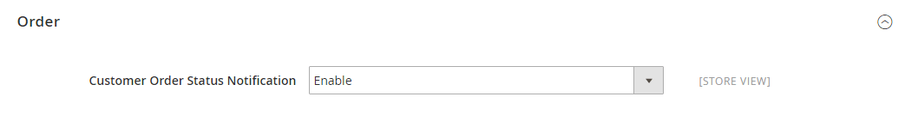

# [!UICONTROL Catalog] > [!UICONTROL RSS Feeds]

{{config}}

## [!UICONTROL Rss Config]

<!-- zoom -->

<!-- [Rss Config](https://experienceleague.adobe.com/en/docs/commerce-admin/marketing/communications/social-rss) -->

| Campo | [Escopo](../../getting-started/websites-stores-views.md#scope-settings) | Descrição |
|--- |--- |--- |
| [!UICONTROL Enable RSS] | Exibição da loja | Permite que os clientes recebam RSS feeds da loja. |

{style="table-layout:auto"}

Para obter detalhes sobre como usar os RSS feeds após serem habilitados, consulte [Redes sociais e RSS feeds](../../merchandising-promotions/social-rss.md).

## [!UICONTROL Wish List]

<!-- zoom -->

<!-- [Wish List](https://experienceleague.adobe.com/en/docs/commerce-admin/stores-sales/shopper-tools/wish-lists/wishlists) -->

| Campo | [Escopo](../../getting-started/websites-stores-views.md#scope-settings) | Descrição |
|--- |--- |--- |
| [!UICONTROL Enable RSS] | Exibição da loja | Quando ativado, um link de feed RSS é exibido na parte superior das páginas da lista de desejos. A página de compartilhamento da lista de desejos inclui uma caixa de seleção que o cliente pode marcar para vincular ao feed a partir de listas de desejos compartilhadas. |

{style="table-layout:auto"}

## [!UICONTROL Catalog]

<!-- zoom -->

<!-- [Catalog](https://experienceleague.adobe.com/en/docs/commerce-admin/catalog/catalog-menu) -->

| Campo | [Escopo](../../getting-started/websites-stores-views.md#scope-settings) | Descrição |
|--- |--- |--- |
| [!UICONTROL New Products] | Exibição da loja | Quando habilitado, publica a notificação de novos produtos adicionados ao catálogo da loja. |
| [!UICONTROL Special Products] | Exibição da loja | Quando ativado, publica a notificação de quaisquer produtos com preços especiais. |
| [!UICONTROL Coupons/Discounts] | Exibição da loja | Quando habilitado, publica a notificação de quaisquer cupons ou descontos. |
| [!UICONTROL Top Level Category] | Exibição da loja | Publica uma notificação de qualquer alteração na estrutura de categoria de nível superior do catálogo, que é refletida no menu principal. |

{style="table-layout:auto"}

## [!UICONTROL Order]

<!-- zoom -->

<!-- [Order](https://experienceleague.adobe.com/en/docs/commerce-admin/stores-sales/order-management/orders/order-status#notification) -->

| Campo | [Escopo](../../getting-started/websites-stores-views.md#scope-settings) | Descrição |
|--- |--- |--- |
| [!UICONTROL Customer Order Status Notification] | Exibição da loja | Oferece aos clientes a capacidade de rastrear o status do pedido pelo feed RSS. Quando ativado, um link de feed RSS é exibido no pedido |

{style="table-layout:auto"}
