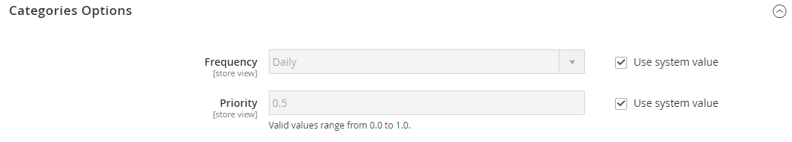
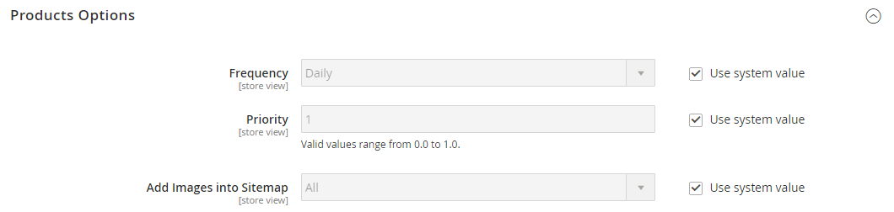
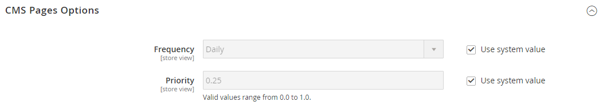

# [!UICONTROL Catalog] > [!UICONTROL XML Sitemap]

{{config}}

## [!UICONTROL Categories Options]

<!-- zoom -->

<!-- [Categories Options](https://experienceleague.adobe.com/en/docs/commerce-admin/marketing/seo/sitemap-xml) -->

| Campo | [Escopo](../../getting-started/websites-stores-views.md#scope-settings) | Descrição |
|--- |--- |--- |
| [!UICONTROL Frequency] | Exibição da loja | Determina a frequência com que as categorias de mapa de site são atualizadas. Opções: `Always` / `Hourly` / `Daily` / `Weekly` / `Monthly` / `Yearly` / `Never` |
| [!UICONTROL Priority] | Exibição da loja | Um valor entre `0.0` e `1.0` que determina a prioridade das atualizações de mapas de site de categoria em relação a outro conteúdo. Zero (`0.0`) tem a prioridade mais baixa. |

{style="table-layout:auto"}

## [!UICONTROL Products Options]

<!-- zoom -->

<!-- [Products Options](https://experienceleague.adobe.com/en/docs/commerce-admin/marketing/seo/sitemap-xml) -->

| Campo | [Escopo](../../getting-started/websites-stores-views.md#scope-settings) | Descrição |
|--- |--- |--- |
| [!UICONTROL Frequency] | Exibição da loja | Determina a frequência com que os produtos de mapa de site são atualizados. Opções: `Always` / `Hourly` / `Daily` / `Weekly` / `Monthly` / `Yearly` / `Never` |
| [!UICONTROL Priority] | Exibição da loja | Um valor entre `0.0` e `1.0` que determina a prioridade das atualizações do mapa de site do produto em relação a outro conteúdo. Zero (`0.0`) tem a prioridade mais baixa. |
| [!UICONTROL Add Images into Sitemap] | Exibição da loja | Determina a extensão com que as imagens são incluídas no mapa do site. Opções: `None` / `Base Only` / `All` |

{style="table-layout:auto"}

## [!UICONTROL CMS Pages Options]

<!-- zoom -->

<!-- [CMS Pages Options](https://experienceleague.adobe.com/en/docs/commerce-admin/marketing/seo/sitemap-xml) -->

| Campo | [Escopo](../../getting-started/websites-stores-views.md#scope-settings) | Descrição |
|--- |--- |--- |
| [!UICONTROL Frequency] | Exibição da loja | Determina a frequência com que as páginas do CMS do mapa de site são atualizadas. Opções: `Always` / `Hourly` / `Daily` / `Weekly` / `Monthly` / `Yearly` / `Never` |
| [!UICONTROL Priority] | Exibição da loja | Um valor entre `0.0` e `1.0` que determina a prioridade das atualizações de mapa de site de página do CMS em relação a outro conteúdo. Zero (`0.0`) tem a prioridade mais baixa. |

{style="table-layout:auto"}

## [!UICONTROL Store Url Options]

| Campo | [Escopo](../../getting-started/websites-stores-views.md#scope-settings) | Descrição |
|--- |--- |--- |
| [!UICONTROL Frequency] | Exibição da loja | Determina com que frequência os URLs de armazenamento são atualizados. Opções: `Always` / `Hourly` / `Daily` / `Weekly` / `Monthly` / `Yearly` / `Never` |
| [!UICONTROL Priority] | Exibição da loja | Um valor entre `0.0` e `1.0` que determina a prioridade das atualizações de URL de armazenamento em relação a outro conteúdo. Zero (`0.0`) tem a prioridade mais baixa. |

{style="table-layout:auto"}

## [!UICONTROL Generation Settings]

<!-- zoom -->

<!-- [Generation Settings](https://experienceleague.adobe.com/en/docs/commerce-admin/marketing/seo/sitemap-xml) -->

| Campo | [Escopo](../../getting-started/websites-stores-views.md#scope-settings) | Descrição |
|--- |--- |--- |
| [!UICONTROL Enabled] | Exibição da loja | Determina se um mapa de site XML está disponível para o armazenamento. Opções: `Yes` / `No` |
| [!UICONTROL Generation Method] | Exibição da loja | Determina como o mapa de site XML é gerado. O `Standard` usa o processo tradicional de geração síncrona e processa todos os dados na memória, enquanto o `Batch` usa um modo de lote assíncrono otimizado para memória, para maior flexibilidade e escalabilidade. Essa opção está disponível a partir da versão 2.4.9. Opções: `Standard` / `Batch` |
| [!UICONTROL Start Time] | Exibição da loja | Especifica a hora, os minutos e o segundo do dia em que o mapa do site é atualizado. |
| [!UICONTROL Frequency] | Exibição da loja | Determina a frequência com que o mapa do site é atualizado. Opções: `Daily` / `Weekly` / `Monthly` |
| [!UICONTROL Error Email Recipient] | Exibição da loja | O endereço de email da pessoa que recebe a notificação se ocorrer um erro durante o processo de atualização do mapa de site. Para vários endereços, separe cada um com uma vírgula. |
| [!UICONTROL Error Email Sender] | Site | Identifica o contato da loja que aparece como o remetente da notificação de erro. Opções: `General Contact` / `Sales Representative` / `Customer Support` / `Custom Email 1` / `Custom Email 2` |
| [!UICONTROL Error Email Template] | Site | Identifica o modelo de email usado para a notificação de erro. Modelo padrão: `Sitemap generate Warnings` |

{style="table-layout:auto"}

## [!UICONTROL Sitemap File Limits]

<!-- zoom -->

<!-- [Sitemap File Limits](https://experienceleague.adobe.com/en/docs/commerce-admin/marketing/seo/sitemap-xml) -->

| Campo | [Escopo](../../getting-started/websites-stores-views.md#scope-settings) | Descrição |
|--- |--- |--- |
| [!UICONTROL Maximum No of URLs Per File] | Exibição da loja | Determina o número máximo de URLs que podem ser incluídos em um único mapa de site. |
| [!UICONTROL Maximum File Size] | Exibição da loja | Determina o tamanho máximo do mapa de site gerado, em bytes. |

{style="table-layout:auto"}

## [!UICONTROL Search Engine Submission Settings]

<!-- zoom -->

<!-- [Search Engine Submission Settings](https://experienceleague.adobe.com/en/docs/commerce-admin/marketing/seo/sitemap-xml) -->

| Campo | [Escopo](../../getting-started/websites-stores-views.md#scope-settings) | Descrição |
|--- |--- |--- |
| [!UICONTROL Enable Submission to Robots.txt] | Exibição da loja | Permite que as diretivas sejam enviadas para o arquivo robots.txt. Opções: `Yes` / `No` |

{style="table-layout:auto"}
