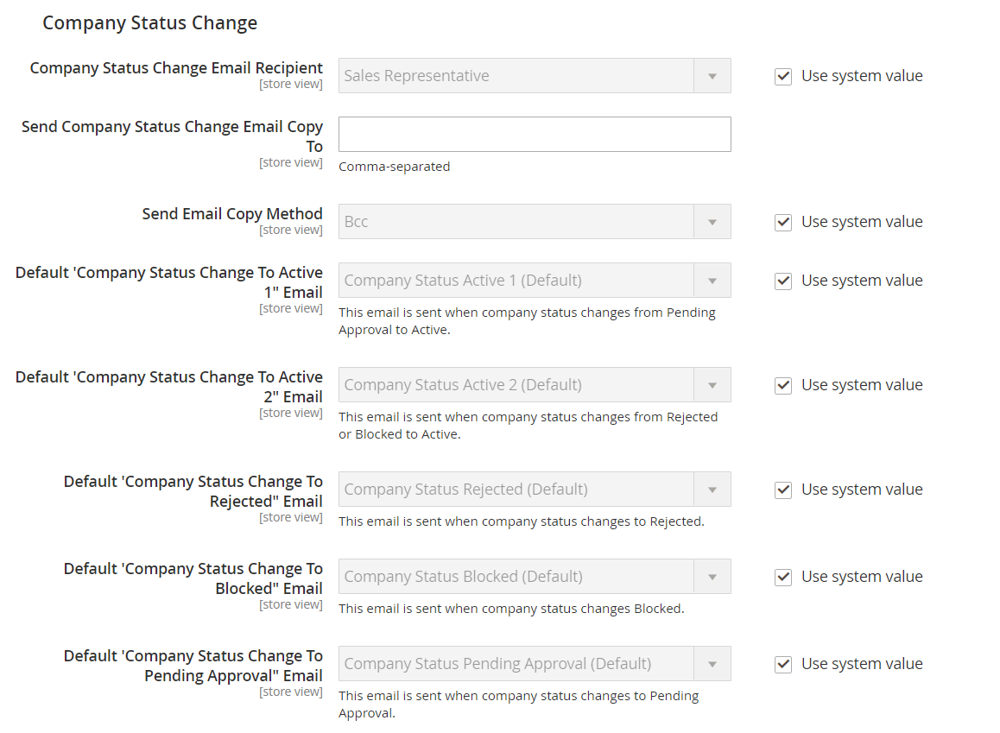

# [!UICONTROL Customers] > [!UICONTROL Company Configuration]

{{b2b-feature}}

{{config}}

>[!TIP]
>
>Com a instalação e a habilitação do B2B para Adobe Commerce, a experiência de compra pode ser personalizada com recursos específicos da empresa. O B2B para Adobe Commerce é uma solução integrada que oferece suporte aos modelos B2B e B2C. Para obter mais informações sobre os recursos B2B, consulte a [Guia do usuário B2B para Adobe Commerce](https://experienceleague.adobe.com/docs/commerce-admin/b2b/introduction.html).

>[!NOTE]
>
>O acesso a essas opções de configuração para recursos B2B é controlado pelo [recursos da função](../../systems/permissions-user-roles.md#role-resources). Esses recursos de função devem ser definidos para a função de usuário atribuída ao usuário administrador.

Para obter mais informações sobre essas configurações, consulte [Habilitar recursos básicos B2B](../../b2b/enable-basic-features.md) no _Guia do usuário B2B para Adobe Commerce_.

## [!UICONTROL General]

<!-- zoom -->

| Campo | [Escopo](../../getting-started/websites-stores-views.md#scope-settings) | Descrição |
|--- |--- |--- |
| [!UICONTROL Allow Company Registration from the Storefront] | Site | Determina se os visitantes da loja têm a opção de [registrar](../../customers/customer-sign-in.md) para uma conta da empresa ou uma conta individual. Opções: `Yes` / `No` |

{style="table-layout:auto"}

## [!UICONTROL Email Options - Company Registration]

<!-- zoom -->

| Campo | [Escopo](../../getting-started/websites-stores-views.md#scope-settings) | Descrição |
|--- |--- |--- |
| [!UICONTROL Company Registration Email Recipient] | Exibição da loja | O contato da loja que é notificado quando uma solicitação de registro da empresa é enviada da loja. Opções: `General Contact` / `Sales Representative` / `Customer Support` / `Custom Email 1` / `Custom Email 2` |
| [!UICONTROL Send Company Registration Email Copy To] | Exibição da loja | O endereço de email de cada pessoa que receberá uma cópia da notificação de registro. Separe vários endereços de email com vírgula. |
| [!UICONTROL Send Email Copy Method] | Exibição da loja | O método de email usado para enviar a cópia do email de registro. Opções: `Bcc` / `Separate Email` |
| [!UICONTROL Default Company Registration Email] | Exibição da loja | O template de email usado por padrão para a notificação de registro da empresa. Modelo padrão: `Company Registration Request` |

{style="table-layout:auto"}

## [!UICONTROL Customer-Related Emails]

<!-- zoom -->

| Campo | [Escopo](../../getting-started/websites-stores-views.md#scope-settings) | Descrição |
|--- |--- |--- |
| [!UICONTROL Default 'Sales Rep Assigned' Email] | Exibição da loja | O modelo de email usado por padrão quando um representante de vendas é atribuído a uma conta da empresa. Esse email é enviado ao representante de vendas e ao administrador da empresa. Modelo padrão: `Sales Representative Assigned to Company` |
| [!UICONTROL Default 'Assign Company to Customer' Email] | Exibição da loja | O modelo de email usado por padrão quando uma conta de cliente individual é atribuída a uma conta de empresa. Esse email é enviado somente para o cliente. Modelo padrão: `Assign Company to Customer` |
| [!UICONTROL Default 'Assign Company Admin' Email] | Exibição da loja | O modelo de email usado quando um administrador de empresa é atribuído a uma empresa. Esse email é enviado ao representante de vendas e ao administrador da empresa. Modelo padrão: `Assign Company Admin` |
| [!UICONTROL Default 'Company Admin Inactive' Email] | Exibição da loja | O template de email usado por padrão quando o status da pessoa que atua como administrador da empresa é alterado para &quot;Inativo&quot;. O sistema envia uma notificação por email sobre a alteração para os administradores de empresas novos e antigos. Modelo padrão: `Company Admin Set Inactive` |
| [!UICONTROL Default 'Company Admin Changed to Member' Email] | Exibição da loja | O modelo de email que é usado por padrão quando o antigo administrador de empresa se torna um membro da empresa. O email é enviado somente para o membro da empresa. Modelo padrão: `Company Admin Changed to Member` |
| [!UICONTROL Default 'Customer Status Active' Email] | Exibição da loja | O modelo de email usado por padrão quando o status de um cliente se torna ativo. Esse email é enviado somente para o cliente. Modelo padrão: `Customer Status Active` |
| [!UICONTROL Default 'Customer Status Inactive' Email] | Exibição da loja | O modelo de email usado por padrão quando o status de um cliente se torna inativo. Esse email é enviado somente para o cliente. Modelo padrão: `Customer Status Inactive` |

{style="table-layout:auto"}

## [!UICONTROL Company Status Change]

<!-- zoom -->

| Campo | [Escopo](../../getting-started/websites-stores-views.md#scope-settings) | Descrição |
|--- |--- |--- |
| [!UICONTROL Company Status Change Email Recipient] | Exibição da loja | O contato da loja que é notificado sempre que o status de uma empresa muda. Opções: `General Contact` / `Sales Representative` / `Customer Support` / `Custom Email 1` / `Custom Email 2` |
| [!UICONTROL Send Company Status Change Email Copy To] | Exibição da loja | O endereço de email de cada pessoa que receberá uma cópia da notificação de alteração do status da empresa. Separe vários endereços de email com vírgula. |
| [!UICONTROL Send Email Copy Method] | Exibição da loja | O método de email usado para enviar a cópia da notificação de alteração de status. Opções: `Bcc` / `Separate Email` |
| [!UICONTROL Default "Company Status Change to Active 1' Email] | Exibição da loja | O modelo de email usado quando o status de uma empresa muda de _Pendente de Aprovação_ para _Ativo_. Modelo padrão: `Company Status Active 1` |
| [!UICONTROL Default 'Company Status Change to Active 2' Email] | Exibição da loja | O modelo de email que é usado por padrão quando o status de uma empresa muda de _Rejeitado_ ou _Bloqueado_ para _Ativo_. Modelo padrão: `Company Status Active 2` |
| [!UICONTROL Default 'Company Status Change to Rejected' Email] | Exibição da loja | O modelo de email que é usado por padrão quando o status de uma empresa muda para _Rejeitado_. Modelo padrão: `Company Status Rejected` |
| [!UICONTROL Default 'Company Status Change to Blocked' Email] | Exibição da loja | O modelo de email que é usado por padrão quando o status de uma empresa muda para _Bloqueado_. Modelo padrão: `Company Status Blocked` |
| [!UICONTROL Default 'Company Status Change to Pending Approval' Email] | Exibição da loja | O modelo de email que é usado por padrão quando o status de uma empresa muda para _Pendente de Aprovação_. Modelo padrão: `Company Status Pending Approval` |

{style="table-layout:auto"}

## [!UICONTROL Company Credit]

<!-- zoom -->

| Campo | [Escopo](../../getting-started/websites-stores-views.md#scope-settings) | Descrição |
|--- |--- |--- |
| [!UICONTROL Company Credit Change Email Sender] | Exibição da loja | O contato da loja que é notificado sempre que há uma alteração no crédito de uma empresa. Opções: `General Contact` / `Sales Representative` / `Customer Support` / `Custom Email 1` / `Custom Email 2` |
| [!UICONTROL Send Company Credit Change Email Copy To] | Exibição da loja | O endereço de email de cada pessoa que receberá uma cópia da notificação de alteração de crédito da empresa. Separe vários endereços de email com vírgula. |
| [!UICONTROL Send Email Copy Method] | Exibição da loja | O método de email usado para enviar a cópia da notificação de alteração de crédito. Opções: `Bcc` / `Separate Email` |
| [!UICONTROL Allocated Email Template] | Exibição da loja | O modelo de email usado por padrão quando o crédito da empresa é alocado. Esse email é enviado ao administrador da empresa. Modelo padrão: `Credit Limit Allocated` |
| [!UICONTROL Updated Email Template] | Exibição da loja | O modelo de email usado por padrão quando o limite de crédito de uma empresa é atualizado. Esse email é enviado ao administrador da empresa. Modelo padrão: `Credit Limit Updated` |
| [!UICONTROL Reimbursed Email Template] | Exibição da loja | O template de email usado por padrão quando um [reembolso](../../b2b/credit-company.md#apply-a-payment-to-a-company-account) é feita a crédito da empresa. Esse email é enviado ao administrador da empresa. Modelo padrão: `Credit Reimbursed` |
| [!UICONTROL Refunded Email Template] | Exibição da loja | O modelo de email usado por padrão quando um valor de um pedido é reembolsado ao crédito da empresa. Esse email é enviado ao administrador da empresa. Modelo padrão: `Order Refunded to Company Credit` |
| [!UICONTROL Reverted Email Template] | Exibição da loja | O modelo de email usado por padrão quando um pedido é revertido para crédito da empresa. Esse email é enviado ao administrador da empresa. Modelo padrão: `Order Reverted to Company Credit` |

{style="table-layout:auto"}
