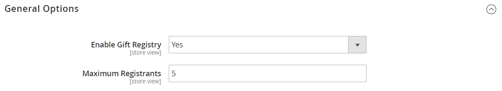
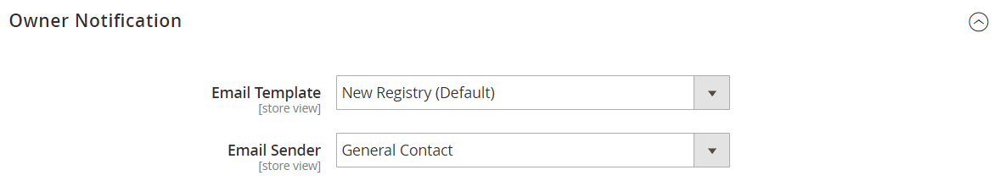
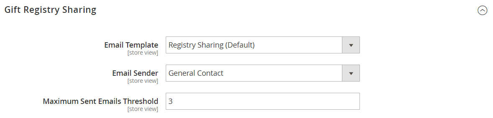

# [!UICONTROL Customers] > [!UICONTROL Gift Registry]

{{ee-feature}}

{{config}}

Para obter informações detalhadas sobre como usar essas configurações para habilitar registros de presentes para seus clientes da loja, consulte [Configurar registros de presentes](../../merchandising-promotions/gift-registry-configure.md). Para obter informações sobre como incluir a pesquisa de registro de presentes na loja, consulte [Adicionar pesquisa de registro de presentes](../../merchandising-promotions/gift-registry-search.md).

## [!UICONTROL General Options]

<!-- zoom -->

<!-- [General Options](https://experienceleague.adobe.com/pt-br/docs/commerce-admin/marketing/merchandising/gift-registry/gift-registry-configure) -->

| Campo | [Escopo](../../getting-started/websites-stores-views.md#scope-settings) | Descrição |
|--- |--- |--- |
| [!UICONTROL Enable Gift Registry] | Exibição da loja | Determina se os registros de presentes estão disponíveis. Opções:  **`Yes`**- Habilita registros de presentes para a exibição de loja selecionada. A guia Registro de presentes aparece no painel de conta de clientes registrados. **`No`** - Os registros de presentes não estão disponíveis para a exibição de loja. |
| [!UICONTROL Maximum Registrants] | Exibição da loja | Define o número de pessoas que um cliente pode adicionar a um registro de presentes. O cliente compartilha o registro de presentes com cada inscrito. Na loja, o botão _Adicionar inscrito_ fica disponível aos clientes até que o número máximo seja atingido. |

{style="table-layout:auto"}

## [!UICONTROL Owner Notification]

<!-- zoom -->

<!-- [Owner Notification](https://experienceleague.adobe.com/pt-br/docs/commerce-admin/marketing/merchandising/gift-registry/gift-registry-configure) -->

| Campo | [Escopo](../../getting-started/websites-stores-views.md#scope-settings) | Descrição |
|--- |--- |--- |
| [!UICONTROL Email Template] | Exibição da loja | Determina o modelo usado para o email de Notificação do Proprietário enviado quando um registro de presente é criado. Modelo padrão: Notificação do proprietário do registro de presentes |
| [!UICONTROL Email Sender] | Exibição da loja | Identifica o [contato da loja](../../getting-started/store-details.md#store-email-addresses) que aparece como remetente do email de Notificação do Proprietário do Registro de Presentes. Valor padrão: `General Contact` |

{style="table-layout:auto"}

## Compartilhamento do Registro de presentes

<!-- zoom -->

<!-- Gift Registry Sharing](https://experienceleague.adobe.com/pt-br/docs/commerce-admin/marketing/merchandising/gift-registry/gift-registry-configure) -->

| Campo | [Escopo](../../getting-started/websites-stores-views.md#scope-settings) | Descrição |
|--- |--- |--- |
| [!UICONTROL Email Template] | Exibição da loja | Determina o modelo usado para o email de Compartilhamento do Registro de presentes enviado quando um registro de presentes é criado. Quando o proprietário clicar em _Compartilhar Registro de Presentes_, o email será enviado para cada destinatário. Modelo padrão: `Gift Registry Sharing` |
| [!UICONTROL Email Sender] | Exibição da loja | Identifica o [contato da loja](../../getting-started/store-details.md#store-email-addresses) que aparece como remetente do email de Compartilhamento do Registro de Presentes. Valor padrão: `General Contact` |
| [!UICONTROL Maximum Sent Emails Threshold] | Exibição da loja | O número máximo de mensagens de notificação por email do Registro de presentes que podem ser enviadas de uma vez. |

{style="table-layout:auto"}

## [!UICONTROL Gift Registry Update]

<!-- zoom -->

<!-- [Gift Registry Update](https://experienceleague.adobe.com/pt-br/docs/commerce-admin/marketing/merchandising/gift-registry/gift-registry-configure) -->

| Campo | [Escopo](../../getting-started/websites-stores-views.md#scope-settings) | Descrição |
|--- |--- |--- |
| [!UICONTROL Email Template] | Exibição da loja | Determina o modelo usado para o email de Atualização do Registro de presentes que é enviado ao proprietário do Registro de presentes quando uma compra é feita no Registro de presentes. A atualização inclui informações sobre o item e a quantidade comprada, mas não inclui o nome da pessoa que fez o pedido. Modelo padrão: `Gift Registry Update` |
| [!UICONTROL Email Sender] | Exibição da loja | Identifica o [contato da loja](../../getting-started/store-details.md#store-email-addresses) que aparece como remetente do email de Atualização do Registro de Presentes. Valor padrão: `General Contact` |

{style="table-layout:auto"}
