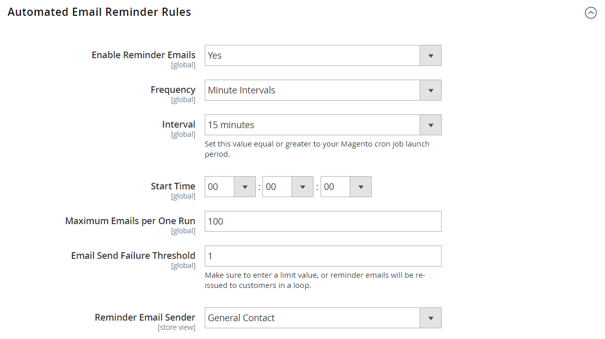
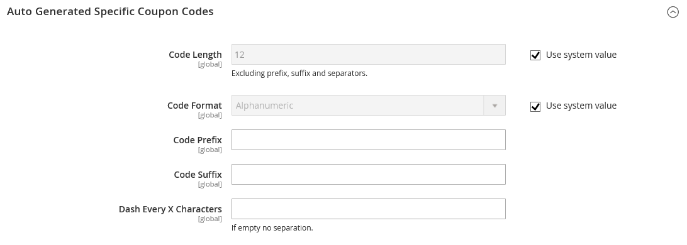

# [!UICONTROL Customers] > [!UICONTROL Promotions]

{{config}}

## [!UICONTROL Automated Email Reminder Rules]

{{ee-feature}}

<!-- zoom -->

<!-- [Automated Email Reminder Rules](https://experienceleague.adobe.com/en/docs/commerce-admin/marketing/communications/email-reminders/email-reminder-rules#configure-email-reminders) -->

| Campo | [Escopo](../../getting-started/websites-stores-views.md#scope-settings) | Descrição |
|--- |--- |--- |
| [!UICONTROL Enable Reminder Emails] | Global | Habilita lembretes de email automatizados. Se estiver definido como Não, as configurações restantes serão ignoradas. Opções: `Yes` / `No` |
| [!UICONTROL Frequency] | Global | Indica a frequência com que a Commerce deve verificar se há novos clientes qualificados para os lembretes de email automatizados. Opções:  **`Minute Intervals`**- Envia o email de acordo com o intervalo selecionado. (5 minutos, 10 minutos, 15 minutos, 20 minutos ou 30 minutos) **`Hourly`** - Envia emails de hora em hora, no minuto após a hora especificada. Insira um valor entre 0 e 59.  **`Daily`**- Envia emails diariamente, a partir da Hora de Início. |
| [!UICONTROL Interval] | Global | O intervalo deve ser igual ou maior que o período de inicialização do cron.php. Opções: `5 minutes` / `10 minutes` / `15 minutes` / `20 minutes` / `30 minutes` |
| [!UICONTROL Start Time] | Global | Define o dia, o minuto e o segundo em que o email é enviado. Especificado no formato de 24 horas, com base na hora do sistema no servidor. |
| [!UICONTROL Maximum Emails per One Run] | Global | Limita o número de emails enviados em um bloco agendado. |
| [!UICONTROL Email Send Failure Threshold] | Global | O número de vezes que o lembrete tenta enviar notificações para um endereço de email específico e falha. Quando o valor é definido como 0, não há limite e as notificações continuam a ser enviadas apesar de todas as falhas. |
| [!UICONTROL Reminder Email Sender] | Exibição da loja | A identidade da loja que aparece como o remetente do email. |

{style="table-layout:auto"}

## [!UICONTROL Auto Generated Specific Coupon Codes]

<!-- zoom -->

<!-- [Auto Generated Specific Coupon Codes](https://experienceleague.adobe.com/en/docs/commerce-admin/marketing/promotions/cart-rules/price-rules-cart-coupon#configure-coupon-codes)  -->

| Campo | [Escopo](../../getting-started/websites-stores-views.md#scope-settings) | Descrição |
|--- |--- |--- |
| [!UICONTROL Code Length] | Global | Define o comprimento do código do cupom, excluindo prefixo, sufixo e separadores. |
| [!UICONTROL Code Format] | Global | Define o formato do código do cupom. As opções incluem:  **`Alphanumeric`**- Qualquer combinação de letras e números. **`Alphabetical`** - Somente letras.  **`Numeric`**- Somente números. |
| [!UICONTROL Code Prefix] | Global | Um valor que é anexado ao início de todos os códigos de cupom. Se não quiser usar um prefixo, deixe o campo em branco. |
| [!UICONTROL Code Suffix] | Global | Um valor que é anexado ao final de todos os códigos. Se não quiser usar um sufixo, deixe o campo em branco. |
| [!UICONTROL Dash Every X Characters] | Global | O intervalo para inserir um traço (-) em todos os códigos de cupom. Se não quiser usar um traço, deixe o campo em branco.  _&#x200B;**Observação:**&#x200B;_ códigos de cupom que diferem somente por um traço são considerados códigos diferentes. |

{style="table-layout:auto"}
