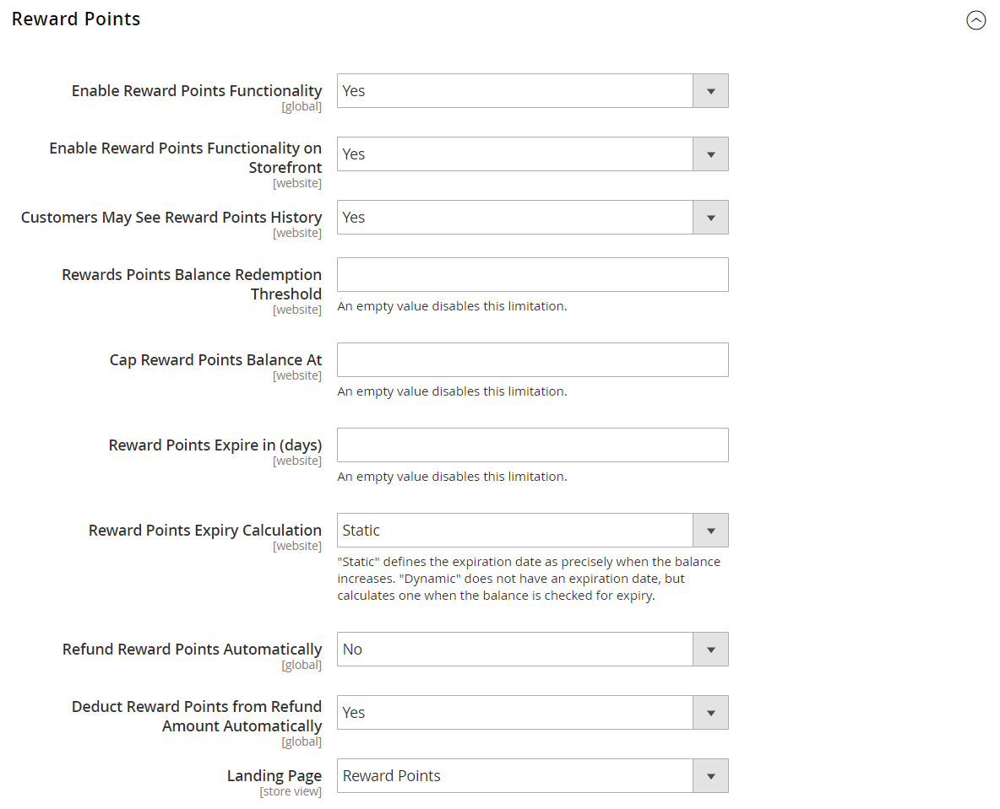
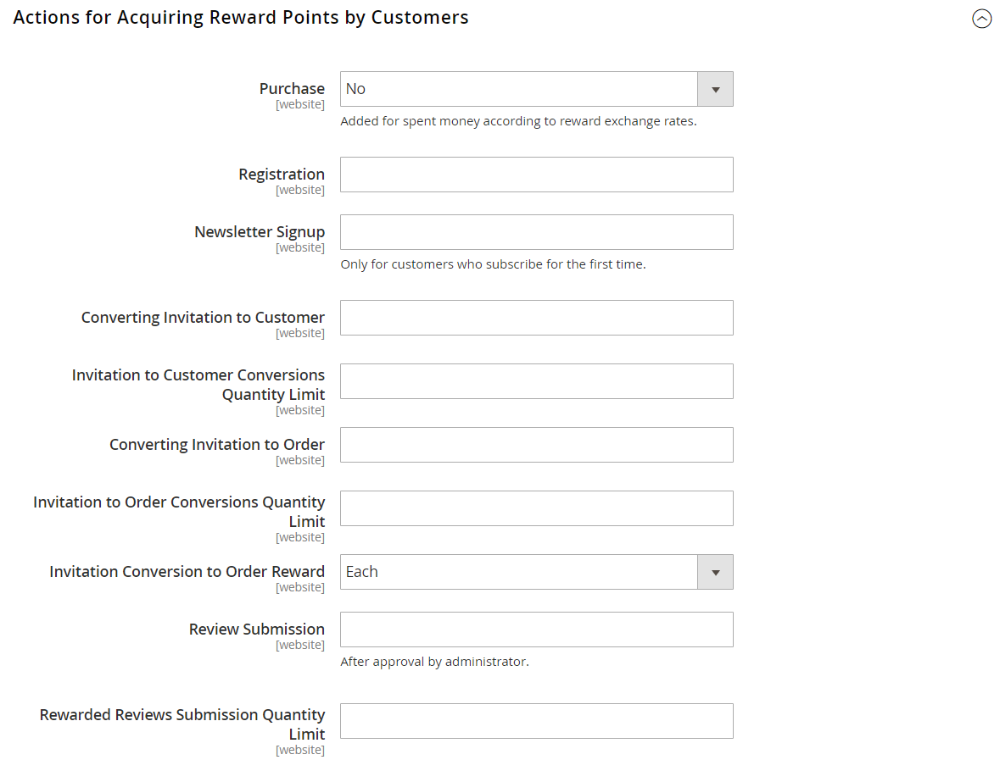
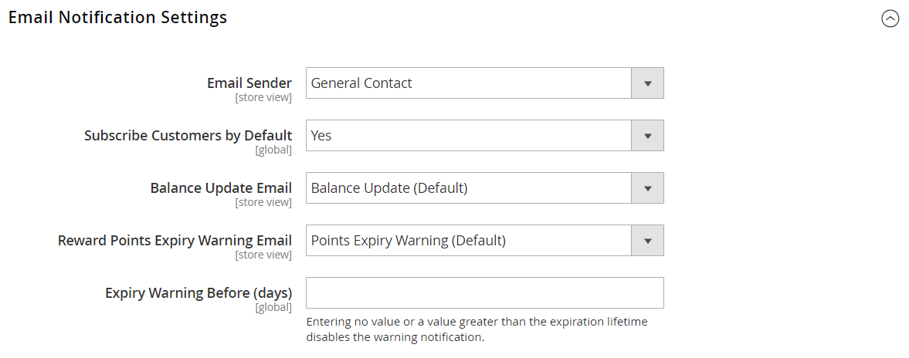

# [!UICONTROL Customers] > [!UICONTROL Reward Points]

{{ee-feature}}

{{config}}

>[!NOTE]
>
>A configuração [Taxas de Câmbio de Recompensa](../../merchandising-promotions/reward-exchange-rates.md) é necessária para o resgate de pontos de premiação por clientes e administradores durante o check-out.

## [!UICONTROL Reward Points]

<!-- zoom -->

<!-- [Reward Points](https://experienceleague.adobe.com/en/docs/commerce-admin/marketing/merchandising/reward-points/rewards-loyalty#enable-reward-point-operations-for-your-store) -->

| Campo | [Escopo](../../getting-started/websites-stores-views.md#scope-settings) | Descrição |
|--- |--- |----------------------------------------------------------------------------------------------------------------------------------------------------------------------------------------------------------------------------------------------------------------------------------------------------------------------------------------------------------------------------------------------------------------------------------------------------------------------------------------------------------------------------------------------------------------------|
| [!UICONTROL Enable Reward Points Functionality] | Global | Ativa ou desativa pontos de premiação. Opções: `Yes` / `No`. |
| [!UICONTROL Enable Reward Points Functionality on Storefront] | Site | Quando ativado, os clientes podem ganhar pontos por meio de suas atividades e resgatá-los no checkout. Se desativado, somente os usuários administradores podem atribuir e resgatar pontos em nome dos clientes. Opções: `Yes` / `No`. |
| [!UICONTROL Customers May See Reward Points History] | Site | Quando ativado, os clientes podem ver um histórico detalhado com cada acúmulo, resgate e expiração dos Pontos de recompensa no painel de contas. Opções: `Yes` / `No` |
| [!UICONTROL Reward Points Balance Redemption Threshold] | Site | Exige que os clientes atinjam um saldo de ponto mínimo antes que possam resgatá-los para pedidos. Deixe em branco para não fazer o mínimo. |
| [!UICONTROL Cap Reward Points Balance At] | Site | Impede que os clientes acumulem mais do que esse saldo máximo de pontos. Deixe em branco para não atingir o máximo. |
| [!UICONTROL Reward Points Expire in (days)] | Site | Indica a duração dos pontos de premiação em dias. Cada lote de pontos ganhos durante atividades separadas tem uma vida útil separada. Cada lote no histórico de Pontos de premiação indica o número de dias restantes antes que os pontos expirem. O histórico pode ser visualizado no painel de conta do cliente, se ativado, e no painel de Administrador. Deixe em branco para não expirar. |
| [!UICONTROL Reward Points Expiry Calculation] | Site | Determina o método usado para determinar quando os pontos de premiação expiram. Opções:  **`Static`**- Determina o tempo de vida restante dos pontos de premiação com base no número de dias definido na configuração. Se o limite de expiração na configuração for alterado, a data de expiração dos pontos existentes não será alterada. **`Dynamic`** - Calcula o número de dias restantes sempre que o saldo de pontos de premiação aumenta. Se o limite de expiração na configuração for alterado, os cálculos de expiração de todos os pontos existentes serão atualizados adequadamente. |
| [!UICONTROL Refund Reward Points Automatically] | Global | Determina se os pontos de premiação disponíveis são reembolsados automaticamente. Opções: `Yes` / `No` |
| [!UICONTROL Deduct Reward Points from Refund Amount Automatically] | Global | Isso determina se os pontos de premiação ganhos por meio de compras são total ou parcialmente anulados no reembolso de pedido, quando esse recurso está habilitado. Somente os pontos de premiação do pedido que os ganhou são afetados quando esse pedido é reembolsado. Opções: `Yes` / `No`. |
| [!UICONTROL Landing Page] | Exibição da loja | Especifica a página do CMS que explica seu programa de pontos de premiação. Um link para a página padrão Recompensas é exibido nos locais em sua loja onde os pontos podem ser obtidos. |

{style="table-layout:auto"}

## [!UICONTROL Actions for Acquiring Reward Points by Customers]

<!-- zoom -->

<!-- [Actions for Acquiring Reward Points by Customers](https://experienceleague.adobe.com/en/docs/commerce-admin/marketing/merchandising/reward-points/rewards-loyalty#enable-reward-point-operations-for-your-store) -->

| Campo | [Escopo](../../getting-started/websites-stores-views.md#scope-settings) | Descrição |
|--- |--- |----------------------------------------------------------------------------------------------------------------------------------------------------------------------------------------------------------------------------------------------------------------------------------------------------------------------------------------------------------------------------------------------------------------------------------------------------------------------------------------------------------------------------------------------------------------------------------------------------|
| [!UICONTROL Purchase] | Site | Determina se os pontos de recompensa são ganhos para as compras com base nas [Taxas de Câmbio de Recompensa](../../merchandising-promotions/reward-exchange-rates.md) configuradas. Opções: `Yes` / `No` |
| [!UICONTROL Registration] | Site | Especifica o número de pontos ganhos ao abrir uma conta de cliente. |
| [!UICONTROL Newsletter Signup] | Site | Especifica o número de pontos ganhos por clientes registrados que assinam um boletim informativo. (Não há pontos disponíveis para assinaturas de convidados.) Se um cliente cancelar a assinatura e fizer a assinatura novamente, os pontos não serão ganhos na segunda assinatura. |
| [!UICONTROL Converting Invitation to Customer] | Site | Especifica o número de pontos ganhos por um cliente que envia um convite quando o destinatário abre uma conta de cliente. |
| [!UICONTROL Invitation to Customer Conversions Quantity Limit] | Site | Limita o número de conversões de convite que podem ser usadas para ganhar pontos para o cliente que envia o convite. Deixe em branco para sem limite. |
| [!UICONTROL Converting Invitation to Order] | Site | Especifica o número de pontos ganhos por um cliente que envia um convite quando o destinatário faz um pedido inicial. |
| [!UICONTROL Invitation to Order Conversions Quantity Limit] | Site | Limita o número de conversões de pedidos que podem ganhar pontos para a pessoa que envia o convite. Se estiver em branco, não há limite máximo. |
| [!UICONTROL Invitation Conversion to Order Reward] | Site | Indica a frequência com que um cliente pode ganhar pontos de premiação quando convidados fazem compras. Opções:  **`Each`**- O cliente recebe pontos de premiação para cada pedido faturado feito pelo convidado. Os pontos de recompensa são fornecidos de acordo com as taxas de câmbio definidas para a combinação necessária de um site e um grupo de clientes. **`First`** - O cliente recebe pontos de premiação somente para o primeiro pedido faturado feito pelos convidados. Se mais de um convidado registrar e fizer um pedido, somente o valor do primeiro pedido será convertido em pontos de premiação e concedido ao cliente. |
| [!UICONTROL Review Submission] | Site | Determina o número de pontos ganhos por um cliente que envia uma revisão aprovada para publicação. |
| [!UICONTROL Rewarded Reviews Submission Quantity Limit] | Site | Limita o número de análises que podem ser usadas para ganhar pontos por cliente. Deixe em branco para sem limite. |

{style="table-layout:auto"}

## [!UICONTROL Email Notification Settings]

<!-- zoom -->

<!-- [Email Notification Settings](https://experienceleague.adobe.com/en/docs/commerce-admin/marketing/merchandising/reward-points/rewards-loyalty#enable-reward-point-operations-for-your-store) -->

| Campo | [Escopo](../../getting-started/websites-stores-views.md#scope-settings) | Descrição |
|--- |--- |--- |
| [!UICONTROL Email Sender] | Exibição da loja | Determina o contato da loja que aparece como o remetente dos emails de atualização do saldo e notificação de expiração. |
| [!UICONTROL Subscribe Customers by Default] | Global | Determina o status de assinatura padrão dos clientes para emails de atualização de saldo e notificações de expiração. |
| [!UICONTROL Balance Update Email] | Exibição da loja | Determina o modelo usado para a notificação que é enviada aos clientes sempre que seu saldo de ponto é atualizado. Modelo padrão: `Reward Points Balance Update` |
| [!UICONTROL Reward Points Expiry Warning Email] | Exibição da loja | Determina o modelo do email que os clientes recebem quando o limite de aviso de expiração é atingido para um lote de pontos. Modelo padrão: `Reward Points Expiry Warning` |
| [!UICONTROL Expiry Warning before (days)] | Global | Especifica o número de dias antes da expiração do ponto para enviar a notificação. Deixe em branco para não enviar notificações de expiração. A notificação não será enviada se o número de dias inserido for maior que o tempo de vida restante dos pontos. |

{style="table-layout:auto"}
