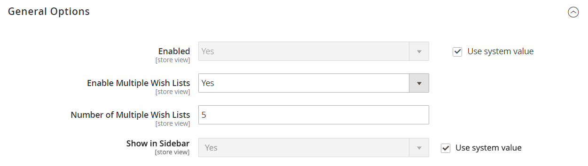
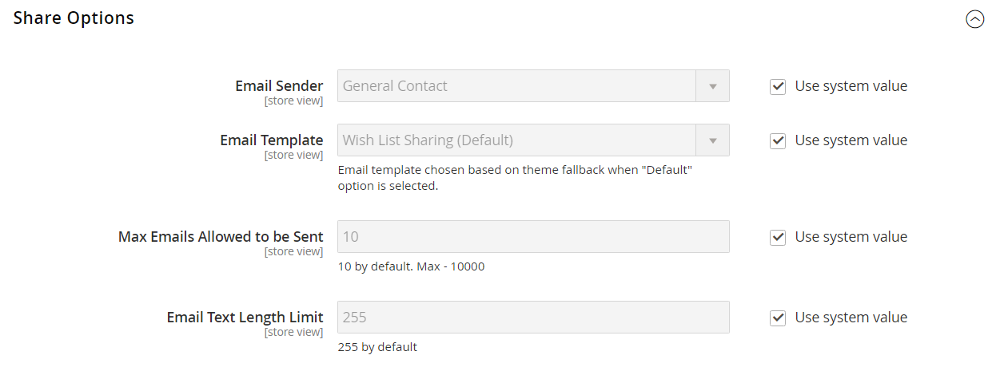

# [!UICONTROL Customers] > [!UICONTROL Wish List]

{{config}}

>[!NOTE]
>
>Uma lista de desejos permite que os clientes registrados criem suas próprias coleções de produtos que desejam comprar no futuro. As listas de desejos podem ser compartilhadas entre clientes.

## [!UICONTROL General Options]

<!-- zoom -->

<!--[General Options](https://experienceleague.adobe.com/en/docs/commerce-admin/stores-sales/shopper-tools/wish-lists/wishlist-configuration) -->

| Campo | [Escopo](../../getting-started/websites-stores-views.md#scope-settings) | Descrição |
|--- |--- |--- |
| [!UICONTROL Enabled] | Exibição da loja | Ativa o módulo da lista de desejos para sua loja. Opções: `Yes` / `No` |
| [!UICONTROL Show in Sidebar] | Exibição da loja | Especifica a visibilidade das listas de desejos na barra lateral.  Opções: `Yes` / `No` |
| [!UICONTROL Enable Multiple Wish Lists] | Exibição da loja |  (somente Adobe Commerce) Quando definido como `Yes`, permite que os clientes criem e mantenham várias listas de desejos. Opções: `Yes` / `No` |
| [!UICONTROL Number of Multiple Wish Lists] | Exibição da loja |  (somente Adobe Commerce) Se várias listas de desejos estiverem habilitadas, o determinará o número máximo de listas de desejos que os clientes podem ter associado à sua conta. |

{style="table-layout:auto"}

## [!UICONTROL Share Options]

<!-- zoom -->

<!-- [Share Options](https://experienceleague.adobe.com/en/docs/commerce-admin/stores-sales/shopper-tools/wish-lists/wishlist-configuration) -->

| Campo | [Escopo](../../getting-started/websites-stores-views.md#scope-settings) | Descrição |
|--- |--- |--- |
| [!UICONTROL Email Sender] | Exibição da loja | Determina o contato da loja que aparece como o remetente da mensagem enviada quando uma lista de desejos é compartilhada. Contato padrão: `General Contact` |
| [!UICONTROL Email Template] | Exibição da loja | Determina o modelo de email usado para a mensagem enviada quando uma lista de desejos é compartilhada. Modelo padrão: `Share Wishlist` |
| [!UICONTROL Max Emails Allowed to be Sent] | Exibição da loja | Determina o número máximo de emails que podem ser enviados em um lote. Definir um limite máximo pode ajudar a reduzir a carga no servidor. O número máximo permitido é 10.000. Valor padrão: `10` |
| [!UICONTROL Email Text Length Limit] | Exibição da loja | Determina o número máximo de caracteres que podem ser incluídos na mensagem. O número máximo permitido é 10.000. Valor padrão: `255` |

{style="table-layout:auto"}

## [!UICONTROL My Wish List Link]

<!-- zoom -->

<!--[My Wish List Link](https://experienceleague.adobe.com/en/docs/commerce-admin/stores-sales/shopper-tools/wish-lists/wishlist-configuration) -->

| Campo | [Escopo](../../getting-started/websites-stores-views.md#scope-settings) | Descrição |
|--- |--- |--- |
| [!UICONTROL Display Wish List Summary] | Site | Configura a exibição do Resumo da lista de desejos no painel da conta do cliente. Opções: `Display number of items in wish list` / `Display item quantities` |

{style="table-layout:auto"}
