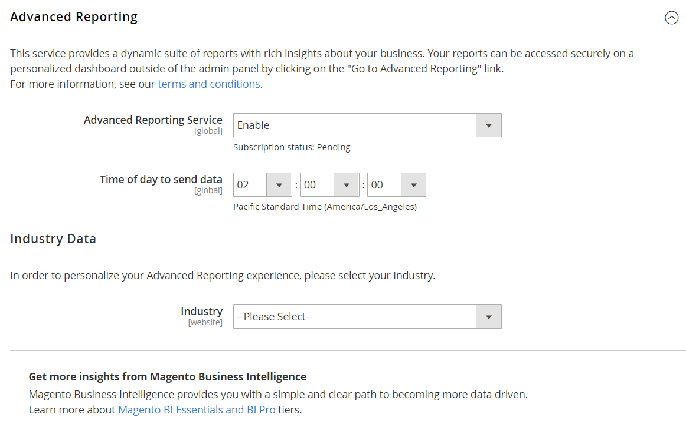

# [!UICONTROL General] > [!UICONTROL Advanced Reporting]

{{config}}

## [!UICONTROL Advanced Reporting]

_[!DNL Advanced Reporting]_&#x200B;é um serviço baseado em nuvem da plataforma [Adobe Commerce Intelligence](https://experienceleague.adobe.com/docs/commerce-business-intelligence/mbi/getting-started.html){:target="_blank"}. Para obter mais informações, consulte [Relatórios Avançados](https://experienceleague.adobe.com/docs/commerce-admin/start/reporting/business-intelligence.html#advanced-reporting){:target="_blank"} no_ Guia de Introdução _.

<!-- zoom -->

<!-- [Advanced Reporting](https://experienceleague.adobe.com/en/docs/commerce-admin/start/reporting/business-intelligence#advanced-reporting) -->

| Campo | [Escopo](../../getting-started/websites-stores-views.md#scope-settings) | Descrição |
|--- |--- |--- |
| [!UICONTROL Advanced Reporting Service] | Global | Habilita a integração do [!DNL Advanced Reporting] para a sua instalação do Commerce. |
| [!UICONTROL Industry] | Site | Identifica o setor de atividade para personalizar o [!DNL Advanced Reporting]. |
| [!UICONTROL Time of day to send data] | Global | Determina a hora de cada dia em que os dados do repositório são enviados para [!DNL Advanced Reporting]. A hora é baseada em um relógio de 24 horas e inclui os minutos, as horas e os segundos do fuso horário. |

{style="table-layout:auto"}
