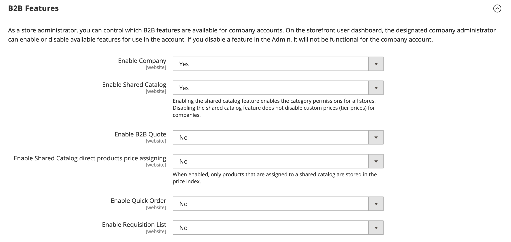

# [!UICONTROL General] > [!UICONTROL B2B Features]

{{b2b-feature}}

{{config}}

>[!TIP]
>
>Com a instalação e a habilitação do Adobe Commerce B2B, a experiência de compra pode ser personalizada com recursos específicos da empresa. O Adobe Commerce B2B é uma solução integrada que oferece suporte aos modelos B2B e B2C. Para obter mais informações sobre os recursos B2B, consulte a [_Guia do usuário B2B do Adobe Commerce_](https://experienceleague.adobe.com/docs/commerce-admin/b2b/introduction.html).

## [!UICONTROL B2B Features]

<!-- zoom -->

| Campo | [Escopo](../../getting-started/websites-stores-views.md#scope-settings) | Descrição |
|------- |----------------------------------------------------------------------- |------------ |
| [[!UICONTROL Enable Company]](../../b2b/account-companies.md) | Site | Quando ativado, o permite que os clientes gerenciem a atribuição da empresa no painel de conta e também ativa os recursos Catálogo compartilhado e Cotação B2B por padrão. Opções: `Yes` / `No` |
| [[!UICONTROL Enable Quick Order]](../../b2b/quick-order.md) | Site | Quando ativado, permite que os clientes e convidados façam pedidos rapidamente com base no SKU ou no nome do produto. Opções: `Yes` / `No` |
| [[!UICONTROL Enable Requisition List]](../../b2b/configure-requisition-lists.md) | Site | Quando ativado, permite que os clientes criem e gerenciem listas de requisições a partir do painel de instrumentos da conta. |

{style="table-layout:auto"}

<!-- zoom -->

Quando o recurso Empresa estiver ativado, campos adicionais estarão disponíveis para Catálogo Compartilhado e Cotação B2B.

| Campo | [Escopo](../../getting-started/websites-stores-views.md#scope-settings) | Descrição |
|------- |----------------------------------------------------------------------- |------------ |
| [[!UICONTROL Enable Shared Catalog]](../../b2b/catalog-shared.md) | Site | Quando habilitado, permite criar catálogos com curadoria e preços personalizados disponíveis globalmente ou limitados a empresas específicas. Opções: `Yes` / `No` |
| [!UICONTROL Enable Shared Catalog direct products price assigning] | Site | Quando a variável _[!UICONTROL Enable Shared Catalog]_o campo está definido como `Yes`, essa opção está disponível. Quando habilitado, somente os produtos atribuídos a um catálogo compartilhado são armazenados no índice de preços. Os produtos que não estão atribuídos ao catálogo compartilhado não são exibidos na loja. Opções: `Yes` / `No` |
| [[!UICONTROL Enable B2B Quote]](../../b2b/configure-quotes.md) | Site | Quando ativado, permite que os compradores da empresa enviem uma solicitação de cotação do carrinho de compras. Opções: `Yes` / `No` |

{style="table-layout:auto"}

### [!UICONTROL Default B2B Payment Methods]

<!-- zoom -->

| Campo | [Escopo](../../getting-started/websites-stores-views.md#scope-settings) | Descrição |
|------- |----------------------------------------------------------------------- |------------ |
| [!UICONTROL Applicable Payment Methods] | Global | Determina a seleção dos métodos de pagamento disponíveis para compradores B2B. Opções: `All Payment Methods` / `Specific Payment Methods` |
| [!UICONTROL Payment Methods] | Global | Especifica cada método de pagamento disponível para compradores B2B. |

{style="table-layout:auto"}

### [!UICONTROL Default B2B Shipping Methods]

<!-- zoom -->

| Campo | [Escopo](../../getting-started/websites-stores-views.md#scope-settings) | Descrição |
|------- |----------------------------------------------------------------------- |------------ |
| [!UICONTROL Applicable Shipping Methods] | Global | Determina a seleção dos métodos de envio disponíveis por padrão para compradores B2B. Opções: `All Shipping Methods` / `Specific Shipping Methods` |
| [!UICONTROL Shipping Methods] | Global | Especifica cada método de envio disponível por padrão para compradores B2B.  **_Nota:_**Também é possível limitar os métodos de envio para um [conta da empresa](../../b2b/account-companies.md). |

{style="table-layout:auto"}

## [!UICONTROL Order Approval Configuration]

<!-- zoom -->

| Campo | [Escopo](../../getting-started/websites-stores-views.md#scope-settings) | Descrição |
|------- |----------------------------------------------------------------------- |------------ |
| [[!UICONTROL Enable Purchase Orders]](../../stores-purchase/purchase-order.md) | Site | Quando habilitado, permite que as empresas criem ordens de compra. Opções: `Yes` / `No` |

{style="table-layout:auto"}

