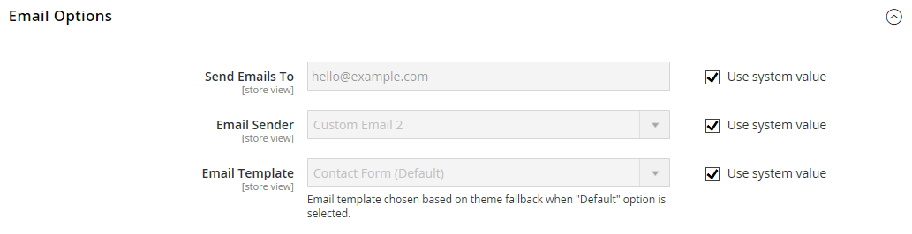

# [!UICONTROL General] > [!UICONTROL Contacts]

{{config}}

## [!UICONTROL Contact Us]

<!-- zoom -->

<!-- [Contact Us](https://experienceleague.adobe.com/en/docs/commerce-admin/start/setup/store-details#contact-us-form) -->

| Campo | [Escopo](../../getting-started/websites-stores-views.md#scope-settings) | Descrição |
|--- |--- |--- |
| [!UICONTROL Enable Contact Us] | Exibição da loja | Habilita a página [_Fale Conosco_](../../getting-started/store-details.md#contact-us-form) e coloca um link no rodapé. |

{style="table-layout:auto"}

## [!UICONTROL Email Options]

<!-- zoom -->

<!-- [Email Options](https://experienceleague.adobe.com/en/docs/commerce-admin/start/setup/store-details#contact-us-form) -->

| Campo | [Escopo](../../getting-started/websites-stores-views.md#scope-settings) | Descrição |
|--- |--- |--- |
| [!UICONTROL Send Emails To] | Exibição da loja | Identifica o endereço de email que recebe toda a resposta da página _Fale Conosco_ |
| [!UICONTROL Email Sender] | Exibição da loja | Identifica o contato de armazenamento usado para todas as respostas a consultas de email da página _Fale Conosco_. Remetente padrão: `Custom Email 2` |
| [!UICONTROL Email Template] | Exibição da loja | Especifica o modelo a ser usado como base para todas as respostas às consultas de email da página _Fale Conosco_. Modelo padrão: `Contact Form` |

{style="table-layout:auto"}
