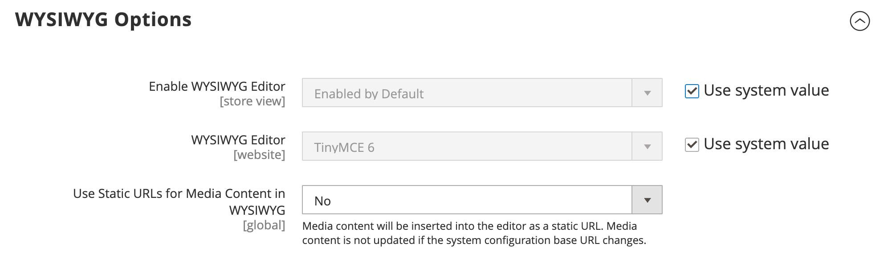
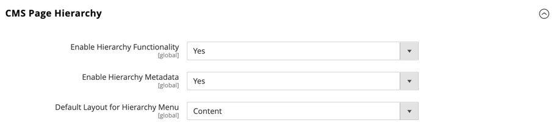

# [!UICONTROL General] > [!UICONTROL Content Management]

{{config}}

## [!UICONTROL WYSIWYG Options]

<!-- zoom -->

<!-- [WYSIWYG Options](https://experienceleague.adobe.com/en/docs/commerce-admin/content-design/wysiwyg/editor) -->

| Campo | [Escopo](../../getting-started/websites-stores-views.md#scope-settings) | Descrição |
|--- |--- |--- |
| [!UICONTROL Enable WYSIWYG Editor] | Exibição da loja | Determina se o editor está habilitado para o armazenamento. Opções: Ativado por padrão/Desativado por padrão/Desativado completamente |
| [!UICONTROL WYSIWYG Editor] | Site | Determina a versão do editor TinyMCE usada para o editor do WYSIWYG. Opções:  **`TinyMCE 5`**- (Padrão) Usa o TinyMCE versão 5 como o editor padrão do WYSIWYG.  _ **&#x200B; Observação:**&#x200B;_uma atualização da biblioteca TinyMCE 5.10 no Adobe Commerce e no Magento Open Source 2.4.5 resolve uma vulnerabilidade que permitia a execução arbitrária do JavaScript ao atualizar uma imagem ou um link usando alguns tipos de URLs. O TinyMCE 3 foi descontinuado na versão 2.4.0 e removido na versão 2.4.3. O TinyMCE 4 foi removido na versão 2.4.4. |
| [!UICONTROL Use Static URLs for Media Content in WYSIWYG] | Global | Determina se as [URLs estáticas](../../content-design/catalog-urls-dynamic-media.md) são usadas para conteúdo de mídia referenciado do editor do WYSIWYG. A configuração se aplica a todos os locais onde o editor do WYSIWYG está disponível, incluindo produtos, categorias, páginas e blocos. Opções:  **`Yes`**- Usa URLs estáticas para conteúdo de mídia inserido com o editor do WYSIWYG. As URLs estáticas são absolutas e quebradas se a [URL de base](../../stores-purchase/store-urls.md) do armazenamento for alterada. **`No`** (Padrão) - Usa URLs dinâmicas para conteúdo de mídia inserido com o editor do WYSIWYG, com base na diretiva `{{media url="..."}}`. Os URLs dinâmicos são relativos e não se quebram se o URL de base do armazenamento for alterado. |

{style="table-layout:auto"}

## [!UICONTROL CMS Page Hierarchy]

{{ee-feature}}

<!-- zoom -->

<!--[CMS Page Hierarchy](https://experienceleague.adobe.com/en/docs/commerce-admin/content-design/elements/pages/page-hierarchy) -->

| Campo | [Escopo](../../getting-started/websites-stores-views.md#scope-settings) | Descrição |
|--- |--- |--- |
| [!UICONTROL Enable Hierarchy Functionality] | Global | Ativa o uso da hierarquia de páginas para suas páginas de conteúdo. Opções: `Yes` / `No` |
| [!UICONTROL Enable Hierarchy Metadata] | Global | Oferece a capacidade de associar metadados a páginas na hierarquia. Opções: `Yes` / `No` |
| [!UICONTROL Default Layout for Hierarchy Menu] | Global | Determina o estilo de menu padrão. Opções: `Content` / `Left Column` / `Right Column` |

{style="table-layout:auto"}

## [!UICONTROL Advanced Content Tools]

<!-- zoom -->

<!-- [Advanced Content Tools](https://experienceleague.adobe.com/en/docs/commerce-admin/page-builder/walkthrough/3-catalog-content) -->

| Campo | [Escopo](../../getting-started/websites-stores-views.md#scope-settings) | Descrição |
|--- |--- |--- |
| [!UICONTROL Enable Page Builder] | Global | Determina se as ferramentas de conteúdo avançado do [!DNL Page Builder] estão disponíveis. Opções:  **`Yes`**- O espaço de trabalho [!DNL Page Builder] aparece na seção Conteúdo de páginas, blocos, produtos e categorias. **`No`** - As ferramentas de edição padrão do CMS aparecem na seção _[!UICONTROL Content]_&#x200B;de páginas, blocos, produtos e categorias. |
| [!UICONTROL Enable Page Builder Content Preview] | Global | Determina se as visualizações de conteúdo do [!DNL Page Builder] estão habilitadas para produtos e categorias. Opções: `Yes` / `No`  **_Nota:_** Isso é definido como `Yes` por padrão, mas desativar a visualização pode evitar quaisquer problemas de desempenho resultantes do carregamento de visualizações em um formulário de produto ou categoria. |
| [!UICONTROL Google Maps API Key] | Global | A chave de API [!DNL Google Maps] da sua conta do Google. |
| [!UICONTROL Test Key] |  | Valida a chave de API [!DNL Google Maps]. |
| [!UICONTROL Google Maps Style] | Global | Cole o código JSON de estilo [!DNL Google Maps] aqui para alterar a aparência do tipo de conteúdo do Mapa. |
| [!UICONTROL Default Column Grid Size] | Global | Determina o número padrão de colunas na grade [!DNL Page Builder]. |
| [!UICONTROL Maximum Column Grid Size] | Global | Determina o número máximo de colunas na grade [!DNL Page Builder]. |

{style="table-layout:auto"}

>[!TIP]
>
>O Page Builder facilita a criação de páginas ricas em conteúdo com layouts personalizados que aprimoram a sua narrativa visual e impulsionam a participação e a fidelidade do cliente. Esses recursos foram projetados para melhorar a qualidade e reduzir o tempo e o custo de produção de páginas personalizadas. Para obter mais informações sobre esses recursos e como usá-los para criar conteúdo envolvente para sua loja Adobe Commerce ou Magento Open Source, consulte o [_Guia do Usuário do Page Builder_](../../page-builder/guide-overview.md).
