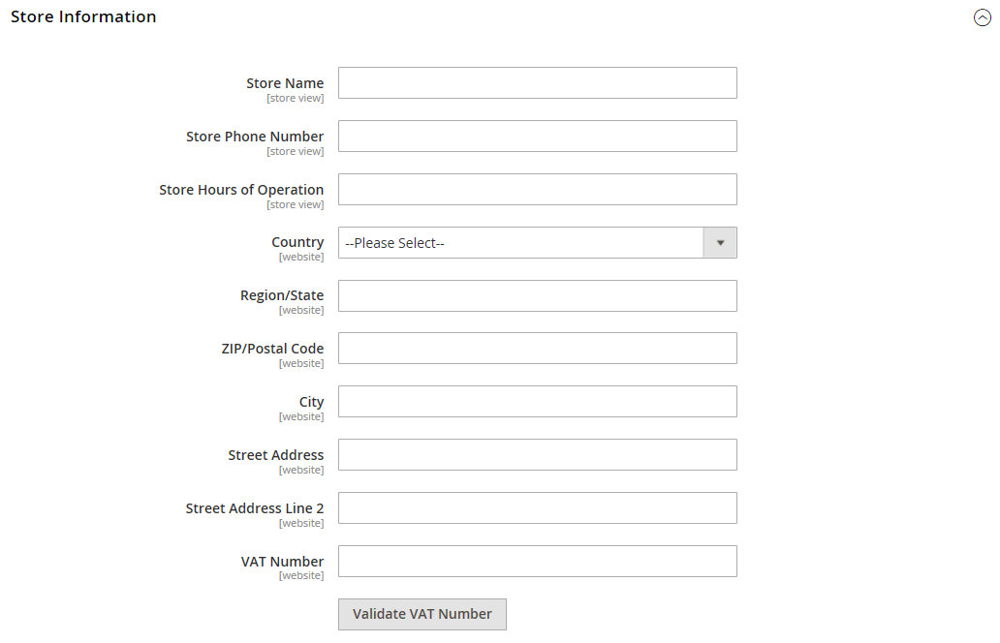

# [!UICONTROL General] > [!UICONTROL General]

{{config}}

## [!UICONTROL Country Options]

Consulte [Opções de País](../../getting-started/store-details.md#country-options) para obter mais detalhes sobre esses campos e opções de configuração.

<!-- zoom -->

| Campo | [Escopo](../../getting-started/websites-stores-views.md#scope-settings) | Descrição |
|--- |--- |--- |
| [!UICONTROL Default Country] | Exibição da loja | O país onde sua loja está localizada. |
| [!UICONTROL Allow Countries] | Site | Os países onde você aceita pedidos. |
| [!UICONTROL Zip/Postal Code is Optional for] | Global | Países que não exigem CEP no endereço para entrega. |
| [!UICONTROL European Union Countries] | Global | Países membros da União Europeia. |
| [!UICONTROL Top Destinations] | Exibição da loja | Os principais países para os quais você direciona vendas. |

{style="table-layout:auto"}

## [!UICONTROL State Options]

Consulte [Opções de Estado](../../getting-started/store-details.md#state-options) para obter mais detalhes sobre esses campos e opções de configuração.

<!-- zoom -->

| Campo | [Escopo](../../getting-started/websites-stores-views.md#scope-settings) | Descrição |
|--- |--- |--- |
| [!UICONTROL State is required for] | Global | Os países (onde você faz negócios) que exigem que uma região ou um estado seja incluído no endereço postal. |
| [!UICONTROL Allow to Choose State if It is Optional for Country] | Global | Para países onde não é obrigatório, determina se o campo _Região/Estado_ está incluído no endereço postal do cliente.   **`Yes`**- Inclui o campo _Região/Estado_ no endereço do cliente, mesmo se não for exigido pelo país. **`No`** - Omite o campo Região/Estado do endereço do cliente se não for exigido pelo país. |

{style="table-layout:auto"}

## [!UICONTROL Locale Options]

Consulte [Opções de Local](../../getting-started/store-details.md#locale-options) para obter mais detalhes sobre esses campos e opções de configuração.

<!-- zoom -->

| Campo | [Escopo](../../getting-started/websites-stores-views.md#scope-settings) | Descrição |
|--- |--- |--- |
| [!UICONTROL Timezone] | Site | O fuso horário do mercado primário que é atendido pelo site. Normalmente, o fuso horário é o mesmo usado no local físico da sua empresa. |
| [!UICONTROL Locale] | Exibição da loja | O idioma, a moeda e o sistema de medição usado no mercado distribuído pela exibição da loja. |
| [!UICONTROL Weight Unit] | Exibição da loja | A unidade de medida normalmente usada para remessas do local. Opções: `lbs` / `kgs` |
| [!UICONTROL First Day of Week] | Exibição da loja | O dia considerado como o primeiro dia da semana no mercado distribuído pela exibição da loja. |
| [!UICONTROL Weekend Days] | Exibição da loja | Os dias que caem no fim de semana no mercado atendido pela visualização da loja. |

{style="table-layout:auto"}

## [!UICONTROL Website Restrictions]

{{ee-feature}}

<!-- zoom -->

Para obter mais informações sobre como alterar essas configurações, consulte [Restrições de acesso](../../merchandising-promotions/event-configure.md#access-restrictions) no _Guia de merchandising e promoções_.

| Campo | [Escopo](../../getting-started/websites-stores-views.md#scope-settings) | Descrição |
|--- |--- |--- |
| [!UICONTROL Access Restriction] | Site | Determina se o site está operando no modo restrito.   **`Yes`**- O acesso ao site é restrito da maneira definida nos campos abaixo. **`No`** - As restrições estão desabilitadas e as configurações a seguir não têm efeito. |
| [!UICONTROL Restriction Mode] | Site | Determina o tipo de restrição de acesso que se aplica ao site.   **`Website Closed`**- Todo o acesso à loja é restrito, e as URLs da loja são temporariamente redirecionadas para a página de aterrissagem. Essa configuração pode ser útil durante a manutenção do site ou antes da inicialização. **`Private Sales: Login Only`** - Somente clientes registrados podem fazer logon para acessar a loja. Todos os URLs de vitrine são temporariamente redirecionados para a landing page especificada ou para o formulário de logon. Os usuários não podem criar uma conta neste modo. **`Private Sales: Login and Register`**- Os usuários devem fazer logon para acessar a loja. Todas as URLs da loja são temporariamente redirecionadas para o formulário de logon até que o usuário faça logon. Os usuários podem se registrar para uma conta enquanto o site estiver nesse modo. |
| [!UICONTROL Startup Page] | Exibição da loja | Quando o site está no modo de Vendas Particulares, esta configuração determina a página que aparece até que o cliente faça logon.    **`To login form`**- Os usuários são redirecionados para o formulário de logon até que façam logon. **`To landing page`** - Os usuários são redirecionados para a página estática especificada abaixo até que façam logon.   **_Importante!_**Inclua um link para a página de logon da página de aterrissagem especificada, para que os clientes possam fazer logon para acessar o site completo. |
| [!UICONTROL Landing Page] | Exibição da loja | Determina a primeira página que aparece quando o site está no modo de Vendas privadas. |
| [!UICONTROL HTTP Response] | Site | Determina a resposta HTTP que é enviada quando o site é fechado e uma conexão é tentada por um bot, crawler ou spider.   **`503 Service unavailable`**- A página não está disponível, mas a aranha não deve atualizar o índice. **`200 OK`** - A página de aterrissagem está correta e deve ser tratada pela aranha como a única página do site. |
| [!UICONTROL Enable Autocomplete on login/forgot password forms] | Site | Determina se os campos nos formulários _Logon_ e _Esqueceu a senha_ são preenchidos automaticamente a partir de entradas anteriores. Opções: `Yes` / `No` |

{style="table-layout:auto"}

## [!UICONTROL Store Information]

<!-- zoom -->

Para obter mais informações sobre como alterar essas configurações, consulte [Armazenar Informações](../../getting-started/store-details.md) no _Guia de Introdução_.

| Campo | [Escopo](../../getting-started/websites-stores-views.md#scope-settings) | Descrição |
|--- |--- |--- |
| [!UICONTROL Store Name] | Exibição da loja | O nome da loja associada à exibição de loja. |
| [!UICONTROL Store Phone Number] | Exibição da loja | O número de telefone principal da loja (associado à exibição de loja) está aberto para negócios. Por exemplo: Seg - sexta-feira, 9-5, sáb 9-meio-dia PST |
| País | Site | O país da empresa que opera o site. |
| [!UICONTROL Region/State] | Site | A região ou o estado da empresa que opera o site. |
| [!UICONTROL ZIP/Postal Code] | Site | O CEP da empresa que opera o site. |
| [!UICONTROL City] | Site | A localização da cidade da empresa que opera o site. |
| [!UICONTROL Street Address] | Site | A rua ou o endereço para correspondência da empresa que opera o site. |
| [!UICONTROL Street Address Line 2|]Site | A segunda linha do endereço comercial, se necessário. |
| [!UICONTROL VAT Number] | Site | O número do Imposto sobre o Valor Agregado da empresa proprietária da instalação do Commerce, se aplicável. |
| [!UICONTROL Validate VAT Number] |  | Verifica o número de identificação do Imposto sobre Valor Agregado. |

{style="table-layout:auto"}

## [!UICONTROL Single-Store Mode]

<!-- zoom -->

Para obter mais informações sobre como alterar essas configurações, consulte [Modo de armazenamento único](../../getting-started/websites-stores-views.md#single-store-mode) no _Guia de Introdução_.

| Campo | [Escopo](../../getting-started/websites-stores-views.md#scope-settings) | Descrição |
|--- |--- |--- |
| [!UICONTROL Enable Single-Store Mode] | Global | Quando habilitado para instalações de repositório único, oculta a caixa Escopo de configuração e os rótulos de campo relacionados Opções: `Yes` / `No`  **_Observação:_**O modo de repositório único é ignorado para armazenamentos com mais de um modo de exibição.  Habilitar o modo de armazenamento único copiará todos os dados específicos do catálogo e do armazenamento de produtos da exibição de armazenamento padrão para o escopo de todas as exibições de armazenamento. Ele só copiará os dados do catálogo e do produto se a loja tiver apenas uma loja. Se a loja tiver uma loja desativada e uma loja ativada, ela não copiará o catálogo e os dados do produto.  A habilitação do modo de repositório único ignora as definições de configuração específicas do repositório para dados específicos do conteúdo. Em vez disso, ele usa as definições de configuração definidas no escopo de nível global para garantir a consistência entre a interface de usuário do administrador e a loja. |

{style="table-layout:auto"}

## [!UICONTROL Data Services]

<!-- zoom -->

| Campo | [Escopo](../../getting-started/websites-stores-views.md#scope-settings) | Descrição |
|--- |--- |--- |
| [!UICONTROL Commerce Events Enabled] | Global | Esta configuração é desativada por padrão se você for um cliente da área de saúde e tiver instalado a extensão [HIPAA](https://experienceleague.adobe.com/en/docs/commerce/data-connection/hipaa-readiness) do Data Services. Como resultado, os dados do evento da loja usados pelo Live Search e pelas Recomendações de produto não são mais capturados. Isso ocorre porque os dados do evento da loja são gerados no lado do cliente. Para continuar capturando e enviando dados do evento da loja para uso pelos serviços do [Live Search](https://experienceleague.adobe.com/en/docs/commerce/live-search/overview) e do [Product Recommendations](https://experienceleague.adobe.com/en/docs/commerce/product-recommendations/guide-overview), defina o **Commerce Events Enabled** como `Yes`. |

{style="table-layout:auto"}
