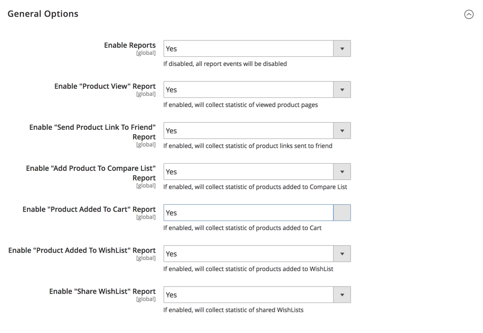

# [!UICONTROL General] > [!UICONTROL Reports]

{{config}}

## [!UICONTROL Dashboard]

<!-- zoom -->

<!-- [Dashboard](https://docs.magento.com/user-guide/stores/admin-dashboard.html) -->

| Campo | [Escopo](../../getting-started/websites-stores-views.md#scope-settings) | Descrição |
|--- |--- |--- |
| [!UICONTROL Year-to-Date Starts] | Global | Especifica o mês e o dia em que os cálculos do acumulado do ano são baseados. |
| [!UICONTROL Current Month Starts] | Global | Especifica o dia do mês usado nos cálculos para marcar o início do mês atual. |

{style="table-layout:auto"}

## [!UICONTROL General Options]

<!-- zoom -->

>[!NOTE]
>
>Se suas funções empresariais não exigirem relatórios, recomendamos desativar a funcionalidade de relatórios para aprimorar o desempenho da loja. No entanto, alguns recursos, como segmentos dinâmicos de clientes, dependem dos dados do relatório para funcionar corretamente.

| Campo | [Escopo](../../getting-started/websites-stores-views.md#scope-settings) | Descrição |
|--- |--- |--- |
| [!UICONTROL Enable Reports] | Global | Ativa ou desativa eventos de relatório. |
| [!UICONTROL Enable "Product View" Report] | Global | Ativa ou desativa a coleta de estatísticas das páginas de produtos visualizadas. |
| [!UICONTROL Enable "Send Product Link To Friend" Report] | Global | Habilita ou desabilita a coleção de estatísticas de links de produtos enviados para amigos. |
| [!UICONTROL Enable "Add Product To Compare List" Report] | Global | Habilita ou desabilita a coleção de estatísticas de produtos adicionados à Lista de Comparação. |
| [!UICONTROL Enable "Product Added To Cart" Report] | Global | Ativa ou desativa a coleta de estatísticas de produtos adicionados ao carrinho. |
| [!UICONTROL Enable "Product Added To Wishlist" Report] | Global | Habilita ou desabilita a coleção de estatísticas de produtos adicionados à lista de desejos. |
| [!UICONTROL Enable "Share WishList" Report] | Global | Habilita ou desabilita a coleção de estatísticas de listas de desejos compartilhadas. |

{style="table-layout:auto"}
