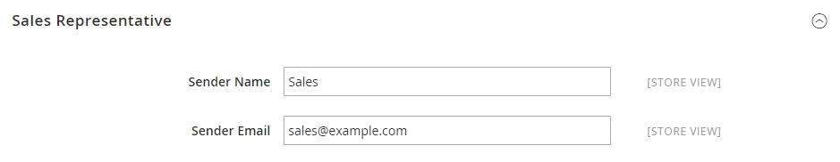
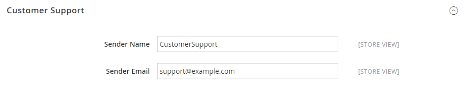
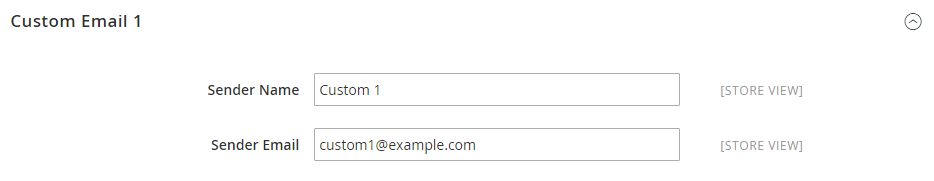

# [!UICONTROL General] > [!UICONTROL Store Email Addresses]

{{config}}

Consulte [Armazenar endereços de email](../../getting-started/store-details.md#store-email-addresses) para obter informações detalhadas sobre esses campos e opções de configuração.

## [!UICONTROL General]

[!BADGE Somente SaaS]{type=Positive url="https://experienceleague.adobe.com/en/docs/commerce/user-guides/product-solutions" tooltip="Aplicável somente a projetos do Adobe Commerce as a Cloud Service (infraestrutura SaaS gerenciada pela Adobe)."}

<!-- zoom -->

| Campo | [Escopo](../../getting-started/websites-stores-views.md#scope-settings) | Descrição |
|--- |--- |--- |
| [!UICONTROL Storefront Base URL] | Exibição da loja | O URL base que será usado para criar links incluídos em emails voltados para o cliente. O URL deve terminar com uma barra. Por exemplo, `https://www.example.com/`. |

{style="table-layout:auto"}

## [!UICONTROL General Contact]

<!-- zoom -->

| Campo | [Escopo](../../getting-started/websites-stores-views.md#scope-settings) | Descrição |
|--- |--- |--- |
| [!UICONTROL Sender Name] | Exibição da loja | O nome que aparece como remetente do email enviado pela identidade `General Contact`. |
| [!UICONTROL Sender Email] | Exibição da loja | O endereço de email associado à identidade `General Contact`. No Adobe Commerce as a Cloud Service, crie um tíquete de suporte para alterar o endereço de email. |

{style="table-layout:auto"}

## [!UICONTROL Sales Representative]

<!-- zoom -->

| Campo | [Escopo](../../getting-started/websites-stores-views.md#scope-settings) | Descrição |
|--- |--- |--- |
| [!UICONTROL Sender Name] | Exibição da loja | O nome que aparece como remetente do email enviado pela identidade `Sales Representative`. |
| [!UICONTROL Sender Email] | Exibição da loja | O endereço de email associado à identidade `Sales Representative`.  No Adobe Commerce as a Cloud Service, crie um tíquete de suporte para alterar o endereço de email. |

{style="table-layout:auto"}

## [!UICONTROL Customer Support]

<!-- zoom -->

| Campo | [Escopo](../../getting-started/websites-stores-views.md#scope-settings) | Descrição |
|--- |--- |--- |
| [!UICONTROL Sender Name] | Exibição da loja | O nome que aparece como remetente do email enviado pela identidade `Customer Support`. |
| [!UICONTROL Sender Email] | Exibição da loja | O endereço de email associado à identidade `Customer Support`.  No Adobe Commerce as a Cloud Service, crie um tíquete de suporte para alterar o endereço de email. |

{style="table-layout:auto"}

## E-mail personalizado 1

<!-- zoom -->

| Campo | [Escopo](../../getting-started/websites-stores-views.md#scope-settings) | Descrição |
|--- |--- |--- |
| [!UICONTROL Sender Name] | Exibição da loja | O nome que aparece como remetente do email enviado pela identidade `Custom 1`. |
| [!UICONTROL Sender Email] | Exibição da loja | O endereço de email associado à identidade `Custom 1`.  No Adobe Commerce as a Cloud Service, crie um tíquete de suporte para alterar o endereço de email. |

{style="table-layout:auto"}

## Email Personalizado 2

<!-- zoom -->

| Campo | [Escopo](../../getting-started/websites-stores-views.md#scope-settings) | Descrição |
|--- |--- |--- |
| [!UICONTROL Sender Name] | Exibição da loja | O nome que aparece como remetente do email enviado pela identidade `Custom 2`. |
| [!UICONTROL Sender Email] | Exibição da loja | O endereço de email associado à identidade `Custom 2`.  No Adobe Commerce as a Cloud Service, crie um tíquete de suporte para alterar o endereço de email. |

{style="table-layout:auto"}
