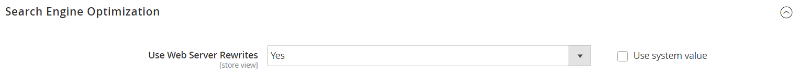

# [!UICONTROL General] > [!UICONTROL Web]

{{config}}

## [!UICONTROL URL Options]

<!-- zoom -->

<!-- [URL Options configuration settings](https://docs.magento.com/user-guide/stores/store-urls.html) -->

| Campo | Escopo | Descrição |
|  ---  |  ---  |  ---  |
| [!UICONTROL Add Store Code to URLs] | Global | Se as Substituições de Servidor Web estiverem ativadas, insere o Código de armazenamento da exibição atual no URL. Opções: `Yes` / `No`.  Quando este campo é definido como `Yes`, você deve incluir códigos de armazenamento nos URLs do navegador para garantir que as substituições de URL sejam mapeadas corretamente e que todas as páginas sejam abertas com êxito. Isso evita _Página 404 Não Encontrada_ erros. |
| [!UICONTROL Auto-redirect to Base URL] | Exibição da loja | (Para configurações de loja única) Se houver um link quebrado em seu site, o redireciona o tráfego para o URL base, em vez de para uma página com uma mensagem &quot;Página 404 não encontrada&quot;. Opções:` No` / `Yes (302 Found)` / `Yes (301 Moved Permanently)`  **_Importante:_**Não use o redirecionamento automático para o URL de base para configurações de várias lojas. |
| [!UICONTROL Catalog media URL format] | Global | Define o [Formato de URL](../../catalog/catalog-urls.md) atribuídos a produtos e categorias. Opções: o hash exclusivo por variante de imagem (modo Herdado) define o nome de arquivo convertido como um valor de hash exclusivo. A otimização de imagem com base em parâmetros de consulta define [otimização de imagem](../../content-design/media-gallery-image-optimization.md) processo dependendo dos parâmetros de consulta. |

{:style=&quot;table-layout:auto&quot;}

## [!UICONTROL Search Engine Optimization]

<!-- zoom -->

<!-- [Search Engine Optimization configuration settings](https://docs.magento.com/user-guide/marketing/url-rewrite.html) -->

| Campo | [Escopo](../../getting-started/websites-stores-views.md#scope-settings) | Descrição |
|--- |--- |--- |
| [!UICONTROL Use Web Server Rewrites] | Exibição da loja | Os sistemas baseados em PHP geralmente incluem um arquivo chamado `index.php` na pasta raiz. Por padrão, o nome do arquivo aparece no URL logo após o nome da pasta raiz. Quando isso está ativado, o sistema omite `index.php` do URL. Essa prática recomendada de usabilidade torna cada URL mais conciso e não tem impacto no desempenho ou na classificação do site. Opções: `Yes` / `No` |

{:style=&quot;table-layout:auto&quot;}

## [!UICONTROL Base URLs]

<!-- zoom -->

<!-- [Base URLS configuration settings](https://docs.magento.com/user-guide/stores/store-urls.html) -->

| Campo | [Escopo](../../getting-started/websites-stores-views.md#scope-settings) | Descrição |
|--- |--- |--- |
| [!UICONTROL Base URL] | Exibição da loja | O endereço completo da pasta raiz de Commerce que não está sendo executada em um canal criptografado (SSL). O URL deve terminar com uma barra. |
| [!UICONTROL Base Link URL] | Exibição da loja | Uma tag de marcação usada como um espaço reservado para o URL de base. |
| [!UICONTROL Base URL for Static View Files] | Exibição da loja | Um caminho que aponta para o local dos arquivos estáticos usados pelo tema, como css, fontes, imagens e JavaScript. Um espaço reservado é usado para representar o URL base. Se a sua instalação do Commerce tiver vários sites com a mesma estrutura de pastas, você poderá ter uma pasta diferente para cada site. Defina o escopo de configuração para o site correto antes de inserir o URL base para arquivos de visualização estáticos. Você também pode especificar uma pasta fora da instalação do Commerce. |
| [!UICONTROL Base URL for User Media Files] | Exibição da loja | Um caminho que aponta para o local de imagens de catálogo e outros arquivos de mídia. Um espaço reservado é usado para representar o URL base. Se a sua instalação do Commerce tiver vários sites com a mesma estrutura de pastas, você poderá ter uma pasta de mídia diferente para cada um. Isso lhe dá a capacidade de fazer backup e reverter cada pasta de mídia separadamente. Você também pode especificar uma pasta de mídia fora da instalação do Commerce. |

{:style=&quot;table-layout:auto&quot;}

## [!UICONTROL Base URLs (Secure)]

<!-- zoom -->

<!-- [Base URLs (Secure) configuration settings](https://docs.magento.com/user-guide/stores/store-urls.html) -->

| Campo | [Escopo](../../getting-started/websites-stores-views.md#scope-settings) | Descrição |
|--- |--- |--- |
| [!UICONTROL Secure Base URL] | Exibição da loja | O endereço completo da pasta raiz de Commerce fornecida com o protocolo SSL/TLS criptografado. O URL deve terminar com uma barra. |
| [!UICONTROL Secure Base Link URL] | Exibição da loja | Uma tag de marcação usada como um espaço reservado para o URL base que é executado em um canal seguro. |
| [!UICONTROL Secure Base URL for Static View Files] | Exibição da loja | Uma tag de marcação que aponta para o local de arquivos estáticos, como CSS, fontes, imagens e JavaScript usados pelo tema. Os arquivos podem estar em um canal não seguro ou seguro. Se a sua instalação do Commerce tiver vários sites com a mesma estrutura de pastas, você poderá ter uma pasta diferente para cada site. Defina o escopo de configuração para o site correto antes de inserir o URL base para arquivos de visualização estáticos. Você também pode especificar uma pasta fora da instalação do Commerce. |
| [!UICONTROL Secure Base URL for User Media Files] | Exibição da loja | Um caminho que aponta para o local de imagens de catálogo e outros arquivos de mídia. Os arquivos podem estar em um canal não seguro ou seguro. Um espaço reservado é usado para representar o URL base. Se a sua instalação do Commerce tiver vários sites com a mesma estrutura de pastas, você poderá ter uma pasta de mídia diferente para cada um. Isso lhe dá a capacidade de fazer backup e reverter cada pasta de mídia separadamente. Você também pode especificar uma pasta de mídia fora da instalação do Commerce. |
| [!UICONTROL Use Secure URLs on Storefront] | Exibição da loja | Se o domínio tiver um certificado de segurança, você pode optar por executar a loja com ou sem criptografia SSL. Opções: **`Yes`**- Os URLs de armazenamento começam com `https` para indicar que a página é entregue com protocolo criptografado e seguro. **`No`** - Os URLs de armazenamento começam com `http` para indicar que a página é entregue sem protocolo seguro. |
| [!UICONTROL Use Secure URLs in Admin] | Global | Se o domínio tiver um certificado de segurança, você poderá optar por executar o Administrador da loja, com ou sem criptografia SSL. Opções:  **`Yes`**- URLs de administrador começam com `https` para indicar que a página é entregue com protocolo criptografado e seguro. **`No`** - URLs de administrador começam com `http` para indicar que a página é entregue sem protocolo seguro.  Quando URLs seguros são ativados para o armazenamento e para o Administrador, dois campos adicionais aparecem para habilitar e configurar `HSTS`. |
| [!UICONTROL Enable HTTP Strict Transport Security (HSTS)] | Exibição da loja | Quando ativado, [`HSTS`][1] O fornece uma medida de segurança contra ataques do tipo &quot;man in the middle&quot; e impede que os usuários substituam a mensagem &quot;invalid certificate&quot;. Opções: `Yes` / `No` |
| [!UICONTROL Upgrade Insecure Requests] | Exibição da loja | Quando ativado, converte informações não seguras (`HTTP`) solicitações recebidas do navegador para o (`HTTPS`). Opções: `Yes` / `No` |
| [!UICONTROL Offloader Header] | Global | Especifica o `offloader_header` na configuração do servidor para identificar o protocolo entre o cliente e o balanceador de carga. A maioria das instalações do Commerce usa o valor padrão, `X-Forwarded-Proto` (XFP) para identificar o protocolo como `HTTP` ou `HTTPS`. |

{:style=&quot;table-layout:auto&quot;}

## [!UICONTROL Default Pages]

<!-- zoom -->

<!-- [Default Pages configuration settings](https://docs.magento.com/user-guide/cms/pages-default.html) -->

| Campo | [Escopo](../../getting-started/websites-stores-views.md#scope-settings) | Descrição |
|--- |--- |--- |
| [!UICONTROL Default Web URL] | Exibição da loja | Indica a landing page associada ao URL base. Por padrão, ela é definida como &quot;cms&quot; para indicar uma página do sistema de gerenciamento de conteúdo (CMS) do Commerce. Você também pode usar um tipo diferente de página de aterrissagem, como um blog. Por exemplo, se um blog estiver instalado no servidor em `magento/blog`, você pode inserir o nome da pasta &quot;blog&quot; como um caminho relativo para a seleção de páginas. |
| [!UICONTROL CMS Home Page] | Exibição da loja | Para escolher a home page da loja, basta selecionar a página CMS na lista. Por padrão, a Página inicial do CMS lista toda a seleção de páginas do CMS disponíveis para sua loja. |
| [!UICONTROL Default No-route URL] | Exibição da loja | Contém o URL da página padrão que você deseja que apareça quando um `404 Page not Found` ocorre um erro. O valor padrão é `cms/noroute/index`. |
| [!UICONTROL CMS No Route Page] | Exibição da loja | Identifica uma página CMS específica que você deseja que apareça quando ocorrer um erro 404 Página não encontrada. A página padrão é 404 Não encontrado. |
| [!UICONTROL CMS No Cookies Page] | Exibição da loja | Identifica uma página CMS específica que aparece quando os cookies não estão ativados para o navegador. A página explica por que os cookies são usados e como ativá-los para cada navegador. A página padrão é Ativar cookies. |
| [!UICONTROL Show Breadcrumbs for CMS Pages] | Exibição da loja | Determina se uma trilha de navegação estrutural aparece em todas as páginas do CMS no catálogo. Opções: `Yes` / `No` |

{:style=&quot;table-layout:auto&quot;}

## [!UICONTROL Default Layouts]

<!-- zoom -->

<!--[Default Layouts](https://docs.magento.com/user-guide/design/page-layout.html) -->

| Campo | [Escopo](../../getting-started/websites-stores-views.md#scope-settings) | Descrição |
|--- |--- |--- |
| [!UICONTROL Default Product Layout] | Global | Determina o [layout](../../content-design/page-layout.md) que é usado por padrão para páginas de produto. Opções:  **`No layout updates`**- Por padrão, as atualizações de layout não estão disponíveis para páginas de produtos. **`Empty`** - Por padrão, o usa um layout em branco para páginas de produto.  **`1 column`**- Por padrão, o usa um layout de coluna única para páginas de produtos. **`2 columns with left bar`** - Por padrão, o usa um layout de duas colunas com a barra lateral à esquerda para páginas de produtos.  **`2 columns with right bar`**- Por padrão, o usa um layout de duas colunas com a barra lateral à direita para páginas de produtos. **`3 columns`** - Por padrão, o usa um layout de três colunas com barras laterais à esquerda e à direita para páginas de produtos. **`Page -- Full Width`**- (Exige [!DNL Page Builder]) Por padrão, o usa o layout Página — Largura total para páginas de produtos. **`Category - Full Width`** - (Exige [!DNL Page Builder]) Por padrão, o usa o layout Categoria - Largura total para páginas de produto.  **`Product - Full Width`**- (Exige [!DNL Page Builder]) Por padrão, o usa o layout Produto - Largura total para páginas de produto. |
| [!UICONTROL Default Category Layout] | Global | Determina o [layout](../../content-design/page-layout.md) que é usado por padrão para páginas de categoria. Opções:  **`No layout updates`**- Por padrão, as atualizações de layout não estão disponíveis para páginas de categoria. **`Empty`** - Por padrão, o usa um layout em branco para páginas de categoria.  **`1 column`**- Por padrão, o usa um layout de coluna única para páginas de categoria. **`2 columns with left bar`** - Por padrão, o usa um layout de duas colunas com a barra lateral à esquerda para páginas de categoria.  **`2 columns with right bar`**- Por padrão, o usa um layout de duas colunas com a barra lateral à direita para páginas de categoria. **`3 columns`** - Por padrão, o usa um layout de três colunas com barras laterais à esquerda e à direita para páginas de categoria. **`Page - Full Width`**- (Exige [!DNL Page Builder]) Por padrão, o usa o layout Página - Largura total para páginas de categoria. **`Category - Full Width`** - (Exige [!DNL Page Builder]) Por padrão, o usa o layout Categoria - Largura total para páginas de categoria.  **`Product - Full Width`**- (Exige [!DNL Page Builder]) Por padrão, o usa o layout Produto - Largura total para páginas de categoria. |
| Layout de página padrão | Global | Determina o [layout](../../content-design/page-layout.md) que é usado por padrão para páginas CMS. Opções:  **`No layout updates`**- Por padrão, as atualizações de layout não estão disponíveis para páginas CMS. **`Empty`** - Por padrão, o usa um layout em branco para páginas CMS.  **`1 column`**- Por padrão, o usa um layout de coluna única para páginas CMS. **`2 columns with left bar`** - Por padrão, o usa um layout de duas colunas com a barra lateral à esquerda para páginas CMS. **`2 columns with right bar`**- Por padrão, o usa um layout de duas colunas com a barra lateral à direita para páginas CMS. **`3 columns`** - Por padrão, o usa um layout de três colunas com barras laterais à esquerda e à direita para páginas CMS. **`Page - Full Width`**- (Exige [!UICONTROL Page Builder]) Por padrão, o usa o layout Página - Largura total para páginas CMS. **`Category - Full Width`** - (Exige [!UICONTROL Page Builder]) Por padrão, o usa o layout Categoria - Largura total para páginas CMS.  **`Product - Full Width`**- (Exige [!DNL Page Builder]) Por padrão, o usa o layout Produto - Largura total para páginas CMS. |

{:style=&quot;table-layout:auto&quot;}

## [!UICONTROL Default Cookie Settings]

<!-- zoom -->

<!-- [Default Cookie configuration settings](https://docs.magento.com/user-guide/stores/compliance-cookie-law.html) -->

| Campo | [Escopo](../../getting-started/websites-stores-views.md#scope-settings) | Descrição |
|--- |--- |--- |
| [!UICONTROL Cookie Lifetime] | Exibição da loja | Determina por quanto tempo um cookie pode existir antes de ser excluído automaticamente. O valor padrão é de 3.600 segundos (1 hora) |
| [!UICONTROL Cookie Path] | Exibição da loja | Especifica as pastas no servidor onde os cookies do Commerce podem ser usados. Para disponibilizar cookies do Commerce em todos os locais da instalação, defina o Caminho do cookie como uma única barra: `/`. Esse valor pode conter somente o caminho do cookie e **_não é possível_** contém quaisquer outros parâmetros de cookie. |
| [!UICONTROL Cookie Domain] | Exibição da loja | Determina se os cookies do Commerce estão disponíveis para subdomínios. Por exemplo, para suportar `mysubdomain`.domain.com, digite o nome do seu domínio com um ponto no início, como `.domain.com`. Esse valor pode conter somente o domínio do cookie e **_não é possível_** contém quaisquer outros parâmetros de cookie. |
| [!UICONTROL Use HTTP Only] | Exibição da loja | Determina se os Cookies do Commerce podem ser usados somente em um canal não seguro (http) ou também em um canal criptografado (https). Opções: `Yes` / `No` |
| [!UICONTROL Cookie Restriction Mode] | Site | Determina se o modo de restrição de cookie está ativado. Opções: `Yes` / `No` |

{:style=&quot;table-layout:auto&quot;}

## [!UICONTROL Session Validation Settings]

<!-- zoom -->

<!-- [Session Validation configuration settings](https://docs.magento.com/user-guide/stores/security-session-validation.html) -->

| Campo | [Escopo](../../getting-started/websites-stores-views.md#scope-settings) | Descrição |
|--- |--- |--- |
| [!UICONTROL Validate REMOTE_ADDR] | Global | Verifica se o endereço IP de uma solicitação corresponde `$_SESSION` dados. A sessão é encerrada se um endereço IP diferente for detectado. Opções: `Yes` / `No` |
| [!UICONTROL Validate HTTP_VIA] | Global | Verifica os dados de proxy recebidos e verifica se o endereço proxy de uma solicitação corresponde `$_SESSION` dados. A sessão é encerrada se um endereço de proxy diferente for detectado. Opções: `Yes` / `No` |
| [!UICONTROL Validate HTTP_x_FORWARDED_FOR] | Global | Verifica os dados de proxy enviados e verifica se o endereço encaminhado de uma solicitação corresponde  `$_SESSION` dados. A sessão é encerrada se um endereço encaminhado-for diferente for detectado. Opções: `Yes` / `No` |
| [!UICONTROL Validate HTTP_USER_AGENT] | Global | `USER_AGENT` refere-se ao navegador ou dispositivo usado para acessar o site. Ele verifica se o nome e a versão do navegador e do sistema operacional correspondem `$_SESSION` dados. A sessão é encerrada se um agente do usuário diferente for detectado de uma solicitação para outra na mesma sessão. Opções: `Yes` / `No` |

{:style=&quot;table-layout:auto&quot;}

## [!UICONTROL Browser Capabilities Detection]

<!-- zoom -->

<!-- [Browser Capabilities Detection configuration settings](https://docs.magento.com/user-guide/stores/security-browser-capabilities-detection.html) -->

| Campo | [Escopo](../../getting-started/websites-stores-views.md#scope-settings) | Descrição |
|--- |--- |--- |
| [!UICONTROL Redirect to CMS-page if Cookies are Disabled] | Exibição da loja | Se os cookies forem desativados pelo navegador, ele será redirecionado automaticamente para a página Nenhum cookie do CMS. Opções: `Yes` / `No` |
| [!UICONTROL Show Notice if JavaScript is Disabled] | Exibição da loja | Se o JavaScript for desativado pelo navegador, ele exibirá um aviso solicitando que o usuário ative as Opções do JavaScript: `Yes` / `No` (desabilita) |
| [!UICONTROL Show Notice if Local Storage is Disabled] | Exibição da loja | Exibe uma mensagem se o cache local estiver desativado. Opções: `Yes` / `No` |

{:style=&quot;table-layout:auto&quot;}

[1]: https://cheatsheetseries.owasp.org/cheatsheets/HTTP_Strict_Transport_Security_Cheat_Sheet.html
