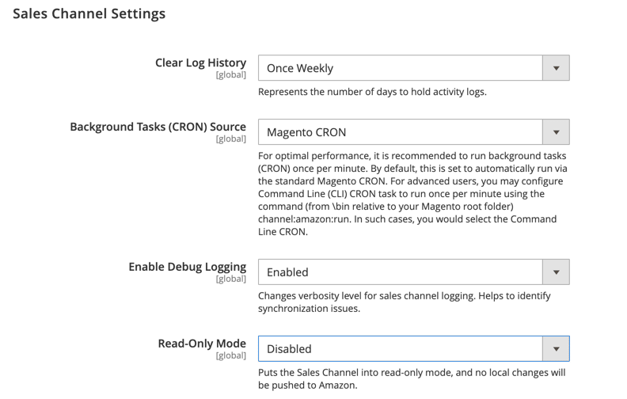

# [!UICONTROL Sales Channels] > [!UICONTROL Global Settings]

{{config}}

Estas configurações estão disponíveis quando o [[!DNL Amazon Sales Channel]](https://experienceleague.adobe.com/docs/commerce-channels/amazon/getting-started/install.html?lang=pt-BR) é instalado.

<!-- zoom -->

| Campo | [Escopo](../getting-started/websites-stores-views.md#scope-settings) | Descrição |
|-----|---------|------|
| [!UICONTROL Clear Log History] | Global | Opções:  **`Once Daily`**: selecione esta opção para limpar o histórico de atividades da loja uma vez por dia.  **`Once Weekly`**: selecione esta opção para limpar o histórico de atividades da loja uma vez por semana.  **`Once Monthly`**: (Padrão) selecione esta opção para limpar o histórico de atividades da loja uma vez por mês. |
| [!UICONTROL Background Tasks (CRON) Source] | Global | Selecione `Magento CRON` para especificar que o [!DNL Amazon Sales Channel] use suas configurações de cron do Commerce para determinar os intervalos de comunicação e sincronização de dados com a Central de Vendas do Amazon. |
| [!UICONTROL Enable Debug Logging] | Global | Selecione `Enabled` para coletar dados de sincronização adicionais quando a solução de problemas for necessária.  Essa opção está desabilitada por padrão e só deve ser habilitada quando necessária para a solução de problemas, pois o logon contínuo afeta negativamente o desempenho. Se ativado para solução de problemas, deve ser desativado ao concluir. |
| [!UICONTROL Read-Only Mode] | Global | Selecione `Enabled` para bloquear todas as solicitações de API que mudam de estado de saída. As alterações potenciais são salvas, mas não enviadas, até que o modo somente leitura seja desativado. Para iniciar as transferências de dados novamente, selecione `Disabled`.  Quando um banco de dados é migrado para uma nova cópia da instância (detectado quando a URL de um armazenamento muda na configuração), o modo somente leitura é habilitado automaticamente.  Isso foi projetado para uso em cópias da instância de produção, como _Preparo_ ou _QA_, e não deve ser usado na instância de produção.  **_Observação _**: o cache de configuração deve ser limpo para que o [!UICONTROL Read-Only Mode] seja habilitado. |

{style="table-layout:auto"}
