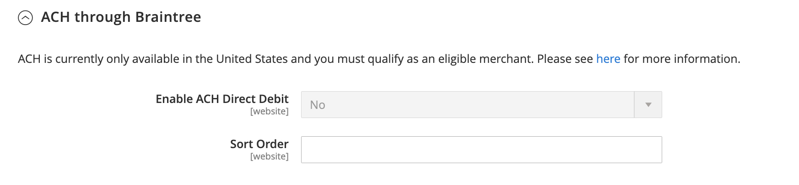

# [!UICONTROL Sales] > [!UICONTROL Payment Methods] > [!UICONTROL Braintree]

>[!IMPORTANT]
>
>**Migração do Comércio 2.4:** 
>Para versões de Adobe Systems Comércio e Magento Open Source anteriores à 2.4.0, foi recomendado que os comerciantes instalassem e configurem a extensão oficial de integração de pagamento Braintree do [Commerce Marketplace](https://marketplace.magento.com/catalogsearch/result/?q=braintree) para substituir a integração principal. A partir de 2.4.0, a extensão agora está incluída na versão principal.
>  
>Ao migrar para o Comércio 2.4, os comerciantes precisam desinstalar a extensão distribuída no Marketplace (`paypal/module-braintree` ou `gene/module-braintree`) e atualizar quaisquer personalizações de código para usar o `PayPal_Braintree` namespace em vez de `Magento_Braintree`. As configurações da extensão empacotada para Comércio e da extensão distribuída na Commerce Marketplace são mantidas. Os pagamentos feitos com essas versões da extensão são capturados, anulados ou reembolsados normalmente.
>  
>Se você estiver atualizando para Comércio 2.4.0 e não usar a extensão de Commerce Marketplace recomendada na versão anterior 2.3.x, o recurso multi address não funciona com a versão 2.4.0 do Braintree. Quando um consumidor seleciona entregar em vários endereços __ , o método de pagamento Braintree não aparece. A extensão Commerce Marketplace anteriormente recomendada para a 2.3.x tem esse problema de múltiplo endereço.

{{config}}

>[!IMPORTANT]
>
>Se você precisar de ajuda com acusações inesperadas sobre sua cartão, visita o [cancelamento assinatura](https://helpx.adobe.com/manage-account/using/cancel-subscription.html) página para assistência.

## [!UICONTROL Basic Braintree Settings]

<!-- zoom -->

| Campo | [Âmbito](../../getting-started/websites-stores-views.md#scope-settings) | Descrição |
|--- |--- |--- |
| [!UICONTROL Title] | Exibição da loja | Valor padrão: `Credit Card` (Braintree) |
| [!UICONTROL Environment] | Exibição da loja | Opções: `Sandbox` / `Production` |
| [!UICONTROL Payment Action] | Exibição da loja | Determina a ação tomada pelo Braintree quando um pagamento é processado. Opções:  **`Authorize`**- Os fundos no cartão de crédito do cliente estão autorizados, mas não foram transferidos da conta. Um pedido é criado no Administrador da loja. Posteriormente, você pode capturar a venda e criar uma fatura. **`Intent Sale`** (anteriormente `Authorize and Capture` em versões anteriores) - Os fundos no cartão de crédito do cliente são autorizados e capturados pela Braintree, e um pedido e uma fatura são criados no Administrador da loja. |
| [!UICONTROL Sandbox Merchant ID] | Exibição da loja | Esse é o identificador exclusivo de toda a sua conta de gateway de sandbox. Também conhecida como _ID pública_ ou _ID de produção_, sua ID de comerciante é diferente para seus gateways de produção e sandbox. Este campo aparece quando o campo _[!UICONTROL Environment]_está definido como `Sandbox`. |
| [!UICONTROL Sandbox Public Key] | Exibição da loja | Esse é o identificador público específico do usuário que restringe o acesso a dados criptografados. Cada usuário associado ao seu gateway do Braintree de sandbox tem sua própria chave pública de sandbox. Este campo aparece quando o campo _[!UICONTROL Environment]_está definido como `Sandbox`. |
| [!UICONTROL Sandbox Private Key] | Exibição da loja | Esse é o identificador privado específico do usuário que restringe o acesso a dados criptografados. Cada usuário associado ao seu gateway do Braintree de sandbox tem sua própria chave privada para a sandbox. Este campo aparece quando o campo _[!UICONTROL Environment]_está definido como `Sandbox`. |
| [!UICONTROL Merchant ID] | Exibição da loja | Esse é o identificador exclusivo de toda a conta do gateway, incluindo as várias contas de comerciante que podem estar no gateway. Também conhecida como _ID pública_ ou _ID de produção_, sua ID de comerciante é diferente para seus gateways de produção e sandbox. Este campo aparece quando o campo _[!UICONTROL Environment]_está definido como `Production`. |
| [!UICONTROL Public Key] | Exibição da loja | Esse é o identificador público específico do usuário que restringe o acesso a dados criptografados. Cada usuário associado ao seu gateway do Braintree tem sua própria chave pública. Este campo aparece quando o campo _[!UICONTROL Environment]_está definido como `Production`. |
| [!UICONTROL Private Key] | Exibição da loja | Esse é o identificador privado específico do usuário que restringe o acesso a dados criptografados. Cada usuário associado ao seu gateway do Braintree tem sua própria chave privada. Este campo aparece quando o campo _[!UICONTROL Environment]_está definido como `Production`. |
| [!UICONTROL Enable Card Payments] | Site | Determina se o Braintree método de pagamento cartão de crédito está disponível para seus clientes como um método de pagamento. Opções: `Yes` / `No` |
| [!UICONTROL Enable Vault for Card Payments] | Site | Quando ativado, o fornece armazenamento seguro para informações de pagamento do cliente, de modo que os clientes não precisam inserir novamente as informações de cartão de crédito para cada compra. Opções: `Yes` / `No` |
| [!UICONTROL Enable Vault CVV Re-verification] | Site | Quando ativada, a validação é feita para a configuração de regras CVV na sua conta do Braintree. Opções: `Yes` / `No` |

{style="table-layout:auto"}

## [!UICONTROL Advanced Braintree Settings]

{width="550" zoomable="yes"}

| Campo | [Escopo](../../getting-started/websites-stores-views.md#scope-settings) | Descrição |
|--- |--- |--- |
| [!UICONTROL Vault Title] | Site | Um título descritivo para referência que identifica o cofre no qual as informações do cartão do cliente estão armazenadas. |
| [!UICONTROL Merchant Account ID] | Site | A ID da Conta do Comerciante a ser associada às transações do Braintree deste site. Se deixado em branco, a conta de comerciante padrão da conta do Braintree será usada. |
| [!UICONTROL Enable Checkout Express Payments] | Site | Fornece uma experiência de finalização mais rápida com opções de Pagamento Expresso no início do processo de finalização, incluindo PayPal, PayLater, Apple Pay e Google Pay. Opções: `Yes` / `No` |
| [!UICONTROL Skip Fraud Checks on Admin Orders] | Site | Impede que a transação seja enviada para avaliação como parte das verificações de [!DNL Advanced Fraud Tools], em pedidos feitos pelo administrador apenas quando definido como `Yes`. Opções: `Yes` / `No` |
| [!UICONTROL Bypass Fraud Protection Threshold] | Site | `Advanced Fraud Protection` verificações são ignoradas quando o valor limite é atingido ou excedido. Deixar esse campo em branco desativa essa opção. |
| [!UICONTROL Debug] | Site da Web | Determina se as comunicações entre o sistema de Braintree e suas armazenamento são registradas em um arquivo de log. Opções: `Yes` / `No` |
| [!UICONTROL CVV Verification] | Site da Web | Determina se os clientes devem fornecer o código de segurança de três dígitos no verso de um cartão de crédito. Opções: `Yes` / `No` |
| [!UICONTROL Send Card Line Items] | Site da Web | Envie os itens de linha carrinho para todos os métodos de pagamento. Opções: `Yes` / `No` |
| [!UICONTROL Credit Card Types] | Site da Web | Especifica cada cartão de crédito que você aceita como pagamento por meio de Braintree. Pressione e segure `Ctrl` (ou `Command` no Mac) para selecionar uma combinação de cartões. Opções: `American Express` / `Visa` / `MasterCard` / `Discover` / `JCB` / `Diners``Maestro International` |
| [!UICONTROL Sort Order] | Site | Determina a ordem em que o Braintree é listado com outros métodos de pagamento durante a finalização da compra. |

## [!UICONTROL Braintree Webhooks Settings]

<!-- zoom -->

| Campo | [Escopo](../../getting-started/websites-stores-views.md#scope-settings) | Descrição |
|--- |--- |--- |
| [!UICONTROL Enable Webhook] | Site | Para ativar a funcionalidade de webhook para proteção contra fraude, pagamentos ACH, métodos de pagamento locais e disputas. Opções: `Yes` / `No` |
| [!UICONTROL Fraud Protection URL] | Site | Adicione esta URL à sua Conta da Braintree como o [!UICONTROL Webhook Destination URL]. **Esta URL deve ser segura e estar acessível publicamente.** |
| [!UICONTROL Fraud Protection Approve Order Status] | Site | Quando a proteção contra fraude é aprovada pelo Braintree, o status do pedido selecionado é atribuído ao pedido do Commerce. Este status é usado para atualizar o status do pedido onde o método de pagamento da ACH é usado e quando ele é movido para `SETTLED` no Braintree. |
| [!UICONTROL Fraud Protection Reject Order Status] | Site | Quando a proteção contra fraude é rejeitada pelo Braintree, o status do pedido selecionado é atribuído ao pedido do Commerce. Este status é usado para atualizar o status do pedido onde o método de pagamento da ACH é usado e quando `SETTLEMENT` é `DECLINED` no Braintree. |

{style="table-layout:auto"}

## [!UICONTROL Country Specific Settings]

<!-- zoom -->

| Campo | [Âmbito](../../getting-started/websites-stores-views.md#scope-settings) | Descrição |
|--- |--- |--- |
| [!UICONTROL Payment from Applicable Countries] | Site da Web | Determina se você aceita pagamentos processados por Braintree de todos os países ou apenas de países específicos. Opções: `All Allowed Countries` / `Specific Countries` |
| [!UICONTROL Payment from Specific Countries] | Site da Web | Se aplicável, identifica os países específicos dos quais você aceita pagamentos processados por Braintree. |
| [!UICONTROL Country Specific Credit Card Types] | Site da Web | Identifica os cartões de crédito aceitos por país para pagamentos processados pelo Braintree. Um registro é salvo para cada país. Opções:  **`Country`**- Escolha o país. **`Allowed Card Types`** - Selecione cada cartão de crédito aceita do país como pagamento por meio de Braintree.  **`Add`**- Adicione uma linha para permitir cartões de crédito de outro país. **`Action`** - Exclui o registro de cartões de crédito permitidos para o país. |

{style="table-layout:auto"}

## [!UICONTROL ACH through Braintree]

<!-- zoom -->

| Campo | [Escopo](../../getting-started/websites-stores-views.md#scope-settings) | Descrição |
|--- |--- |--- |
| [!UICONTROL Enabled ACH Direct Debit] | Site da Web | Determina se ele [!DNL ACH Direct Debit] está incluído como um método de pagamento por meio de Braintree. Opções: `Yes` / `No` |
| [!UICONTROL Enable Vault for ACH Direct Debit] | Site da Web | Os clientes podem abobadar/armazenamento seu método de pagamento de débito direto ACH de uso único para uso futuro. Depois que os detalhes do pagamento forem salvos, o cliente poderá usar o método de pagamento Débito Direto ACH sem inserir os dados novamente ou autenticar novamente suas informações de pagamento. Opções: `Yes` / `No` |
| [!UICONTROL Sort Order] | Site | Determina a ordem em que [!DNL ACH Direct Debit] está listado com outros métodos de pagamento durante o check-out. |

{style="table-layout:auto"}

## [!UICONTROL Apple Pay through Braintree]

<!-- zoom -->

| Campo | [Escopo](../../getting-started/websites-stores-views.md#scope-settings) | Descrição |
|--- |--- |--- |
| [!UICONTROL Enable ApplePay through Braintree] | Site | Determina se o Apple Pay está incluído como um método de pagamento por meio do Braintree. Opções: `Yes` / `No`    O domínio deve ser [verificado primeiro na Conta da Braintree](https://developer.paypal.com/braintree/docs/guides/apple-pay/configuration/javascript/v3). |
| [!UICONTROL Enable Vault for ApplePay] | Site | Os clientes podem arquivar/armazenar seu método de pagamento Apple Pay para uso futuro. Depois que os detalhes do pagamento forem salvos, o cliente poderá usar o Apple Pay sem inserir os dados novamente ou autenticar novamente suas informações de pagamento. Opções: `Yes` / `No` |
| [!UICONTROL Payment Action] | Site da Web | Determina a ação tomada por Braintree quando um pagamento é processado. Opções:  **`Authorize`**- Os fundos na cartão do cliente são autorizados, mas não transferidos do conta do cliente. Um solicitar é criado em seu Admin armazenamento. Posteriormente, você pode capturar a venda e criar uma fatura. **`Intent Sale`** - Os fundos na cartão do cliente são autorizados e capturados por Braintree e uma solicitar e fatura são criados em seu Administrador armazenamento. **_Observação:_** esta foi `Authorize and Capture` a versão 2.3.x e anterior. |
| [!UICONTROL Merchant Name] | Armazenar Exibir | Rotular exibido aos clientes no pop-up do ApplePay. |
| [!UICONTROL Sort Order] | Site da Web | Determina a solicitar de lista do Apple Pay com outros métodos de pagamento durante o check-out. |

{style="table-layout:auto"}

## [!UICONTROL Local Payment Methods]

<!-- zoom -->

| Campo | [Escopo](../../getting-started/websites-stores-views.md#scope-settings) | Descrição |
|--- |--- |--- |
| [!UICONTROL Enabled Local Payment Methods] | Site | Determina se o Método de Pagamento Local será incluído como um método de pagamento por meio do Braintree. Opções: `Yes` / `No` |
| [!UICONTROL Title] | Site | Rótulo que aparece na seção do método de pagamento de finalização da compra. Valor padrão: `Local Payments` |
| [!UICONTROL Fallback Button Text] | Site | Insira o texto a ser usado no botão que aparece na página de fallback do Braintree que leva os clientes de volta ao site. Valor padrão: `Complete Checkout` |
| [!UICONTROL Redirect on Fail] | Site | Especifica o URL para o qual os clientes devem ser redirecionados quando as transações do método de pagamento local forem canceladas, reprovadas ou encontrarem erros. Deve ser a página de pagamento do check-out (por exemplo, `https://www.domain.com/checkout#payment`). |
| [!UICONTROL Allowed Payment Method] | Site | Selecione o método de Pagamento local a ser ativado. Opções: `Bancontact` / `EPS` / `iDeal` / `MyBank` / `P24` / `SEPA/ELV Direct Debit` |
| [!UICONTROL Sort Order] | Site | Determina a ordem em que o Método de Pagamento Local será listado com outros métodos de pagamento durante a finalização da compra. |

{style="table-layout:auto"}

>[!NOTE]
>
>A extensão fornecida do Braintree não oferece suporte a todos os métodos de pagamento locais listados na [documentação do desenvolvedor do Braintree](https://developer.paypal.com/braintree/docs/guides/local-payment-methods/overview). Outros métodos de pagamento locais estão em desenvolvimento para serem suportados em versões futuras.

## [!UICONTROL GooglePay through Braintree]

<!-- zoom -->

| Campo | [Âmbito](../../getting-started/websites-stores-views.md#scope-settings) | Descrição |
|--- |--- |--- |
| [!UICONTROL Enabled GooglePay through Braintree] | Site da Web | Determina se o [!DNL Google Pay] pagamento está incluído como um método de pagamento por meio de Braintree. Opções: `Yes` / `No` |
| [!UICONTROL Enable Vault for GooglePay] | Site da Web | Os clientes podem arquivar/armazenar seu método de pagamento Google Pay para uso futuro. Uma vez que as detalhes do pagamento estão abobadadas, o cliente pode usar o Google Pay sem reentrar nos dados ou autenticar novamente suas informações de pagamento. Opções: `Yes` / `No` |
| [!UICONTROL Payment Action] | Site | Determina a ação tomada pelo Braintree quando um pagamento é processado. Opções:  **`Authorize`**- Os fundos no cartão do cliente são autorizados, mas não transferidos da conta do cliente. Um pedido é criado no Administrador da loja. Posteriormente, você pode capturar a venda e criar uma fatura. **`Intent Sale`** - Os fundos no cartão do cliente são autorizados e capturados pela Braintree, e um pedido e uma fatura são criados no Administrador da loja. **_Observação:_** este era `Authorize and Capture` na versão 2.3.x e em versões anteriores. |
| [!UICONTROL Button Color] | Site | Determina a cor do [!DNL Google Pay] botão. Opções: `White` / `Black` |
| [!UICONTROL Merchant ID] | Armazenar Exibir | A ID fornecida pelo Google deve ser inserida aqui. |
| [!UICONTROL Accepted Cards] | Site da Web | Selecione o tipo de cartões que um cliente pode usar para fazer um pedido usando o [!DNL Google Pay]. |
| [!UICONTROL Sort Order] | Site | Determina a ordem em que o Google Pay é listado com outros métodos de pagamento durante o checkout. |

{style="table-layout:auto"}

## [!UICONTROL Venmo through Braintree]

<!-- zoom -->

| Campo | [Escopo](../../getting-started/websites-stores-views.md#scope-settings) | Descrição |
|--- |--- |--- |
| [!UICONTROL Enable Venmo through Braintree] | Site | Determina se [!DNL Venmo] está incluído como um método de pagamento por meio do Braintree. Opções: `Yes` / `No` |
| [!UICONTROL Enable Vault for Venmo] | Site | Os clientes podem arquivar/armazenar seu método de pagamento Venmo para uso futuro. Depois que os detalhes do pagamento forem salvos, o cliente poderá usar o método de pagamento Venmo sem inserir os dados novamente ou autenticar novamente suas informações de pagamento. Opções: `Yes` / `No` |
| [!UICONTROL Payment Action] | Site da Web | Determina a ação tomada por Braintree quando um pagamento é processado. Opções:  **`Authorize`**- Os fundos na cartão do cliente são autorizados, mas não transferidos do conta do cliente. Um solicitar é criado em seu Admin armazenamento. Posteriormente, você pode capturar a venda e criar uma fatura. **`Intent Sale`** - Os fundos na cartão do cliente são autorizados e capturados por Braintree e uma solicitar e fatura são criados em seu Administrador armazenamento. **_Observação:_** este foi  _Autorizado e Capture_ na 2.3.x e versões anteriores. |
| [!UICONTROL Sort Order] | Site da Web | Determina a solicitar que a Venmo está listada com outros métodos de pagamento durante o check-out. |

{style="table-layout:auto"}

## [!UICONTROL PayPal through Braintree]

{width="550" zoomable="yes"}
{width="550" zoomable="yes"}

| Campo | [Escopo](../../getting-started/websites-stores-views.md#scope-settings) | Descrição |
|--- |--- |--- |
| [!UICONTROL Enable PayPal through Braintree] | Site | Determina se o PayPal é incluído como um método de pagamento pelo Braintree. Opções: `Yes` / `No` |
| [!UICONTROL Enable PayPal Credit through Braintree] | Site da Web | Determina se o Crédito do PayPal é incluído como um método de pagamento por meio do Braintree. Opções: `Yes` / `No`. Este campo fica visível quando `Enable PayPal through Braintree` está definido como `Yes` |
| [!UICONTROL Enable PayPal PayLater through Braintree] | Site | Determina se o PayPal PayLater é incluído como um método de pagamento através do Braintree. Opções: `Yes` / `No`. Este campo fica visível quando `Enable PayPal through Braintree` está definido como `Yes` |
| [!UICONTROL Title] | Exibição da loja | O rótulo que identifica o PayPal pelo Braintree para clientes durante o checkout. Valor padrão: `PayPal` |
| [!UICONTROL Vault Enabled] | Site | Quando ativado, fornece armazenamento seguro para informações de pagamento do cliente, para que os clientes não precisem inserir novamente suas informações do PayPal para cada compra. Opções: `Yes` / `No` |
| [!UICONTROL Send Cart Line Items for PayPal] | Site | Envie os itens de linha (itens de pedido) para PayPal juntamente com Cartões-presente, Empacotamento de presente para itens, Empacotamento de presente para pedido, Crédito da loja, Envio e Imposto como itens de linha. Opções: `Yes` / `No` |
| [!UICONTROL Sort Order] | Site | Um número que determina a solicitar em que PayPal por meio Braintree é listado com outros métodos de pagamento durante o check-out. |
| [!UICONTROL Override Merchant Name] | Armazenar Exibir | Um nome alternativo que pode ser usado para identificar a comerciante de cada armazenamento visualização. |
| [!UICONTROL Payment Action] | Site da Web | Determina a ação tomada por PayPal até Braintree quando um pagamento é processado. Opções:  **`Authorize`**- Os fundos na cartão do cliente são autorizados, mas não transferidos do conta do cliente. Um solicitar é criado em seu Admin armazenamento. Posteriormente, você pode capturar a venda e criar uma fatura. **`Authorize and Capture`** - Os fundos no cartão do cliente são autorizados e capturados por PayPal através de Braintree e um solicitar e fatura são criados em seu Admin armazenamento. |
| [!UICONTROL Payment from Applicable Countries] | Site da Web | Determina se você aceita pagamentos processados pelo PayPal pelo Braintree de todos os países ou somente de países específicos. Opções: `All Allowed Countries` / `Specific Countries` |
| [!UICONTROL Payment from Specific Countries] | Site da Web | Se aplicável, identifica os países específicos dos quais você aceita pagamentos processados pelo Braintree. |
| [!UICONTROL Require Customer's Billing Address] | Site | Determina se o endereço de cobrança do cliente é necessário para enviar um pedido. Opções: `Yes` / `No` |
| [!UICONTROL Skip Order Review Step] | Site | Determina se os clientes devem ser redirecionados para a página de revisão antes de concluir o pagamento. Opções: `Yes` / `No` |
| [!UICONTROL Debug] | Site da Web | Determina se as comunicações entre o PayPal por meio Braintree sistema e suas armazenamento são registradas em um arquivo de log. Opções: `Yes` / `No` |
| [!UICONTROL Display on Shopping Cart] | Site | Determina se o botão PayPal aparece no [minicarrinho](../../stores-purchase/cart-configuration.md#mini-cart) e na página [carrinho de compras](../../stores-purchase/cart.md). Opções: `Yes` / `No` |
| [!UICONTROL Send Package Tracking] | Site | As informações de rastreamento de pacotes serão enviadas ao PayPal somente para transações/pedidos do PayPal. Você deve habilitar o campo de configuração [!UICONTROL Send Cart Line Items for PayPal] para que o recurso [!UICONTROL Package Tracking] funcione corretamente. Opções: `Yes` / `No` |
| [!UICONTROL Use PayPal's "Notify Payer" functionality] | Site | Depois que estiver definido como Sim, o Comprador ou o Pagador será notificado pelo PayPal sobre atualizações de rastreamento de pacotes. Opções: `Yes` / `No` |

{style="table-layout:auto"}

>[!NOTE]
>
>**[!DNL PayPal Credit]** ou **[!DNL PayPal PayLater]** pode ser habilitado. Ambos os métodos não podem ser ativados ao mesmo tempo.

### [!UICONTROL Styling]

<!-- zoom -->

| Campo | [Escopo](../../getting-started/websites-stores-views.md#scope-settings) | Descrição |
|--- |--- |--- |
| [!UICONTROL Location] | Site | Determina onde as mensagens e os botões do PayPal são renderizados na loja. Opções: `Mini-Cart and Cart Page` / `Checkout Page` / `Product Page` |

{style="table-layout:auto"}

**[!UICONTROL Mini-Cart and Cart Page]**

A opção e as configurações desta seção variam de acordo com a configuração no campo _[!UICONTROL Location]_.

| Campo | [Escopo](../../getting-started/websites-stores-views.md#scope-settings) | Descrição |
|--- |--- |--- |
| [!UICONTROL PayPal Button Type] | Site | Define o botão para um dos três tipos: `PayPal Button` / `PayPal Pay Later Button` / `PayPal Credit Button` |

**[!UICONTROL PayPal Button]**

As opções e configurações desta seção variam de acordo com o tipo de botão selecionado no campo _[!UICONTROL PayPal Button Type]_.

| Campo | [Escopo](../../getting-started/websites-stores-views.md#scope-settings) | Descrição |
|--- |--- |--- |
| [!UICONTROL Show PayPal Button] | Site da Web | Determina o local do PayPal botão no local selecionado. Opções: `Yes` / `No` |
| [!UICONTROL Button Label] | Site | Determina o rótulo do botão PayPal. Opções: `Paypal` / `Checkout` / `Buy Now` / `Pay` |
| [!UICONTROL Color] | Site | Determina a cor do botão PayPal. Opções: `Blue` / `Black` / `Gold` / `Silver` |
| [!UICONTROL Shape] | Site | Determina a forma do botão PayPal. Opções: `Pill` / `Rectangle` |
| [!UICONTROL Size(Deprecated)] | Site | Determina o tamanho do botão PayPal. Opções: `Medium` / `Large` / `Responsive` |

{style="table-layout:auto"}

>[!NOTE]
>
>O campo de configuração **[!DNL Size(Deprecated)]** está obsoleto e não está sendo usado para estilizar os botões PayPal.

Quando essas opções são definidas, você pode visualizar os botões do PayPal e as mensagens do PayLater. Há controles que você pode usar para aplicar as configurações ou redefinir os valores:

| Campo | [Âmbito](../../getting-started/websites-stores-views.md#scope-settings) | Descrição |
|--- |--- |--- |
| [!UICONTROL Apply] | Site da Web | Armazena as configurações de estilo selecionadas para botões e mensagens PayLater e as aplica ao local atual e ao tipo de botão atual. |
| [!UICONTROL Apply to All Buttons] | Site da Web | Armazena as configurações de estilo selecionadas para botões e PayLater mensagens valores e as aplica a todos os botão tipos e locais. |
| [!UICONTROL Reset to Recommended Defaults] | Site da Web | Retorna as configurações de estilo aos valores padrão recomendados para botões e mensagens PayLater e as aplica a todos os botão tipos e locais. |

{style="table-layout:auto"}

## [!UICONTROL Pay Later Messaging]

**[!UICONTROL Product Page]**

<!-- zoom -->

| Campo | [Escopo](../../getting-started/websites-stores-views.md#scope-settings) | Descrição |
|--- |--- |------------------------------------------------------------------------------------------------------------------------------------------------------------------------------------------------------------------------------------------|
| [!UICONTROL Show PayLater Messaging] | Site | Habilita as mensagens do PayLater no local selecionado. Opções: `Yes` / `No`. Exibe mensagens de Pagamento Posterior para ofertas disponíveis. Restrições são aplicadas. [Clique aqui para saber mais.](https://developer.paypal.com/studio/checkout/pay-later/us) |
| [!UICONTROL Message Layout] | Site da Web | Determina o layout da mensagem paylater. Opções: `Text` / `Flex` |
| [!UICONTROL Logo] | Site | Determina o tipo de logotipo usado para a mensagem Pagar Mais Tarde. Opções: `Inline` / `Primary` / `Alternative` / `None` |
| [!UICONTROL Logo Position] | Site | Determina a posição do logotipo para a mensagem Pagar mais tarde. Opções: `Left` / `Right` / `Top` |
| [!UICONTROL Text Color] | Site | Determina a cor do texto da mensagem Pagar mais tarde. Opções: `Black` / `White` / `Monochrome` / `Grayscale` |

{style="table-layout:auto"}

**[!UICONTROL Cart]**

<!-- zoom -->

| Campo | [Escopo](../../getting-started/websites-stores-views.md#scope-settings) | Descrição |
|--- |--- |------------------------------------------------------------------------------------------------------------------------------------------------------------------------------------------------------------------------------------------|
| [!UICONTROL Show PayLater Messaging] | Site | Habilita as mensagens do PayLater no local selecionado. Opções: `Yes` / `No`. Exibe mensagens de Pagamento Posterior para ofertas disponíveis. Restrições são aplicadas. [Clique aqui para saber mais.](https://developer.paypal.com/studio/checkout/pay-later/us) |
| [!UICONTROL Message Layout] | Site | Determina o layout de mensagem do PayLater. Opções: `Text` / `Flex` |
| [!UICONTROL Logo] | Site | Determina o tipo de logotipo usado para a mensagem Pagar Mais Tarde. Opções: `Inline` / `Primary` / `Alternative` / `None` |
| [!UICONTROL Logo Position] | Site | Determina a posição do logotipo para a mensagem Pagar mais tarde. Opções: `Left` / `Right` / `Top` |
| [!UICONTROL Text Color] | Site | Determina a cor do texto da mensagem Pagar mais tarde. Opções: `Black` / `White` / `Monochrome` / `Grayscale` |

{style="table-layout:auto"}

**[!UICONTROL Checkout]**

<!-- zoom -->

| Campo | [Escopo](../../getting-started/websites-stores-views.md#scope-settings) | Descrição |
|--------------------------------------|--- |-------------------------------------------------------------------------------------------------------------------------------------------------------------------------------------------------------------------------------------------|
| [!UICONTROL Show PayLater Messaging] | Site | Habilita as mensagens do PayLater no local selecionado. Opções: `Yes` / `No`. Exibe mensagens de Pagamento Posterior para ofertas disponíveis. Restrições são aplicadas. [Clique aqui para saber mais.](https://developer.paypal.com/studio/checkout/pay-later/us) |
| [!UICONTROL Text Align] | Site | Determina o layout de mensagem do PayLater. Opções: `Left` / `Center` / `Right` |
| [!UICONTROL Text Color] | Site | Determina a cor do texto da mensagem Pagar mais tarde. Opções: `Black` / `White` |

{style="table-layout:auto"}

## Configurações de verificação segura 3d

<!-- zoom -->

| Campo | [Âmbito](../../getting-started/websites-stores-views.md#scope-settings) | Descrição |
|--- |--- |--- |
| [!UICONTROL 3D Secure Verification] | Site da Web | Determina se uma transação deve passar por um processo de verificação extra quando o cliente está inscrito em uma programa como _Verificado por VISA_. Opções: `Yes` / `No` |
| [!UICONTROL Always request 3DS] | Site da Web | Desafie o 3D Secure solicitação sempre para todas as transações. Opções: `Yes` / `No` |
| [!UICONTROL Threshold Amount] | Site da Web | Determina o valor máximo do pedido autorizado para processamento em um único pedido. O Braintree recusará a autorização se o valor do pedido exceder esse valor limite. |
| [!UICONTROL Verify for Applicable Countries] | Site | Determina os países onde o pagamento deve ser verificado. Opções: `All Allowed Countries` / `Specific Countries` |
| [!UICONTROL Verify for Specific Countries] | Site | Se aplicável, identifica os países específicos a partir dos quais o pagamento pela Braintree deve ser verificado. |

{style="table-layout:auto"}

## [!UICONTROL Dynamic Descriptors]

<!-- zoom -->

| Campo | [Escopo](../../getting-started/websites-stores-views.md#scope-settings) | Descrição |
|--- |--- |--- |
| [!UICONTROL Name] | Exibição da loja | Há duas partes no descritor Nome, separadas por um asterisco (*). A primeira parte do descritor identifica a empresa ou o DBA e a segunda identifica o produto. Por exemplo: `company*myproduct`   O comprimento das partes Empresa e Produto do descritor pode ser alocado das seguintes maneiras, para um comprimento combinado de até 22 caracteres:  **`Option 1`**- A empresa deve ter três caracteres / O produto pode ter até 18 caracteres **`Option 2`** - A empresa deve ter sete caracteres / O produto pode ter até 14 caracteres  **`Option 3`**- A empresa deve ter 12 caracteres / O produto pode ter até nove caracteres |
| [!UICONTROL Phone] | Exibição da loja | O descritor de telefone deve ter de dez a 14 caracteres e pode incluir apenas números, traços, parênteses e pontos. Por exemplo: `9999999999` `(999) 999-9999` `999.999.9999` |
| [!UICONTROL URL] | Exibição da loja | O descritor de URL representa seu nome de domínio e pode ter até 13 caracteres. Por exemplo: `company.com` |

{style="table-layout:auto"}
