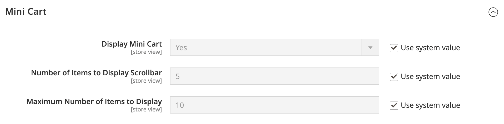

# [!UICONTROL Sales] > [!UICONTROL Checkout]

{{config}}

## [!UICONTROL Checkout Options]

<!-- zoom -->

<!--[Checkout Options](https://experienceleague.adobe.com/pt-br/docs/commerce-admin/stores-sales/point-of-purchase/checkout/checkout-process#checkout-options) -->

| Campo | [Escopo](../../getting-started/websites-stores-views.md#scope-settings) | Descrição |
|------------------------------------------------------------------|--- |----------------------------------------------------------------------------------------------------------------------------------------------------------------------------------------------------------------------------------------------------------------------------------------------------------------------------------------------------------------------------------------------------------------------------------------------------------------------|
| [!UICONTROL Enable Guest Checkout Login] | Exibição da loja | Habilite esta configuração para permitir que usuários não autenticados (vitrine e APIs) consultem se um endereço de email já está associado a uma conta de cliente. Isso pode ser usado para aprimorar o fluxo de trabalho de check-out para convidados exibindo um prompt de entrada se o endereço de email inserido já estiver registrado em uma conta de cliente, mas isso custa a exposição de informações a usuários não autenticados.  Opções: `Yes` / `No` |
| [!UICONTROL Enable Onepage Checkout] | Exibição da loja | Determina se [Check-out de uma página](../../stores-purchase/checkout-process.md#checkout-options) é o formato de check-out padrão. Opções: `Yes` / `No` |
| [!UICONTROL Allow Guest Checkout] | Exibição da loja | Determina se os convidados podem passar pelo check-out de [&#x200B; sem se registrarem](../../stores-purchase/checkout-guest.md) em uma conta com sua loja. Opções: `Yes` / `No` |
| [!UICONTROL Enable Terms and Conditions] | Exibição da loja | Determina se os clientes devem concordar com os [Termos e Condições](../../stores-purchase/terms-and-conditions.md) da venda antes de fazer uma compra. Opções: `Yes` / `No` |
| [!UICONTROL Display Billing Address On] | Exibição da loja | Determina o local do endereço de cobrança durante a finalização da compra. Opções: `Payment Method` / `Payment Page` |
| [!UICONTROL Maximum Number of Items to Display in Order Summary] | Exibição da loja | Determina o número máximo de itens que podem aparecer no _Resumo de Pedidos_ durante o check-out. O padrão é `10`. |
| [!UICONTROL Enable Address Search] | Site |  (somente Adobe Commerce) Determina se os clientes podem usar a funcionalidade [pesquisa de endereço](../../stores-purchase/checkout-address-search.md) para as etapas Remessa e Revisão e Pagamentos. Quando isso estiver ativado, use Limite de número de endereços do cliente para definir o número de endereços salvos necessários para ativar essa funcionalidade durante a finalização da compra. Opções: `Yes` / `No` |
| Limite de Número de Endereços do Cliente | Site |  (somente Adobe Commerce) Quando a pesquisa de endereço está habilitada, determina o número de endereços salvos necessários para ativar esta funcionalidade durante o check-out. Quando o número de endereços salvos do cliente atingir ou exceder esse número, somente o endereço padrão será renderizado nas etapas _Remessa_ e _Revisão e Pagamentos_. O cliente pode usar uma função de pesquisa para alterar o endereço selecionado. O padrão é `10`. |

{style="table-layout:auto"}

## [!UICONTROL Shopping Cart]

<!-- zoom -->

<!--[Shopping Cart](https://experienceleague.adobe.com/pt-br/docs/commerce-admin/stores-sales/point-of-purchase/cart/cart-configuration) -->

| Campo | [Escopo](../../getting-started/websites-stores-views.md#scope-settings) | Descrição |
|--- |--- |--- |
| [!UICONTROL Quote Lifetime (days)] | Site | Determina a [vida útil de um preço cotado](../../stores-purchase/cart-configuration.md#quote-lifetime), em dias. |
| [!UICONTROL After Adding a Product Redirect to Shopping Cart] | Exibição da loja | Determina se a [página do carrinho de compras aparece](../../stores-purchase/cart-configuration.md#redirect-to-cart) imediatamente após um produto ser adicionado ao carrinho. Opções: `Yes` / `No` |
| [!UICONTROL Number of Items to Display Pager] | Exibição da loja | Determina o número de itens no carrinho de compras antes que o pager seja acionado. Valor padrão: `20` |
| [!UICONTROL Show Cross-sell Items in the Shopping Cart] | Exibição da loja | Indica se [itens de venda cruzada](../../catalog/related-products-up-sells-cross-sells.md#cross-sells) são exibidos no carrinho de compras, fornecendo opções de venda adicionais aos clientes. Opções: `Yes` (padrão) / `No` |
| [!UICONTROL Grouped Product Image] | Exibição da loja | Determina a imagem de [miniatura](../../stores-purchase/cart-configuration.md#cart-thumbnails) que aparece para um [produto agrupado](../../catalog/product-create-grouped.md) no carrinho de compras. Opções: `Product Thumbnail Itself` / `Parent Product Thumbnail` |
| [!UICONTROL Configurable Product Image] | Exibição da loja | Determina a imagem de [miniatura](../../stores-purchase/cart-configuration.md#cart-thumbnails) que aparece para um produto configurável no carrinho de compras. Opções: `Product Thumbnail Itself` / `Parent Product Thumbnail` |
| [!UICONTROL Preview Quote Lifetime (minutes)] | Exibição da loja | Determina a idade máxima da cotação em minutos quando visualizada do carrinho de compras. |
| [!UICONTROL Enable Clear Shopping Cart] | Site | Determina se o carrinho de compras exibe a opção para que os usuários limpem o conteúdo do carrinho em uma única ação. Opções: `Yes` / `No` |

{style="table-layout:auto"}

## [!UICONTROL My Cart Link]

<!-- zoom -->

<!-- [*My Cart Link*](https://experienceleague.adobe.com/pt-br/docs/commerce-admin/stores-sales/point-of-purchase/cart/cart-configuration#mini-cart) -->

| Campo | [Escopo](../../getting-started/websites-stores-views.md#scope-settings) | Descrição |
|--- |--- |--- |
| [!UICONTROL Display Cart Summary] | Site | Determina o valor que aparece entre parênteses após o link Meu carrinho. Opções: `Display number of items in cart` / `Display item quantities` |

{style="table-layout:auto"}

## Mini carrinho

<!-- zoom -->

<!-- [*Mini Cart*](https://experienceleague.adobe.com/pt-br/docs/commerce-admin/stores-sales/point-of-purchase/cart/cart-configuration#mini-cart) -->

| Campo | [Escopo](../../getting-started/websites-stores-views.md#scope-settings) | Descrição |
|--- |--- |--- |
| [!UICONTROL Display Mini Cart] | Exibição da loja | Determina se o mini carrinho aparece nas páginas da loja quando o ícone do carrinho no cabeçalho é clicado. A exibição do minicarrinho depende do tema. Opções: `Yes` / `No` |
| [!UICONTROL Number of Items to Display Scrollbar] | Exibição da loja | Determina o número de itens que podem aparecer no minicarrinho antes que a barra de rolagem seja acionada. Padrão: `5` |
| [!UICONTROL Maximum Number of Items to Display] | Exibição da loja | Determina o número máximo de itens que podem aparecer no minicarrinho. Padrão: `10` |

{style="table-layout:auto"}

## [!UICONTROL Payment Failed Emails]

<!-- zoom -->

<!-- [*Payment Failed Emails*](https://experienceleague.adobe.com/pt-br/docs/commerce-admin/stores-sales/point-of-purchase/checkout/checkout-payment-failed-emails) -->

| Campo | [Escopo](../../getting-started/websites-stores-views.md#scope-settings) | Descrição |
|--- |--- |--- |
| [!UICONTROL Payment Failed Email Receiver] | Exibição da loja | Identifica o contato da loja que recebe emails de Pagamento com Falha. Receptor padrão: `General Contact` |
| [!UICONTROL Payment Failed Email Sender] | Exibição da loja | Identifica o contato da loja que aparece como o remetente da mensagem de emails Payment Failed. Remetente padrão: `General Contact` |
| [!UICONTROL Payment Failed Template] | Exibição da loja | Identifica o modelo usado para emails de Pagamento com Falha. Modelo padrão: `Payment Failed` |
| [!UICONTROL Send Payment Failed Copy To] | Exibição da loja | Fornece o endereço de email de qualquer pessoa para receber uma cópia de um email de Pagamento com Falha. Separe vários endereços com uma vírgula. |
| [!UICONTROL Send Payment Failed Copy Method] | Exibição da loja | Indica o método de email usado para enviar a cópia. Opções:  **`Bcc`**- Envia uma cópia de cortesia oculta incluindo o destinatário no cabeçalho do mesmo email enviado ao cliente. O destinatário CCO não está visível para o cliente. **`Separate Email`** - Envia a cópia como um email separado. |

{style="table-layout:auto"}
