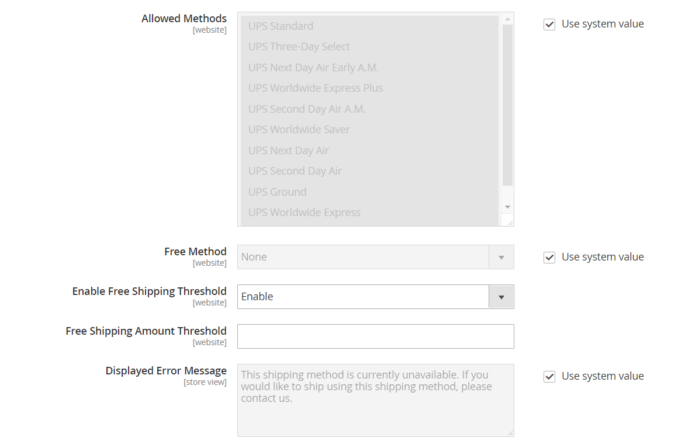

# [!UICONTROL Sales] > [!UICONTROL Delivery Methods]

{{config}}

## [!UICONTROL Basic Delivery Methods]

### [!UICONTROL Flat Rate]

<!-- zoom -->

<!-- [Flat Rate](https://docs.magento.com/user-guide/shipping/shipping-flat-rate.html) -->

| Campo | [Escopo](../../getting-started/websites-stores-views.md#scope-settings) | Descrição |
|--- |--- |--- |
| [!UICONTROL Enabled] | Site | Quando ativado, a Taxa única aparece como uma opção no _Estimar Envio e Imposto_ do carrinho de compras e na guia _Envio_ durante o check-out. Opções: `Yes` / `No` |
| [!UICONTROL Title] | Exibição da loja | O nome usado para este método de envio durante o check-out. |
| [!UICONTROL Method Name] | Exibição da loja | Um nome que descreve o método de cálculo usado para produzir uma estimativa de entrega. O nome do método aparece ao lado da taxa estimada calculada no carrinho de compras. O valor padrão é `Fixed`. |
| [!UICONTROL Type] | Site | Descreve o tipo de cálculo usado para determinar a taxa uniforme. Opções:  **`None`**- Nenhum cálculo é usado. Define a Taxa Uniforme como zero, que é o equivalente ao frete grátis. **`Per Order`** - Cobra uma única taxa uniforme para todo o pedido.  **`Per Item`**- Cobra uma taxa uniforme separada para cada item no carrinho. A taxa é multiplicada pelo número de itens no carrinho, mesmo que a quantidade total inclua uma combinação de itens diferentes. |
| [!UICONTROL Price] | Site | O preço que você cobra do cliente pela entrega com taxa uniforme. |
| [!UICONTROL Calculate Handling Fee] | Site | Determina como a taxa de manuseio é calculada, se incluída. Opções: `Fixed` / `Percent` |
| [!UICONTROL Handling Fee] | Site | Insira o valor a ser cobrado por uma taxa de manuseio, com base no método escolhido para calcular o valor. Por exemplo, se o encargo for baseado em uma taxa fixa, insira o valor como um valor decimal, como 4,90. No entanto, se a taxa de manuseio se basear em uma porcentagem do pedido, insira o valor como uma porcentagem. Por exemplo, se você estiver cobrando seis por cento da ordem, insira o valor como `.06`. |
| [!UICONTROL Displayed Error Message] | Exibição da loja | Uma mensagem que será exibida se um cliente escolher Taxa Uniforme, mas, por algum motivo, o método não estiver disponível. |
| [!UICONTROL Ship to Applicable Countries] | Site | Identifica os países nos quais você oferece remessa com Taxa Uniforme. Opções:  **`All Allowed Countries`**- Os clientes de qualquer país especificado na configuração da loja podem usar a entrega com Taxa Uniforme. **`Specific Countries`** - Clientes de apenas países específicos podem usar o frete com taxa única. |
| [!UICONTROL Ship to Specific Countries] | Site | Identifica cada país onde os clientes podem usar a entrega com Taxa Uniforme. |
| [!UICONTROL Show Method if Not Applicable] | Site | Determina se a Taxa única aparecerá como uma opção durante o check-out se o método não se aplicar à compra. Opções: `Yes` / `No` |
| [!UICONTROL Sort Order] | Site | Um número que determina a ordem em que a Taxa Uniforme é exibida quando listada com outros métodos de delivery durante a finalização da compra. |

{style="table-layout:auto"}

### [!UICONTROL Free Shipping]

<!-- zoom -->

<!-- [Free Shipping](https://docs.magento.com/user-guide/shipping/shipping-free.html) -->

| Campo | [Escopo](../../getting-started/websites-stores-views.md#scope-settings) | Descrição |
|--- |--- |--- |
| [!UICONTROL Enabled] | Site | Quando ativado, o Frete gratuito é exibido como uma opção na seção Envio durante a finalização da compra. Opções: `Yes` / `No` |
| [!UICONTROL Title] | Exibição da loja | O nome usado para este método de envio durante o check-out. |
| Nome do método | Exibição da loja | Um nome que descreve o método de cálculo usado para produzir uma estimativa de entrega. O nome do método aparece ao lado da taxa estimada calculada no carrinho de compras. O valor padrão é `Free`. |
| Valor Mínimo do Pedido | Site | A compra mínima necessária para aplicar o Frete Gratuito a um pedido. |
| Incluir Imposto no Valor | Site | Determina se o imposto está incluído no cálculo da Quantia Mínima da Ordem. Opções:  **Sim** - O imposto é incluído ao calcular o valor Mínimo do pedido (Subtotal + Imposto - Desconto). **Não** - O imposto não está incluído no cálculo do valor Mínimo do pedido (Subtotal - Desconto). |
| Mensagem de erro exibida | Exibição da loja | Uma mensagem que é exibida se um cliente escolher Frete gratuito, mas por algum motivo o método não estiver disponível. |
| País de Destino Aplicável | Site | Identifica os países onde você oferece Frete Gratuito. Opções:  **Todos os países permitidos** - Clientes de qualquer país especificado na configuração da loja podem usar o Frete gratuito.  **Países específicos** - Clientes de apenas países específicos podem usar o Frete gratuito. |
| Países específicos para envio | Site | Identifica cada país onde os clientes podem usar o Frete gratuito. |
| Mostrar método se não aplicável | Site | Determina se o Frete gratuito aparecerá como uma opção durante o check-out se o método não se aplicar à compra. Opções: `Yes` / `No` |
| [!UICONTROL Sort Order] | Site | Um número que determina a ordem em que o Frete Gratuito é exibido quando listado com outros métodos de entrega durante a finalização da compra. |

{style="table-layout:auto"}

### [!UICONTROL Table Rates]

<!-- zoom -->

<!-- [Table Rates](https://docs.magento.com/user-guide/shipping/shipping-table-rate.html) -->

| Campo | [Escopo](../../getting-started/websites-stores-views.md#scope-settings) | Descrição |
|--- |--- |--- |
| [!UICONTROL Enabled] | Site | Quando ativado, a opção Taxas de tabela aparece na seção Estimar remessa e imposto do carrinho de compras e na seção Remessa durante a finalização da compra. Opções: `Yes` / `No` |
| [!UICONTROL Title] | Exibição da loja | O nome usado para este método de envio durante o check-out. |
| Nome do método | Exibição da loja | Um nome que descreve o método de cálculo usado para produzir uma estimativa de entrega. O nome do método aparece ao lado da taxa estimada calculada no carrinho de compras. O valor padrão é `Table Rate`. |
| [!UICONTROL Condition] | Site | Determina a condição em que o cálculo é baseado. O formato do arquivo CSV que é carregado é específico para cada condição. Opções: `Weight vs. Destination` / `Price vs. Destination` / `# of Items vs. Destination` |
| [!UICONTROL Include Virtual Products in Price Calculation] | Site | Determina se os produtos virtuais que não precisam ser enviados estão incluídos nos cálculos de preço de Taxa de Tabela. |
| [!UICONTROL Calculate Handling Fee] | Site | Determina como a taxa de manuseio é calculada, se incluída. Opções: `Fixed` / `Percent` |
| [!UICONTROL Handling Fee] | Site | O valor de qualquer taxa adicionada ao encargo de remessa para cobrir as despesas de manuseio da remessa. Insira o valor como um decimal. Por exemplo, se a taxa for baseada em uma porcentagem, insira 0,06 em vez de 6%. Para um valor fixo, insira `6.00`. |
| [!UICONTROL Displayed Error Message] | Exibição da loja | Uma mensagem que será exibida se um cliente escolher Taxas de tabela, mas por algum motivo o método não estiver disponível. |
| [!UICONTROL Ship to Applicable Countries] | Site | Identifica os países nos quais você oferece entrega com Taxa de Tabela. Opções:  **`All Allowed Countries`**- Clientes de qualquer país especificado na configuração da loja podem usar a remessa com Taxa de Tabela. **`Specific Countries`** - Clientes de apenas países específicos podem usar a remessa com Taxa de Tabela. |
| [!UICONTROL Ship to Specific Countries] | Site | Identifica cada país onde os clientes podem usar a entrega com Taxa de Tabela. |
| [!UICONTROL Show Method if Not Applicable] | Site | Determina se as Taxas de tabela aparecem como uma opção durante o check-out se o método não se aplicar à compra. Opções: `Yes` / `No` |
| [!UICONTROL Sort Order] | Site | Um número que determina a ordem em que as Taxas de tabela aparecem quando listadas com outros métodos de delivery durante a finalização da compra. |

{style="table-layout:auto"}

### [!UICONTROL In-Store Delivery]

<!-- zoom -->

<!-- [In-Store Delivery](https://docs.magento.com/user-guide/shipping/shipping-in-store-delivery.html) -->

| Campo | [Escopo](../../getting-started/websites-stores-views.md#scope-settings) | Descrição |
|--- |--- |--- |
| [!UICONTROL Enabled] | Site | Quando ativado, o delivery na loja pode aparecer como uma opção no _Estimar Envio e Imposto_ do carrinho de compras e na guia _Envio_ durante o check-out. Opções: `Yes` / `No` |
| [!UICONTROL Method Name] | Exibição da loja | Um nome que identifica o recurso de retirada na loja como um método de remessa. Esse valor é exibido como o rótulo de uma guia na parte superior da página de finalização de remessa e na tabela de métodos de envio disponíveis na parte inferior da mesma página. O valor padrão é `In-store Delivery`. |
| [!UICONTROL Title] | Exibição da loja | O nome usado para este método de envio durante o check-out. |
| [!UICONTROL Price] | Site | O preço que você cobra do cliente por uma coleta na loja. |
| [!UICONTROL Search Radius] | Site | O raio, em km, a ser usado ao pesquisar locais de coleta. |
| [!UICONTROL Displayed Error Message] | Exibição da loja | Uma mensagem que é exibida quando um cliente seleciona a retirada na loja, mas o método de entrega não está disponível. |

{style="table-layout:auto"}

## [!UICONTROL Carriers]

### [!UICONTROL UPS]

{{ups-api}}

{{beta2-updates}}

<!-- zoom -->

<!-- [UPS XML Account Settings](https://docs.magento.com/user-guide/shipping/ups.html) -->

| Campo | [Escopo](../../getting-started/websites-stores-views.md#scope-settings) | Descrição |
|--- |--- |--- |
| [!UICONTROL Enabled for Checkout] | Site | Determina se o no-break está disponível para os clientes como um método de envio durante o checkout. Opções: `Yes` / `No` |
| [!UICONTROL Enabled for RMA] | Site | Determina se a UPS está disponível aos clientes como um método de envio para uma RMA. Opções: `Yes` / `No` |
| [!UICONTROL UPS Type] | Exibição da loja | Especifica o método usado para conectar ao sistema de envio da UPS. Opções:  **`United Parcel Service XML`**- (Padrão) Seu armazenamento envia um arquivo XML com dados para o UPS como uma solicitação. **`United Parcel Service`** - A loja envia pares de valores-chave para a UPS como solicitação.   **_Nota:_**O tipo padrão United Parcel Service é programado para desativação no Commerce. Para novas configurações, você deve usar o [!UICONTROL United Parcel Service XML] tipo. |
| _[!UICONTROL UPS Account Settings]_ |  |  |
| [!UICONTROL Live Account] | Exibição da loja | Especifica que a conta do United Parcel Service está ativa. Opções: `Yes` / `No` |
| [!UICONTROL Gateway URL] | Site | O URL que se conecta ao sistema UPS para recuperar taxas de envio dinâmicas. O UPS descontinuará o suporte para HTTP. Valor padrão: `https://www.ups.com/using/services/rave/qcostcgi.cgi` |
| [!UICONTROL Title] | Exibição da loja | O nome usado para este método de envio durante o check-out. |
| _[!UICONTROL UPS XML Account Settings]_ |  |  |
| [!UICONTROL Access License Number] | Site | Seu número de licença de acesso à conta de despachante UPS. |
| [!UICONTROL Gateway XML URL] | Site | Para o serviço UPS XML, exibe os seguintes URLs necessários para transmitir dados XML: URL XML do gateway, URL XML de rastreamento, URL XML de confirmação de remessa, URL XML de aceitação de remessa |
| [!UICONTROL Mode] | Site | Determina o modo de transmissão usado para os dados enviados para o sistema UPS. Opções:  **`Development`**- A UPS não verifica se os dados recebidos do servidor do Commerce são enviados por SSL. **`Live`** - O no-break verifica se os dados recebidos do servidor do Commerce são enviados por uma camada de soquete seguro (SSL). |
| ID de usuário | Site | Sua ID de usuário da conta de despachante UPS. |
| [!UICONTROL Origin of the Shipment] | Site | (Somente UPS XML) O país ou região onde a entrega do produto é originada. |
| [!UICONTROL Password] | Exibição da loja | A senha da sua conta de expedidor UPS. |

{style="table-layout:auto"}

<!-- zoom -->

<!-- [UPS Package Information](https://docs.magento.com/user-guide/shipping/ups.html) -->

| Campo | [Escopo](../../getting-started/websites-stores-views.md#scope-settings) | Descrição |
|--- |--- |--- |
| _[!UICONTROL UPS Negotiated Rate Settings]_ |  |  |
| [!UICONTROL Enable Negotiated Rates] | Site | (Somente UPS XML) Ativa/desativa taxas especiais, de acordo com seu contrato com a UPS. Opções: `Yes` / `No` |
| [!UICONTROL Packages Request Type] | Site | Determina como o peso é calculado para remessas com vários pacotes. Opções: `Divide to equal weight (one request)` / `Use origin weight (multiple requests)` |
| [!UICONTROL Shipper Number] | Site | (Somente UPS XML) O Número do Remetente UPS de seis caracteres é necessário para referência para usar taxas negociadas. |
| [!UICONTROL Container] | Site | Define o tipo de contêiner usado para empacotar remessas de ordens. Opções: `Customer Packaging` / `UPS Letter Envelope` / `Customer Packaging` / `UPS Letter Envelope` / `UPS Tube` / `UPS Express Box` / `UPS Worldwide 25 kilo` / `UPS Worldwide 10 kilo` |
| [!UICONTROL Weight Unit] | Site | Define a unidade de medida padrão para o peso do produto na loja. Consulte [Peso dimensional](../../stores-purchase/carriers.md#dimensional-weight) para obter informações adicionais. |
| [!UICONTROL Tracking XML URL] | Site | (Somente no XML do UPS) O URL do UPS usado para rastrear pacotes. |
| [!UICONTROL Destination Type] | Site | Define o tipo de destino da remessa padrão. Opções: `Business` / `Residential` |
| [!UICONTROL Maximum Package Weight] | Site | Define o peso máximo que um pacote pode ter, conforme especificado pelo UPS. Se os produtos solicitados excederem o peso máximo do pacote, essa opção de envio não estará disponível. De acordo [UPS.com](https://www.ups.com/us/en/global.page), os pacotes não podem exceder 70 kg (150 lb) Consulte a transportadora para verificar o peso máximo. |
| [!UICONTROL Pickup Method] | Site | Define o método de coleta UPS. Opções: `Regular Daily Pickup` / `On Call Air` / `One Time Pickup` / `Letter Center` / `Customer Counter` |
| [!UICONTROL Minimum Package Weight] | Site | Define o peso mínimo que um pacote pode ter, conforme especificado pelo UPS. Se o peso dos produtos solicitados for menor que o peso mínimo da embalagem, essa opção de envio não estará disponível. Para verificar o peso mínimo, verifique com a transportadora. |
| [!UICONTROL Calculate Handling Fee] | Site | Define o método de cálculo da taxa de manuseio de material para remessa com taxa de tabela. Opções:  **`Fixed`**- A taxa de manuseio é fixa. **`Percent`** - A taxa de manuseio é aplicada como uma porcentagem do valor do pedido. |
| [!UICONTROL Handling Applied] | Site | Especifica se a taxa de manuseio é aplicada a cada pedido ou a cada pacote dentro de um pedido. |
| [!UICONTROL Handling Fee] | Site | Define o manuseio incluído com o preço da taxa de remessa. A taxa de manuseio pode ser definida como um valor fixo ou uma porcentagem.   **_Nota:_**Se você digitar um valor percentual, usar o formato decimal `0.25` para 25%. |

{style="table-layout:auto"}

<!-- zoom -->

<!-- [UPS Allowed Methods](https://docs.magento.com/user-guide/shipping/ups.html) -->

| Campo | [Escopo](../../getting-started/websites-stores-views.md#scope-settings) | Descrição |
|--- |--- |--- |
| _[!UICONTROL UPS allowed methods]_ |  |  |
| [!UICONTROL Allowed Methods] | Site | Especifica os métodos permitidos de envio UPS oferecidos aos clientes. As taxas de remessa são calculadas com base no método de remessa selecionado. |
| [!UICONTROL Free Method] | Site | Identifica o método usado para o método de envio gratuito por meio do UPS. Para desativar o frete grátis, escolha &quot;Nenhum&quot;.   **_Nota:_**Este método é semelhante ao método [Envio gratuito](../../stores-purchase/shipping-free.md)No entanto, ele aparece como uma opção de envio UPS durante a finalização da compra. |
| [!UICONTROL Free Shipping Amount Threshold] | Site | Determina se o frete gratuito é aplicado quando a quantidade do pedido atinge o limite de frete gratuito. Opções: `Enable` / `Disable` |
| [!UICONTROL Free Shipping Amount Threshold] | Site | Define o valor total mínimo que um pedido deve atingir para se qualificar para remessa gratuita. |
| [!UICONTROL Displayed Error Message] | Exibição da loja | A mensagem de erro que é exibida quando este método de envio não está disponível por algum motivo. |

{style="table-layout:auto"}

<!-- zoom -->

<!-- [UPS Applicable Countries and Other Settings](https://docs.magento.com/user-guide/shipping/ups.html) -->

| Campo | [Escopo](../../getting-started/websites-stores-views.md#scope-settings) | Descrição |
|--- |--- |--- |
| _[!UICONTROL UPS Applicable countries and other Settings]_ |  |  |
| [!UICONTROL Ship to Applicable Countries] | Site | Especifica quais clientes do país têm permissão para usar esse método de envio. Opções:  **`All Allowed Countries`**- Clientes de todos os [países](../../getting-started/store-details.md#country-options) especificado na configuração da loja pode usar esse método de envio. **`Specific Countries`** - Após escolher esta opção, o [!UICONTROL Ship to Specific Countries] é exibida. Selecione cada país na lista onde este método de envio pode ser usado. |
| [!UICONTROL Show Method if Not Applicable] | Site | Determina se a UPS sempre aparece como uma opção de envio durante o check-out. Opções:  **`Yes`**- UPS sempre aparece como uma opção de envio durante o checkout, mesmo se não for aplicável ao pedido. **`No`** - UPS aparece como uma opção de envio durante a finalização da compra somente se aplicável ao pedido. (Por exemplo, se o peso do pedido exceder a quantidade máxima de peso.) |
| [!UICONTROL Debug] | Site | Especifica se as transmissões de dados entre seu armazenamento e o no-break estão registradas no sistema para depuração. A menos que haja um problema que deva ser rastreado e registrado, essa opção deve ser definida como `No`. |
| [!UICONTROL Sort Order] | Site | Um número que determina a ordem em que o UPS aparece quando listado com outros métodos de delivery durante o checkout. Enter `0` no topo da lista. |

{style="table-layout:auto"}

### [!UICONTROL USPS]

{{beta2-updates}}

| Campo | [Escopo](../../getting-started/websites-stores-views.md#scope-settings) | Descrição |
|--- |--- |--- |
| Ativado para check-out | Site | Determina se o USPS estará disponível aos clientes como um método de envio durante o checkout. Opções: `Yes` / `No` |
| _[!UICONTROL USPS Account Settings]_ |  |  |
| [!UICONTROL Gateway URL] | Site | O URL usado para conectar ao sistema USPS para recuperar dinamicamente as taxas de envio. |
| [!UICONTROL Secure Gateway URL] | Site | O URL seguro usado para conectar ao sistema USPS em uma SSL (Secure Socket Layer) para recuperar dinamicamente as taxas de envio. |
| [!UICONTROL Title] | Exibição da loja | O título dessa opção de envio como exibido no checkout do carrinho de compras. |
| [!UICONTROL User ID] | Site | Sua ID de usuário da conta da transportadora USPS. |
| [!UICONTROL Password] | Site | Sua senha da conta do carregador USPS. |
| [!UICONTROL Mode] | Site | Determina o modo de transmissão usado para dados enviados ao sistema USPS. As opções incluem:  **`Development`**- O USPS não verifica se os dados recebidos do servidor do Commerce são enviados por SSL. **`Live`** - O USPS verifica se os dados recebidos do servidor do Commerce são enviados por uma camada de soquete seguro (SSL). |

{style="table-layout:auto"}

<!-- zoom -->

<!-- [USPS Packaging Settings](https://docs.magento.com/user-guide/shipping/usps.html) -->

| Campo | [Escopo](../../getting-started/websites-stores-views.md#scope-settings) | Descrição |
|--- |--- |--- |
| _[!UICONTROL USPS packaging Settings]_ |  |  |
| [!UICONTROL Packages Request Type] | Site | Determina como o peso é calculado para remessas com vários pacotes. Opções: `Divide to equal weight (one request)` / `Use origin weight (multiple requests)` |
| [!UICONTROL Container] | Site | Define o tipo de contêiner usado para empacotar remessas de ordens. Opções: `Variable` / `Flat Rate Box` / `Flat Rate Envelope` / `Rectangular` / Não retangular |
| [!UICONTROL Size] | Site | Define a opção Size para o tamanho típico do pacote de remessa. Essa opção afeta o cálculo da taxa de envio. Opções: `Regular` / `Large` / `Oversize` |
| [!UICONTROL Machinable] | Site | Especifica se o pacote pode ser processado por computador. Essa opção afeta o cálculo da taxa de envio. |
| [!UICONTROL Maximum Package Weight] | Site | Define o peso máximo que um pacote pode ter, conforme especificado pela USPS. Se os produtos solicitados excederem o peso máximo do pacote, essa opção de envio não estará disponível. |

{style="table-layout:auto"}

<!-- zoom -->

<!-- [USPS Handling Fee Settings](https://docs.magento.com/user-guide/shipping/usps.html) -->

| Campo | [Escopo](../../getting-started/websites-stores-views.md#scope-settings) | Descrição |
|--- |--- |--- |
| _[!UICONTROL USPS Handling Fee settings]_ |  |  |
| [!UICONTROL Calculate Handling Fee] | Site | Define o método de cálculo da taxa de manuseio de material para remessa com taxa de tabela. Opções:  **`Fixed`**- A taxa de manuseio é fixa. **`Percent`** - A taxa de manuseio é aplicada como uma porcentagem do valor do pedido. |
| [!UICONTROL Handling Applied] | Site | Especifica se a taxa de manuseio é aplicada a cada pedido ou a cada pacote dentro de um pedido. |
| [!UICONTROL Handling Fee] | Site | Define o manuseio incluído com o preço da taxa de remessa. A taxa de manuseio pode ser definida como um valor fixo ou uma porcentagem.   **_Nota:_**Ao digitar um valor percentual, use o formato decimal `0.25` para 25%. |

{style="table-layout:auto"}

<!-- zoom -->

<!-- [USPS Allowed Methods](https://docs.magento.com/user-guide/shipping/usps.html) -->

| Campo | [Escopo](../../getting-started/websites-stores-views.md#scope-settings) | Descrição |
|--- |--- |--- |
| _[!UICONTROL USPS Allowed Methods]_ |  |  |
| [!UICONTROL Allowed Methods] | Site | Especifica os métodos permitidos de envio de USPS oferecidos aos clientes. As taxas de remessa são calculadas com base no método de remessa selecionado. |
| [!UICONTROL Free Method] | Site | Define o método de envio gratuito por meio do USPS, ou pode ser desativado selecionando `None`.   **_Nota:_**Este método de envio é semelhante ao método de envio gratuito de sua loja, no entanto, ele é listado como uma opção de envio USPS e identificado como envio USPS. |
| [!UICONTROL Minimum Order Amount for Free Shipping] | Site | Define o valor mínimo da ordem que deve ser atendido para se qualificar para remessa gratuita. |
| [!UICONTROL Displayed Error Message] | Exibição da loja | A mensagem de erro que aparece quando o USPS não está disponível por algum motivo. |

{style="table-layout:auto"}

<!-- zoom -->

<!-- [USPS Applicable Countries](https://docs.magento.com/user-guide/shipping/usps.html) -->

| Campo | [Escopo](../../getting-started/websites-stores-views.md#scope-settings) | Descrição |
|--- |--- |--- |
| _[!UICONTROL USPS Applicable Countries]_ |  |  |
| [!UICONTROL Ship to Applicable Countries] | Site | Especifica os países onde os pedidos podem ser enviados. Opções:  **`All Allowed Countries`**- Clientes de todos os [países](../../getting-started/store-details.md#country-options) especificado na configuração da loja pode usar esse método de envio. **`Specific Countries`** - Após escolher esta opção, o [!UICONTROL Ship to Specific Countries] é exibida. Selecione cada país na lista onde este método de envio pode ser usado. |
| [!UICONTROL Show Method if Not Applicable] | Site | Controla a exibição do envio de USPS durante o check-out. Opções:  **`Yes`**- USPS sempre aparece como uma opção de envio durante a finalização da compra, mesmo se não for aplicável ao pedido. **`No`** - USPS aparece como uma opção de envio durante a finalização da compra somente se aplicável ao pedido (ou seja, o peso do pedido excede a quantidade máxima de peso). |
| [!UICONTROL Debug] | Site | Determina se um log de transmissões de dados entre seu armazenamento e a USPS é mantido pelo sistema para depuração. A menos que haja um problema que deva ser rastreado e registrado, essa opção deve ser definida como `No`. |
| [!UICONTROL Sort Order] | Site | Um número que determina a ordem em que o USPS aparece quando listado com outros métodos de delivery durante o checkout. Enter `0` no topo da lista. |

{style="table-layout:auto"}

### [!UICONTROL FedEx]

{{beta2-updates}}

<!-- zoom -->

<!-- [FedEx Account Settings](https://docs.magento.com/user-guide/shipping/fedex.html) -->

| Campo | [Escopo](../../getting-started/websites-stores-views.md#scope-settings) | Descrição |
|--- |--- |--- |
| _[!UICONTROL FedEx Account Settings]_ |  |  |
| [!UICONTROL Enabled for Checkout] | Site | Determina se o FedEx está disponível para os clientes como um método de envio durante o check-out. Opções: `Yes` / `No` |
| [!UICONTROL Title] | Exibição da loja | O título dessa opção de envio como exibido no checkout do carrinho de compras. |
| [!UICONTROL Account ID] | Site | A ID da sua conta FedEx. |
| [!UICONTROL Meter Number] | Site | Seu número de medidor FedEx. |
| [!UICONTROL Key] | Site | Sua chave de conta FedEx. |
| [!UICONTROL Password] | Site | A senha da sua conta FedEx. |
| [!UICONTROL Sandbox Mode] | Site | Para executar transações FedEx em um ambiente de teste, defina o Modo de sandbox como `Yes`. Opções: `Yes` / `No`. |
| [!UICONTROL Web-Services URL] | Site | O URL necessário depende da configuração do Modo de sandbox. Opções:  **`Production`**- O URL para acessar os serviços Web FedEx quando a loja está ativa. **`Sandbox`** - O URL para acessar o ambiente de teste dos serviços Web FedEx. |

{style="table-layout:auto"}

<!-- zoom -->

<!-- [FedEx Packaging](https://docs.magento.com/user-guide/shipping/fedex.html) -->

| Campo | [Escopo](../../getting-started/websites-stores-views.md#scope-settings) | Descrição |
|--- |--- |--- |
| _[!UICONTROL FedEx Packaging Settings]_ |  |  |
| [!UICONTROL Packages Request Type] | Site | Determina como o peso é calculado para remessas com vários pacotes. Opções: `Divide to equal weight (one request)` / `Use origin weight (multiple requests)` |
| [!UICONTROL Packaging] | Site | Na lista, selecione o tipo de contêiner que normalmente é usado para empacotar produtos solicitados da loja. |
| [!UICONTROL Dropoff] | Site | Na lista, selecione o método de retirada:  **`Regular Pickup`**- (Padrão) Se você tiver um alto volume de remessas, pode ser econômico organizar captações regulares. **`Request Courier`** - Você deve ligar e solicitar que um mensageiro da FedEx retire os envios.  **`Drop Box`**- Você deve entregar as remessas em sua caixa de entrega FedEx local. **`Business Service Center`** - Você deve entregar as remessas em seu centro de serviços empresariais FedEx local.  **`Station`**- Você deve entregar as remessas em sua estação FedEx local. |
| [!UICONTROL Maximum Package Weight] | Site | O padrão para o FedEx é 150 libras. Consulte sua transportadora para obter o peso máximo suportado. O uso do valor padrão é recomendado, a menos que você tenha acordos especiais com o FedEx. |

{style="table-layout:auto"}

<!-- zoom -->

<!-- [FedEx Handling Fee](https://docs.magento.com/user-guide/shipping/fedex.html) -->

| Campo | [Escopo](../../getting-started/websites-stores-views.md#scope-settings) | Descrição |
|--- |--- |--- |
| _[!UICONTROL FedEx Handling Fee Settings]_ |  |  |
| [!UICONTROL Calculate Handling Fee] | Site | Determina o método usado para calcular taxas de manuseio. Opções: `Fixed Fee` / `Percentage`   **_Nota:_**A taxa de manuseio é opcional e aparece como um custo extra que é adicionado ao custo de envio da FedEx. |
| [!UICONTROL Handling Applied] | Site | Determina como as taxas de manuseio são aplicadas. Opções: `Per Order` / `Per Package` |
| [!UICONTROL Handling Fee] | Site | Especifica o valor cobrado como uma taxa de manuseio, com base no método usado para calcular o valor. Se o encargo for baseado em uma taxa fixa, insira o valor em formato decimal, como `4.90`. Se a taxa de manuseio for baseada em uma porcentagem do pedido, insira o valor como uma porcentagem. Por exemplo, para cobrar seis por cento do pedido, insira o valor como `.06`. |

{style="table-layout:auto"}

<!-- zoom -->

<!-- [FedEx Delivery Methods](https://docs.magento.com/user-guide/shipping/fedex.html) -->

| Campo | [Escopo](../../getting-started/websites-stores-views.md#scope-settings) | Descrição |
|--- |--- |--- |
| _[!UICONTROL FedEx delivery methods]_ |  |  |
| [!UICONTROL Residential Delivery] | Site | Defina como um dos seguintes, dependendo se você vende B2C (Business-to-Consumer) ou B2B (Business-to-Business):  **`Yes`**- Para entregas B2C **`No`** - Para entregas B2B |
| [!UICONTROL Allowed Methods] | Site | Na lista, selecione os métodos de entrega que você suporta. Os métodos dependem da sua conta FedEx, da frequência e do tamanho das suas remessas e se você permite remessas internacionais. Como comerciante, você pode decidir oferecer apenas frete terrestre. |
| [!UICONTROL Hub ID] | Site | Uma ID fornecida pelo FedEx usada com o [!DNL Smart Post] método. |
| [!UICONTROL Free Method] | Site | Na lista, selecione o método de envio que você prefere usar para ofertas de frete gratuito.   **_Nota:_**Esse método de envio é semelhante ao método de envio gratuito normal, no entanto, ele está listado nas opções de envio da FedEx e é identificado como envio da FedEx. |
| [!UICONTROL Free Shipping Amount Threshold] | Site | Determina se um valor de pedido mínimo é necessário para frete grátis. Opções:  **`Enable`**- Permite o envio gratuito de FedEx para pedidos que atendam ao valor mínimo. **`Disable`** - Desativa o envio gratuito de FedEx com pedido mínimo. |
| [!UICONTROL Free Shipping Amount Threshold] | Site | Especifica o valor mínimo da ordem que é necessário para frete grátis. |
| [!UICONTROL Displayed Error Message] | Exibição da loja | A mensagem que aparece quando o FedEx não está disponível por algum motivo. Você pode usar a mensagem padrão ou inserir outra. |

{style="table-layout:auto"}

<!-- zoom -->

<!-- [FedEx Applicable Countries](https://docs.magento.com/user-guide/shipping/fedex.html) -->

| Campo | [Escopo](../../getting-started/websites-stores-views.md#scope-settings) | Descrição |
|--- |--- |--- |
| _[!UICONTROL FedEx Applicable Countries]_ |  |  |
| [!UICONTROL Ship to Applicable Countries] | Site | Indica os países para os quais seus clientes podem enviar por FedEx. Opções:  **`All Allowed Countries`**- Clientes de todos os [países](../../getting-started/store-details.md#country-options) especificado na configuração da loja pode usar esse método de envio. **`Specific Countries`** - Após escolher esta opção, o [!UICONTROL Ship to Specific Countries] é exibida. Selecione cada país na lista onde este método de envio pode ser usado. |
| [!UICONTROL Ship to Specific Countries] | Site | Indica os países específicos para os quais seus clientes podem enviar por FedEx. |
| [!UICONTROL Debug] | Site | Determina se um log de transmissões de dados entre seu armazenamento e o FedEx é mantido pelo sistema para depuração. A menos que haja um problema que deva ser rastreado e registrado, essa opção deve ser definida como `No`. |
| [!UICONTROL Show Method if Not Applicable] | Site | Determina quando o FedEx aparece como um método de envio durante o check-out. Opções:  **`Yes`**- A opção de envio FedEx é exibida na lista de métodos de entrega, independentemente do pedido se qualificar para usá-lo. **`No`** - A opção de envio FedEx não é exibida na lista de métodos de entrega se não for aplicável ao pedido (por exemplo, se o peso do pedido exceder a quantidade máxima de peso). |
| [!UICONTROL Sort Order] | Site | Um número que determina a ordem em que o FedEx aparece quando listado com outros métodos de delivery durante o checkout. Enter `0` no topo da lista. |

{style="table-layout:auto"}

### [!UICONTROL DHL]

<!-- zoom -->

<!-- [DHL Account Settings](https://docs.magento.com/user-guide/shipping/dhl.html) -->

| Campo | [Escopo](../../getting-started/websites-stores-views.md#scope-settings) | Descrição |
|--- |--- |--- |
| _[!UICONTROL DHL Account Settings]_ |  |  |
| [!UICONTROL Enabled for Checkout] | Site | Determina se a DHL está disponível para os clientes como um método de envio durante o checkout. Opções: `Yes` / `No` |
| [!UICONTROL Title] | Exibição da loja | O título deste método de envio como exibido durante a finalização da compra. |
| [!UICONTROL Gateway URL] | Site | Normalmente, você pode aceitar o URL do Gateway padrão. No entanto, se a DHL tiver fornecido um URL alternativo, insira o valor nesse campo. |
| [!UICONTROL Access ID] | Site | ID de acesso da sua conta de despachante DHL. |
| [!UICONTROL Password] | Site | Sua senha da conta do carregador da DHL. |
| [!UICONTROL Account Number] | Site | Seu número de conta da DHL. |

{style="table-layout:auto"}

<!-- zoom -->

<!-- [DHL Package Settings](https://docs.magento.com/user-guide/shipping/dhl.html) -->

| Campo | [Escopo](../../getting-started/websites-stores-views.md#scope-settings) | Descrição |
|--- |--- |--- |
| _[!UICONTROL DHL Package Settings]_ |  |  |
| [!UICONTROL Calculate Handling Fee] | Site | A taxa de manuseio é opcional e aparece como uma taxa extra adicionada ao custo de envio da DHL. Na lista, selecione o método que deseja usar para calcular as taxas de manuseio. Opções: Taxa Fixa / Porcentagem. |
| [!UICONTROL Handling Applied] | Site | Na lista, selecione como deseja que as taxas de tratamento sejam aplicadas. Opções: `Per Order` / `Per Package` |
| Taxa de manuseio | Site | Insira o valor a ser cobrado por uma taxa de manuseio, com base no método escolhido para calcular o valor. Por exemplo, se o encargo for baseado em uma taxa fixa, insira o valor como um valor decimal, como `4.90`. No entanto, se a taxa de manuseio se basear em uma porcentagem do pedido, insira o valor como uma porcentagem. Por exemplo, se você estiver cobrando seis por cento da ordem, insira o valor como `.06`. |
| [!UICONTROL Divide Order Weight] | Exibição da loja | Determina se o peso de um pedido acima de 70 kg pode ser dividido em unidades menores para garantir um encargo de envio preciso. Opções: `Yes` / `No` |
| [!UICONTROL Weight Unit] | Exibição da loja | Determina a unidade de medida do peso usada nos cálculos de remessa. Opções: `Pounds` / `Kilograms` |
| [!UICONTROL Size] | Exibição da loja | Determina o tamanho do pacote. Opções:  **`Regular`**- Os pacotes enviados estão em conformidade com os métodos de embalagem padrão da DHL. No [!UICONTROL Allowed Methods] selecione cada método de empacotamento usado para enviar produtos de seu armazenamento. **`Specific`** - Se os pacotes entregues tiverem dimensões personalizadas, complete o seguinte: [!UICONTROL Height (cm)] / [!UICONTROL Depth (cm)] / [!UICONTROL Width (cm)] |

{style="table-layout:auto"}

<!-- zoom -->

<!-- DHL Allowed Methods](https://docs.magento.com/user-guide/shipping/dhl.html) -->

| Campo | [Escopo](../../getting-started/websites-stores-views.md#scope-settings) | Descrição |
|--- |--- |--- |
| _[!UICONTROL DHL allowed methods]_ |  |  |
| [!UICONTROL Allowed Methods] | Site | Na lista, selecione cada método de entrega que você suporta. |
| [!UICONTROL Ready Time] | Site | Especifica quando o pacote estará pronto para retirada, em horas, após o envio de um pedido. |
| [!UICONTROL Displayed Error Message] | Exibição da loja | Essa mensagem aparece quando a DHL fica indisponível por qualquer motivo. Você pode usar a mensagem padrão ou inserir sua própria mensagem. |
| [!UICONTROL Free Method] |  | Este método de envio é semelhante ao método de envio gratuito regular, no entanto, ele está listado nas opções de envio da DHL e é identificado como envio da DHL. Na lista, selecione o método de envio que você prefere usar para ofertas de frete gratuito. |
| [!UICONTROL Free Shipping with Minimum Order Amount] | Site | Defina como um dos seguintes:  **`Enable`**- Para permitir frete DHL gratuito para pedidos que satisfazem o valor mínimo. **`Disable`** - Para não oferecer frete DHL gratuito com pedido mínimo. |
| [!UICONTROL Minimum Order Amount for Free Shipping] | Site | Se você habilitar [!UICONTROL Free Shipping with Minimum Order], insira o valor do valor mínimo do pedido no campo. |

{style="table-layout:auto"}

<!-- zoom -->

<!-- [DHL Applicable Countries](https://docs.magento.com/user-guide/shipping/dhl.html) -->

| Campo | [Escopo](../../getting-started/websites-stores-views.md#scope-settings) | Descrição |
|--- |--- |--- |
| _[!UICONTROL DHL applicable countries]_ |  |  |
| [!UICONTROL Ship to Applicable Countries] | Site | Especifica quais clientes do país têm permissão para usar esse método de envio. Opções:  **Todos os países permitidos** - Todos os países permitidos são aplicáveis para usar o método de frete gratuito. Os Países Permitidos são especificados na [!UICONTROL General] página de configuração.  **Países específicos** - Limita esta opção de envio aos países especificados na lista Remeter para Países Específicos. |
| [!UICONTROL Ship to Specific Countries] | Site | Especifica os países para onde as remessas da DHL podem ser enviadas. Esta lista de países selecionada é usada se `Specific Countries` está selecionado no [!UICONTROL Ship to Applicable Countries] opção. |
| [!UICONTROL Show Method if Not Applicable] | Site | Determina quando a DHL aparece como um método de envio durante o check-out. Opções:  **`Yes`**- A DHL sempre aparece como uma opção de envio durante o checkout, mesmo se não for aplicável ao pedido. **`No`** - A DHL aparece como uma opção de envio durante o checkout somente se aplicável ao pedido (ou seja, o peso do pedido excede a quantidade máxima de peso). |
| [!UICONTROL Debug] | Site | Cria um arquivo de log com informações de erro. |
| [!UICONTROL Sort Order] | Site | Um número que determina a ordem em que a DHL aparece quando listada com outros métodos de delivery durante o checkout. Para colocá-lo na parte superior da lista, digite `0`. |

{style="table-layout:auto"}
