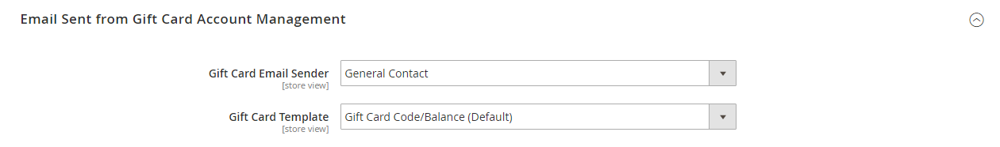

# [!UICONTROL Sales] > [!UICONTROL Gift Cards]

{{ee-feature}}

{{config}}

## [!UICONTROL Gift Card Email Settings]

<!-- zoom -->

<!-- [Gift Card Email Settings](https://docs.magento.com/user-guide/catalog/product-gift-card-account-configuration.html) -->

| Campo | [Escopo](../../getting-started/websites-stores-views.md#scope-settings) | Descrição |
|--- |--- |--- |
| [!UICONTROL Gift Card Notification Email Sender] | Exibição da loja | Identifica o [armazenar contato](../../getting-started/store-details.md#store-email-addresses) que aparece como o remetente do email de notificação do cartão-presente. Valor padrão: `General Contact` |
| [!UICONTROL Gift Card Notification Email Template] | Exibição da loja | Determina o [modelo](../../systems/email-templates.md) que é usado para o email de notificação de cartão-presente. |

{:style=&quot;table-layout:auto&quot;}

## [!UICONTROL Gift Card General Settings]

<!-- zoom -->

<!-- [Gift Card General Settings](https://docs.magento.com/user-guide/catalog/product-gift-card-account-configuration.html) -->

| Campo | [Escopo](../../getting-started/websites-stores-views.md#scope-settings) | Descrição |
|--- |--- |--- |
| [!UICONTROL Redeemable] | Global | Determina se o portador do cartão-presente pode resgatar seu valor em dinheiro. Opções: `Yes` / `No`. |
| [!UICONTROL Lifetime (days)] | Global | Determina o número de dias que o cartão é válido. Se deixado em branco, o cartão não expira.   **_Importante:_**Em alguns lugares, é ilegal definir dados de expiração em cartões-presente. Verifique suas leis locais antes de definir uma vida útil para seus cartões-presente. |
| [!UICONTROL Allow Gift Message] | Exibição da loja | Determina se a opção para incluir uma mensagem de presente está disponível para clientes que compram um cartão-presente. Opções: `Yes` / `No`. |
| [!UICONTROL Gift Message Maximum Length] | Exibição da loja | Determina o número máximo de caracteres permitidos em uma mensagem de cartão-presente. Valor padrão: 255 |
| [!UICONTROL Generate Gift Card Account when Order Item is] | Global | Determina se uma conta de cartão-presente é gerada quando um cliente faz um pedido ou quando o pedido é faturado. Opções: `Ordered` / `Invoiced` |

{:style=&quot;table-layout:auto&quot;}

## [!UICONTROL Email Sent from Gift Card Account Management]

<!-- zoom -->

<!-- [Email Sent from Gift Card Account Management](https://docs.magento.com/user-guide/catalog/product-gift-card-account-configuration.html) -->

| Campo | [Escopo](../../getting-started/websites-stores-views.md#scope-settings) | Descrição |
|--- |--- |--- |
| [!UICONTROL Gift Card Email Sender] | Exibição da loja | Identifica o [armazenar contato](../../getting-started/store-details.md#store-email-addresses) que aparece como o remetente do email do cartão-presente. Valor padrão: `General Contact` |
| [!UICONTROL Gift Card Template] | Exibição da loja | Determina o [modelo](../../systems/email-templates.md) que é usado para o email do cartão-presente. |

{:style=&quot;table-layout:auto&quot;}

## [!UICONTROL Gift Card Account General Settings]

<!-- zoom -->

<!-- [Gift Card Account General Settings](https://docs.magento.com/user-guide/catalog/product-gift-card-account-configuration.html) -->

| Campo | [Escopo](../../getting-started/websites-stores-views.md#scope-settings) | Descrição |
|--- |--- |--- |
| [!UICONTROL Code Length] | Global | Determina o comprimento do código do cartão-presente. |
| [!UICONTROL Code Format] | Global | Determina o formato do código do cartão-presente. Opções: `Alphanumeric` / `Numeric` |
| [!UICONTROL Code Prefix] | Global | Define qualquer prefixo adicionado ao início do código. |
| [!UICONTROL Code Suffix] | Global | Define qualquer sufixo adicionado ao final do código. |
| [!UICONTROL Dash Every X Characters] | Global | Se você quiser incluir traços no código, o determinará o número de caracteres entre cada traço. |
| [!UICONTROL New Pool Size] | Global | Determina o tamanho do novo pool de códigos a ser gerado. |
| [!UICONTROL Low Code Pool Threshold] | Global | Determina o número de registros no pool de códigos que aciona um alerta de que o pool precisa ser reabastecido. |
| [!UICONTROL Generate] | Global | Clique em para gerar a lista de códigos de cartão-presente. |

{:style=&quot;table-layout:auto&quot;}
