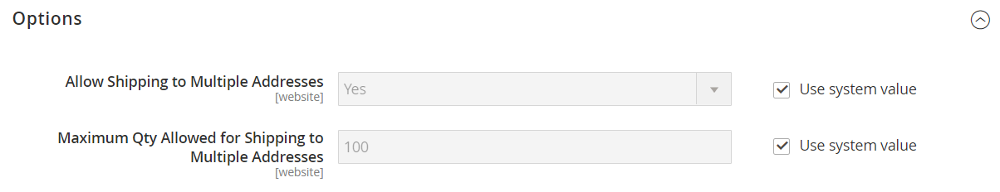

# [!UICONTROL Sales] > [!UICONTROL Multishipping Settings]

{{config}}

Para obter informações detalhadas sobre como definir essas configurações de envio múltiplo para sua loja, consulte [Vários endereços](../../stores-purchase/shipping-settings.md#multiple-addresses).

## [!UICONTROL Options]

<!-- zoom -->

<!-- [Options](https://experienceleague.adobe.com/en/docs/commerce-admin/stores-sales/delivery/shipping-settings#multiple-addresses) -->

| Campo | [Escopo](../../getting-started/websites-stores-views.md#scope-settings) | Descrição |
|--- |--- |--- |
| [!UICONTROL Allow Shipping to Multiple Addresses] | Site | Determina se você permite que pedidos únicos sejam enviados para vários endereços (somente clientes registrados). Opções: `Yes` / `No` |
| [!UICONTROL Maximum Qty Allowed for Shipping to Multiple Addresses] | Site | Define um limite para o número de unidades de um produto que podem ser enviadas para vários endereços. |

{style="table-layout:auto"}

>[!NOTE]
>
> (Disponível somente com o Adobe Commerce B2B) Para pedidos com vários endereços de remessa, o método de pagamento [Pagamento na Conta](../../b2b/enable-basic-features.md#configure-payment-on-account), mesmo se habilitado, não estará disponível durante o check-out.
