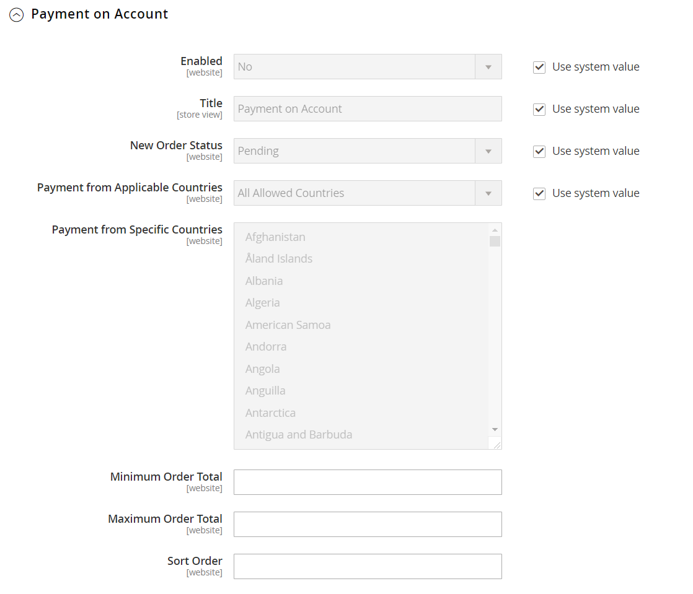

# [!UICONTROL Sales] > [!UICONTROL Payment Methods]

>[!TIP]
>
>Os Payment Services for Adobe Commerce and Magento Open Source fornecem uma solução de autoatendimento pronta para uso, incluindo teste de sandbox e uma configuração simples, para fornecer um processamento de pagamento robusto e seguro. Para saber mais sobre este poderoso conjunto de ferramentas e como ele pode fornecer a você o controle e a insight necessários para criar a melhor experiência para seus compradores, consulte o [_Guia do Usuário dos Serviços de Pagamento_](https://experienceleague.adobe.com/docs/commerce/payment-services/guide-overview.html?lang=pt-BR).

{{config}}

## [!UICONTROL Merchant Location]

[!BADGE Somente PaaS]{type=Informative url="https://experienceleague.adobe.com/pt-br/docs/commerce/user-guides/product-solutions" tooltip="Aplica-se somente a projetos do Adobe Commerce na nuvem (infraestrutura do PaaS gerenciada pela Adobe) e a projetos locais."}

<!-- zoom -->

<!-- [Merchant Location](https://experienceleague.adobe.com/pt-br/docs/commerce-admin/start/setup/store-details#merchant-location) -->

| Campo | [Escopo](../../getting-started/websites-stores-views.md#scope-settings) | Descrição |
|--- |--- |--- |
| [!UICONTROL Merchant Country] | Site | Identifica o país onde o comerciante está registrado para realizar negócios. |

{style="table-layout:auto"}

## Soluções recomendadas

As seguintes soluções de pagamento são recomendadas como uma maneira fácil para os comerciantes que estão apenas começando a aceitar o pagamento online por conta PayPal ou cartão de crédito. À medida que sua empresa cresce, você pode combiná-los com soluções de pagamento PayPal adicionais.

- [Payment Services](payment-services.md)
- [!BADGE Somente PaaS]{type=Informative url="https://experienceleague.adobe.com/pt-br/docs/commerce/user-guides/product-solutions" tooltip="Aplica-se somente a projetos do Adobe Commerce na nuvem (infraestrutura do PaaS gerenciada pela Adobe) e a projetos locais."} [Check-out do PayPal Express](paypal-express-checkout.md)
- [!BADGE Somente PaaS]{type=Informative url="https://experienceleague.adobe.com/pt-br/docs/commerce/user-guides/product-solutions" tooltip="Aplica-se somente a projetos do Adobe Commerce na nuvem (infraestrutura do PaaS gerenciada pela Adobe) e a projetos locais."} [Braintree](braintree.md)

>[!NOTE]
>
>Algumas integrações de pagamento e extensões agrupadas foram removidas nas versões 2.4.x e movidas para o Commerce Marketplace. Você pode encontrar as últimas extensões oficiais de integração de pagamento no [Commerce Marketplace](https://marketplace.magento.com/extensions/payments-security.html){:target="_blank"}.
> 
>**Amazon Pay** e **Klarna**: as versões 2.4.0 a 2.4.3 da Adobe Commerce e do Magento Open Source incluíam essas extensões desenvolvidas pelo fornecedor. A partir da versão 2.4.4, essas extensões não serão mais agrupadas com a versão principal e deverão ser instaladas e atualizadas do Commerce Marketplace. O Marketplace também fornece acesso à documentação atual fornecida pelo desenvolvedor da extensão.
> 
>Se você tiver uma dessas extensões agrupadas habilitadas e configuradas, atualize o arquivo `composer.json` como parte do processo de atualização 2.4.4 e gerencie as atualizações de extensão a partir de agora. Consulte [Atualizar módulos](https://experienceleague.adobe.com/docs/commerce-operations/upgrade-guide/modules/upgrade.html?lang=pt-BR) no _Guia de Atualização_ para obter mais informações. 
> 
>**Worldpay**, **Eway**, **CyberSource** e **Authorize.Net**: para obter detalhes sobre como fazer uma transição segura dessas integrações de pagamento, consulte o [DevBlog](https://community.magento.com/t5/Magento-DevBlog/Deprecation-of-Magento-core-payment-integrations/ba-p/426445){:target="_blank"}.

## Outros métodos do PayPal

[!BADGE Somente PaaS]{type=Informative url="https://experienceleague.adobe.com/pt-br/docs/commerce/user-guides/product-solutions" tooltip="Aplica-se somente a projetos do Adobe Commerce na nuvem (infraestrutura do PaaS gerenciada pela Adobe) e a projetos locais."}

PayPal oferece várias soluções de pagamento que atendem às necessidades de empresas de todos os portes, e que estão envolvidas em negócios em todo o mundo. PayPal oferece a capacidade de aceitar pagamentos de todos os principais cartões de débito e crédito. O PayPal oferece conveniência adicional sem esforço extra, porque até mesmo os clientes que não têm uma conta do PayPal podem pagar suas compras com o PayPal.

### Métodos multifuncionais PayPal

[!BADGE Somente PaaS]{type=Informative url="https://experienceleague.adobe.com/pt-br/docs/commerce/user-guides/product-solutions" tooltip="Aplica-se somente a projetos do Adobe Commerce na nuvem (infraestrutura do PaaS gerenciada pela Adobe) e a projetos locais."}

- [Pagamento avançado do PayPal](paypal-payments-advanced.md)
- [PayPal Payments Pro](paypal-payments-pro.md)
- [PayPal Payments Standard](paypal-payments-standard.md)

### Gateways de pagamento do PayPal

[!BADGE Somente PaaS]{type=Informative url="https://experienceleague.adobe.com/pt-br/docs/commerce/user-guides/product-solutions" tooltip="Aplica-se somente a projetos do Adobe Commerce na nuvem (infraestrutura do PaaS gerenciada pela Adobe) e a projetos locais."}

- [PayPal Payflow Pro](paypal-payflow-pro.md) (Inclui Check-out Expresso)
- [Link do Fluxo de Pagamento do PayPal](paypal-payflow-link.md) (Inclui Check-out Expresso)

## Métodos de pagamento de base

Os métodos de pagamento a seguir são criados no Commerce e não usam um provedor de serviço de pagamento de terceiros para processar a transação. Muitos dos métodos de pagamento básicos são gerenciados off-line, em vez de on-line.

### [!UICONTROL Check / Money Order]

<!-- zoom -->

<!-- [Check / Money Order](https://experienceleague.adobe.com/pt-br/docs/commerce-admin/stores-sales/payments/offline/check-money-order) -->

| Campo | [Escopo](../../getting-started/websites-stores-views.md#scope-settings) | Descrição |
|--- |--- |--- |
| [!UICONTROL Enabled] | Site | Determina se os clientes podem pagar com cheque ou ordem de pagamento. Opções: `Yes` / `No` |
| [!UICONTROL Title] | Exibição da loja | O nome deste método de pagamento que aparece para os clientes durante a finalização da compra. |
| [!UICONTROL New Order Status] | Site | Determina o [status do pedido](../../stores-purchase/order-status.md) inicial atribuído a pedidos pagos por cheque ou ordem de pagamento. Valor padrão: `Pending` |
| [!UICONTROL Payment from Applicable Countries] | Site | Determina os países dos quais você aceita pagamento por cheque ou ordem de pagamento. Opções: `All Allowed Countries` / `Specific Countries` |
| [!UICONTROL Payment from Specific Countries] | Site | Identifica os países específicos a partir dos quais você aceita pagamento por cheque ou ordem de pagamento. |
| [!UICONTROL Make Check Payable to] | Exibição da loja | O nome da entidade a quem os cheques e as ordens de pagamento devem ser pagos. |
| [!UICONTROL Send Check to] | Exibição da loja | O endereço ou caixa postal para o qual os cheques e as ordens de pagamento devem ser enviados. |
| [!UICONTROL Minimum Order Total] | Site | O menor valor do pedido que pode ser pago por cheque ou ordem de pagamento. |
| [!UICONTROL Maximum Order Total] | Site | O maior valor de ordem que pode ser pago por cheque ou ordem de pagamento.   **_Observação:_**&#x200B;um pedido é qualificado se o total estiver entre, ou corresponder, ao total mínimo ou máximo do pedido. |
| [!UICONTROL Sort Order] | Site | Um número que determina a ordem em que o pagamento por cheque ou ordem de pagamento é exibido quando listado com outros métodos de pagamento durante a finalização da compra. Digite `0` para colocá-lo no topo da lista. |

{style="table-layout:auto"}

### [!UICONTROL Bank Transfer Payment]

<!-- zoom -->

<!-- [Bank Transfer Payment](https://experienceleague.adobe.com/pt-br/docs/commerce-admin/stores-sales/payments/offline/bank-transfer) -->

| Campo | [Escopo](../../getting-started/websites-stores-views.md#scope-settings) | Descrição |
|--- |--- |--- |
| [!UICONTROL Enabled] | Site | Determina se os clientes podem pagar transferindo o pagamento diretamente do banco para a conta do comerciante. Opções: `Yes` / `No` |
| [!UICONTROL Title] | Exibição da loja | O nome deste método de pagamento que aparece para os clientes durante a finalização da compra. |
| [!UICONTROL New Order Status] | Site | Determina o status inicial do pedido atribuído a pedidos pagos por transferência bancária. Valor padrão: `Pending` |
| [!UICONTROL Payment from Applicable Countries] | Site | Determina os países dos quais você aceita pagamento por transferência bancária. Opções: `All Allowed Countries` / `Specific Countries` |
| [!UICONTROL Payment from Specific Countries] | Site | Identifica os países específicos dos quais você aceita pagamento por transferência bancária. |
| [!UICONTROL Minimum Order Total] | Site | O menor valor de ordem que pode ser pago por transferência bancária. |
| [!UICONTROL Maximum Order Total] | Site | O maior valor de ordem que pode ser pago por transferência bancária.   **_Observação:_**&#x200B;um pedido é qualificado se o total estiver entre, ou corresponder, ao total mínimo ou máximo do pedido. |
| [!UICONTROL Sort Order] | Site | Um número que determina a ordem em que o pagamento por transferência bancária é exibido quando listado com outros métodos de pagamento durante a finalização da compra. Digite `0` para colocá-lo no topo da lista. |

{style="table-layout:auto"}

### [!UICONTROL Payment on Account]

{{b2b-feature}}

<!-- zoom -->

<!-- [Payment on Account](https://experienceleague.adobe.com/pt-br/docs/commerce-admin/b2b/enable-basic-features#configure-payment-on-account) -->

| Campo | [Escopo](../../getting-started/websites-stores-views.md#scope-settings) | Descrição |
|--- |--- |--- |
| [!UICONTROL Enabled] | Site | Determina se as empresas podem usar o crédito da empresa para fazer compras. Opções: `Yes` / `No` |
| [!UICONTROL Title] | Exibição da loja | O nome deste método de pagamento que aparece para os clientes durante a finalização da compra. |
| [!UICONTROL New Order Status] | Site | Determina o status de novos pedidos cobrados em uma conta da empresa. Opções: `Pending (default)` / `Processing` / `Suspected Fraud` |
| [!UICONTROL Payment from Applicable Countries] | Site | Determina os países nos quais você permite que as empresas debitem as compras de suas contas. Opções: `All Allowed Countries` / `Specific Countries` |
| [!UICONTROL Payment from Specific Countries] | Site | Identifica os países específicos em que as empresas podem cobrar compras em suas contas. |
| [!UICONTROL Minimum Order Total] | Site | Especifica o menor valor de pedido que pode ser cobrado em uma conta de empresa. |
| [!UICONTROL Maximum Order Total] | Site | O maior valor de pedido que pode ser cobrado em uma conta de empresa.   **_Observação:_**&#x200B;um pedido é qualificado se o total estiver entre, ou corresponder, ao total mínimo ou máximo do pedido. |
| [!UICONTROL Sort Order] | Site | Um número que determina a ordem em que o pagamento por conta é exibido quando listado com outros métodos de pagamento durante a finalização da compra. Digite `0` para colocá-lo no topo da lista. |

{style="table-layout:auto"}

>[!NOTE]
>
>O pagamento por conta não é suportado para pedidos com [vários endereços de envio](../../stores-purchase/shipping-settings.md#multiple-addresses) e não aparece entre as opções de pagamento.

### [!UICONTROL Cash On Delivery Payment]

<!-- zoom -->

<!-- [Cash On Delivery Payment](../../stores-purchase/cash-on-delivery.html) -->

| Campo | [Escopo](../../getting-started/websites-stores-views.md#scope-settings) | Descrição |
|--- |--- |--- |
| [!UICONTROL Enabled] | Site | Determina se os clientes podem pagar transferindo o pagamento diretamente do banco para a conta do comerciante. Opções: `Yes` / `No` |
| [!UICONTROL Title] | Exibição da loja | O nome deste método de pagamento que aparece para os clientes durante a finalização da compra. |
| [!UICONTROL New Order Status] | Site | Determina o status inicial do pedido atribuído a pedidos pagos por transferência bancária. Valor padrão: `Pending` |
| [!UICONTROL Payment from Applicable Countries] | Site | Determina os países dos quais você aceita pagamento por transferência bancária. Opções: `All Allowed Countries` / `Specific Countries` |
| [!UICONTROL Payment from Specific Countries] | Site | Identifica os países específicos dos quais você aceita pagamento por transferência bancária. |
| [!UICONTROL Minimum Order Total] | Site | Especifica o menor valor de ordem que pode ser pago por transferência bancária. |
| [!UICONTROL Maximum Order Total] | Site | O maior valor de ordem que pode ser pago por transferência bancária.   **_Observação:_**&#x200B;um pedido é qualificado se o total estiver entre, ou corresponder, ao total mínimo ou máximo do pedido. |
| [!UICONTROL Sort Order] | Site | Um número que determina a ordem em que o pagamento por transferência bancária é exibido quando listado com outros métodos de pagamento durante a finalização da compra. Digite `0` para colocá-lo no topo da lista. |

{style="table-layout:auto"}

### [!UICONTROL Zero Subtotal Checkout]

<!-- zoom -->

<!-- [Zero Subtotal Checkout](../../stores-purchase/zero-subtotal-checkout.html) -->

| Campo | [Escopo](../../getting-started/websites-stores-views.md#scope-settings) | Descrição |
|--- |--- |--- |
| [!UICONTROL Title] | Exibição da loja | O nome usado para este método de pagamento durante o check-out. Valor padrão: Nenhuma Informação de Pagamento Necessária |
| [!UICONTROL Enabled] | Site | Determina se o Check-out de Subtotal Zero está disponível para que o administrador da loja gerencie pedidos que têm um subtotal igual a zero, como um que foi tributado, mas um desconto reduziu o valor para zero. Opções: `Yes` / `No` |
| [!UICONTROL New Order Status] | Site | Determina o status inicial do pedido atribuído aos pedidos processados como Checkout de subtotal zero. Valor padrão: `Pending` |
| [!UICONTROL Payment from Applicable Countries] | Site | Determina os países a partir dos quais o Check-out de Subtotal Zero pode ser aplicado. Opções: `All Allowed Countries` / `Specific Countries` |
| [!UICONTROL Payment from Specific Countries] | Site | Identifica os países específicos para os quais o Check-out de Subtotal Zero pode ser aplicado. |
| [!UICONTROL Sort Order] | Site | Um número que determina a ordem em que o título, como &quot;Nenhuma Informação de Pagamento é Necessária&quot;, é exibido quando listado com outros métodos de pagamento durante a finalização da compra. Digite `0` para colocá-lo no topo da lista. |

{style="table-layout:auto"}

## [!UICONTROL Payment actions]

[!BADGE Somente PaaS]{type=Informative url="https://experienceleague.adobe.com/pt-br/docs/commerce/user-guides/product-solutions" tooltip="Aplica-se somente a projetos do Adobe Commerce na nuvem (infraestrutura do PaaS gerenciada pela Adobe) e a projetos locais."}

As ações de pagamento estão configuradas _por método de pagamento_. A ação de pagamento determina quando os fundos são capturados e quando as NFFs são criadas para suas ordens de venda.

Consulte a seção Configurações básicas de cada tópico de método de pagamento individual para obter uma lista abrangente de opções de configuração individuais.

| Ação de pagamento | Descrição |
|--- |---|
| [!UICONTROL Authorization] | Aprova a compra, mas retém os fundos. O valor não é sacado até que seja capturado pelo comerciante. |
| [!UICONTROL Authorize] | Autoriza a conta do comprador para o total do pedido, mas não captura o pagamento. Capturar pagamento criando uma NFF. As ordens autorizadas podem ser anuladas ou canceladas. |
| [!UICONTROL Authorize and Capture] | Autoriza a conta do comprador para o total do pedido e captura o pagamento. Uma NFF é criada automaticamente. Você pode reembolsar fundos capturados por meio de um aviso de crédito. Não é possível cancelar um pedido depois que o pagamento é capturado. |
| [!UICONTROL Charge on shipment] | A Amazon recebe uma solicitação de captura e cobra do cliente quando uma fatura é criada no Commerce. |
| [!UICONTROL Charge on order] | A Amazon cria a fatura e cobra o cliente quando o pedido é feito. |
| [!UICONTROL Not Capture] | Quando a fatura é enviada, o sistema não captura o pagamento. Pressupõe-se que você capture o pagamento por meio do Commerce posteriormente. Há um botão Capturar na fatura concluída. Antes de capturar, você pode cancelar a NFF. Depois de capturar, você pode criar um aviso de crédito e anular a NFF. |
| [!UICONTROL Order] | Representa um acordo com o PayPal que permite que o comerciante capture um ou mais valores até o total do pedido da conta do comprador do cliente, dentro de um período de tempo definido (até 29 dias). |
| [!UICONTROL Sale] | O valor da compra é autorizado e imediatamente retirado da conta do cliente. |

{style="table-layout:auto"}

>[!NOTE]
>
>Não selecione a opção _[!UICONTROL Not Capture]_, a menos que tenha certeza de que capturará o pagamento por meio do Commerce posteriormente. Você não pode criar um aviso de crédito até que o pagamento tenha sido capturado usando o botão Capturar.

## [!UICONTROL Purchase Order]

<!-- zoom -->

<!-- [Purchase Order](../../stores-purchase/purchase-order.html) -->

| Campo | [Escopo](../../getting-started/websites-stores-views.md#scope-settings) | Descrição |
|--- |--- |--- |
| [!UICONTROL Enabled] | Site | Determina se os clientes podem pagar por ordem de compra (OC). Opções: `Yes` / `No` |
| [!UICONTROL Title] | Exibição da loja | O nome deste método de pagamento que aparece para os clientes durante a finalização da compra. |
| [!UICONTROL New Order Status] | Site | Determina o [status do pedido](../../stores-purchase/order-status.md) inicial atribuído a pedidos pagos por OC. Valor padrão: Pendente |
| [!UICONTROL Payment from Applicable Countries] | Site | Determina os países a partir dos quais você aceita pagamento por OC. Opções: `All Allowed Countries` / `Specific Countries` |
| [!UICONTROL Payment from Specific Countries] | Site | Identifica os países específicos a partir dos quais você aceita pagamento por OC. |
| [!UICONTROL Minimum Order Total] | Site | O menor valor de ordem que pode ser pago por OC. |
| [!UICONTROL Maximum Order Total] | Site | O maior valor de ordem que pode ser pago por OC.   **_Observação:_**&#x200B;um pedido é qualificado se o total estiver entre, ou corresponder, ao total mínimo ou máximo do pedido. |
| [!UICONTROL Sort Order] | Site | Um número que determina a ordem em que o pagamento por OC é exibido quando listado com outros métodos de pagamento durante a finalização da compra. Digite `0` para colocá-lo no topo da lista. |

{style="table-layout:auto"}
