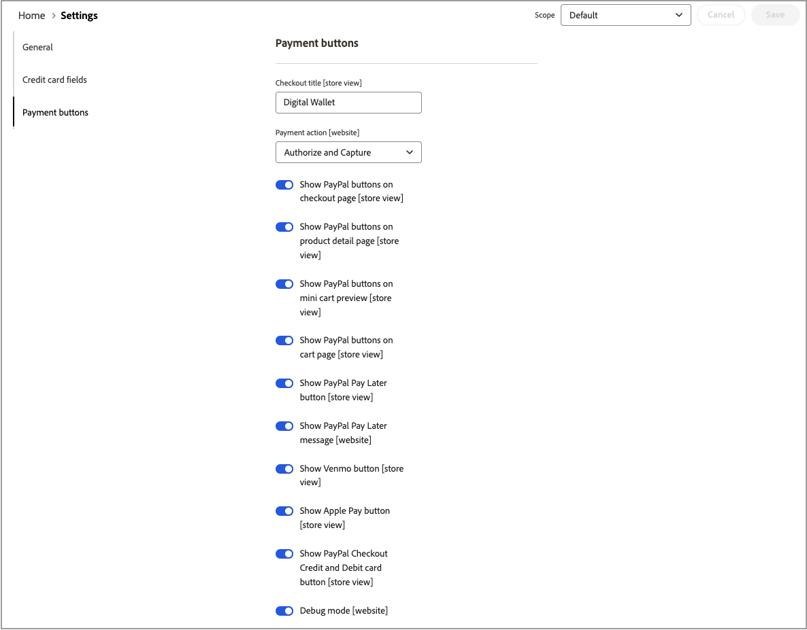

# [!UICONTROL Sales] > [!UICONTROL Payment Methods] > [!UICONTROL Payment Services]

Os Serviços de pagamento fornecem uma solução de autoatendimento pronta para uso, incluindo teste de sandbox e uma configuração simples, para fornecer um processamento de pagamento robusto e seguro. Para saber mais, consulte o [_Guia do Usuário dos Serviços de Pagamento_](https://experienceleague.adobe.com/docs/commerce/payment-services/guide-overview.html?lang=pt-BR).

Para acessar as definições de configuração para Serviços de Pagamento, na barra lateral _Admin_, vá para **[!UICONTROL Sales]** > **[!UICONTROL Payment Services]** e clique em **[!UICONTROL Settings]**.

{width="400"}

>[!NOTE]
>
>Para usar a configuração Herdada em vez de [Configurações](https://experienceleague.adobe.com/docs/commerce/payment-services/configure/settings.html?lang=pt-BR), consulte [Configuração Herdada](https://experienceleague.adobe.com/docs/commerce/payment-services/configure/configure-admin.html?lang=pt-BR).

## [!UICONTROL General]

{width="600" zoomable="yes"}

| Campo | [Escopo](../../getting-started/websites-stores-views.md#scope-settings) | Descrição |
|---|---|---|
| [!UICONTROL Enable] | site | Habilite ou desabilite o [!DNL Payment Services] para o seu site. Opções: [!UICONTROL Yes] / [!UICONTROL No] |
| [!UICONTROL Payment mode] | exibição de loja | Defina o método ou ambiente para sua loja. Opções: [!UICONTROL Sandbox] / [!UICONTROL Production] |
| [!UICONTROL Sandbox Merchant ID] | exibição de loja | Sua ID de comerciante de sandbox, que é gerada automaticamente durante a integração da sandbox. |
| [!UICONTROL Production Merchant ID] | exibição de loja | Sua ID de comerciante de produção, que é gerada automaticamente durante a integração da sandbox. |
| [!UICONTROL Soft Descriptor] | exibição de site ou loja | Adicione um descritor simples aos sites e visualizações da loja que forneça informações para transações do cliente e defina marcas, lojas ou linhas de produtos. A opção [!UICONTROL Use website] aplica qualquer descritor simples adicionado no nível do site. A opção [!UICONTROL Use default] aplica qualquer descritor simples adicionado como padrão. |

{style="table-layout:auto"}

## [!UICONTROL Credit card fields]

{width="600" zoomable="yes"}

| Campo | [Escopo](../../getting-started/websites-stores-views.md#scope-settings) | Descrição |
|---|---|---|
| [!UICONTROL Title] | exibição de loja | Adicione o texto para exibição como o título desta opção de pagamento na exibição de Método de Pagamento durante a finalização da compra. |
| [!UICONTROL Payment Action] | site | A [ação de pagamento](payment-methods.md#payment-actions) para o método de pagamento especificado. Opções: [!UICONTROL Authorize] / [!UICONTROL Authorize and Capture] |
| [!UICONTROL 3DS Secure authentication] | site | Habilite ou desabilite a [autenticação Segura do 3DS](https://experienceleague.adobe.com/docs/commerce/payment-services/security-compliance/security.html?lang=pt-BR#3ds). Opções: [!UICONTROL Always] / [!UICONTROL When Required] / [!UICONTROL Off] |
| [!UICONTROL Show on checkout page] | site | Ative ou desative os campos de cartão de crédito para serem exibidos na página de check-out. Opções: [!UICONTROL Yes] / [!UICONTROL No] |
| [!UICONTROL Vault enabled] | exibição de loja | Habilite ou desabilite o [cofre de cartão de crédito](https://experienceleague.adobe.com/docs/commerce/payment-services/payments-checkout/vaulting.html?lang=pt-BR). Opções: [!UICONTROL Yes] / [!UICONTROL No] |
| [!UICONTROL Show vaulted payment methods in Admin] | exibição de loja | Habilite ou desabilite a capacidade de concluir pedidos de clientes no Administrador [usando um método de pagamento com cofre](https://experienceleague.adobe.com/docs/commerce/payment-services/payments-checkout/vaulting.html?lang=pt-BR). Opções: [!UICONTROL Yes] / [!UICONTROL No] |
| [!UICONTROL Debug Mode] | site | Ative ou desative o modo de depuração. Opções: [!UICONTROL Yes] / [!UICONTROL No] |

{style="table-layout:auto"}

## [!UICONTROL Payment buttons]

{width="600" zoomable="yes"}

| Campo | [Escopo](../../getting-started/websites-stores-views.md#scope-settings) | Descrição |
|---|---|---|
| [!UICONTROL Title] | exibição de loja | Adicione o texto a ser exibido como o título para esta opção de pagamento na exibição de Método de Pagamento durante a finalização da compra. |
| [!UICONTROL Payment Action] | site | A [ação de pagamento](payment-methods.md#payment-actions){target="_blank"} para o método de pagamento especificado. Opções: [!UICONTROL Authorize] / [!UICONTROL Authorize and Capture] |
| [!UICONTROL Show PayPal buttons on checkout page] | exibição de loja | Habilite ou desabilite [!DNL PayPal Smart Buttons] na página de check-out. Opções: [!UICONTROL &#x200B; Yes] / [!UICONTROL No] |
| [!UICONTROL Show PayPal buttons on product detail page] | exibição de loja | Habilite ou desabilite [!DNL PayPal Smart Buttons] na página de detalhes do produto. Opções: [!UICONTROL &#x200B; Yes] / [!UICONTROL No] |
| [!UICONTROL Show PayPal buttons in mini-cart preview] | exibição de loja | Habilite ou desabilite [!DNL PayPal Smart Buttons] na visualização do minicarrinho. Opções: [!UICONTROL Yes] / [!UICONTROL No] |
| [!UICONTROL Show PayPal buttons on cart page] | exibição de loja | Habilite ou desabilite [!DNL PayPal Smart Buttons] na página do carrinho. Opções: [!UICONTROL Yes] / [!UICONTROL No] |
| [!UICONTROL Show PayPal Pay Later button] | exibição de loja | Ativar ou desativar a aparência da opção de pagamento pagar mais tarde, onde os botões de pagamento são exibidos. Opções: [!UICONTROL Yes] / [!UICONTROL No] |
| [!UICONTROL Show PayPal Pay Later Message] | site | Ative ou desative a mensagem Pagar mais tarde no carrinho de compras, página do produto, minicarrinho e durante o fluxo de finalização. Opções: [!UICONTROL Yes] / [!UICONTROL No] |
| [!UICONTROL Show Venmo button] | exibição de loja | Habilite ou desabilite a opção de pagamento Venmo onde os botões de pagamento são exibidos. Opções: [!UICONTROL Yes] / [!UICONTROL No] |
| [!UICONTROL Show Apple Pay button] | exibição de loja | Ative ou desative a opção Pagamento Apple onde os botões de pagamento são exibidos. Opções: [!UICONTROL Yes] / [!UICONTROL No] |
| [!UICONTROL Show PayPal Credit and Debit card button] | exibição de loja | Ative ou desative a opção de pagamento com cartão de Crédito e Débito onde os botões de pagamento são exibidos. Opções: [!UICONTROL Yes] / [!UICONTROL No] |
| [!UICONTROL Debug Mode] | site | Ative ou desative o Modo de depuração. Opções: [!UICONTROL Yes] / [!UICONTROL No] |

{style="table-layout:auto"}

## [!UICONTROL PayPal Smart Button Styling]

{width="600" zoomable="yes"}

| Campo | [Escopo](../../getting-started/websites-stores-views.md#scope-settings) | Descrição |
|--- |--- |--- |
| [!UICONTROL Layout] | Exibição da loja | Definir estilo de layout para botões de pagamento. Opções: [!UICONTROL Vertical] / [!UICONTROL Horizontal] |
| [!UICONTROL Tagline] | Exibição da loja | Ativar/desativar slogan. Opções: [!UICONTROL Yes] / [!UICONTROL No] |
| [!UICONTROL Color] | Exibição da loja | Defina a cor dos botões de pagamento. Opções: [!UICONTROL Blue] / [!UICONTROL Gold] / [!UICONTROL Silver] / [!UICONTROL White] / [!UICONTROL Black] |
| [!UICONTROL Shape] | Exibição da loja | Definir a forma dos botões de pagamento. Opções: [!UICONTROL Rectangular] / [!UICONTROL Pill] |
| [!UICONTROL Responsive Button Height] | Exibição da loja | Define se os botões de pagamento usarão uma altura padrão. Opções: [!UICONTROL Yes] / [!UICONTROL No] |
| [!UICONTROL Height] | Exibição da loja | Defina a altura dos botões de pagamento. Valor padrão: nenhum |
| [!UICONTROL Label] | Exibição da loja | Defina o rótulo que aparece nos botões de pagamento. Opções: [!UICONTROL PayPal] / [!UICONTROL Checkout] / [!UICONTROL Buynow] / [!UICONTROL Pay] / [!UICONTROL Installment] |

{style="table-layout:auto"}
