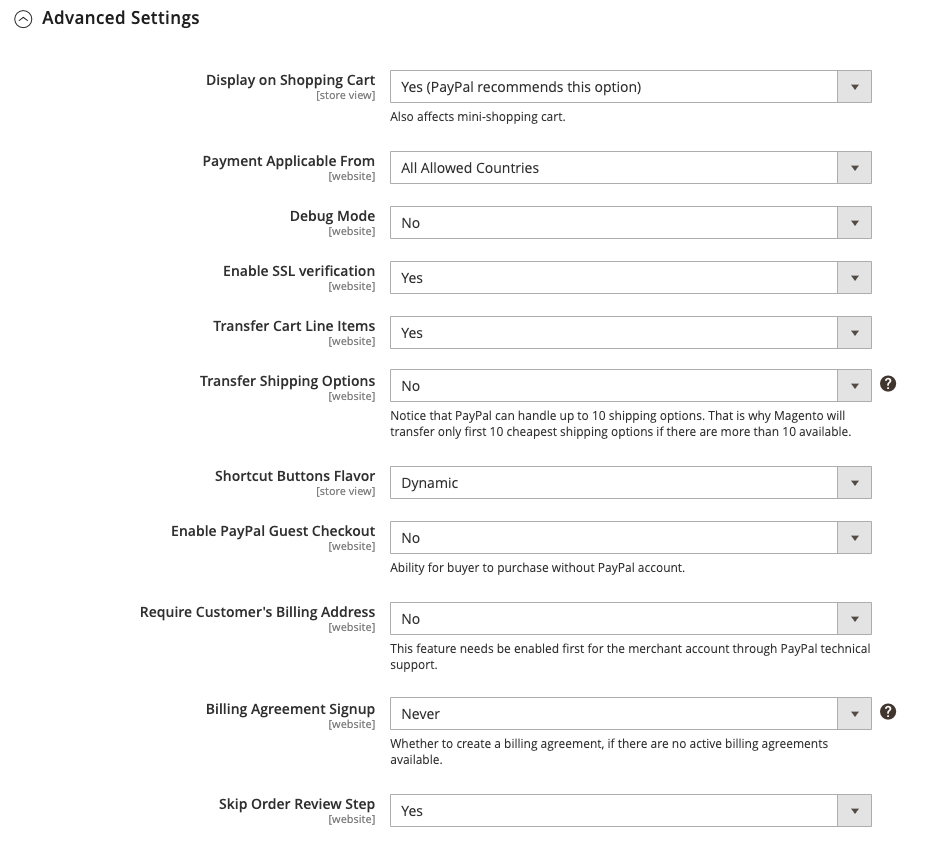
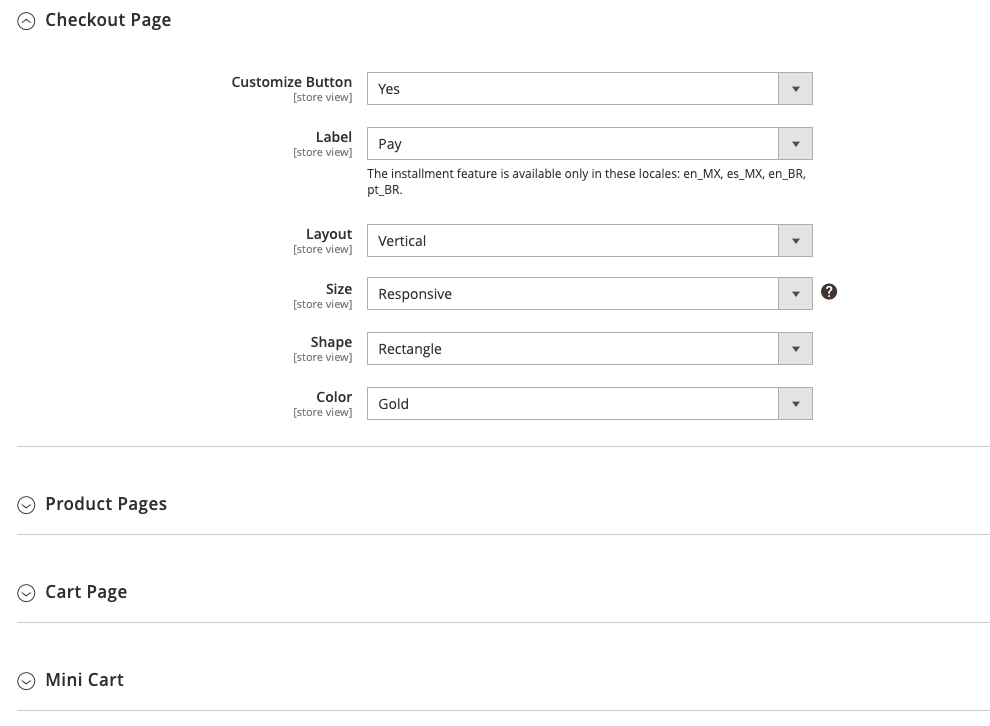

# [!UICONTROL Sales] > [!UICONTROL Payment Methods] > [!UICONTROL PayPal Express Checkout]

>[!IMPORTANT]
>
>**Requisitos de PSD2:**  
>A partir de 14 de setembro de 2019, os bancos europeus poderão recusar pagamentos que não atendam [PSD 2](../../getting-started/compliance-payment-services-directive.md) requisitos. Nenhuma ação é necessária para que o Check-out do PayPal Express esteja em conformidade com o PSD2, pois todos os requisitos são tratados pelo PayPal.

{{config}}

## [!UICONTROL Required PayPal Settings]

<!-- zoom -->

<!-- [PayPal Express Checkout Required Settings](../../stores-purchase/paypal-express-checkout.html) -->

| Campo | [Escopo](../../getting-started/websites-stores-views.md#scope-settings) | Descrição |
|--- |--- |--- |
| [!UICONTROL Enable this Solution] | Site | Ativa [!DNL PayPal Express Checkout] como um método de pagamento disponível para seus clientes. Opções: `Yes` / `No` |
| [!UICONTROL Enable In-Context Checkout Experience] | Site | Ativa a Finalização de compra simplificada em contexto do PayPal como um método de pagamento disponível para seus clientes. Opções: `Yes` / `No` |
| [!UICONTROL Enable PayPal Credit] | Site | Ativa o Crédito do PayPal para permitir que os clientes comprem agora, mas paguem depois. Você é pago antecipadamente, mas os clientes têm mais tempo para pagar. Opções: `Yes` / `No` |

{style="table-layout:auto"}

### [!UICONTROL Express Checkout]

| Campo | [Escopo](../../getting-started/websites-stores-views.md#scope-settings) | Descrição |
|--- |--- |--- |
| [!UICONTROL Email Associated with PayPal Merchant Account] | Site | Especifica o endereço de email especificado quando sua conta de comerciante do PayPal foi estabelecida. O endereço de email diferencia maiúsculas de minúsculas e deve corresponder exatamente ao seu endereço de email no sistema PayPal. |
| [!UICONTROL API Authentication Methods] | Site | Determina o método usado para autenticação da API. Opções:  **`API Signature`**- Exibe o _[!UICONTROL API Signature]_no formulário. **`API Certificate`**- Exibe o_[!UICONTROL API Certificate]_ no formulário. |
| [!UICONTROL API Username] | Site | O nome de usuário da API associado à sua conta de comerciante do PayPal. |
| [!UICONTROL API Password] | Site | A senha da API associada à sua conta de comerciante do PayPal. |
| [!UICONTROL API Signature] | Site | A assinatura da API associada à sua conta de comerciante do PayPal. |
| [!UICONTROL API Certificate] | Site | Navegue para carregar seu certificado de API. |
| [!UICONTROL Get Credentials from PayPal] |  | Obtém suas credenciais de API do PayPal. |
| [!UICONTROL Sandbox Credentials] |  | Obtém suas credenciais de sandbox do PayPal. |
| [!UICONTROL Sandbox Mode] | Site | Para executar o Check-out expresso do PayPal em um ambiente de teste, insira suas credenciais de API de sandbox e defina como `Yes`. Opções: `Yes` / `No` |
| [!UICONTROL API Uses Proxy] | Site | Se o sistema usar um servidor proxy para estabelecer a conexão entre o Commerce e o sistema PayPal, defina como `Yes`. Opções: `Yes` / `No` |
| [!UICONTROL Proxy Host] | Site | Se a API usa proxy, isso especifica o endereço IP do host proxy. |
| [!UICONTROL Proxy Port] | Site | Se a API usa proxy, isso especifica a porta usada pelo host proxy. |

{style="table-layout:auto"}

### [!UICONTROL Advertise PayPal Credit]

<!-- zoom -->

| Campo | [Escopo](../../getting-started/websites-stores-views.md#scope-settings) | Descrição |
|--- |--- |--- |
| [!UICONTROL Publisher ID] | Site | A ID do Publicador associada à sua conta de Crédito do PayPal. |
| [!UICONTROL Get Publisher ID from PayPal] |  | Busca a ID do editor no PayPal. |
| [!UICONTROL Home Page] | Site | Determina a posição e o tamanho do [!DNL PayPal Credit] banner na página inicial. Opções:  **Exibir** - Exibe um[!DNL PayPal Credit] banner na home page da sua loja. Opções: `Yes` / `No`  **Position** - Determina a posição do [!DNL PayPal Credit] banner na página inicial. Opções: Cabeçalho (centro) / Barra lateral (direita)  **Tamanho** - Determina o tamanho do [!DNL PayPal Credit] banner na página inicial. Opções: `190 x 100` / `234 x 60` / `300 x 50` / `468 x 60` / `728 x 90` /` 800 x 66` |
| [!UICONTROL Catalog Category Page] | Site | Determina a posição e o tamanho do [!DNL PayPal Credit] banner nas páginas de categoria. Opções: (igual a para [!UICONTROL Home Page]) |
| [!UICONTROL Catalog Product Page] | Site | Determina a posição e o tamanho do [!DNL PayPal Credit] banner nas páginas do produto. Opções: (igual a para [!UICONTROL Home Page]) |
| [!UICONTROL Checkout Cart Page] | Site | Determina a posição e o tamanho do [!DNL PayPal Credit] banner na página do carrinho. Opções: (igual a para [!UICONTROL Home Page]) |

{style="table-layout:auto"}

## [!UICONTROL Basic Settings]

<!-- zoom -->

| Campo | [Escopo](../../getting-started/websites-stores-views.md#scope-settings) | Descrição |
|--- |--- |--- |
| [!UICONTROL Title] | Exibição da loja | Um nome que identifica o método de pagamento do Check-out expresso do PayPal durante o check-out. |
| [!UICONTROL Sort Order] | Exibição da loja | Um número que determina a ordem em que o Check-out do PayPal Express é exibido quando listado com outros métodos de pagamento durante o check-out. Enter `0` no topo da lista. |
| [!UICONTROL Payment Action] | Site | Determina a ação tomada pelo PayPal quando recebe um pedido. Opções:  **`Authorization`**- Aprova a compra, mas suspende os fundos. A quantidade não é retirada até que seja &quot;capturada&quot; pelo comerciante. **`Sale`** - O valor da compra é autorizado e imediatamente retirado da conta do cliente.  **`Order`**- Representa um acordo com o PayPal que permite que o comerciante capture uma ou mais quantias até o total solicitado da conta do comprador do cliente, dentro de um período de tempo definido. Isso pode levar até 29 dias. Uma ou mais faturas devem ser geradas pelo Administrador do Commerce para capturar os fundos. |
| [!UICONTROL Display on Product Details Page] | Exibição da loja | Determina se o botão &quot;Finalizar compra com o PayPal&quot; aparece nas páginas do produto. As opções incluem: `Yes` / `No` |

{style="table-layout:auto"}

## [!UICONTROL Advanced Settings]

<!-- zoom -->

| Campo | [Escopo](../../getting-started/websites-stores-views.md#scope-settings) | Descrição |
|--- |--- |--- |
| [!UICONTROL Display on Shopping Cart] | Exibição da loja | Determina se o Check-out do PayPal Express é exibido como uma opção de pagamento no carrinho de compras. Opções: `Yes` (PayPal recomendado) / `No` |
| [!UICONTROL Payment Action Applicable From] | Site | Determina o intervalo da seleção de país aplicável. Opções: `All Allowed Countries` / `Specific Countries` |
| [!UICONTROL Countries Payment Applicable From] | Site | Identifica cada país do qual o pagamento é aceito. Somente os clientes com um endereço de cobrança em um país selecionado podem fazer compras com este método de pagamento. |
| [!UICONTROL Debug Mode] | Site | Registra mensagens enviadas entre sua loja e o sistema de pagamento em um arquivo de log. Opções: `Yes` / `No`   **_Nota:_**O arquivo de log é armazenado no servidor e pode ser acessado apenas por desenvolvedores. De acordo com os padrões de segurança de dados do PCI, as informações de cartão de crédito não são gravadas no arquivo de registro. |
| [!UICONTROL Enable SSL Verification] | Site | Habilita a verificação do certificado de segurança do host. Opções: `Yes` / `No` |
| [!UICONTROL Transfer Cart Line Items] | Site | Exibe um resumo completo dos itens de linha do carrinho de compras do cliente no site do PayPal. Opções: `Yes` / `No` |
| [!UICONTROL Transfer Shipping Options] | Site | Inclui até dez opções de envio no site do PayPal. Opções: `Yes` / `No` |
| [!UICONTROL Shortcut Buttons Flavor] | Exibição da loja | Determina o tipo de imagem usada para o botão de aceitação do PayPal. Opções:  **`Dynamic`**- (Recomendado) Exibe uma imagem que pode ser alterada dinamicamente do servidor PayPal. **`Static`** - Exibe uma imagem estática que não pode ser alterada dinamicamente. |
| [!UICONTROL Enable PayPal Guest Checkout] | Site | Permite que clientes que não têm contas do PayPal façam compras com o Check-out do PayPal Express. Opções: `Yes` / `No` |
| [!UICONTROL Require Customer's Billing Address] | Site | Determina se o endereço de cobrança do cliente é obrigatório. Opções: `Yes` / `No` / `For Virtual Quotes Only` |
| [!UICONTROL Billing Agreement Signup] | Site | Determina se os clientes podem entrar em um [contrato de faturamento](../../stores-purchase/paypal-billing-agreements.md) com sua loja. Opções:  **`Auto`**- O cliente pode se inscrever em um contrato de faturamento durante a Finalização Expressa. **`Ask Customer`** - Pergunte ao cliente se ele deseja se inscrever em um contrato de faturamento.  **`Never`**- Não é oferecida aos clientes a opção de se inscreverem em um contrato de faturamento. |
| [!UICONTROL Skip Order Review Step] | Site | Determina se os clientes podem concluir a transação no site do PayPal ou se precisam retornar à loja e concluir a etapa Revisão do Pedido antes de enviar o pedido. Opções: `Yes` / `No` |

{style="table-layout:auto"}

### [!UICONTROL Billing Agreement Settings]

<!-- zoom -->

| Campo | [Escopo](../../getting-started/websites-stores-views.md#scope-settings) | Descrição |
|--- |--- |--- |
| [!UICONTROL Enabled] | Site | Quando ativados, os contratos de faturamento aparecem para os clientes como uma opção de pagamento durante o check-out. Opções: `Yes` / `No` |
| [!UICONTROL Title] | Exibição da loja | A etiqueta da opção de contrato de faturamento do PayPal que aparece como uma opção de pagamento durante o check-out. |
| [!UICONTROL Sort Order] | Exibição da loja | Determina a ordem na qual os contratos de faturamento são listados com outros métodos de pagamento durante a finalização da compra. |
| [!UICONTROL Payment Action] | Site | Determina como o PayPal gerencia a transação: Opções:  **Autorização** - Aprova a compra, mas suspende os fundos. A quantidade não é retirada até que seja &quot;capturada&quot; pelo comerciante.  **Venda** - O valor da compra é autorizado e imediatamente retirado da conta do cliente. |
| [!UICONTROL Payment Applicable From] | Site | Determina o intervalo da seleção de país aplicável. Opções: Todos os Países Permitidos/Países Específicos |
| [!UICONTROL Countries Payment Applicable From] | Site | Identifica cada país do qual o pagamento é aceito. Somente os clientes com um endereço de cobrança em um país selecionado podem fazer compras com este método de pagamento. |
| [!UICONTROL Debug Mode] | Site | Registra a comunicação com o sistema de pagamento em um arquivo de log. Opções: `Yes` / `No`   **_Nota:_**O arquivo de log é armazenado no servidor e pode ser acessado apenas por desenvolvedores. De acordo com os padrões de segurança de dados do PCI, as informações de cartão de crédito não são gravadas no arquivo de registro. |
| [!UICONTROL Enable SSL Verification] | Site | Habilita uma etapa de verificação para garantir que a transação ocorra em um canal SSL criptografado. Opções: `Yes` / `No` |
| [!UICONTROL Transfer Cart Line Items] | Site | Quando ativado, exibe um resumo dos itens de linha do carrinho de compras na página de pagamentos do PayPal. Opções: `Yes` / `No` |
| [!UICONTROL Allow in Billing Agreement Wizard] | Site | Quando ativado, os clientes podem iniciar um contrato de faturamento no painel da conta do cliente. |

{style="table-layout:auto"}

### [!UICONTROL Settlement Report Settings]

<!-- zoom -->

| Campo | [Escopo](../../getting-started/websites-stores-views.md#scope-settings) | Descrição |
|--- |--- |--- |
| **[!UICONTROL SFTP Credentials]** |  |  |
| [!UICONTROL Login] | Site | O nome de usuário necessário para fazer logon no Servidor FTP Seguro do PayPal. |
| [!UICONTROL Password] | Site | A senha necessária para fazer logon no Servidor FTP Seguro do PayPal. |
| [!UICONTROL Sandbox Mode] | Site | Quando ativado, executa relatórios em um ambiente de teste antes de entrar em funcionamento no ambiente de produção. Opções: `Yes` / `No` |
| [!UICONTROL Custom Endpoint Hostname or IP-Address] | Site | O URL onde os relatórios de liquidação são gerenciados. Valor padrão: `reports.paypal.com` |
| [!UICONTROL Custom Path] | Site | O caminho onde os relatórios de liquidação são salvos no servidor. Valor padrão: `/ppreports/outgoing` |
| **[!UICONTROL Scheduled Fetching]** |  |  |
| [!UICONTROL Enable Automatic Fetching] | Site | Quando ativado, busca os relatórios de liquidação automaticamente de acordo com a programação. Opções: `Yes` / `No` |
| [!UICONTROL Schedule] | Site | Determina com que frequência os relatórios de liquidação são gerados pelo PayPal. Opções: `Daily` / `Every 3 days` / `Every 7 days` / `Every 10 days` / `Every 14 days` / `Every 30 days` / `Every 40 days` |
| [!UICONTROL Time of Day] | Site | Determina a hora, os minutos e o segundo em que os relatórios de liquidação são gerados. |

{style="table-layout:auto"}

### [!UICONTROL Frontend Experience Settings]

<!-- zoom -->

| Campo | [Escopo](../../getting-started/websites-stores-views.md#scope-settings) | Descrição |
|--- |--- |--- |
| [!UICONTROL PayPal Product Logo] | Exibição da loja | Determina o logotipo do PayPal que aparece em sua loja. Há quatro estilos básicos em dois tamanhos. Opções: `No Logo` / `We prefer PayPal (150 x 60)` / `We prefer PayPal (150 x 40)` / `Now accepting PayPal (150 x 60)` / `Now accepting PayPal (150 x 40)` / `Payments by PayPal (150 x 60)` / `Payments by PayPal (150 x 40)` / `Shop now using (150 x 60)` / `Shop now using (150 x 40)` |
| **[!UICONTROL PayPal Merchant Pages Style]** |  |  |
| [!UICONTROL Page Style] | Exibição da loja | Determina a aparência da página do comerciante do PayPal. Valores permitidos: **`paypal`** - Usa o estilo de página do PayPal.  **`primary`**- Usa o estilo de página identificado como &quot;primário&quot; no perfil da conta. **`your_custom_value`** - Usa um estilo de página de pagamento personalizado, que é especificado no perfil da conta. |
| [!UICONTROL Header Image URL] | Exibição da loja | O URL da imagem que aparece no canto superior esquerdo da página de check-out. O tamanho máximo é 750 x 90 pixels.   **_Nota:_**O PayPal recomenda que a imagem seja armazenada em um servidor seguro (https). Caso contrário, o navegador do cliente poderá avisar que &quot;a página contém itens seguros e não seguros&quot;. |
| [!UICONTROL Header Image Background Color] | Exibição da loja | Os seis caracteres [cor hexadecimal](https://en.wikipedia.org/wiki/Web_colors) código da cor de fundo do cabeçalho na página de check-out. Você pode inserir o código em caracteres maiúsculos e minúsculos. |
| [!UICONTROL Header Image Border Color] | Exibição da loja | Os seis caracteres [cor hexadecimal](https://en.wikipedia.org/wiki/Web_colors) código para a borda de dois pixels em torno do cabeçalho. |
| [!UICONTROL Page Background Color] | Exibição da loja | Os seis caracteres [cor hexadecimal](https://en.wikipedia.org/wiki/Web_colors) código da cor de fundo da página de check-out que aparece atrás do cabeçalho e do formulário de pagamento. |

{style="table-layout:auto"}

#### [!UICONTROL Customize Smart Buttons (Basic)]

<!-- zoom -->

| Campo | [Escopo](../../getting-started/websites-stores-views.md#scope-settings) | Descrição |
|--- |--- |--- |
| [!UICONTROL Customize Button] | Exibição de loja | Determina se os botões inteligentes do PayPal podem ser personalizados para corresponder ao layout e ao tema da sua loja. É possível aplicar essas alterações independentemente na página Check-out, nas páginas de Produtos, no Carrinho e no Minicarrinho. |
| [!UICONTROL Label] | Exibição de loja | O texto que o PayPal exibe no Botão Pagamento Inteligente. Opções:  **`Checkout`**(exibido como &quot;Check-out do PayPal&quot;) **`Pay`** (exibido como &quot;Pagar com PayPal&quot;)  **`Buy Now`**(exibido como &quot;Compre agora com o PayPal&quot;) **`PayPal`** (exibido como &quot;PayPal&quot;)  **`Installment`**(exibido como &quot;PayPal&quot;) **`Credit`** (exibido como &quot;CRÉDITO DO PayPal&quot;) |
| [!UICONTROL Layout] | Exibição de loja | Determina se os botões inteligentes do PayPal devem ser exibidos vertical ou horizontalmente. Opções:  **`Vertical`**- O comprador deve fazer logon no PayPal ou criar uma conta do PayPal, independentemente de &quot;Ativar Check-out do Convidado&quot; estar selecionado. **`Horizontal`** - Quando &quot;Ativar Check-out de Convidado&quot; estiver selecionado, exibe o **`Pay with Debit Card or Credit Card`** na janela pop-up PayPal. Caso contrário, o comprador deve fazer logon no PayPal ou criar uma conta do PayPal. |
| [!UICONTROL Size] | Exibição de loja | Define o tamanho do Botão de Pagamento Inteligente. Opções:  **`Medium`**- 250 por 35 pixels **`Large`** - 350 por 40 pixels  **`Responsive`**- (Padrão) Ajusta à largura do contêiner. A largura mínima é de 100 pixels e a máxima é de 500 pixels. A altura é ajustada dinamicamente com base na largura. |
| [!UICONTROL Shape] | Exibição de loja | Define a forma do Botão de Pagamento Inteligente. Opções: `Pill` (padrão) / `Rectangle` |
| [!UICONTROL Color] | Exibição de loja | Defina a cor do Botão Pagamento Inteligente. Opções: `Gold` (padrão) / `Blue` / `Silver` / `Black` |

{style="table-layout:auto"}

#### [!UICONTROL Customize Smart Buttons (Features)]

<!-- zoom -->

| Campo | [Escopo](../../getting-started/websites-stores-views.md#scope-settings) | Descrição |
|--- |--- |--- |
| [!UICONTROL Disable Funding Options] | Exibição de loja | Determina quais outras opções de financiamento do PayPal são exibidas na página Check-out. As opções selecionadas nunca são exibidas na página Check-out. As opções não selecionadas são exibidas somente se o PayPal oferecer suporte à moeda da loja e à localização do comprador. Opções: `PayPal Credit` / `PayPal Guest Checkout` `Credit Card Icons` / `Elektronisches Lastschriftverfahren - German ELV` |

{style="table-layout:auto"}
