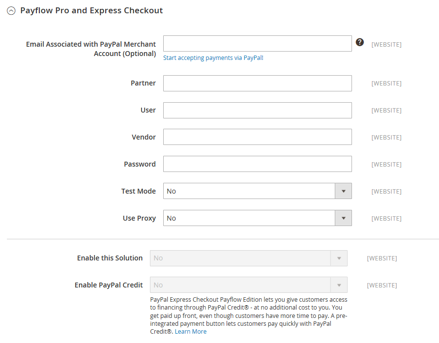
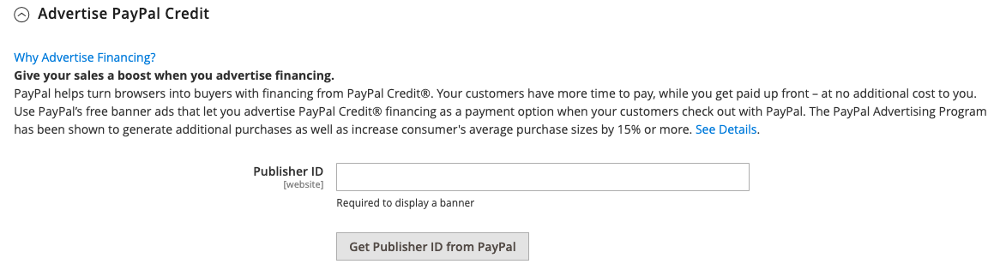
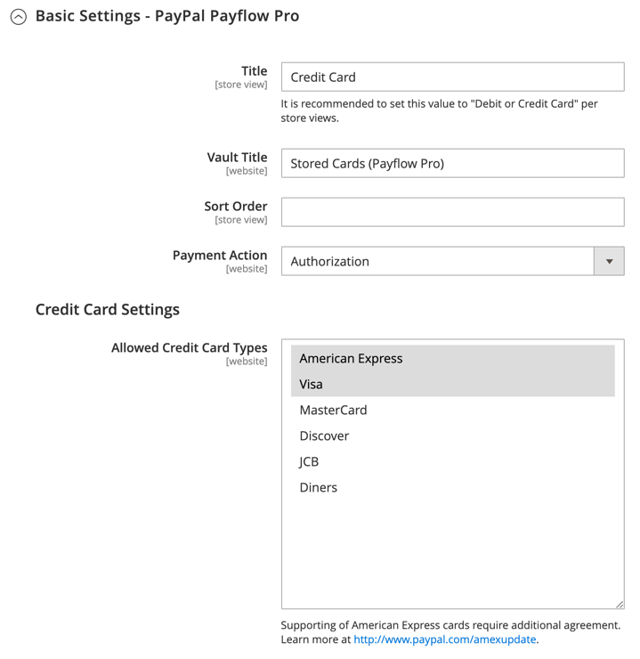
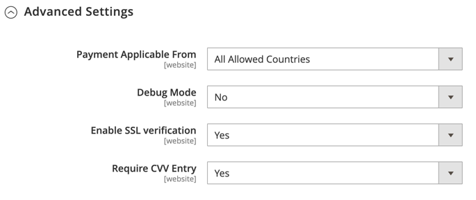

# [!UICONTROL Sales] > [!UICONTROL Payment Methods] >  [!UICONTROL PayPal Payflow Pro]

>[!IMPORTANT]
>
>Requisitos do **PSD2:**  
>A partir de 14 de setembro de 2019, os bancos europeus poderão recusar pagamentos que não atendam aos requisitos da [PSD2](../../getting-started/compliance-payment-services-directive.md). Para estar em conformidade com o PSD2, [!DNL PayPal Payflow Pro] deve estar integrado com [!DNL Cardinal Commerce]. Para saber mais, consulte [Segurança 3D para Fluxo de Pagamento](https://developer.paypal.com/api/nvp-soap/payflow/3d-secure-overview/).

{{config}}

## [!UICONTROL Required Settings]

<!-- zoom -->

| Campo | [Escopo](../../getting-started/websites-stores-views.md#scope-settings) | Descrição |
|--- |--- |--- |
| [!UICONTROL Email Associated with PayPal Merchant Account] | Site | (Opcional) Qualquer endereço de email associado à sua conta de comerciante do PayPal. Os endereços de email diferenciam maiúsculas de minúsculas e devem corresponder exatamente aos endereços que estão em sua conta. |
| [!UICONTROL Partner] | Site | Sua ID de parceiro do PayPal, se aplicável. |
| [!UICONTROL Vendor] | Site | Seu nome de logon de usuário do PayPal. |
| Usuário | Site | A ID de outro usuário em sua conta do PayPal. |
| [!UICONTROL Password] | Site | A senha associada à sua conta de comerciante do PayPal. |
| [!UICONTROL Test Mode] | Site | Quando ativado, executa o PayPal Payflow Pro em um ambiente de teste. Desative o modo de teste quando estiver pronto para &quot;entrar em produção&quot;. Opções: `Yes` / `No` |
| [!UICONTROL Use Proxy] | Site | Um proxy pode ser usado para redirecionar o tráfego quando o firewall do servidor impede o acesso direto ao servidor PayPal. Se aplicável, identifica o servidor proxy usado para estabelecer conexão com o servidor do PayPal. Opções: `Yes` / `No`   Se habilitado, defina as opções de proxy:  **`Proxy Host`**- O endereço IP do host proxy. **`Proxy Port`** - O número da porta do proxy. |
| [!UICONTROL Enable this Solution] | Site | Determina se o PayPal Payflow Pro está disponível para seus clientes como um método de pagamento. |
| [!UICONTROL Enable PayPal Credit] | Site | Determina se o Crédito do PayPal está disponível para seus clientes como uma opção de pagamento. |

{style="table-layout:auto"}

## [!UICONTROL Advertise PayPal Credit]

<!-- zoom -->

| Campo | [Escopo](../../getting-started/websites-stores-views.md#scope-settings) | Descrição |
|--- |--- |--- |
| [!UICONTROL Publisher ID] | Site | A ID do Publicador associada à sua conta de Crédito do PayPal. |
| [!UICONTROL Get Publisher ID from PayPal] |  | Busca a ID do editor no PayPal. |
| [!UICONTROL Home Page] | Site | Determina a posição e o tamanho do banner [!DNL PayPal Credit] na página inicial. Opções:  **`Display`**- Determina se um banner [!DNL PayPal Credit] é exibido na home page da loja. Opções: `Yes` / `No` **`Position`** - Determina a posição do banner [!DNL PayPal Credit] na página inicial. Opções: Cabeçalho (centro) / Barra Lateral (direita)  **`Size`**- Determina o tamanho do banner [!DNL PayPal Credit] na página inicial. Opções: `190 x 100` / `234 x 60` / `300 x 50` / `468 x 60` / `728 x 90` /` 800 x 66` |
| [!UICONTROL Catalog Category Page] | Site | Determina a posição e o tamanho do banner [!DNL PayPal Credit] nas páginas de categoria. Opções: (igual a [!UICONTROL Home Page]) |
| [!UICONTROL Catalog Product Page] | Site | Determina a posição e o tamanho do banner [!DNL PayPal Credit] nas páginas do produto. Opções: (igual a [!UICONTROL Home Page]) |
| [!UICONTROL Checkout Cart Page] | Site | Determina a posição e o tamanho do banner [!DNL PayPal Credit] na página do carrinho. Opções: (igual a [!UICONTROL Home Page]) |

{style="table-layout:auto"}

## [!UICONTROL Basic Settings - PayPal Payflow Pro]

<!-- zoom -->

| Campo | [Escopo](../../getting-started/websites-stores-views.md#scope-settings) | Descrição |
|--- |--- |--- |
| [!UICONTROL Title] | Exibição da loja | Um nome que identifica o PayPal Payflow Pro como um método de pagamento durante o checkout. |
| [!UICONTROL Sort Order] | Exibição da loja | Um número que determina a ordem em que o PayPal Payflow Pro é exibido quando listado com outros métodos de pagamento durante o check-out. |
| [!UICONTROL Payment Action] | Site | Determina a ação tomada pelo PayPal quando um pedido é enviado. Opções:  **`Authorization`**- Aprova a compra, mas suspende os fundos. A quantidade não é retirada até que seja &quot;capturada&quot; pelo comerciante. **`Sale`** - O valor da compra é autorizado e imediatamente retirado da conta do cliente. |
| **[!UICONTROL Credit Card Settings]** |  |  |
| [!UICONTROL Allowed Credit Cart Types] | Site | Determina os cartões de crédito disponíveis para os clientes durante o check-out. Selecione cada placa suportada. Opções: `American Express` (requer um contrato extra) / `Visa` / `MasterCard` / `Discover` / `JCB` |

{style="table-layout:auto"}

## [!UICONTROL Advanced Settings]

<!-- zoom -->

| Campo | [Escopo](../../getting-started/websites-stores-views.md#scope-settings) | Descrição |
|--- |--- |--- |
| Exibir no carrinho de compras | Exibição da loja | Determina se o Check-out do PayPal Express é exibido como uma opção de pagamento no carrinho de compras. Opções: Sim (Recomendado) / Não |
| [!UICONTROL Payment Action Applicable From] | Site | Determina o intervalo da seleção de país aplicável. Opções: Todos os Países Permitidos/Países Específicos |
| [!UICONTROL Countries Payment Applicable From] | Site | Identifica cada país do qual o pagamento é aceito. Somente os clientes com um endereço de cobrança em um país selecionado podem fazer compras com este método de pagamento. |
| [!UICONTROL Debug Mode] | Site | Registra mensagens enviadas entre sua loja e o sistema de pagamento do PayPal em um arquivo de log. Opções: `Yes` / `No`   **_Nota:_** O arquivo de log está armazenado no servidor e pode ser acessado apenas por desenvolvedores. De acordo com os padrões de segurança de dados do PCI, as informações de cartão de crédito não são gravadas no arquivo de registro. |
| [!UICONTROL Enable SSL Verification] | Site | Habilita a verificação do certificado de segurança do host. Opções: `Yes` / `No` |
| [!UICONTROL Transfer Cart Line Items] | Site | Exibe um resumo completo dos itens de linha do carrinho de compras do cliente no site do PayPal. Opções: `Yes` / `No` |
| [!UICONTROL Skip Order Review Step] | Site | Determina se os clientes podem concluir a transação no site do PayPal ou se precisam retornar à loja e concluir a etapa Revisão do Pedido antes de enviar o pedido. Opções: `Yes` / `No` |

{style="table-layout:auto"}
