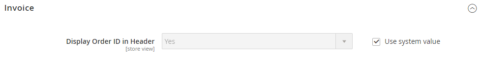
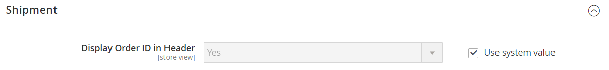

# [!UICONTROL Sales] > [!UICONTROL PDF Print-outs]

{{config}}

<!-- [Invoice](https://experienceleague.adobe.com/en/docs/commerce-admin/stores-sales/site-store/sales-documents) -->

## [!UICONTROL Invoice]

<!-- zoom -->

| Campo | [Escopo](../../getting-started/websites-stores-views.md#scope-settings) | Descrição |
|--- |--- |--- |
| [!UICONTROL Display Order ID in Header] | Exibição da loja | Inclui a ID do pedido no cabeçalho das faturas para referência. Opções: `Yes` / `No` |

{style="table-layout:auto"}

## [!UICONTROL Shipment]

<!-- zoom -->

| Campo | [Escopo](../../getting-started/websites-stores-views.md#scope-settings) | Descrição |
|--- |--- |--- |
| [!UICONTROL Display Order ID in Header] | Exibição da loja | Inclui a ID do pedido no cabeçalho das guias de remessa para referência. Opções: `Yes` / `No` |

{style="table-layout:auto"}

## [!UICONTROL Credit Memo]

<!-- zoom -->

| Campo | [Escopo](../../getting-started/websites-stores-views.md#scope-settings) | Descrição |
|--- |--- |--- |
| [!UICONTROL Display Order ID in Header] | Exibição da loja | Inclui a ID do pedido no cabeçalho dos avisos de crédito para referência. Opções: `Yes` / `No` |

{style="table-layout:auto"}
