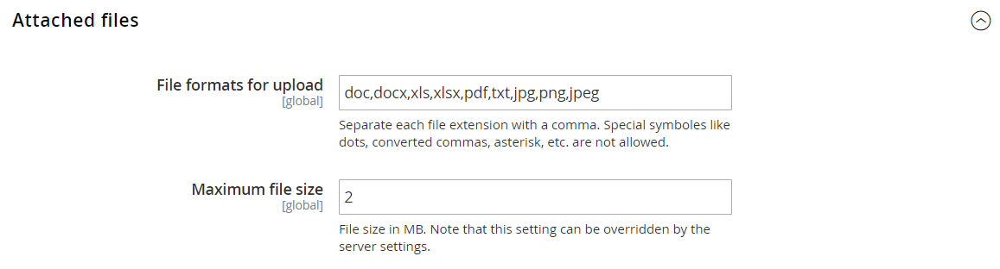

# [!UICONTROL Sales] > [!UICONTROL Quotes]

{{b2b-feature}}

>[!TIP]
>
>Com a instalação e a habilitação do Adobe Commerce B2B, a experiência de compra pode ser personalizada com recursos específicos da empresa. O Adobe Commerce B2B é uma solução integrada que oferece suporte aos modelos B2B e B2C. Para obter mais informações sobre os recursos B2B, consulte o [Guia do Usuário B2B do Adobe Commerce](https://experienceleague.adobe.com/docs/commerce-admin/b2b/introduction.html).

{{config}}

<!-- [Quotes](https://experienceleague.adobe.com/en/docs/commerce-admin/b2b/quotes/quotes) -->

## [!UICONTROL General]

<!-- zoom -->

| Campo | [Escopo](../../getting-started/websites-stores-views.md#scope-settings) | Descrição |
|--- |--- |--- |
| [!UICONTROL Minimum Amount] | Site | O valor mínimo do subtotal do carrinho de compras, após quaisquer descontos, que é necessário antes que um cliente possa enviar uma solicitação de cotação. Valor padrão: `0` |
| [!UICONTROL Minimum Amount Message] | Exibição da loja | A mensagem que aparece no carrinho de compras quando um cliente tenta enviar uma solicitação de cotação, mas o valor mínimo necessário não é atendido. |
| [!UICONTROL Default Expiration Period] | Site | Determina o tempo de vida padrão de uma [aspa](../../b2b/quote-price-negotiation.md) como período de tempo a partir da data em que a solicitação de aspas é enviada. Opções: `Days` / `Weeks` / `Months` |

{style="table-layout:auto"}

## [!UICONTROL Attached Files]

<!-- zoom -->

| Campo | [Escopo](../../getting-started/websites-stores-views.md#scope-settings) | Descrição |
|--- |--- |--- |
| [!UICONTROL File formats for upload] | Global | Determina os formatos de arquivo que podem ser anexados a aspas. Valores padrão com suporte: `doc`, `docx`, `xls`, `xlsx`, `pdf`, `txt`, `jpg`, `png` e `jpeg` |
| [!UICONTROL Maximum file size] | Global | Determina o tamanho máximo de um arquivo anexado a uma aspa. Esta configuração pode ser substituída pela configuração do servidor. |

{style="table-layout:auto"}
