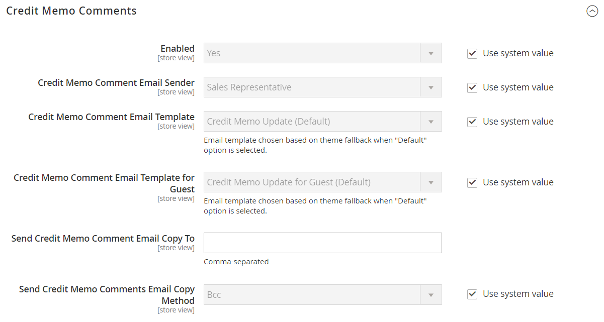
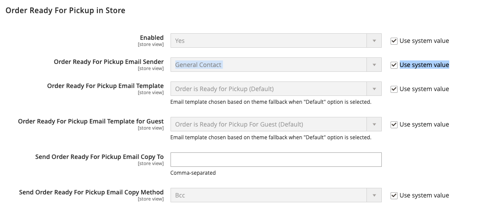

# [!UICONTROL Sales] > [!UICONTROL Sales Emails]

{{config}}

## [!UICONTROL General Settings]

<!-- zoom -->

<!-- [General Settings](https://docs.magento.com/user-guide/system/email-communications.html) -->

| Campo | [Escopo](../../getting-started/websites-stores-views.md#scope-settings) | Descrição |
|--- |--- |--- |
| [!UICONTROL Asynchronous sending] | Global | Determina se os emails de vendas são enviados de forma assíncrona. É recomendável habilitar o envio assíncrono. Opções:  **`Disable`**- (Padrão) Os emails de vendas são enviados quando acionados por um evento. **`Enable`** - (Recomendado) Os emails de vendas são enviados em intervalos regulares predeterminados. |

{style="table-layout:auto"}

## [!UICONTROL Order]

<!-- zoom -->

<!-- [Order](https://docs.magento.com/user-guide/sales/orders.html) -->

| Campo | [Escopo](../../getting-started/websites-stores-views.md#scope-settings) | Descrição |
|--- |--- |--- |
| [!UICONTROL Enabled] | Exibição da loja | Quando ativado, envia um email transacional para cada pedido feito. Opções: `Yes` / `No` |
| [!UICONTROL New Order Confirmation Email Sender] | Exibição da loja | Identifica o contato de armazenamento que aparece como o remetente da mensagem. Remetente padrão: `Sales Representative` |
| [!UICONTROL New Order Confirmation Template] | Exibição da loja | Identifica o modelo que é enviado para confirmar novos pedidos feitos por clientes. Modelo padrão: `New Order` |
| [!UICONTROL New Order Confirmation Template for Guest] | Exibição da loja | Identifica o modelo que é enviado para confirmar novos pedidos feitos por convidados. Modelo padrão: `New Order for Guest` |
| [!UICONTROL Send Order Email Copy To] | Exibição da loja | Fornece o endereço de email de qualquer pessoa para receber uma cópia de um email de pedido. Separe vários endereços com uma vírgula. |
| [!UICONTROL Send Order Email Copy Method] | Exibição da loja | Indica o método de email usado para enviar a cópia. As opções incluem:  **`Bcc`**- Envia uma cópia de cortesia às cegas incluindo o recipient no cabeçalho do mesmo email enviado ao cliente. O destinatário CCO não está visível para o cliente. **`Separate Email`** - Envia a cópia como um email separado. |

{style="table-layout:auto"}

## [!UICONTROL Order Comments]

<!-- zoom -->

<!-- [Order Comments](https://docs.magento.com/user-guide/sales/order-processing.html) -->

| Campo | [Escopo](../../getting-started/websites-stores-views.md#scope-settings) | Descrição |
|--- |--- |--- |
| [!UICONTROL Enabled] | Exibição da loja | Quando ativado, envia um email transacional para cada comentário do pedido. Opções: `Yes` / `No` |
| [!UICONTROL Order Comment Email Sender] | Exibição da loja | Identifica o contato de armazenamento que aparece como o remetente da mensagem. Remetente padrão: `Sales Representative` |
| [!UICONTROL Order Comment Email Template] | Exibição da loja | Identifica o modelo que é enviado quando um comentário é adicionado a uma ordem de cliente. Modelo padrão: `Order Update` |
| [!UICONTROL New Order Confirmation Template for Guest] | Exibição da loja | Identifica o modelo que é enviado quando um comentário é adicionado a um pedido de convidado. Modelo padrão: `Order Update for Guest` |
| [!UICONTROL Send Order Email Copy To|Store View] | Fornece o endereço de email de qualquer pessoa para receber uma cópia de um email de comentário de pedido. Separe vários endereços com uma vírgula. |
| [!UICONTROL Send Order Email Copy Method] | Exibição da loja | Indica o método usado para enviar a cópia. As opções incluem:  **`Bcc`**- Envia uma cópia de cortesia às cegas incluindo o recipient no cabeçalho do mesmo email enviado ao cliente. O destinatário CCO não está visível para o cliente. **`Separate Email`** - Envia a cópia como um email separado. |

{style="table-layout:auto"}

## [!UICONTROL Invoice]

<!-- zoom -->

<!-- [Invoice](https://docs.magento.com/user-guide/sales/invoices.html) -->

| Campo | [Escopo](../../getting-started/websites-stores-views.md#scope-settings) | Descrição |
|--- |--- |--- |
| [!UICONTROL Enabled] | Exibição da loja | Quando ativado, envia um email transacional para cada fatura gerada. Opções: `Yes` / `No` |
| [!UICONTROL Invoice Email Sender] | Exibição da loja | Identifica o contato de armazenamento que aparece como o remetente da mensagem. Remetente padrão: `Sales Representative` |
| [!UICONTROL Invoice Email Template] | Exibição da loja | Identifica o modelo enviado quando uma fatura é gerada para um cliente. Modelo padrão: `New Invoice` |
| [!UICONTROL Invoice Email Template for Guest] | Exibição da loja | Identifica o modelo que é enviado quando uma NFF é gerada para um convidado. Modelo padrão: `New Invoice for Guest` |
| [!UICONTROL Send Invoice Email Copy To] | Exibição da loja | Fornece o endereço de email de qualquer pessoa para receber uma cópia de um email de fatura. Separe vários endereços com uma vírgula. |
| [!UICONTROL Send Invoice Email Copy Method] | Exibição da loja | Indica o método usado para enviar a cópia. As opções incluem:  **`Bcc`**- Envia uma cópia de cortesia às cegas incluindo o recipient no cabeçalho do mesmo email enviado ao cliente. O destinatário CCO não está visível para o cliente. **`Separate Email`** - Envia a cópia como um email separado. |

{style="table-layout:auto"}

## [!UICONTROL Invoice Comments]

<!-- zoom -->

<!-- [Invoice Comments](https://docs.magento.com/user-guide/sales/invoice-create.html) -->

| Campo | [Escopo](../../getting-started/websites-stores-views.md#scope-settings) | Descrição |
|--- |--- |--- |
| [!UICONTROL Enabled] | Exibição da loja | Quando ativado, envia um email transacional para cada comentário da fatura. Opções: `Yes` / `No` |
| [!UICONTROL Invoice Comment Email Sender] | Exibição da loja | Identifica o contato de armazenamento que aparece como o remetente da mensagem. Remetente padrão: `Sales Representative` |
| [!UICONTROL Invoice Comment Email Template] | Exibição da loja | Identifica o modelo que é enviado quando um comentário é adicionado a uma fatura de cliente. Modelo padrão: `Invoice Update` |
| [!UICONTROL Invoice Comment Email Template for Guest] | Exibição da loja | Identifica o modelo que é enviado quando um comentário é adicionado a uma fatura de convidado. Modelo padrão: `Invoice Update for Guest` |
| [!UICONTROL Send Invoice Comment Email Copy To] | Exibição da loja | Fornece o endereço de email de qualquer pessoa para receber uma cópia de um email de comentário de fatura. Separe vários endereços com uma vírgula. |
| [!UICONTROL Send Invoice Comments Email Copy Method] | Exibição da loja | Indica o método de email usado para enviar a cópia. As opções incluem:  **`Bcc`**- Envia uma cópia de cortesia às cegas incluindo o recipient no cabeçalho do mesmo email enviado ao cliente. O destinatário CCO não está visível para o cliente. **`Separate Email`** - Envia a cópia como um email separado. |

{style="table-layout:auto"}

## [!UICONTROL Shipment]

<!-- zoom -->

<!-- [Shipment](https://docs.magento.com/user-guide/sales/shipments.html) -->

| Campo | [Escopo](../../getting-started/websites-stores-views.md#scope-settings) | Descrição |
|--- |--- |--- |
| [!UICONTROL Enabled] | Exibição da loja | Quando ativado, envia um email transacional para cada remessa gerada. Opções: `Yes` / `No` |
| [!UICONTROL Shipment Email Sender] | Exibição da loja | Identifica o contato de armazenamento que aparece como remetente da mensagem. Remetente padrão: `Sales Representative` |
| [!UICONTROL Shipment Email Template] | Exibição da loja | Identifica o modelo que é enviado quando uma remessa é gerada para um cliente. Modelo padrão: `New Shipment` |
| [!UICONTROL Shipment Email Template for Guest] | Exibição da loja | Identifica o modelo que é enviado quando uma remessa é gerada para um convidado. Modelo padrão: `New Shipment for Guest` |
| [!UICONTROL Send Shipment Email Copy To] | Exibição da loja | Fornece o endereço de email de qualquer pessoa que deve receber uma cópia de um email de remessa. Separe vários endereços com uma vírgula. |
| [!UICONTROL Send Shipment Email Copy Method] | Exibição da loja | Indica o método usado para enviar a cópia. As opções incluem:  **`Bcc`**- Envia uma cópia de cortesia às cegas incluindo o recipient no cabeçalho do mesmo email enviado ao cliente. O destinatário CCO não está visível para o cliente. **`Separate Email`** - Envia a cópia como um email separado. |

{style="table-layout:auto"}

## [!UICONTROL Shipment Comments]

<!-- zoom -->

<!-- [Shipment Comments](https://docs.magento.com/user-guide/sales/shipments.html) -->

| Campo | [Escopo](../../getting-started/websites-stores-views.md#scope-settings) | Descrição |
|--- |--- |--- |
| [!UICONTROL Enabled] | Exibição da loja | Quando ativado, envia um email transacional para cada comentário de remessa. Opções: `Yes` / `No` |
| [!UICONTROL Shipment Comment Email Sender] | Exibição da loja | Identifica o contato de armazenamento que aparece como o remetente da mensagem. Remetente padrão: `Sales Representative` |
| [!UICONTROL Shipment Comment Email Template] | Exibição da loja | Identifica o modelo que é enviado quando um comentário é adicionado a uma remessa do cliente. Modelo padrão: `Shipment Update` |
| [!UICONTROL Shipment Comment Email Template for Guest] | Exibição da loja | Identifica o modelo que é enviado quando um comentário é adicionado a uma remessa de convidado. Modelo padrão: `Shipment Update for Guest` |
| [!UICONTROL Send Shipment Comment Email Copy To] | Exibição da loja | Fornece o endereço de email de qualquer pessoa para receber uma cópia de um email de comentário de remessa. Separe vários endereços com uma vírgula. |
| [!UICONTROL Send Shipment Comments Email Copy Method] | Exibição da loja | Indica o método de email usado para enviar a cópia. As opções incluem:  **`Bcc`**- Envia uma cópia de cortesia às cegas incluindo o recipient no cabeçalho do mesmo email enviado ao cliente. O destinatário CCO não está visível para o cliente. **`Separate Email`** - Envia a cópia como um email separado. |

{style="table-layout:auto"}

## [!UICONTROL Credit Memo]

<!-- zoom -->

<!-- [Credit Memo](https://docs.magento.com/user-guide/sales/credit-memos.html) -->

| Campo | [Escopo](../../getting-started/websites-stores-views.md#scope-settings) | Descrição |
|--- |--- |--- |
| [!UICONTROL Enabled] | Exibição da loja | Ativa o email transacional para cada memorando de crédito gerado. Opções: `Yes` / `No` |
| [!UICONTROL Credit Memo Email Sender] | Exibição da loja | Identifica o contato de armazenamento que aparece como remetente da mensagem. Remetente padrão: `Sales Representative` |
| [!UICONTROL Credit Memo Email Template] | Exibição da loja | Identifica o modelo que é enviado quando um aviso de crédito é gerado para um cliente. Modelo padrão: `New Credit Memo` |
| [!UICONTROL Credit Memo Email Template for Guest] | Exibição da loja | Identifica o modelo que é enviado quando um aviso de crédito é gerado para um convidado. Modelo padrão: `New Credit Memo for Guest` |
| [!UICONTROL Send Credit Memo Email Copy To] | Exibição da loja | Fornece o endereço de email de qualquer pessoa que deve receber uma cópia de um email de aviso de crédito. Separe vários endereços com uma vírgula. |
| [!UICONTROL Send Credit Memo Email Copy Method] | Exibição da loja | Indica o método usado para enviar a cópia. As opções incluem:  **`Bcc`**- Envia uma cópia de cortesia às cegas incluindo o recipient no cabeçalho do mesmo email enviado ao cliente. O destinatário CCO não está visível para o cliente. **`Separate Email`** - Envia a cópia como um email separado. |

{style="table-layout:auto"}

## [!UICONTROL Credit Memo Comments]

<!-- zoom -->

<!-- [Credit Memo Comments](https://docs.magento.com/user-guide/sales/credit-memo-create.html) -->

| Campo | [Escopo](../../getting-started/websites-stores-views.md#scope-settings) | Descrição |
|--- |--- |--- |
| [!UICONTROL Enabled] | Exibição da loja | Quando ativado, envia um email transacional para cada comentário de memorando de crédito. Opções: `Yes` / `No` |
| [!UICONTROL Credit Memo Comment Email Sender] | Exibição da loja | Identifica o contato de armazenamento que aparece como o remetente da mensagem. Remetente padrão: `Sales Representative` |
| [!UICONTROL Credit Memo Comment Email Template] | Exibição da loja | Identifica o modelo que é enviado quando um comentário é adicionado a um aviso de crédito de cliente. Modelo padrão: `Credit Memo Update` |
| [!UICONTROL Credit Memo Comment Email Template for Guest] | Exibição da loja | Identifica o modelo que é enviado quando um comentário é adicionado a um memorando de crédito de convidado. Modelo padrão: `Credit Memo Update for Guest` |
| [!UICONTROL Send Credit Memo Comment Email Copy To] | Exibição da loja | Especifica o endereço de email de qualquer pessoa que receberá uma cópia de um email de comentário de memorando de crédito. Separe vários endereços com uma vírgula. |
| [!UICONTROL Send Credit Memo Comments Email Copy Method] | Exibição da loja | Indica o método de email usado para enviar a cópia. As opções incluem:  **`Bcc`**- Envia uma cópia de cortesia às cegas incluindo o recipient no cabeçalho do mesmo email enviado ao cliente. O destinatário CCO não está visível para o cliente. **`Separate Email`** - Envia a cópia como um email separado. |

{style="table-layout:auto"}

## [!UICONTROL Order Ready For Pickup in Store]

<!-- zoom -->

<!-- [Order Ready For Pickup in Store](https://docs.magento.com/user-guide/shipping/shipping-in-store-delivery.html) -->

| Campo | [Escopo](../../getting-started/websites-stores-views.md#scope-settings) | Descrição |
|--- |--- |--- |
| [!UICONTROL Enabled] | Exibição da loja | Quando ativado, envia um email transacional quando um pedido está pronto para retirada na loja. Opções: `Yes` / `No` |
| [!UICONTROL Order Ready For Pickup Email Sender] | Exibição da loja | Identifica o contato de armazenamento que aparece como o remetente da mensagem. Remetente padrão: `General Contact` |
| [!UICONTROL Order Ready For Pickup Email Template] | Exibição da loja | Identifica o modelo usado para o email transacional para cada pedido que está pronto para retirada na loja para um cliente registrado. Modelo padrão: `Order is Ready for Pickup` |
| [!UICONTROL Order Ready For Pickup Email Template for Guest] | Exibição da loja | Identifica o modelo usado para o email transacional para cada pedido que está pronto para retirada na loja para um convidado. Modelo padrão: `Order is Ready for Pickup for Guest` |
| Enviar Pedido Pronto Para Retirada E-Mail Copiar Para | Exibição da loja | Especifica o endereço de email de qualquer pessoa para receber uma cópia de um _Pedido pronto para retirada_ email. Separe vários endereços com uma vírgula. |
| [!UICONTROL Send Order Ready For Pickup Email Copy Method] | Exibição da loja | Indica o método de email usado para enviar a cópia. Opções:  **`Bcc`**- Envia uma cópia de cortesia às cegas incluindo o recipient no cabeçalho do mesmo email enviado ao cliente. O destinatário CCO não está visível para o cliente. **`Separate Email`** - Envia a cópia como um email separado. |

{style="table-layout:auto"}

## [!UICONTROL Purchase Order Approval]

{{b2b-feature}}

<!-- zoom -->

| Campo | [Escopo](../../getting-started/websites-stores-views.md#scope-settings) | Descrição |
|--- |--- |--- |
| [!UICONTROL Enabled] | Exibição da loja | Quando ativado, envia emails durante o processo de ordem de compra. Opções: `Yes` / `No` |
| [!UICONTROL Created and requires Approval Purchase Order (to Buyer)] | Exibição da loja | Envia uma confirmação por email para o criador da ordem de compra. |
| [!UICONTROL Created and Automatically approved Purchase Order (to Buyer)] | Exibição da loja | Envia uma confirmação por email para o criador da ordem de compra. |
| [!UICONTROL Approved Purchase Order (to Buyer)] | Exibição da loja | Envia um email para o criador na aprovação da ordem de compra. |
| [!UICONTROL Rejected Purchase Order (to Buyer)] | Exibição da loja | Envia um email para o criador quando a ordem de compra é rejeitada. |
| [!UICONTROL Comment added to Purchase Order] | Exibição da loja | Envia um email para o criador quando um comentário é adicionado à OC. |
| [!UICONTROL Error creating Order from Purchase Order (to Buyer)] | Exibição da loja | Notifica o criador que ocorreu um erro ao converter uma OC em uma ordem. |
| [!UICONTROL Purchase Order required Approval (to Approver)] | Exibição da loja | Envia um e-mail para notificar o aprovador que a ordem de compra requer sua aprovação. |

{style="table-layout:auto"}

## [!UICONTROL Quote]

{{b2b-feature}}

<!-- zoom -->

<!-- [Quotes](https://docs.magento.com/user-guide/customers/account-dashboard-quotes.html) -->

| Campo | [Escopo](../../getting-started/websites-stores-views.md#scope-settings) | Descrição |
|--- |--- |--- |
| [!UICONTROL Enabled] | Exibição da loja | Habilita mensagens de email de cotação a serem enviadas da visualização de loja atual. Opções: `Yes` / `No` |
| [!UICONTROL Updated Quote Template (to Buyer)] | Exibição da loja | Determina o modelo de email usado para a notificação enviada ao comprador quando uma cotação atualizada está disponível. Modelo padrão: `Updated Quote` |
| [!UICONTROL Declined Quote Template (to Buyer)] | Exibição da loja | Determina o modelo de email usado para notificação enviada ao comprador quando uma cotação é recusada. Modelo padrão: `Declined Quote` |
| [!UICONTROL New Quote Template (to Seller)] | Exibição da loja | Determina o modelo de email usado para a notificação enviada ao vendedor quando uma solicitação de uma nova cotação é recebida. Modelo padrão: `New Quote` |
| [!UICONTROL Updated Quote Template (to Seller)] | Exibição da loja | Determina o modelo de email usado para a notificação enviada ao vendedor quando uma cotação atualizada é recebida. Modelo padrão: `Updated Quote` |
| [!UICONTROL Quote Expiration (in 48 hrs)] | Exibição da loja | Especifica o modelo de email usado para o aviso de expiração que é enviado 48 horas antes da cotação expirar. Modelo padrão: `Expiration Warning` |
| [!UICONTROL Quote Expiration (in 24 hrs)] | Exibição da loja | Especifica o modelo de email usado para o aviso de expiração que é enviado 24 horas antes da cotação expirar. Modelo padrão: `Expiration Warning 1` |
| [!UICONTROL Expiration Date Reset] | Exibição da loja | Especifica o modelo de email usado para o aviso enviado quando a data de expiração é alterada. Modelo padrão: `Expiration Date Reset` |
| [!UICONTROL Send Quote Email Copy To] | Exibição da loja | Especifica o endereço de email de cada pessoa que receberá uma cópia do email de cotação. Separe vários endereços com uma vírgula. |
| [!UICONTROL Send Quote Email Copy Method] | Exibição da loja | Indica o método de email usado para enviar a cópia. As opções incluem:  **`Bcc`**- Envia uma cópia de cortesia às cegas incluindo o recipient no cabeçalho do mesmo email enviado ao cliente. O destinatário CCO não está visível para o cliente. **`Separate Email`** - Envia a cópia como um email separado. |

{style="table-layout:auto"}

## [!UICONTROL RMA]

{{ee-feature}}

<!-- zoom -->

<!-- [RMA](https://docs.magento.com/user-guide/sales/returns.html) -->

| Campo | [Escopo](../../getting-started/websites-stores-views.md#scope-settings) | Descrição |
|--- |--- |--- |
| [!UICONTROL Enabled] | Exibição da loja | Ativa a notificação por email para cada RMA gerado. Opções: `Yes` / `No` |
| [!UICONTROL RMA Email Sender] | Exibição da loja | Identifica o [armazenar contato](../../getting-started/store-details.md#store-email-addresses) que aparece como o remetente da mensagem. Valor padrão: `Sales Representative` |
| [!UICONTROL RMA Email Template] | Exibição da loja | Determina o [modelo de email](../../systems/email-templates.md) que é usado para a notificação enviada quando uma RMA é gerada para um cliente. Modelo padrão: `New RMA` |
| [!UICONTROL RMA Email Template for Guest] | Exibição da loja | Determina o modelo que é enviado quando um RMA é gerado para um convidado. Modelo padrão: `New RMA for Guest` |
| [!UICONTROL Send RMA Email Copy To] | Exibição da loja | Fornece o endereço de email de qualquer pessoa que deve receber uma cópia de um email de RMA. Separe vários endereços com uma vírgula. |
| [!UICONTROL Send RMA  Email Copy Method] | Exibição da loja | Indica o método de email usado para enviar a cópia. As opções incluem:  **`Bcc`**- Envia uma cópia de cortesia às cegas incluindo o recipient no cabeçalho do mesmo email enviado ao cliente. O destinatário CCO não está visível para o cliente. **`Separate Email`** - Envia a cópia como um email separado. |

{style="table-layout:auto"}

## [!UICONTROL RMA Authorization]

{{ee-feature}}

<!-- zoom -->

<!-- [RMA Authorization](https://docs.magento.com/user-guide/sales/rma-configure.html) -->

| Campo | [Escopo](../../getting-started/websites-stores-views.md#scope-settings) | Descrição |
|--- |--- |--- |
| [!UICONTROL Enabled] | Exibição da loja | Quando ativado, envia uma notificação por email para cada autorização de RMA. Opções: `Yes` / `No` |
| [!UICONTROL RMA Authorization Email Sender] | Exibição da loja | Identifica o [armazenar contato](../../getting-started/store-details.md#store-email-addresses) que aparece como o remetente da mensagem. Valor padrão: `Sales Representative` |
| [!UICONTROL RMA Authorization Email Template] | Exibição da loja | Determina o [modelo de email](../../systems/email-templates.md) que é utilizada quando uma notificação de autorização de RMA é enviada. Modelo padrão: `RMA Authorization` |
| [!UICONTROL RMA Authorization Email Template for Guest] | Exibição da loja | Determina o modelo usado quando uma notificação de autorização de RMA é enviada a um convidado. Modelo padrão: `RMA Authorization for Guest` |
| [!UICONTROL Send RMA Authorization Email Copy To] | Exibição da loja | Fornece o endereço de email de qualquer pessoa para receber uma cópia de um email de autorização RMA. Separe vários endereços com uma vírgula. |
| [!UICONTROL Send RMA Authorization Email Copy Method] | Exibição da loja | Indica o método de email usado para enviar a cópia. As opções incluem:  **`Bcc`**- Envia uma cópia de cortesia às cegas incluindo o recipient no cabeçalho do mesmo email enviado ao cliente. O destinatário CCO não está visível para o cliente. **`Separate Email`** - Envia a cópia como um email separado. |

{style="table-layout:auto"}

## [!UICONTROL RMA Admin Comments]

{{ee-feature}}

<!-- zoom -->

| Campo | [Escopo](../../getting-started/websites-stores-views.md#scope-settings) | Descrição |
|--- |--- |--- |
| [!UICONTROL Enabled] | Exibição da loja | Quando ativado, envia uma notificação por e-mail para cada comentário do Administrador do RMA. Opções: `Yes` / `No` |
| [!UICONTROL RMA Comment Email Sender] | Exibição da loja | Identifica o [armazenar contato](../../getting-started/store-details.md#store-email-addresses) que aparece como o remetente da mensagem. Valor padrão: `Sales Representative` |
| [!UICONTROL RMA Comment Email Template] | Exibição da loja | Determina o [modelo de email](../../systems/email-templates.md) que é usado quando um Administrador adiciona um comentário a um RMA para um cliente. Modelo padrão: `RMA Admin Comments` |
| [!UICONTROL RMA Comment Email Template for Guest] | Exibição da loja | Determina o modelo usado quando um Administrador adiciona um comentário a um RMA para um convidado. Modelo padrão: `RMA Admin Comments for Guest` |
| [!UICONTROL Send RMA Comment Email Copy To] | Exibição da loja | Fornece o endereço de email de qualquer pessoa para receber uma cópia da notificação. Separe vários endereços com uma vírgula. |
| [!UICONTROL Send RMA Comments Email Copy Method] | Exibição da loja | Indica o método de email usado para enviar a cópia. As opções incluem:  **`Bcc`**- Envia uma cópia de cortesia às cegas incluindo o recipient no cabeçalho do mesmo email enviado ao cliente. O destinatário CCO não está visível para o cliente. **`Separate Email`** - Envia a cópia como um email separado. |

{style="table-layout:auto"}

## [!UICONTROL RMA Customer Comments]

{{ee-feature}}

<!-- zoom -->

<!-- [RMA Customer Comments](https://docs.magento.com/user-guide/sales/returns.html) -->

| Campo | [Escopo](../../getting-started/websites-stores-views.md#scope-settings) | Descrição |
|--- |--- |--- |
| [!UICONTROL Enabled] | Exibição da loja | Quando ativado, envia uma notificação por email para cada comentário de cliente de RMA. Opções: `Yes` / `No` |
| [!UICONTROL RMA Comment Email Sender] | Exibição da loja | Identifica o [armazenar contato](../../getting-started/store-details.md#store-email-addresses) que aparece como o remetente da mensagem. Valor padrão: `Customer Support` |
| [!UICONTROL RMA Comment Email Recipient] | Exibição da loja | Identifica o contato da loja que é o destinatário do email de comentário do cliente. Valor padrão: `Sales Representative` |
| [!UICONTROL RMA Comment Email Template] | Exibição da loja | Determina o [modelo de email](../../systems/email-templates.md) que é usado quando um cliente adiciona um comentário a um RMA. Modelo padrão: `RMA Admin Comments` |
| [!UICONTROL Send RMA Comment Email Copy To] | Exibição da loja | Fornece o endereço de email de qualquer pessoa para receber uma cópia da notificação. Separe vários endereços com uma vírgula. |
| [!UICONTROL Send RMA Comments Email Copy Method] | Exibição da loja | Indica o método de email usado para enviar a cópia. As opções incluem:  **`Bcc`**- Envia uma cópia de cortesia às cegas incluindo o recipient no cabeçalho do mesmo email enviado ao cliente. O destinatário CCO não está visível para o cliente. **`Separate Email`** - Envia a cópia como um email separado. |

{style="table-layout:auto"}
