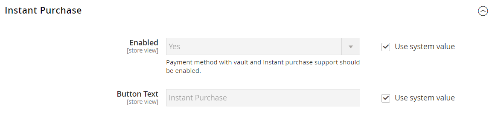
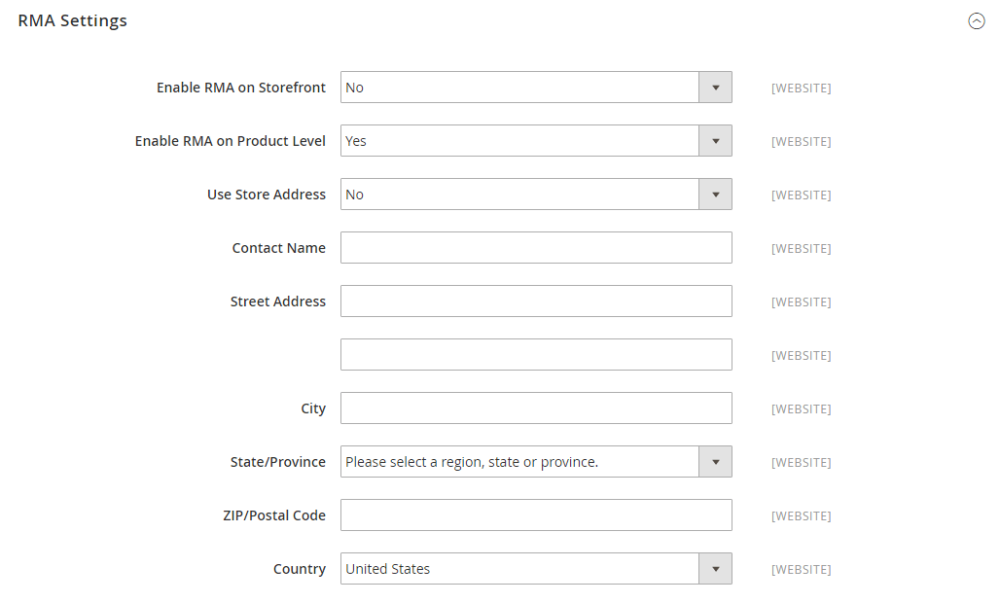

# [!UICONTROL Sales] > [!UICONTROL Sales]

{{config}}

## [!UICONTROL General]

<!-- zoom -->

<!-- [General](https://docs.magento.com/user-guide/marketing/sales-documents-ref-id.html) -->

| Campo | [Escopo](../../getting-started/websites-stores-views.md#scope-settings) | Descrição |
|--- |--- |--- |
| [!UICONTROL Hide Customer IP] | Exibição da loja | Determina se o endereço IP do cliente aparecerá em ordens, NFFs, entregas e avisos de crédito. Opções: `Yes` / `No` |

{style="table-layout:auto"}

## [!UICONTROL Checkout Totals Sort Order]

<!-- zoom -->

<!-- [Checkout Totals Sort Order](https://docs.magento.com/user-guide/sales/checkout-totals-sort-order.html) -->

| Campo | [Escopo](../../getting-started/websites-stores-views.md#scope-settings) | Descrição |
|--- |--- |--- |
| [!UICONTROL Subtotal] | Site | Um número que determina quando o subtotal é calculado em relação a outros totais de check-out. Valor padrão: `10` |
| [!UICONTROL Discount] | Site | Um número que determina quando o desconto é calculado em relação a outros totais de check-out. Valor padrão: `20` |
| [!UICONTROL Shipping] | Site | Um número que determina quando a remessa é calculada em relação a outros totais de check-out. Valor padrão: `30` |
| [!UICONTROL Tax] | Site | Um número que determina quando o imposto é calculado em relação a outros totais de check-out. Valor padrão: `40` |
| [!UICONTROL Fixed Product Tax] | Site | Um número que determina quando o Imposto Fixo do Produto é calculado em relação a outros totais de check-out. Valor padrão: `50` |
| [!UICONTROL Grand Total] | Site | Um número que determina quando o Total geral é calculado em relação a outros totais de check-out. Valor padrão: `100` |

{style="table-layout:auto"}

## [!UICONTROL Reorder]

<!-- zoom -->

<!-- [Reorder](https://docs.magento.com/user-guide/sales/reorders-allow.html) -->

| Campo | [Escopo](../../getting-started/websites-stores-views.md#scope-settings) | Descrição |
|--- |--- |--- |
| [!UICONTROL Allow Reorder] | Exibição da loja | Determina se os clientes podem fazer novos pedidos a partir de suas contas do. Opções: `Yes` / `No` |

{style="table-layout:auto"}

## [!UICONTROL Allow Zero Grand Total]

| Campo | [Escopo](../../getting-started/websites-stores-views.md#scope-settings) | Descrição |
|--- |--- |--- |
| [!UICONTROL Allow Zero Grand Total for Credit Memo] | Exibição da loja | Determina a possibilidade de criar um Aviso de Crédito com um Total Geral Zero. Opções: `Yes` / `No` |

{style="table-layout:auto"}

## [!UICONTROL Invoice and Packing Slip Design]

<!-- zoom -->

<!-- [Invoice and Packing Slip Design](https://docs.magento.com/user-guide/marketing/sales-document-pdf-logo.html) -->

| Campo | [Escopo](../../getting-started/websites-stores-views.md#scope-settings) | Descrição |
|--- |--- |--- |
| [!UICONTROL Logo for PDF Print-outs] | Exibição da loja | Identifica o arquivo de logotipo que aparece no cabeçalho das faturas de PDF e nas guias de remessa. Tipos de arquivo permitidos:  JPG/JPEG  TIF/TIFF  PNG |
| [!UICONTROL Logo for HTML Print View] | Exibição da loja | Identifica o arquivo de logotipo que aparece no cabeçalho da exibição de impressão de faturas e guias de remessa do HTML. Tipos de arquivos permitidos:  JPG /JPEG  GIF  PNG |
| [!UICONTROL Address] | Exibição da loja | O endereço da loja como você quer que ele apareça nas faturas e nas guias de remessa. |

{style="table-layout:auto"}

## [!UICONTROL Minimum Order Amount]

<!-- zoom -->

<!-- [Minimum Order Amount](https://docs.magento.com/user-guide/sales/cart-minimum-order-amount.html) -->

| Campo | [Escopo](../../getting-started/websites-stores-views.md#scope-settings) | Descrição |
|--- |--- |--- |
| [!UICONTROL Enable] | Site | Determina se um valor de pedido mínimo está definido para o site. Opções: `Yes` / `No` |
| [!UICONTROL Minimum Amount] | Site | Especifica o subtotal mínimo, pedido após a aplicação de descontos. |
| [!UICONTROL Include Discount Amount] | Site | Determina se o valor mínimo do pedido inclui descontos aplicados. Opções: `Yes` / `No` |
| [!UICONTROL Include Tax to Amount] | Site | Determina se o valor mínimo do pedido inclui imposto. Opções: `Yes` / `No` |
| [!UICONTROL Description Message] | Exibição da loja | Determina a mensagem que aparece na parte superior do carrinho de compras quando o total do carrinho é menor que o valor mínimo do pedido. Se deixado em branco, a seguinte mensagem padrão é exibida: `Minimum order amount is $[minimum_amount]` |
| [!UICONTROL Error to Show in Shopping Cart] | Exibição da loja | Determina a mensagem que aparece do minicarrinho ou link de finalização quando o valor do pedido é menor que o valor mínimo do pedido necessário. Se deixado em branco, uma mensagem padrão é exibida. |
| [!UICONTROL Validate Each Address Separately in Multi-address Checkout] | Site | Para pedidos de vários itens, determina se os itens do pedido que vão para endereços separados atendem ao valor mínimo do pedido. Opções: `Yes` / `No` |
| [!UICONTROL Multi-address Description Message] | Exibição da loja | Para pedidos de vários endereços, determina a mensagem que aparece no carrinho de compras se os itens enviados para um endereço forem menores que o valor mínimo do pedido. |
| [!UICONTROL Multi-address Error to Show in Shopping Cart] | Exibição da loja | Para pedidos com vários endereços, determina a mensagem que aparece do minicarrinho ou do link de finalização quando o valor do pedido é menor que o valor mínimo exigido. Se deixado em branco, uma mensagem padrão é exibida. |

{style="table-layout:auto"}

## [!UICONTROL Dashboard]

<!-- zoom -->

<!-- [Dashboard](https://docs.magento.com/user-guide/stores/admin-dashboard.html) -->

| Campo | [Escopo](../../getting-started/websites-stores-views.md#scope-settings) | Descrição |
|--- |--- |--- |
| [!UICONTROL Use Aggregated Data] | Global | Determina se os dados de vendas agregados em tempo real são usados para produzir relatórios de instantâneos do painel. Se você tiver uma grande quantidade de dados para processar, o desempenho poderá ser aprimorado desativando a exibição de dados em tempo real. Opções: `Yes` / `No` |

{style="table-layout:auto"}

## [!UICONTROL Orders Cron Settings]

<!-- zoom -->

<!-- [Orders Cron Settings](https://docs.magento.com/user-guide/system/cron.html) -->

| Campo | [Escopo](../../getting-started/websites-stores-views.md#scope-settings) | Descrição |
|--- |--- |--- |
| [!UICONTROL Pending Payment Order Lifetime] | Site | Determina a duração de pedidos pendentes em minutos. Configuração padrão: `480` minutos (8 horas) |

{style="table-layout:auto"}

## [!UICONTROL Gift Options]

<!-- zoom -->

<!-- [Gift Options](https://docs.magento.com/user-guide/sales/gift-options.html) -->

| Campo | [Escopo](../../getting-started/websites-stores-views.md#scope-settings) | Descrição |
|--- |--- |--- |
| [!UICONTROL Allow Gift Messages on Order Level] | Site | Especificar se uma mensagem de presente pode ser adicionada para o pedido inteiro. |
| [!UICONTROL Allow Gift Messages on Order Items] | Site | Especifique se uma mensagem de presente pode ser adicionada para um item de pedido individual. |
| [!UICONTROL Allow Gift Wrapping on Order Level] | Site |  (somente Adobe Commerce) Especifique se o invólucro do presente pode ser adicionado para o pedido inteiro. |
| [!UICONTROL Allow Gift Wrapping for Order Items] | Site |  (somente Adobe Commerce) Especifique se o invólucro do presente pode ser adicionado ao item de pedido individual. |
| [!UICONTROL Allow Gift Receipt] | Site |  (somente Adobe Commerce) Especifique se um recibo de presente pode ser adicionado ao pedido. |
| [!UICONTROL Allow Printed Card] | Site |  (somente Adobe Commerce) Especifique se um cartão impresso pode ser adicionado ao pedido. |
| [!UICONTROL Default Price for Printed Card] | Site |  (somente Adobe Commerce) Especifique o preço padrão do cartão impresso. |

{style="table-layout:auto"}

## [!UICONTROL Minimum Advertised Price]

<!-- zoom -->

<!-- [Minimum Advertised Price](https://docs.magento.com/user-guide/catalog/product-price-minimum-advertised.html) -->

| Campo | [Escopo](../../getting-started/websites-stores-views.md#scope-settings) | Descrição |
|--- |--- |--- |
| [!UICONTROL Enable MAP] | Site | Ativa o Preço Mínimo Anunciado para sua loja. Opções: `Yes` / `No` |
| [!UICONTROL Display Actual Price] | Site | Determina onde o preço real de um produto é visível para o cliente. Opções:  **`In Cart`**- Exibe o preço real do produto no carrinho de compras. **`Before Order Confirmation`** - Exibe o preço real do produto no final do processo de finalização, antes da confirmação do pedido.  **`On Gesture`**- Exibe o preço real do produto em um pop-up quando o cliente clica em &quot;Clique para preço&quot; ou &quot;O que é isto?&quot; link. |
| [!UICONTROL Default Popup Text Message] | Exibição da loja | A mensagem de texto que aparece quando o cliente seleciona o link &quot;Clique para obter preço&quot; em uma lista de categorias ou página de exibição de produto. |
| [!UICONTROL Default "What's This" Text Message] | Exibição da loja | A mensagem de texto que aparece quando o cliente clica em &quot;O que é isto?&quot; link na página exibição do produto. |
| [!UICONTROL Manufacturer's Suggested Retail Price] | Global | O preço de venda a retalho sugerido pelo fabricante (MSRP). |

{style="table-layout:auto"}

## [!UICONTROL Multicoupon Settings]

{{ee-feature}}

<!-- zoom -->

| Campo | [Escopo](../../getting-started/websites-stores-views.md#scope-settings) | Descrição |
|--- |--- |--- |
| [!UICONTROL Maximum number of coupons per order] | Site | Determina o número máximo de cupons permitidos por pedido. Esse recurso está disponível somente na API de Administração, GraphQL e REST. E **_não está disponível_** na Loja. |

{style="table-layout:auto"}

## [!UICONTROL Order by SKU Settings]

{{ee-feature}}

<!-- zoom -->

<!-- [Order by SKU Settings](https://docs.magento.com/user-guide/customers/account-dashboard-order-by-sku.html) -->

<!-- zoom -->

| Campo | [Escopo](../../getting-started/websites-stores-views.md#scope-settings) | Descrição |
|--- |--- |--- |
| [!UICONTROL Enable Order by SKU on My Account in Storefront] | Site | Determina se a opção Ordenar por SKU está disponível no painel de conta do cliente. Opções:  **`Yes, for Everyone`**- A guia Ordenar por SKU aparece no painel de conta de todos os clientes. **`Yes, for Specified Customer Groups`** - A guia Ordenar por SKU aparece no painel de conta para membros de grupos especificados ou um catálogo compartilhado.  **`No`**- A guia Ordenar por SKU não está disponível na conta do cliente. |
| [!UICONTROL Customer Groups] | Site | Determina os Grupos de Clientes. Opções: `General` / `Retailer` / `Wholesale` |

{style="table-layout:auto"}

## [!UICONTROL Instant Purchase]

<!-- zoom -->

<!-- [Instant Purchase](https://docs.magento.com/user-guide/sales/checkout-instant-purchase.html) -->

| Campo | [Escopo](../../getting-started/websites-stores-views.md#scope-settings) | Descrição |
|--- |--- |--- |
| [!UICONTROL Enabled] | Exibição da loja | Habilita a Compra instantânea para a visualização da loja, se o método de pagamento, como Braintree, tiver o cofre ativado. Opções: `Yes` / `No` |
| [!UICONTROL Button Text] | Exibição da loja | Especifica o texto que aparece no botão Compra Instantânea. O texto padrão é `Instant Purchase`. |

{style="table-layout:auto"}

## [!UICONTROL Rate Limiting]

<!-- zoom -->

| Campo | [Escopo](../../getting-started/websites-stores-views.md#scope-settings) | Descrição |
|--------------------------------------------------------|--- |------------------------------------------------------------------------------------------------------------------------------------------------------------------------------------|
| [!UICONTROL Enable rate limiting for placing orders] | Exibição da loja | Determina se a limitação de taxa é usada para fazer pedidos na exibição de armazenamento (o padrão é `No`). Opções: `Yes` / `No`. |
| [!UICONTROL Requests limit per authenticated customer] | Exibição da loja | O número de solicitações de compra que um cliente autenticado pode fazer durante o período. O limite padrão é `10`. |
| [!UICONTROL Requests limit per guest] | Exibição da loja | O número de solicitações de compra que um cliente não autenticado pode fazer durante o período especificado. O valor padrão é `50`. |
| [!UICONTROL Counter resets in a ...] | Exibição da loja | O período durante o qual um cliente autenticado/não autenticado pode fazer determinado número de solicitações de compra (o padrão é `Minute`). Opções: `Minute` / `Hour` /`Day` |

{style="table-layout:auto"}

## [!UICONTROL Orders, Invoices, Shipments, Credit Memos Archiving]

{{ee-feature}}

<!-- zoom -->

Para obter mais informações sobre como alterar essas configurações, consulte [Configurar o arquivo de pedidos](../../stores-purchase/order-archive.md#configure-the-order-archive) no _Guia de Experiência de Compras e Lojas_.

| Campo | [Escopo](../../getting-started/websites-stores-views.md#scope-settings) | Descrição |
|--- |--- |--- |
| [!UICONTROL Enable Archiving] | Global | Determina se o arquivamento está ativado. Opções: `Yes` / `No` |
| [!UICONTROL Archive Orders Purchased] | Global | Determina o número de dias que se passam antes que um pedido concluído seja arquivado. Valor padrão: `30` |
| [!UICONTROL Order  Statuses to be Archived] | Global | Determina o [status](../../stores-purchase/order-status.md) das ordens a serem arquivadas. Por padrão, as ordens com status Concluído ou Fechado são arquivadas. Opções: `Pending` / `Processing` / `Suspected Fraud` / `Complete` / `Closed` / `Canceled` / `On Hold` |

{style="table-layout:auto"}

## [!UICONTROL RMA Settings]

{{ee-feature}}

<!-- zoom -->

Para obter mais informações sobre como alterar essas configurações, consulte [Configurar retornos](../../stores-purchase/rma-configure.md) no _Guia de Experiência de Compras e Lojas_.

| Campo | [Escopo](../../getting-started/websites-stores-views.md#scope-settings) | Descrição |
|--- |--- |--- |
| [!UICONTROL Enable RMA on Storefront] | Site | Determina se os clientes podem criar e visualizar solicitações de RMA na loja. A RMA pode ser aplicada a ordens novas e existentes. Por padrão, o RMA não está habilitado para a loja. Opções: `Yes` / `No` |
| [!UICONTROL Enable RMA on Product Level] | Site | Determina o valor padrão para o campo Ativar RMA nas informações do produto. |
| [!UICONTROL Use Store Address] | Site | Determina o nome e o endereço do contato usado para remessas de mercadorias devolvidas. Opções:  **`Yes`**- Usa o endereço [Ponto de Origem](../../stores-purchase/shipping-settings.md#point-of-origin) das Configurações de Remessa. **`No`** - Abre o formulário de endereço para que você possa inserir um endereço alternativo. |

{style="table-layout:auto"}
