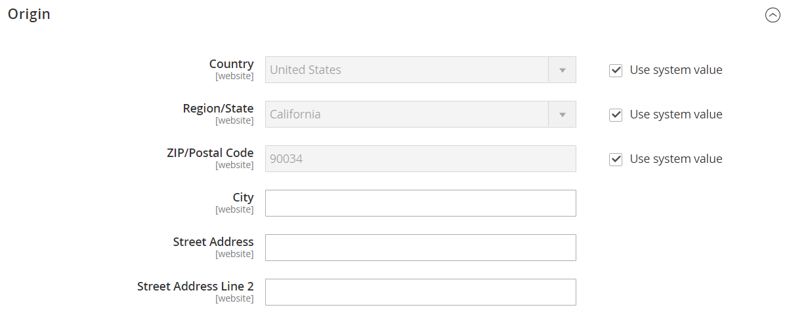
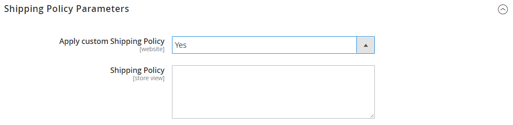

# [!UICONTROL Sales] > [!UICONTROL Shipping Settings]

{{config}}

Para obter mais informações sobre como alterar essas configurações, consulte [Configurações de remessa](../../stores-purchase/shipping-settings.md) no _Guia de Experiência de Compras e Lojas_.

## [!UICONTROL Origin]

<!-- zoom -->

| Campo | [Escopo](../../getting-started/websites-stores-views.md#scope-settings) | Descrição |
|--- |--- |--- |
| [!UICONTROL Country] | Site | O país de ponto de origem. |
| [!UICONTROL Region/State] | Site | Região ou estado do ponto de origem. |
| [!UICONTROL ZIP/Postal Code] | Site | O CEP do ponto de origem. |
| [!UICONTROL City] | Site | A cidade do ponto de origem. |
| [!UICONTROL Street Address] | Site | O endereço do ponto de origem. |
| [!UICONTROL Street Address Line 2] | Site | Uma linha extra para o endereço do ponto de origem, se necessário. |

{style="table-layout:auto"}

## [!UICONTROL Shipping Policy Parameters]

<!-- zoom -->

| Campo | [Escopo](../../getting-started/websites-stores-views.md#scope-settings) | Descrição |
|--- |--- |--- |
| [!UICONTROL Apply Custom Shipping Policy] | Site | Determina se a política de envio aparece durante o check-out. Opções: `Yes` / `No` |
| [!UICONTROL Shipping Policy] | Exibição da loja | Contém a política de remessa como texto. |

{style="table-layout:auto"}

## [!UICONTROL Shipment Tracking URLs]

[!BADGE Somente SaaS]{type=Positive url="https://experienceleague.adobe.com/pt-br/docs/commerce/user-guides/product-solutions" tooltip="Aplicável somente a projetos do Adobe Commerce as a Cloud Service (infraestrutura SaaS gerenciada pela Adobe)."}

<!-- zoom -->

| Campo | [Escopo](../../getting-started/websites-stores-views.md#scope-settings) | Descrição |
|--- |--- |--- |
| [!UICONTROL Enable Custom Tracking URLs] | Exibição da loja | Determina se os números de rastreamento de remessa enviados em emails do comprador são links ou texto sem formatação. O valor padrão de `No` indica que os números são texto simples. Opções: `Yes` / `No` |
| [!UICONTROL USPS Tracking URL] | Exibição da loja | O modelo de URL para remessas do Serviço Postal dos Estados Unidos. |
| [!UICONTROL UPS Tracking URL] | Exibição da loja | O modelo de URL para remessas do United Parcel Service. |
| [!UICONTROL FedEx Tracking URL] | Exibição da loja | O modelo de URL para remessas do Federal Express. |
| [!UICONTROL DHL Tracking URL] | Exibição da loja | O modelo de URL para remessas DHL Express. |

{style="table-layout:auto"}
